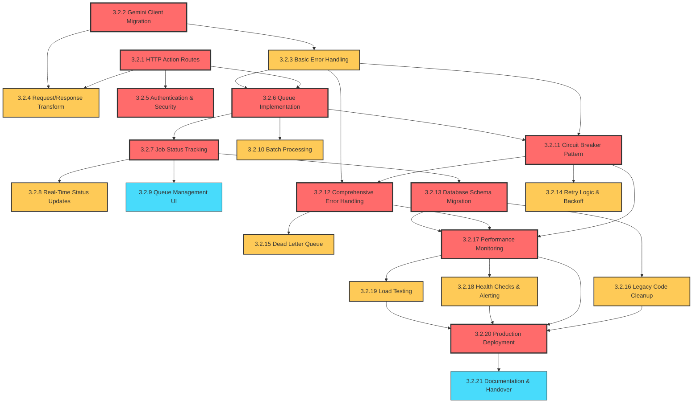

# AI Processing Migration - Sprint Plan & Resource Allocation

## Overview

Migration from synchronous Gemini API calls to asynchronous HTTP Actions with queue-based processing across 4 sprints (8 weeks total).

**Team Structure:**

- **2-3 Developers** (Dev A, Dev B, Dev C)
- **1 Architect** (cross-cutting concerns, reviews, technical guidance)

---

## Sprint Allocation Table

### Sprint 1: Foundation & Infrastructure (Weeks 1-2)

**Sprint Goal:** Establish HTTP Actions foundation and basic Gemini client

| Story ID | Story Title                     | Assigned To       | Story Points | Dependencies | Priority |
| -------- | ------------------------------- | ----------------- | ------------ | ------------ | -------- |
| 3.2.1    | HTTP Action Route Setup         | Dev A             | 5            | None         | Critical |
| 3.2.2    | Gemini Client Migration         | Dev B             | 8            | None         | Critical |
| 3.2.3    | Basic Error Handling            | Dev C             | 5            | 3.2.1, 3.2.2 | High     |
| 3.2.4    | Request/Response Transformation | Dev A             | 5            | 3.2.2        | High     |
| 3.2.5    | Authentication & Security       | Architect + Dev B | 8            | 3.2.1        | Critical |

**Sprint 1 Capacity:** 31 points (7-8 points per person)

### Sprint 2: Queue Management & Real-Time Updates (Weeks 3-4)

**Sprint Goal:** Implement async processing with queue management and real-time status

| Story ID | Story Title              | Assigned To | Story Points | Dependencies | Priority |
| -------- | ------------------------ | ----------- | ------------ | ------------ | -------- |
| 3.2.6    | Queue Implementation     | Dev A       | 8            | 3.2.1        | Critical |
| 3.2.7    | Job Status Tracking      | Dev B       | 5            | 3.2.6        | Critical |
| 3.2.8    | Real-Time Status Updates | Dev C       | 8            | 3.2.7        | High     |
| 3.2.9    | Queue Management UI      | Dev B       | 5            | 3.2.7        | Medium   |
| 3.2.10   | Batch Processing         | Dev A       | 8            | 3.2.6        | High     |

**Sprint 2 Capacity:** 34 points (8-9 points per person)

### Sprint 3: Resilience & Advanced Error Handling (Weeks 5-6)

**Sprint Goal:** Implement robust error handling, circuit breakers, and database migration

| Story ID | Story Title                  | Assigned To       | Story Points | Dependencies  | Priority |
| -------- | ---------------------------- | ----------------- | ------------ | ------------- | -------- |
| 3.2.11   | Circuit Breaker Pattern      | Architect + Dev A | 8            | 3.2.3, 3.2.6  | Critical |
| 3.2.12   | Comprehensive Error Handling | Dev B             | 8            | 3.2.3, 3.2.11 | Critical |
| 3.2.13   | Database Schema Migration    | Dev C             | 8            | 3.2.7         | Critical |
| 3.2.14   | Retry Logic & Backoff        | Dev A             | 5            | 3.2.11        | High     |
| 3.2.15   | Dead Letter Queue            | Dev B             | 5            | 3.2.12        | High     |

**Sprint 3 Capacity:** 34 points (8-9 points per person)

### Sprint 4: Migration & Production Readiness (Weeks 7-8)

**Sprint Goal:** Complete legacy cleanup, implement monitoring, and production rollout

| Story ID | Story Title              | Assigned To          | Story Points | Dependencies     | Priority |
| -------- | ------------------------ | -------------------- | ------------ | ---------------- | -------- |
| 3.2.16   | Legacy Code Cleanup      | Dev C                | 5            | 3.2.13           | High     |
| 3.2.17   | Performance Monitoring   | Architect + Dev A    | 8            | All core stories | Critical |
| 3.2.18   | Health Checks & Alerting | Dev B                | 5            | 3.2.17           | High     |
| 3.2.19   | Load Testing             | Dev A                | 5            | 3.2.17           | High     |
| 3.2.20   | Production Deployment    | Architect + All Devs | 8            | All stories      | Critical |
| 3.2.21   | Documentation & Handover | Dev B + Dev C        | 5            | 3.2.20           | Medium   |

**Sprint 4 Capacity:** 36 points (9 points per person)

---

## Dependency Mapping

---

## Critical Path Analysis

**Critical Path Stories** (must complete on time to avoid project delays):

1. **Sprint 1:** 3.2.1 → 3.2.2 → 3.2.5 (HTTP Actions + Gemini Client + Security)
2. **Sprint 2:** 3.2.6 → 3.2.7 (Queue Implementation + Status Tracking)
3. **Sprint 3:** 3.2.11 → 3.2.12 → 3.2.13 (Circuit Breakers + Error Handling + DB Migration)
4. **Sprint 4:** 3.2.17 → 3.2.20 (Monitoring + Production Deployment)

**Risk Mitigation:**

- Architect paired with developers on critical path stories
- Daily standups to identify blockers early
- Sprint 1 & 2 stories can run in parallel to build buffer time
- Load testing (3.2.19) can start early if monitoring is ready

---

## Resource Distribution Strategy

### Sprint 1: Foundation Building

**Dev A (Backend Focus):**

- HTTP Action route setup (3.2.1)
- Request/Response transformation (3.2.4)

**Dev B (Integration Focus):**

- Gemini client migration (3.2.2)
- Authentication & security (3.2.5) with Architect

**Dev C (Quality Focus):**

- Basic error handling (3.2.3)
- Testing and validation support

**Architect:**

- Security review and implementation (3.2.5)
- Architecture decisions and technical guidance
- Code reviews for all stories

### Sprint 2: Async Processing

**Dev A (Queue Specialist):**

- Queue implementation (3.2.6)
- Batch processing (3.2.10)

**Dev B (UI/Status Focus):**

- Job status tracking (3.2.7)
- Queue management UI (3.2.9)

**Dev C (Real-Time Focus):**

- Real-time status updates (3.2.8)
- WebSocket/SSE implementation

**Architect:**

- Queue architecture review
- Performance considerations
- Integration testing oversight

### Sprint 3: Resilience & Migration

**Architect + Dev A (Resilience Team):**

- Circuit breaker pattern (3.2.11)
- Retry logic & backoff (3.2.14)

**Dev B (Error Handling Lead):**

- Comprehensive error handling (3.2.12)
- Dead letter queue (3.2.15)

**Dev C (Database Focus):**

- Database schema migration (3.2.13)
- Data integrity validation

### Sprint 4: Production Readiness

**Architect + Dev A (Monitoring Team):**

- Performance monitoring (3.2.17)
- Load testing (3.2.19)

**Dev B (Operations Focus):**

- Health checks & alerting (3.2.18)
- Documentation & handover (3.2.21)

**Dev C (Migration Focus):**

- Legacy code cleanup (3.2.16)
- Production deployment support (3.2.20)

**All Team (Production Deployment):**

- Collaborative deployment (3.2.20)
- Go-live support and monitoring

---

## Cross-Sprint Considerations

### Technical Debt Management

- **Sprint 1-2:** Focus on getting core functionality working
- **Sprint 3:** Address technical debt and improve resilience
- **Sprint 4:** Final cleanup and optimization

### Testing Strategy

- **Unit Tests:** Continuous throughout all sprints
- **Integration Tests:** Start in Sprint 2, expand in Sprint 3
- **Load Tests:** Sprint 4 focus, but start setup in Sprint 3
- **E2E Tests:** Update throughout, major validation in Sprint 4

### Risk Management

- **Sprint 1:** Technical feasibility risk - validate early
- **Sprint 2:** Performance risk - monitor queue processing
- **Sprint 3:** Data migration risk - extensive testing
- **Sprint 4:** Production deployment risk - careful rollout

### Communication Plan

- **Daily Standups:** Progress tracking and blocker identification
- **Sprint Reviews:** Demo progress to stakeholders
- **Architecture Reviews:** Architect leads technical decision sessions
- **Retrospectives:** Process improvement and team feedback

---

## Success Metrics

### Sprint-Level Metrics

- **Velocity:** Target 31-36 points per sprint
- **Burn-down:** Track daily progress against sprint goals
- **Quality:** Zero critical bugs carry-over between sprints

### Technical Metrics

- **Performance:** API response time < 200ms (excluding AI processing)
- **Reliability:** 99.9% uptime for HTTP Actions
- **Scalability:** Handle 10x current load with queue system

### Business Metrics

- **Migration Success:** 100% of insights processing moved to async
- **User Experience:** No degradation in feature availability
- **System Resilience:** Graceful handling of AI service outages

This sprint plan ensures balanced workload distribution, respects technical dependencies, and provides multiple parallel work streams to maximize team efficiency while maintaining quality and meeting the 8-week timeline.
