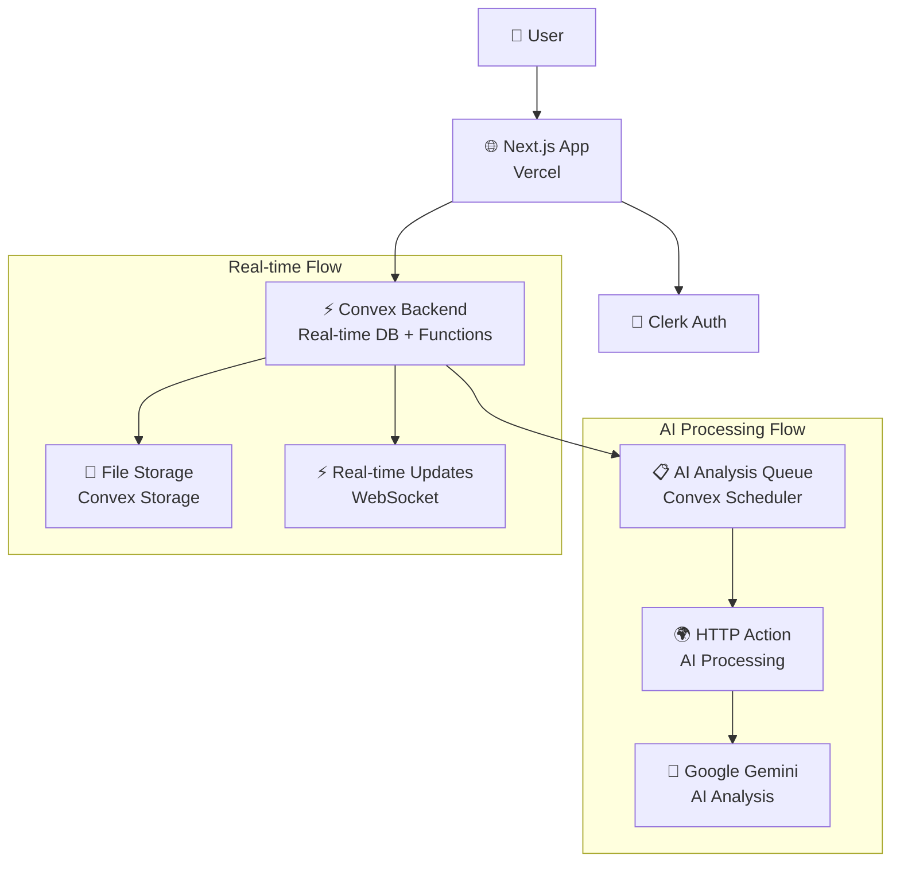
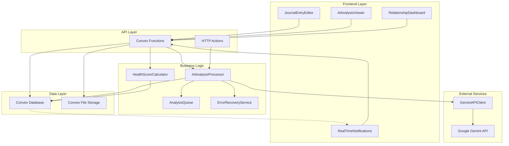
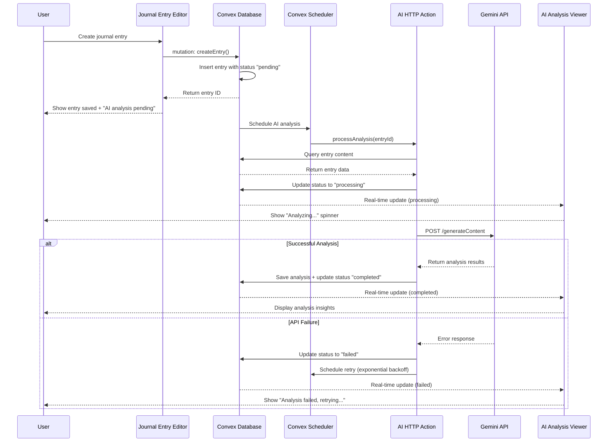
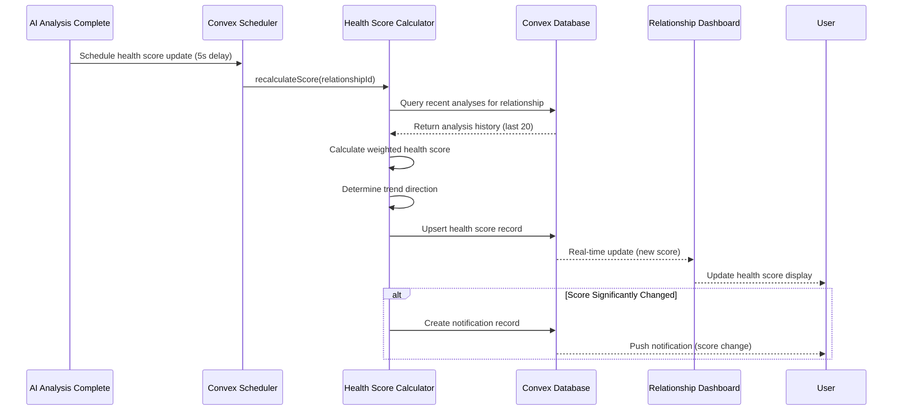
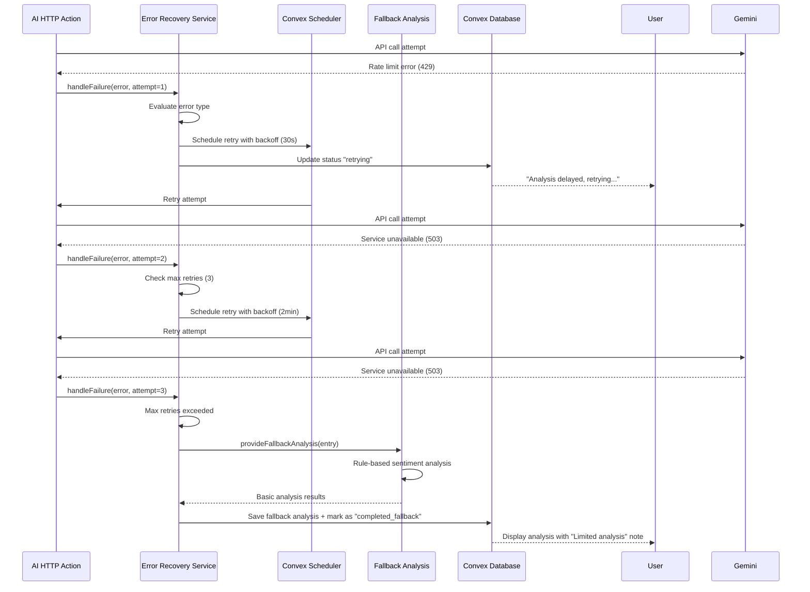
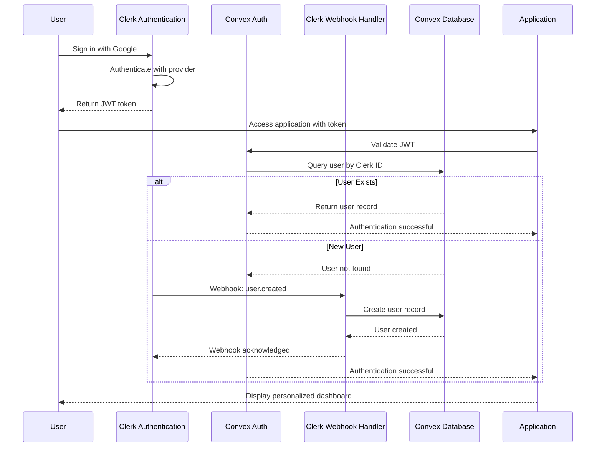
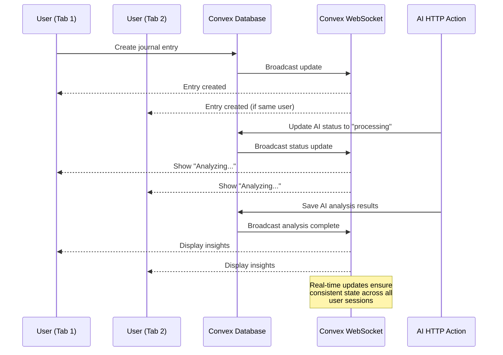
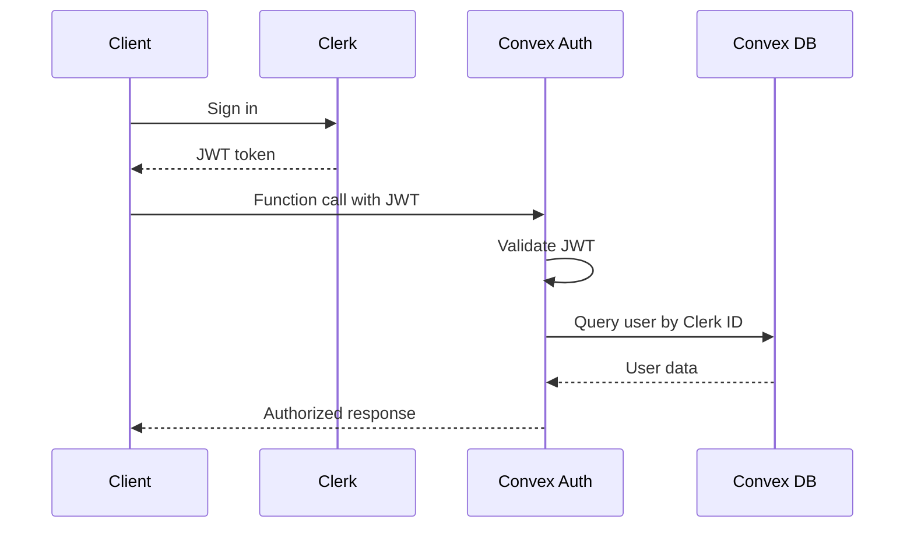
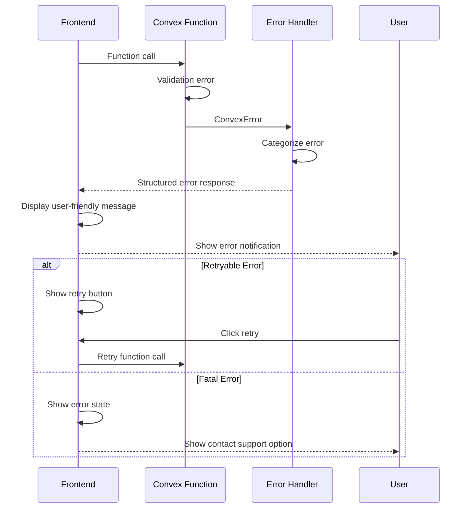

# Resonant Fullstack Architecture Document

This document outlines the complete fullstack architecture for **Resonant**, including backend systems, frontend implementation, and their integration. It serves as the single source of truth for AI-driven development, ensuring consistency across the entire technology stack.

This unified approach combines what would traditionally be separate backend and frontend architecture documents, streamlining the development process for modern fullstack applications where these concerns are increasingly intertwined.

## Introduction

### Starter Template or Existing Project

Based on my analysis of your current codebase, **Resonant** is built on:

- **Next.js 15** with App Router and Turbopack
- **Convex** as the backend-as-a-service platform
- **Clerk** for authentication
- **TypeScript** throughout the stack

The project appears to be based on a modern Convex + Next.js starter pattern with these pre-configured architectural decisions:

- Real-time database with Convex
- Serverless functions architecture
- TypeScript-first development
- Component-based React architecture

**Key constraint:** The current AI analysis system is failing due to architectural mismatches between Node.js dependencies and Convex's serverless environment.

### Change Log

| Date       | Version | Description                                          | Author              |
| ---------- | ------- | ---------------------------------------------------- | ------------------- |
| 2025-01-28 | 1.0     | Initial architecture document for AI integration fix | Winston (Architect) |

## High Level Architecture

### Technical Summary

Resonant employs a **Jamstack + Real-time BaaS** architecture using Next.js 15 for the frontend and Convex for the backend services. The frontend leverages React 19's concurrent features with TypeScript for type safety, while Convex provides real-time database capabilities, serverless functions, and file storage. **The critical architectural challenge is integrating Google Gemini AI analysis within Convex's serverless constraints** - this will be solved using **Convex HTTP Actions** that call external AI services asynchronously, maintaining real-time capabilities for user interactions while processing AI analysis in the background. Authentication is handled by Clerk with seamless Convex integration, and the entire system is deployed on Vercel for optimal Next.js performance with Convex's global edge network.

### Platform and Infrastructure Choice

Based on your existing setup and requirements, I recommend continuing with your current platform choice but with architectural modifications:

**Platform:** Vercel + Convex + External AI Processing
**Key Services:**

- Vercel (Next.js hosting, edge functions)
- Convex (real-time database, serverless functions, file storage)
- Clerk (authentication)
- Google Gemini API (AI analysis via HTTP Actions)
- Vercel Analytics (monitoring)

**Deployment Host and Regions:** Vercel's global edge network + Convex's multi-region deployment

**Alternative considered:** Moving AI to AWS Lambda, but dismissed due to complexity and loss of Convex integration benefits.

### Repository Structure

**Structure:** Monorepo with Next.js + Convex co-location
**Monorepo Tool:** npm workspaces (lightweight, sufficient for current scale)
**Package Organization:** Feature-based with shared types package

This maintains your current structure while adding proper separation for AI services:

```
resonant/
├── src/                    # Next.js frontend
├── convex/                 # Convex backend functions
├── packages/
│   ├── shared-types/       # Shared TypeScript interfaces
│   └── ai-services/        # AI integration utilities
```

### High Level Architecture Diagram



### Architectural Patterns

- **Jamstack Architecture:** Static generation with serverless APIs - _Rationale:_ Optimal performance for journal interface with real-time data integration
- **Backend-as-a-Service (BaaS):** Convex handles infrastructure complexity - _Rationale:_ Reduces operational overhead while providing real-time capabilities
- **Async Processing Pattern:** Queue-based AI analysis with status tracking - _Rationale:_ Separates fast user interactions from slow AI processing
- **Event-Driven Architecture:** Real-time updates for AI analysis completion - _Rationale:_ Immediate user feedback when analysis completes
- **Repository Pattern:** Abstract data access in Convex functions - _Rationale:_ Maintainable data layer with type safety
- **Circuit Breaker Pattern:** Fallback analysis when AI services fail - _Rationale:_ Ensures system reliability despite external service issues

## Tech Stack

### Technology Stack Table

| Category             | Technology                          | Version           | Purpose                          | Rationale                                                                              |
| -------------------- | ----------------------------------- | ----------------- | -------------------------------- | -------------------------------------------------------------------------------------- |
| Frontend Language    | TypeScript                          | ^5.3.0            | Type-safe client development     | Prevents runtime errors, excellent IDE support, shared types with backend              |
| Frontend Framework   | Next.js                             | ^15.0.0           | React framework with SSR/SSG     | App Router for modern routing, Turbopack for fast builds, excellent Vercel integration |
| UI Component Library | Tailwind CSS + shadcn/ui            | ^3.4.0 + latest   | Design system and components     | Utility-first CSS with high-quality accessible components                              |
| State Management     | React Query + Convex React          | ^5.0.0 + latest   | Server state + real-time sync    | Convex handles real-time state, React Query for client state management                |
| Backend Language     | TypeScript                          | ^5.3.0            | Type-safe server development     | Shared types with frontend, excellent Convex integration                               |
| Backend Framework    | Convex                              | latest            | Real-time BaaS platform          | Real-time database, serverless functions, file storage, auth integration               |
| API Style            | Convex Functions                    | N/A               | Type-safe RPC over WebSocket     | Real-time updates, type safety, automatic optimization                                 |
| Database             | Convex Database                     | N/A               | Document database with real-time | Built-in real-time subscriptions, ACID transactions, automatic scaling                 |
| Cache                | Convex Built-in                     | N/A               | Automatic query caching          | Built into Convex platform, no additional configuration needed                         |
| File Storage         | Convex Storage                      | N/A               | File upload and serving          | Integrated with database, automatic CDN, simple API                                    |
| Authentication       | Clerk                               | ^5.0.0            | User authentication service      | Excellent Convex integration, social login, user management                            |
| AI Integration       | Google Gemini + HTTP Actions        | latest            | AI analysis processing           | Reliable external API calls via Convex HTTP Actions                                    |
| Frontend Testing     | Jest + React Testing Library        | ^29.0.0 + ^14.0.0 | Unit and component testing       | Standard React testing stack, excellent TypeScript support                             |
| Backend Testing      | Convex Test + Jest                  | latest + ^29.0.0  | Convex function testing          | Official Convex testing utilities for functions and data                               |
| E2E Testing          | Playwright                          | ^1.40.0           | End-to-end testing               | MCP browser automation support, reliable cross-browser testing                         |
| Build Tool           | Next.js + Turbopack                 | ^15.0.0           | Frontend build system            | Fast development builds, built-in optimizations                                        |
| Bundler              | Turbopack                           | Built-in          | Next.js bundler                  | Faster than Webpack, built into Next.js 15                                             |
| IaC Tool             | Vercel CLI + Convex CLI             | latest            | Deployment automation            | Platform-native deployment tools                                                       |
| CI/CD                | GitHub Actions                      | N/A               | Automated testing and deployment | Excellent integration with Vercel and Convex platforms                                 |
| Monitoring           | Vercel Analytics + Convex Dashboard | Built-in          | Performance and error tracking   | Built into deployment platforms, minimal configuration                                 |
| Logging              | Console + Convex Logs               | Built-in          | Application logging              | Convex provides built-in logging for serverless functions                              |
| CSS Framework        | Tailwind CSS                        | ^3.4.0            | Utility-first styling            | Rapid development, consistent design system, excellent Next.js integration             |

## Data Models

Based on your existing codebase analysis, here are the core data models that will be shared between frontend and backend, with modifications to support the new AI architecture:

### User

**Purpose:** Represents application users with authentication and preferences, including AI analysis settings

**Key Attributes:**

- id: Id<"users"> - Unique user identifier from Clerk integration
- clerkId: string - External Clerk user ID for authentication
- name: string - User's display name
- email: string - User's email address
- preferences: UserPreferences - User settings including AI analysis preferences
- tier: "free" | "premium" - User subscription tier for AI rate limiting
- createdAt: number - Timestamp of account creation
- updatedAt: number - Last profile update timestamp

#### TypeScript Interface

```typescript
interface User {
  _id: Id<'users'>
  clerkId: string
  name: string
  email: string
  preferences: {
    aiAnalysisEnabled: boolean
    reminderSettings: ReminderSettings
    privacySettings: PrivacySettings
  }
  tier: 'free' | 'premium'
  createdAt: number
  updatedAt: number
}
```

#### Relationships

- Has many journal entries
- Has many relationships
- Has many AI analyses (through journal entries)

### JournalEntry

**Purpose:** Core content entity representing user's relationship journal entries with AI analysis integration

**Key Attributes:**

- id: Id<"journalEntries"> - Unique entry identifier
- userId: Id<"users"> - Reference to entry author
- relationshipId: Id<"relationships"> | null - Associated relationship (optional)
- content: string - Journal entry text content
- mood: MoodType - User's selected mood for the entry
- tags: string[] - User-defined tags for categorization
- allowAIAnalysis: boolean - User consent for AI processing
- aiAnalysisStatus: "pending" | "processing" | "completed" | "failed" | "skipped" - AI processing state
- createdAt: number - Entry creation timestamp
- updatedAt: number - Last modification timestamp

#### TypeScript Interface

```typescript
interface JournalEntry {
  _id: Id<'journalEntries'>
  userId: Id<'users'>
  relationshipId?: Id<'relationships'>
  content: string
  mood: MoodType
  tags: string[]
  allowAIAnalysis: boolean
  aiAnalysisStatus:
    | 'pending'
    | 'processing'
    | 'completed'
    | 'failed'
    | 'skipped'
  createdAt: number
  updatedAt: number
}

type MoodType =
  | 'excited'
  | 'ecstatic'
  | 'grateful'
  | 'joyful'
  | 'happy'
  | 'content'
  | 'calm'
  | 'neutral'
  | 'confused'
  | 'concerned'
  | 'anxious'
  | 'sad'
  | 'frustrated'
  | 'angry'
  | 'devastated'
```

#### Relationships

- Belongs to one user
- May belong to one relationship
- Has zero or one AI analysis

### Relationship

**Purpose:** Represents user's relationships being tracked in the journal

**Key Attributes:**

- id: Id<"relationships"> - Unique relationship identifier
- userId: Id<"users"> - Reference to relationship owner
- name: string - Relationship partner's name
- initials: string - Partner's initials for privacy
- type: RelationshipType - Category of relationship
- photoUrl: string | null - Optional profile photo
- isActive: boolean - Whether relationship is currently active
- createdAt: number - Relationship record creation
- updatedAt: number - Last modification timestamp

#### TypeScript Interface

```typescript
interface Relationship {
  _id: Id<'relationships'>
  userId: Id<'users'>
  name: string
  initials: string
  type: RelationshipType
  photoUrl?: string
  isActive: boolean
  createdAt: number
  updatedAt: number
}

type RelationshipType = 'romantic' | 'family' | 'friend' | 'colleague' | 'other'
```

#### Relationships

- Belongs to one user
- Has many journal entries
- Has many AI analyses (through journal entries)
- Has zero or one health score

### AIAnalysis

**Purpose:** Stores AI-generated analysis results for journal entries with enhanced error handling and processing metadata

**Key Attributes:**

- id: Id<"aiAnalysis"> - Unique analysis identifier
- entryId: Id<"journalEntries"> - Reference to analyzed entry
- userId: Id<"users"> - Reference to entry owner (for queries)
- relationshipId: Id<"relationships"> | null - Associated relationship
- sentimentScore: number - Normalized sentiment (-1 to 1)
- emotionalKeywords: string[] - Detected emotions
- confidenceLevel: number - AI confidence (0 to 1)
- reasoning: string - AI explanation of analysis
- patterns: AnalysisPatterns - Detected behavioral patterns
- status: "processing" | "completed" | "failed" - Analysis processing state
- analysisVersion: string - AI model version used
- processingTime: number - Time taken for analysis (ms)
- tokensUsed: number | null - API tokens consumed
- apiCost: number | null - Processing cost
- errorMessage: string | null - Error details if failed
- createdAt: number - Analysis start timestamp

#### TypeScript Interface

```typescript
interface AIAnalysis {
  _id: Id<'aiAnalysis'>
  entryId: Id<'journalEntries'>
  userId: Id<'users'>
  relationshipId?: Id<'relationships'>
  sentimentScore: number
  emotionalKeywords: string[]
  confidenceLevel: number
  reasoning: string
  patterns: {
    recurring_themes: string[]
    emotional_triggers: string[]
    communication_style: string
    relationship_dynamics: string[]
  }
  status: 'processing' | 'completed' | 'failed'
  analysisVersion: string
  processingTime: number
  tokensUsed?: number
  apiCost?: number
  errorMessage?: string
  createdAt: number
}
```

#### Relationships

- Belongs to one journal entry
- Belongs to one user
- May belong to one relationship

### HealthScore

**Purpose:** Aggregated relationship health metrics derived from AI analyses

**Key Attributes:**

- id: Id<"healthScores"> - Unique score identifier
- userId: Id<"users"> - Reference to score owner
- relationshipId: Id<"relationships"> - Associated relationship
- overallScore: number - Computed health score (0-100)
- trendDirection: "improving" | "declining" | "stable" - Score trajectory
- lastAnalysisId: Id<"aiAnalysis"> - Most recent analysis used
- calculatedAt: number - Score computation timestamp
- validUntil: number - Score expiration for recalculation

#### TypeScript Interface

```typescript
interface HealthScore {
  _id: Id<'healthScores'>
  userId: Id<'users'>
  relationshipId: Id<'relationships'>
  overallScore: number
  trendDirection: 'improving' | 'declining' | 'stable'
  lastAnalysisId: Id<'aiAnalysis'>
  calculatedAt: number
  validUntil: number
}
```

#### Relationships

- Belongs to one user
- Belongs to one relationship
- References one AI analysis

## API Specification

Based on the chosen Convex Functions API style, here are the type-safe RPC definitions for the complete system including the new AI integration architecture:

### Convex Functions API

#### Journal Entry Functions

```typescript
// convex/journalEntries.ts
export const create = mutation({
  args: {
    content: v.string(),
    mood: v.union(
      v.literal('excited'),
      v.literal('ecstatic'),
      v.literal('grateful'),
      v.literal('joyful'),
      v.literal('happy'),
      v.literal('content'),
      v.literal('calm'),
      v.literal('neutral'),
      v.literal('confused'),
      v.literal('concerned'),
      v.literal('anxious'),
      v.literal('sad'),
      v.literal('frustrated'),
      v.literal('angry'),
      v.literal('devastated')
    ),
    relationshipId: v.optional(v.id('relationships')),
    tags: v.array(v.string()),
    allowAIAnalysis: v.optional(v.boolean()),
  },
  handler: async (ctx, args) => {
    // Create entry and automatically queue AI analysis if enabled
    const entryId = await ctx.db.insert('journalEntries', {
      ...args,
      userId: await getUserId(ctx),
      aiAnalysisStatus: args.allowAIAnalysis !== false ? 'pending' : 'skipped',
      createdAt: Date.now(),
      updatedAt: Date.now(),
    })

    // Queue AI analysis if user consents
    if (args.allowAIAnalysis !== false) {
      await ctx.scheduler.runAfter(0, internal.aiAnalysis.queueAnalysis, {
        entryId,
        priority: 'normal',
      })
    }

    return entryId
  },
})

export const list = query({
  args: {
    paginationOpts: paginationOptsValidator,
    relationshipId: v.optional(v.id('relationships')),
  },
  handler: async (ctx, args) => {
    const userId = await getUserId(ctx)
    let query = ctx.db
      .query('journalEntries')
      .withIndex('by_user', q => q.eq('userId', userId))
      .order('desc')

    if (args.relationshipId) {
      query = query.filter(q =>
        q.eq(q.field('relationshipId'), args.relationshipId)
      )
    }

    return await query.paginate(args.paginationOpts)
  },
})

export const update = mutation({
  args: {
    id: v.id('journalEntries'),
    content: v.optional(v.string()),
    mood: v.optional(v.union(/* mood types */)),
    tags: v.optional(v.array(v.string())),
    allowAIAnalysis: v.optional(v.boolean()),
  },
  handler: async (ctx, args) => {
    await authorizeEntryAccess(ctx, args.id)

    const updates = {
      ...args,
      updatedAt: Date.now(),
    }

    // Re-queue analysis if content changed and AI is enabled
    if (args.content && args.allowAIAnalysis !== false) {
      updates.aiAnalysisStatus = 'pending'
      await ctx.scheduler.runAfter(0, internal.aiAnalysis.queueAnalysis, {
        entryId: args.id,
        priority: 'normal',
      })
    }

    await ctx.db.patch(args.id, updates)
  },
})
```

#### AI Analysis Functions

```typescript
// convex/aiAnalysis.ts
export const getByEntry = query({
  args: { entryId: v.id('journalEntries') },
  handler: async (ctx, args) => {
    await authorizeEntryAccess(ctx, args.entryId)
    return await ctx.db
      .query('aiAnalysis')
      .withIndex('by_entry', q => q.eq('entryId', args.entryId))
      .unique()
  },
})

export const getRecentByUser = query({
  args: {
    userId: v.id('users'),
    limit: v.optional(v.number()),
  },
  handler: async (ctx, args) => {
    const limit = args.limit || 20
    return await ctx.db
      .query('aiAnalysis')
      .withIndex('by_user_created', q => q.eq('userId', args.userId))
      .order('desc')
      .filter(q => q.eq(q.field('status'), 'completed'))
      .take(limit)
  },
})

// HTTP Action for AI Processing
export const processAnalysis = httpAction(async (ctx, request) => {
  const { analysisId, entryId, priority } = await request.json()

  try {
    const entry = await ctx.runQuery(internal.journalEntries.getById, {
      id: entryId,
    })
    if (!entry) throw new Error('Entry not found')

    // Call Gemini API
    const aiResult = await callGeminiAPI({
      content: entry.content,
      mood: entry.mood,
      context: await getRelationshipContext(ctx, entry.relationshipId),
    })

    // Update analysis with results
    await ctx.runMutation(internal.aiAnalysis.updateAnalysis, {
      analysisId,
      result: aiResult,
      status: 'completed',
    })

    // Trigger health score recalculation
    if (entry.relationshipId) {
      await ctx.scheduler.runAfter(5000, internal.healthScores.recalculate, {
        userId: entry.userId,
        relationshipId: entry.relationshipId,
      })
    }

    return new Response(JSON.stringify({ success: true }), {
      status: 200,
      headers: { 'Content-Type': 'application/json' },
    })
  } catch (error) {
    // Mark analysis as failed
    await ctx.runMutation(internal.aiAnalysis.markFailed, {
      analysisId,
      error: error.message,
    })

    return new Response(JSON.stringify({ error: error.message }), {
      status: 500,
      headers: { 'Content-Type': 'application/json' },
    })
  }
})

export const reprocessStuckEntries = mutation({
  args: {
    userId: v.optional(v.id('users')),
    dryRun: v.optional(v.boolean()),
  },
  handler: async (ctx, args) => {
    // Implementation for finding and reprocessing stuck entries
    // Returns summary of entries found and actions taken
  },
})
```

#### Relationship Functions

```typescript
// convex/relationships.ts
export const create = mutation({
  args: {
    name: v.string(),
    initials: v.string(),
    type: v.union(
      v.literal('romantic'),
      v.literal('family'),
      v.literal('friend'),
      v.literal('colleague'),
      v.literal('other')
    ),
    photoUrl: v.optional(v.string()),
  },
  handler: async (ctx, args) => {
    const userId = await getUserId(ctx)
    return await ctx.db.insert('relationships', {
      ...args,
      userId,
      isActive: true,
      createdAt: Date.now(),
      updatedAt: Date.now(),
    })
  },
})

export const list = query({
  args: { includeInactive: v.optional(v.boolean()) },
  handler: async (ctx, args) => {
    const userId = await getUserId(ctx)
    let query = ctx.db
      .query('relationships')
      .withIndex('by_user', q => q.eq('userId', userId))

    if (!args.includeInactive) {
      query = query.filter(q => q.eq(q.field('isActive'), true))
    }

    return await query.collect()
  },
})
```

#### Health Score Functions

```typescript
// convex/healthScores.ts
export const getByRelationship = query({
  args: { relationshipId: v.id('relationships') },
  handler: async (ctx, args) => {
    await authorizeRelationshipAccess(ctx, args.relationshipId)
    return await ctx.db
      .query('healthScores')
      .withIndex('by_relationship', q =>
        q.eq('relationshipId', args.relationshipId)
      )
      .unique()
  },
})

export const recalculate = internalMutation({
  args: {
    userId: v.id('users'),
    relationshipId: v.id('relationships'),
  },
  handler: async (ctx, args) => {
    // Get recent analyses for relationship
    const analyses = await ctx.db
      .query('aiAnalysis')
      .withIndex('by_relationship', q =>
        q.eq('relationshipId', args.relationshipId)
      )
      .filter(q => q.eq(q.field('status'), 'completed'))
      .order('desc')
      .take(20)

    if (analyses.length === 0) return

    // Calculate health metrics
    const healthScore = calculateHealthScore(analyses)

    // Upsert health score record
    const existing = await ctx.db
      .query('healthScores')
      .withIndex('by_relationship', q =>
        q.eq('relationshipId', args.relationshipId)
      )
      .unique()

    if (existing) {
      await ctx.db.patch(existing._id, {
        ...healthScore,
        calculatedAt: Date.now(),
        validUntil: Date.now() + 7 * 24 * 60 * 60 * 1000, // 7 days
      })
    } else {
      await ctx.db.insert('healthScores', {
        ...healthScore,
        userId: args.userId,
        relationshipId: args.relationshipId,
        calculatedAt: Date.now(),
        validUntil: Date.now() + 7 * 24 * 60 * 60 * 1000,
      })
    }
  },
})
```

#### User Management Functions

```typescript
// convex/users.ts
export const current = query({
  args: {},
  handler: async ctx => {
    const identity = await ctx.auth.getUserIdentity()
    if (!identity) return null

    return await ctx.db
      .query('users')
      .withIndex('by_clerk_id', q => q.eq('clerkId', identity.subject))
      .unique()
  },
})

export const updatePreferences = mutation({
  args: {
    aiAnalysisEnabled: v.optional(v.boolean()),
    reminderSettings: v.optional(v.object({})),
    privacySettings: v.optional(v.object({})),
  },
  handler: async (ctx, args) => {
    const userId = await getUserId(ctx)
    const user = await ctx.db.get(userId)

    await ctx.db.patch(userId, {
      preferences: {
        ...user.preferences,
        ...args,
      },
      updatedAt: Date.now(),
    })
  },
})
```

## Components

Based on the architectural patterns, tech stack, and data models, here are the major logical components across the fullstack system:

### Frontend Components

#### JournalEntryEditor

**Responsibility:** Primary interface for creating and editing journal entries with real-time AI analysis status updates

**Key Interfaces:**

- `onSave(entry: JournalEntryInput): Promise<void>` - Handles entry creation/updates
- `onAIStatusChange(status: AIAnalysisStatus): void` - Receives real-time AI processing updates
- `onValidationError(errors: ValidationError[]): void` - Displays form validation feedback

**Dependencies:** MoodSelector, TagInput, RelationshipPicker, AIAnalysisStatusIndicator

**Technology Stack:** React 19 with useOptimistic, Zod validation, Convex real-time subscriptions

#### AIAnalysisViewer

**Responsibility:** Displays AI analysis results with interactive insights and explanations

**Key Interfaces:**

- `renderAnalysis(analysis: AIAnalysis): ReactElement` - Main analysis display
- `onInsightClick(insight: AnalysisInsight): void` - Handles user interaction with insights
- `onRetryAnalysis(): Promise<void>` - Triggers analysis reprocessing

**Dependencies:** SentimentChart, EmotionKeywords, HealthScoreTrend

**Technology Stack:** React 19, Chart.js for visualizations, Tailwind CSS for styling

#### RelationshipDashboard

**Responsibility:** Overview of all relationships with health scores and trends

**Key Interfaces:**

- `renderHealthScores(scores: HealthScore[]): ReactElement` - Health score grid
- `onRelationshipSelect(id: Id<"relationships">): void` - Navigation to relationship details
- `onRefreshScores(): Promise<void>` - Triggers health score recalculation

**Dependencies:** HealthScoreCard, TrendChart, RelationshipList

**Technology Stack:** React 19, Recharts for data visualization, real-time Convex queries

### Backend Components

#### AIAnalysisProcessor

**Responsibility:** Orchestrates AI analysis workflow including queuing, processing, and result storage

**Key Interfaces:**

- `queueAnalysis(entryId: Id<"journalEntries">): Promise<void>` - Adds entry to processing queue
- `processEntry(analysisId: Id<"aiAnalysis">): Promise<AIAnalysisResult>` - Executes AI analysis
- `handleFailure(analysisId: Id<"aiAnalysis">, error: Error): Promise<void>` - Error recovery

**Dependencies:** GeminiAPIClient, AnalysisQueue, ErrorRecoveryService

**Technology Stack:** Convex HTTP Actions, Scheduler for queue management, TypeScript

#### GeminiAPIClient

**Responsibility:** Handles all interactions with Google Gemini API including authentication and rate limiting

**Key Interfaces:**

- `analyzeJournalEntry(content: string, context: AnalysisContext): Promise<GeminiResponse>` - Primary analysis call
- `checkRateLimit(userId: Id<"users">): Promise<boolean>` - Rate limit validation
- `estimateCost(content: string): Promise<number>` - Cost prediction

**Dependencies:** External Gemini API, RateLimitTracker, CostMonitor

**Technology Stack:** HTTP Actions, fetch API, exponential backoff retry logic

#### HealthScoreCalculator

**Responsibility:** Computes relationship health metrics from AI analysis data

**Key Interfaces:**

- `calculateScore(analyses: AIAnalysis[]): HealthScore` - Core calculation logic
- `identifyTrends(scores: HistoricalScore[]): TrendAnalysis` - Trend detection
- `generateRecommendations(score: HealthScore): Recommendation[]` - Actionable insights

**Dependencies:** AIAnalysisRepository, StatisticalAnalysisUtils

**Technology Stack:** Convex mutations, mathematical computation utilities

#### RealTimeNotificationService

**Responsibility:** Manages real-time updates for AI analysis completion and health score changes

**Key Interfaces:**

- `notifyAnalysisComplete(userId: Id<"users">, entryId: Id<"journalEntries">): void` - Analysis completion
- `notifyHealthScoreUpdate(userId: Id<"users">, relationshipId: Id<"relationships">): void` - Score updates
- `subscribeToUpdates(userId: Id<"users">): Subscription` - Client subscription management

**Dependencies:** Convex real-time infrastructure, WebSocket connections

**Technology Stack:** Convex built-in real-time subscriptions, custom event handlers

### Integration Components

#### AnalysisQueue

**Responsibility:** Manages async processing queue for AI analysis requests with priority handling and retry logic

**Key Interfaces:**

- `enqueue(request: AnalysisRequest, priority: Priority): Promise<void>` - Queue new requests
- `dequeue(): Promise<AnalysisRequest | null>` - Retrieve next request for processing
- `requeue(request: AnalysisRequest, delay: number): Promise<void>` - Retry failed requests

**Dependencies:** Convex Scheduler, PriorityQueue implementation

**Technology Stack:** Convex Scheduler for durable execution, TypeScript priority queue

#### ErrorRecoveryService

**Responsibility:** Handles AI processing failures with intelligent retry strategies and fallback analysis

**Key Interfaces:**

- `handleFailure(error: AIProcessingError): Promise<RecoveryAction>` - Determine recovery strategy
- `executeRetry(request: AnalysisRequest, attempt: number): Promise<void>` - Retry with backoff
- `provideFallbackAnalysis(entry: JournalEntry): Promise<BasicAnalysis>` - Rule-based fallback

**Dependencies:** RetryPolicyManager, FallbackAnalysisEngine

**Technology Stack:** Convex functions, exponential backoff algorithms, rule-based analysis

### Component Diagrams



## External APIs

Based on the component design and PRD requirements, here are the external service integrations needed:

### Google Gemini API

- **Purpose:** AI-powered analysis of journal entries for sentiment, emotion detection, and relationship insights
- **Documentation:** https://ai.google.dev/docs/gemini_api
- **Base URL(s):** https://generativelanguage.googleapis.com/v1beta
- **Authentication:** API Key (Bearer token in Authorization header)
- **Rate Limits:**
  - Free tier: 15 requests per minute, 1,500 requests per day
  - Paid tier: 1,000 requests per minute, no daily limit
  - Token limits: 1M input tokens, 8K output tokens per request

**Key Endpoints Used:**

- `POST /models/gemini-1.5-flash:generateContent` - Primary text analysis for journal entries
- `POST /models/gemini-1.5-flash:countTokens` - Token estimation for cost prediction
- `GET /models` - Available model listing for version management

**Integration Notes:**

- Implements exponential backoff for rate limit handling
- Uses structured prompts with few-shot examples for consistent analysis quality
- Requires content filtering compliance for journal entry processing
- Cost monitoring essential due to per-token pricing model

### Clerk Authentication API

- **Purpose:** User authentication, session management, and user profile synchronization with Convex
- **Documentation:** https://clerk.com/docs/reference/backend-api
- **Base URL(s):** https://api.clerk.com/v1
- **Authentication:** Bearer token using Clerk secret key
- **Rate Limits:**
  - 1,000 requests per minute per application
  - Webhook verification required for user sync

**Key Endpoints Used:**

- `GET /users/{user_id}` - Fetch user profile data for initial sync
- `PATCH /users/{user_id}` - Update user metadata when preferences change
- `POST /webhooks` - Receive user lifecycle events (create, update, delete)

**Integration Notes:**

- Webhook endpoints in Convex HTTP router handle user synchronization
- JWT token validation for securing Convex function access
- Automatic user creation in Convex database on first authentication
- Supports social login providers (Google, GitHub, etc.)

### Vercel Analytics API

- **Purpose:** Application performance monitoring and user behavior analytics
- **Documentation:** https://vercel.com/docs/analytics/api
- **Base URL(s):** https://vercel.com/api/v1/analytics
- **Authentication:** Bearer token using Vercel team token
- **Rate Limits:**
  - 100 requests per minute per team
  - Data retention: 30 days free, longer for paid plans

**Key Endpoints Used:**

- `GET /analytics/events` - Custom event tracking for AI analysis completion
- `GET /analytics/web-vitals` - Core Web Vitals performance metrics
- `POST /analytics/events` - Log custom events for journal entry creation

**Integration Notes:**

- Primarily used for monitoring AI processing performance and user engagement
- Custom events track AI analysis success/failure rates
- Web Vitals monitoring ensures journal entry interface remains responsive
- Privacy-compliant analytics without PII collection

### Convex File Storage (Internal)

- **Purpose:** Secure file storage for user profile photos and future attachment support
- **Documentation:** https://docs.convex.dev/file-storage
- **Base URL(s):** Generated URLs via Convex storage service
- **Authentication:** Convex function context authentication
- **Rate Limits:** Based on Convex plan limits, effectively unlimited for normal usage

**Key Endpoints Used:**

- `storage.store(file)` - Upload profile photos and attachments
- `storage.getUrl(storageId)` - Generate secure URLs for file access
- `storage.delete(storageId)` - Remove files when users delete content

**Integration Notes:**

- Automatic CDN distribution for global file access
- Built-in access control tied to Convex authentication
- Seamless integration with database references
- Automatic cleanup when associated records are deleted

### Health Check and Monitoring

For external service reliability, the system implements:

- **Service Health Monitoring:** Regular health checks for Gemini API availability
- **Fallback Strategies:** Local rule-based analysis when external APIs fail
- **Circuit Breaker Pattern:** Temporary suspension of external calls during outages
- **Cost Monitoring:** Real-time tracking of API usage and associated costs

## Core Workflows

Here are the key system workflows illustrated with sequence diagrams showing component interactions, external APIs, and error handling paths:

### Journal Entry Creation with AI Analysis



### Health Score Recalculation Workflow



### Error Recovery and Retry Workflow



### User Authentication and Sync Workflow



### Real-time Status Updates Workflow



## Database Schema

Here's the concrete Convex schema definition that implements the data models:

```typescript
// convex/schema.ts
import { defineSchema, defineTable } from 'convex/server'
import { v } from 'convex/values'

export default defineSchema({
  users: defineTable({
    clerkId: v.string(),
    name: v.string(),
    email: v.string(),
    preferences: v.object({
      aiAnalysisEnabled: v.boolean(),
      reminderSettings: v.object({
        enabled: v.boolean(),
        frequency: v.union(
          v.literal('daily'),
          v.literal('weekly'),
          v.literal('never')
        ),
        timeOfDay: v.string(), // "09:00" format
      }),
      privacySettings: v.object({
        shareAnalytics: v.boolean(),
        allowDataExport: v.boolean(),
      }),
    }),
    tier: v.union(v.literal('free'), v.literal('premium')),
    createdAt: v.number(),
    updatedAt: v.number(),
  })
    .index('by_clerk_id', ['clerkId'])
    .index('by_email', ['email'])
    .index('by_tier', ['tier']),

  relationships: defineTable({
    userId: v.id('users'),
    name: v.string(),
    initials: v.string(),
    type: v.union(
      v.literal('romantic'),
      v.literal('family'),
      v.literal('friend'),
      v.literal('colleague'),
      v.literal('other')
    ),
    photoUrl: v.optional(v.string()),
    isActive: v.boolean(),
    createdAt: v.number(),
    updatedAt: v.number(),
  })
    .index('by_user', ['userId'])
    .index('by_user_active', ['userId', 'isActive'])
    .index('by_type', ['type']),

  journalEntries: defineTable({
    userId: v.id('users'),
    relationshipId: v.optional(v.id('relationships')),
    content: v.string(),
    mood: v.union(
      v.literal('excited'),
      v.literal('ecstatic'),
      v.literal('grateful'),
      v.literal('joyful'),
      v.literal('happy'),
      v.literal('content'),
      v.literal('calm'),
      v.literal('neutral'),
      v.literal('confused'),
      v.literal('concerned'),
      v.literal('anxious'),
      v.literal('sad'),
      v.literal('frustrated'),
      v.literal('angry'),
      v.literal('devastated')
    ),
    tags: v.array(v.string()),
    allowAIAnalysis: v.boolean(),
    aiAnalysisStatus: v.union(
      v.literal('pending'),
      v.literal('processing'),
      v.literal('completed'),
      v.literal('failed'),
      v.literal('skipped')
    ),
    createdAt: v.number(),
    updatedAt: v.number(),
  })
    .index('by_user', ['userId'])
    .index('by_user_created', ['userId', 'createdAt'])
    .index('by_relationship', ['relationshipId'])
    .index('by_user_relationship', ['userId', 'relationshipId'])
    .index('by_ai_status', ['aiAnalysisStatus'])
    .index('by_mood', ['mood'])
    .searchIndex('search_content', {
      searchField: 'content',
      filterFields: ['userId', 'relationshipId'],
    }),

  aiAnalysis: defineTable({
    entryId: v.id('journalEntries'),
    userId: v.id('users'),
    relationshipId: v.optional(v.id('relationships')),
    sentimentScore: v.number(), // -1 to 1 scale
    emotionalKeywords: v.array(v.string()),
    confidenceLevel: v.number(), // 0 to 1 scale
    reasoning: v.string(),
    patterns: v.object({
      recurring_themes: v.array(v.string()),
      emotional_triggers: v.array(v.string()),
      communication_style: v.string(),
      relationship_dynamics: v.array(v.string()),
    }),
    status: v.union(
      v.literal('processing'),
      v.literal('completed'),
      v.literal('failed')
    ),
    analysisVersion: v.string(),
    processingTime: v.number(), // milliseconds
    tokensUsed: v.optional(v.number()),
    apiCost: v.optional(v.number()),
    errorMessage: v.optional(v.string()),
    createdAt: v.number(),
  })
    .index('by_entry', ['entryId'])
    .index('by_user', ['userId'])
    .index('by_user_created', ['userId', 'createdAt'])
    .index('by_relationship', ['relationshipId'])
    .index('by_status', ['status'])
    .index('by_sentiment', ['sentimentScore']),

  healthScores: defineTable({
    userId: v.id('users'),
    relationshipId: v.id('relationships'),
    overallScore: v.number(), // 0 to 100 scale
    trendDirection: v.union(
      v.literal('improving'),
      v.literal('declining'),
      v.literal('stable')
    ),
    lastAnalysisId: v.id('aiAnalysis'),
    calculatedAt: v.number(),
    validUntil: v.number(),
  })
    .index('by_user', ['userId'])
    .index('by_relationship', ['relationshipId'])
    .index('by_user_relationship', ['userId', 'relationshipId'])
    .index('by_score', ['overallScore'])
    .index('by_validity', ['validUntil']),

  // System tables for monitoring and debugging
  systemLogs: defineTable({
    level: v.union(v.literal('info'), v.literal('warn'), v.literal('error')),
    service: v.string(),
    message: v.string(),
    metadata: v.optional(v.any()),
    timestamp: v.number(),
  })
    .index('by_level', ['level'])
    .index('by_service', ['service'])
    .index('by_timestamp', ['timestamp']),

  apiUsage: defineTable({
    userId: v.id('users'),
    service: v.string(), // "gemini", "clerk", etc.
    operation: v.string(),
    tokensUsed: v.optional(v.number()),
    cost: v.optional(v.number()),
    success: v.boolean(),
    timestamp: v.number(),
  })
    .index('by_user', ['userId'])
    .index('by_service', ['service'])
    .index('by_timestamp', ['timestamp'])
    .index('by_user_timestamp', ['userId', 'timestamp']),
})
```

## Frontend Architecture

### Component Architecture

#### Component Organization

```
src/
├── app/                           # Next.js App Router
│   ├── (auth)/                   # Auth route group
│   │   ├── sign-in/
│   │   └── sign-up/
│   ├── dashboard/                # Main dashboard
│   │   ├── page.tsx
│   │   └── insights/             # AI insights subpage
│   ├── journal/                  # Journal management
│   │   ├── page.tsx              # Journal list
│   │   ├── [id]/                 # Individual entry
│   │   └── new/                  # Create entry
│   ├── relationships/            # Relationship management
│   │   ├── page.tsx
│   │   └── [id]/
│   ├── search/                   # Global search
│   └── layout.tsx                # Root layout
├── components/
│   ├── features/                 # Feature-specific components
│   │   ├── journal/
│   │   │   ├── journal-entry-editor.tsx
│   │   │   ├── journal-entry-card.tsx
│   │   │   ├── mood-selector.tsx
│   │   │   └── tag-input.tsx
│   │   ├── ai-analysis/
│   │   │   ├── analysis-viewer.tsx
│   │   │   ├── sentiment-chart.tsx
│   │   │   └── status-indicator.tsx
│   │   ├── relationships/
│   │   │   ├── relationship-card.tsx
│   │   │   ├── health-score-display.tsx
│   │   │   └── trend-chart.tsx
│   │   └── dashboard/
│   │       ├── dashboard-overview.tsx
│   │       ├── recent-activity.tsx
│   │       └── quick-stats.tsx
│   ├── ui/                       # Reusable UI components (shadcn/ui)
│   │   ├── button.tsx
│   │   ├── card.tsx
│   │   ├── input.tsx
│   │   └── toast.tsx
│   └── providers/                # Context providers
│       ├── convex-client-provider.tsx
│       └── theme-provider.tsx
├── hooks/                        # Custom React hooks
│   ├── use-journal-entries.ts
│   ├── use-ai-analysis.ts
│   ├── use-health-scores.ts
│   └── use-auto-save.ts
├── lib/                          # Utilities and configurations
│   ├── utils.ts
│   ├── validations.ts
│   └── constants.ts
└── styles/
    └── globals.css
```

#### Component Template

```typescript
// Example: journal-entry-editor.tsx
"use client";

import { useState, useCallback } from "react";
import { useMutation, useQuery } from "convex/react";
import { api } from "../../../convex/_generated/api";
import { Id } from "../../../convex/_generated/dataModel";
import { Card, CardContent, CardHeader, CardTitle } from "@/components/ui/card";
import { Button } from "@/components/ui/button";
import { Textarea } from "@/components/ui/textarea";
import { MoodSelector } from "./mood-selector";
import { TagInput } from "./tag-input";
import { RelationshipPicker } from "./relationship-picker";
import { AIAnalysisStatusIndicator } from "../ai-analysis/status-indicator";
import { useAutoSave } from "@/hooks/use-auto-save";

interface JournalEntryEditorProps {
  entryId?: Id<"journalEntries">;
  onSave?: (entryId: Id<"journalEntries">) => void;
}

export function JournalEntryEditor({ entryId, onSave }: JournalEntryEditorProps) {
  const createEntry = useMutation(api.journalEntries.create);
  const updateEntry = useMutation(api.journalEntries.update);
  const existingEntry = useQuery(api.journalEntries.getById,
    entryId ? { id: entryId } : "skip"
  );

  const [content, setContent] = useState(existingEntry?.content ?? "");
  const [mood, setMood] = useState(existingEntry?.mood ?? "neutral");
  const [tags, setTags] = useState(existingEntry?.tags ?? []);
  const [relationshipId, setRelationshipId] = useState(existingEntry?.relationshipId);
  const [allowAIAnalysis, setAllowAIAnalysis] = useState(
    existingEntry?.allowAIAnalysis ?? true
  );

  // Auto-save functionality
  useAutoSave({
    data: { content, mood, tags, relationshipId, allowAIAnalysis },
    onSave: useCallback(async (data) => {
      if (entryId) {
        await updateEntry({ id: entryId, ...data });
      }
    }, [entryId, updateEntry]),
    delay: 2000, // 2 second delay
  });

  const handleSave = async () => {
    const entryData = {
      content,
      mood,
      tags,
      relationshipId,
      allowAIAnalysis,
    };

    if (entryId) {
      await updateEntry({ id: entryId, ...entryData });
    } else {
      const newEntryId = await createEntry(entryData);
      onSave?.(newEntryId);
    }
  };

  return (
    <Card className="w-full max-w-2xl mx-auto">
      <CardHeader>
        <CardTitle className="flex items-center justify-between">
          {entryId ? "Edit Entry" : "New Journal Entry"}
          {entryId && existingEntry && (
            <AIAnalysisStatusIndicator
              status={existingEntry.aiAnalysisStatus}
              entryId={entryId}
            />
          )}
        </CardTitle>
      </CardHeader>
      <CardContent className="space-y-4">
        <Textarea
          placeholder="How are you feeling about your relationships today?"
          value={content}
          onChange={(e) => setContent(e.target.value)}
          className="min-h-32"
        />

        <div className="grid grid-cols-1 md:grid-cols-2 gap-4">
          <MoodSelector value={mood} onChange={setMood} />
          <RelationshipPicker value={relationshipId} onChange={setRelationshipId} />
        </div>

        <TagInput value={tags} onChange={setTags} />

        <div className="flex items-center space-x-2">
          <input
            type="checkbox"
            id="ai-analysis"
            checked={allowAIAnalysis}
            onChange={(e) => setAllowAIAnalysis(e.target.checked)}
          />
          <label htmlFor="ai-analysis">Enable AI analysis for insights</label>
        </div>

        <Button onClick={handleSave} className="w-full">
          {entryId ? "Update Entry" : "Save Entry"}
        </Button>
      </CardContent>
    </Card>
  );
}
```

### State Management Architecture

#### State Structure

```typescript
// State management uses Convex for server state and React state for UI state
// No global client state management needed due to Convex real-time subscriptions

// Server State (via Convex)
interface ServerState {
  user: User | null
  journalEntries: PaginationResult<JournalEntry>
  relationships: Relationship[]
  aiAnalyses: AIAnalysis[]
  healthScores: HealthScore[]
}

// Client State (React state in components)
interface ClientState {
  // UI state only
  selectedMood: MoodType
  editorContent: string
  selectedTags: string[]
  isAutoSaving: boolean
  showAnalysisDetails: boolean
}
```

#### State Management Patterns

- **Server State**: Managed by Convex with automatic real-time updates
- **Form State**: Local React state with auto-save to server
- **UI State**: Component-level state for temporary UI interactions
- **Cache Management**: Handled automatically by Convex query system
- **Optimistic Updates**: Using React's useOptimistic for immediate UI feedback

### Routing Architecture

#### Route Organization

```
app/
├── page.tsx                      # Landing page / redirect to dashboard
├── layout.tsx                    # Root layout with providers
├── (auth)/                       # Authentication route group
│   ├── layout.tsx               # Auth layout
│   ├── sign-in/[[...sign-in]]/page.tsx
│   └── sign-up/[[...sign-up]]/page.tsx
├── dashboard/                    # Protected dashboard
│   ├── page.tsx                 # Overview dashboard
│   ├── layout.tsx               # Dashboard layout with navigation
│   └── insights/page.tsx        # AI insights page
├── journal/                      # Journal management
│   ├── page.tsx                 # Journal entry list
│   ├── new/page.tsx             # Create new entry
│   └── [id]/                    # Dynamic entry routes
│       ├── page.tsx             # View entry
│       └── edit/page.tsx        # Edit entry
├── relationships/                # Relationship management
│   ├── page.tsx                 # Relationship list
│   ├── new/page.tsx             # Create relationship
│   └── [id]/                    # Dynamic relationship routes
│       ├── page.tsx             # Relationship details
│       └── entries/page.tsx     # Entries for this relationship
└── search/                       # Global search
    └── page.tsx
```

#### Protected Route Pattern

```typescript
// middleware.ts - Clerk auth middleware
import { clerkMiddleware, createRouteMatcher } from '@clerk/nextjs/server';

const isProtectedRoute = createRouteMatcher([
  '/dashboard(.*)',
  '/journal(.*)',
  '/relationships(.*)',
  '/search(.*)',
]);

export default clerkMiddleware((auth, req) => {
  if (isProtectedRoute(req)) auth().protect();
});

export const config = {
  matcher: ['/((?!.*\\..*|_next).*)', '/', '/(api|trpc)(.*)'],
};

// app/dashboard/layout.tsx - Dashboard layout with navigation
import { ConvexClientProvider } from '@/components/providers/convex-client-provider';
import { DashboardNav } from '@/components/features/dashboard/dashboard-nav';

export default function DashboardLayout({
  children,
}: {
  children: React.ReactNode;
}) {
  return (
    <ConvexClientProvider>
      <div className="flex h-screen">
        <DashboardNav />
        <main className="flex-1 overflow-auto p-6">
          {children}
        </main>
      </div>
    </ConvexClientProvider>
  );
}
```

### Frontend Services Layer

#### API Client Setup

```typescript
// lib/convex-client.ts
import { ConvexReactClient } from "convex/react";

const convex = new ConvexReactClient(process.env.NEXT_PUBLIC_CONVEX_URL!);

export { convex };

// components/providers/convex-client-provider.tsx
"use client";

import { ClerkProvider, useAuth } from "@clerk/nextjs";
import { ConvexProviderWithClerk } from "convex/react-clerk";
import { convex } from "@/lib/convex-client";

export function ConvexClientProvider({
  children,
}: {
  children: React.ReactNode;
}) {
  return (
    <ClerkProvider
      publishableKey={process.env.NEXT_PUBLIC_CLERK_PUBLISHABLE_KEY!}
    >
      <ConvexProviderWithClerk client={convex} useAuth={useAuth}>
        {children}
      </ConvexProviderWithClerk>
    </ClerkProvider>
  );
}
```

#### Service Example

```typescript
// hooks/use-journal-entries.ts - Custom hook wrapping Convex queries
import { useQuery, useMutation } from 'convex/react'
import { api } from '../../convex/_generated/api'
import { Id } from '../../convex/_generated/dataModel'

export function useJournalEntries(relationshipId?: Id<'relationships'>) {
  const entries = useQuery(api.journalEntries.list, {
    paginationOpts: { numItems: 20, cursor: null },
    relationshipId,
  })

  const createEntry = useMutation(api.journalEntries.create)
  const updateEntry = useMutation(api.journalEntries.update)
  const deleteEntry = useMutation(api.journalEntries.remove)

  return {
    entries,
    createEntry,
    updateEntry,
    deleteEntry,
    isLoading: entries === undefined,
  }
}

// hooks/use-ai-analysis.ts - AI analysis management
export function useAIAnalysis(entryId: Id<'journalEntries'>) {
  const analysis = useQuery(api.aiAnalysis.getByEntry, { entryId })
  const retryAnalysis = useMutation(api.aiAnalysis.retryAnalysis)

  return {
    analysis,
    retryAnalysis,
    isLoading: analysis === undefined,
    hasAnalysis: !!analysis,
    isProcessing: analysis?.status === 'processing',
    isFailed: analysis?.status === 'failed',
  }
}
```

## Backend Architecture

### Service Architecture

#### Function Organization

```
convex/
├── schema.ts                     # Database schema definition
├── auth.ts                       # Authentication utilities
├── _generated/                   # Auto-generated types and API
├── functions/                    # Main business logic
│   ├── journalEntries.ts        # Journal CRUD operations
│   ├── relationships.ts         # Relationship management
│   ├── users.ts                 # User management
│   ├── aiAnalysis.ts           # AI analysis orchestration
│   └── healthScores.ts         # Health score calculations
├── actions/                      # HTTP Actions for external APIs
│   ├── ai-processing.ts         # Gemini API integration
│   └── webhook-handlers.ts      # Clerk webhook processing
├── utils/                        # Shared utilities
│   ├── auth.ts                  # Authentication helpers
│   ├── validation.ts            # Input validation
│   ├── ai-config.ts            # AI service configuration
│   └── cost-tracking.ts        # API usage monitoring
├── http.ts                      # HTTP router configuration
└── crons.ts                     # Scheduled tasks
```

#### Function Template

```typescript
// convex/functions/journalEntries.ts
import { query, mutation } from '../_generated/server'
import { ConvexError } from 'convex/values'
import { v } from 'convex/values'
import { paginationOptsValidator } from 'convex/server'
import { getUserId, requireAuth } from '../utils/auth'
import { validateJournalEntry } from '../utils/validation'

export const create = mutation({
  args: {
    content: v.string(),
    mood: v.union(/* mood types */),
    relationshipId: v.optional(v.id('relationships')),
    tags: v.array(v.string()),
    allowAIAnalysis: v.optional(v.boolean()),
  },
  handler: async (ctx, args) => {
    // Authentication
    const userId = await requireAuth(ctx)

    // Validation
    const validatedData = validateJournalEntry(args)

    // Business logic
    const entryId = await ctx.db.insert('journalEntries', {
      ...validatedData,
      userId,
      aiAnalysisStatus:
        validatedData.allowAIAnalysis !== false ? 'pending' : 'skipped',
      createdAt: Date.now(),
      updatedAt: Date.now(),
    })

    // Side effects
    if (validatedData.allowAIAnalysis !== false) {
      await ctx.scheduler.runAfter(0, internal.aiAnalysis.queueAnalysis, {
        entryId,
        priority: 'normal',
      })
    }

    return entryId
  },
})

export const list = query({
  args: {
    paginationOpts: paginationOptsValidator,
    relationshipId: v.optional(v.id('relationships')),
  },
  handler: async (ctx, args) => {
    const userId = await requireAuth(ctx)

    let query = ctx.db
      .query('journalEntries')
      .withIndex('by_user', q => q.eq('userId', userId))
      .order('desc')

    if (args.relationshipId) {
      query = query.filter(q =>
        q.eq(q.field('relationshipId'), args.relationshipId)
      )
    }

    return await query.paginate(args.paginationOpts)
  },
})
```

### Database Architecture

#### Data Access Layer

```typescript
// convex/utils/repository.ts - Repository pattern for complex queries
export class JournalRepository {
  constructor(private ctx: any) {}

  async getEntryWithAnalysis(entryId: Id<'journalEntries'>) {
    const entry = await this.ctx.db.get(entryId)
    if (!entry) return null

    const analysis = await this.ctx.db
      .query('aiAnalysis')
      .withIndex('by_entry', q => q.eq('entryId', entryId))
      .unique()

    return { ...entry, analysis }
  }

  async getRecentEntriesWithHealth(
    userId: Id<'users'>,
    relationshipId: Id<'relationships'>
  ) {
    const entries = await this.ctx.db
      .query('journalEntries')
      .withIndex('by_user_relationship', q =>
        q.eq('userId', userId).eq('relationshipId', relationshipId)
      )
      .order('desc')
      .take(10)

    const healthScore = await this.ctx.db
      .query('healthScores')
      .withIndex('by_relationship', q => q.eq('relationshipId', relationshipId))
      .unique()

    return { entries, healthScore }
  }
}

// Usage in functions
export const getEntryDetails = query({
  args: { entryId: v.id('journalEntries') },
  handler: async (ctx, args) => {
    await requireAuth(ctx)
    const repository = new JournalRepository(ctx)
    return await repository.getEntryWithAnalysis(args.entryId)
  },
})
```

### Authentication and Authorization

#### Auth Flow



#### Middleware/Guards

```typescript
// convex/utils/auth.ts
import { GenericQueryCtx, GenericMutationCtx } from 'convex/server'
import { ConvexError } from 'convex/values'

export async function requireAuth(
  ctx: GenericQueryCtx<any> | GenericMutationCtx<any>
) {
  const identity = await ctx.auth.getUserIdentity()
  if (!identity) {
    throw new ConvexError('Authentication required')
  }

  const user = await ctx.db
    .query('users')
    .withIndex('by_clerk_id', q => q.eq('clerkId', identity.subject))
    .unique()

  if (!user) {
    throw new ConvexError('User not found')
  }

  return user._id
}

export async function requireEntryAccess(
  ctx: GenericQueryCtx<any> | GenericMutationCtx<any>,
  entryId: Id<'journalEntries'>
) {
  const userId = await requireAuth(ctx)
  const entry = await ctx.db.get(entryId)

  if (!entry || entry.userId !== userId) {
    throw new ConvexError('Entry not found or access denied')
  }

  return entry
}

export async function requireRelationshipAccess(
  ctx: GenericQueryCtx<any> | GenericMutationCtx<any>,
  relationshipId: Id<'relationships'>
) {
  const userId = await requireAuth(ctx)
  const relationship = await ctx.db.get(relationshipId)

  if (!relationship || relationship.userId !== userId) {
    throw new ConvexError('Relationship not found or access denied')
  }

  return relationship
}
```

## Unified Project Structure

```
resonant/
├── .github/                      # CI/CD workflows
│   └── workflows/
│       ├── ci.yaml              # Test and build pipeline
│       └── deploy.yaml          # Deployment pipeline
├── .next/                       # Next.js build output (gitignored)
├── .vscode/                     # VS Code settings
│   ├── settings.json
│   └── extensions.json
├── convex/                      # Convex backend
│   ├── _generated/             # Auto-generated (gitignored)
│   ├── schema.ts               # Database schema
│   ├── functions/              # Convex functions
│   │   ├── journalEntries.ts
│   │   ├── relationships.ts
│   │   ├── users.ts
│   │   ├── aiAnalysis.ts
│   │   └── healthScores.ts
│   ├── actions/                # HTTP Actions
│   │   ├── ai-processing.ts
│   │   └── webhook-handlers.ts
│   ├── utils/                  # Backend utilities
│   │   ├── auth.ts
│   │   ├── validation.ts
│   │   ├── ai-config.ts
│   │   └── cost-tracking.ts
│   ├── http.ts                 # HTTP router
│   └── crons.ts               # Scheduled tasks
├── src/                        # Next.js frontend
│   ├── app/                    # App Router
│   │   ├── (auth)/            # Auth route group
│   │   │   ├── sign-in/[[...sign-in]]/page.tsx
│   │   │   └── sign-up/[[...sign-up]]/page.tsx
│   │   ├── dashboard/         # Dashboard routes
│   │   │   ├── page.tsx
│   │   │   ├── layout.tsx
│   │   │   └── insights/page.tsx
│   │   ├── journal/           # Journal routes
│   │   │   ├── page.tsx
│   │   │   ├── new/page.tsx
│   │   │   └── [id]/
│   │   │       ├── page.tsx
│   │   │       └── edit/page.tsx
│   │   ├── relationships/     # Relationship routes
│   │   │   ├── page.tsx
│   │   │   ├── new/page.tsx
│   │   │   └── [id]/
│   │   │       ├── page.tsx
│   │   │       └── entries/page.tsx
│   │   ├── search/page.tsx
│   │   ├── layout.tsx         # Root layout
│   │   ├── page.tsx          # Landing page
│   │   └── globals.css
│   ├── components/             # React components
│   │   ├── features/          # Feature components
│   │   │   ├── journal/
│   │   │   │   ├── journal-entry-editor.tsx
│   │   │   │   ├── journal-entry-card.tsx
│   │   │   │   ├── mood-selector.tsx
│   │   │   │   └── tag-input.tsx
│   │   │   ├── ai-analysis/
│   │   │   │   ├── analysis-viewer.tsx
│   │   │   │   ├── sentiment-chart.tsx
│   │   │   │   └── status-indicator.tsx
│   │   │   ├── relationships/
│   │   │   │   ├── relationship-card.tsx
│   │   │   │   ├── health-score-display.tsx
│   │   │   │   └── trend-chart.tsx
│   │   │   └── dashboard/
│   │   │       ├── dashboard-overview.tsx
│   │   │       ├── recent-activity.tsx
│   │   │       └── quick-stats.tsx
│   │   ├── ui/                # Reusable UI (shadcn/ui)
│   │   │   ├── button.tsx
│   │   │   ├── card.tsx
│   │   │   ├── input.tsx
│   │   │   ├── textarea.tsx
│   │   │   └── toast.tsx
│   │   └── providers/         # Context providers
│   │       ├── convex-client-provider.tsx
│   │       └── theme-provider.tsx
│   ├── hooks/                  # Custom React hooks
│   │   ├── use-journal-entries.ts
│   │   ├── use-ai-analysis.ts
│   │   ├── use-health-scores.ts
│   │   └── use-auto-save.ts
│   ├── lib/                    # Frontend utilities
│   │   ├── utils.ts
│   │   ├── validations.ts
│   │   ├── constants.ts
│   │   └── chart-config.ts
│   └── middleware.ts           # Clerk auth middleware
├── packages/                   # Shared packages
│   ├── shared-types/          # Shared TypeScript types
│   │   ├── src/
│   │   │   ├── index.ts
│   │   │   ├── journal.ts
│   │   │   ├── relationships.ts
│   │   │   └── ai-analysis.ts
│   │   └── package.json
│   └── ui-config/             # Shared UI configuration
│       ├── src/
│       │   ├── tailwind.config.js
│       │   └── globals.css
│       └── package.json
├── tests/                      # Test files
│   ├── __mocks__/             # Jest mocks
│   ├── e2e/                   # Playwright tests
│   │   ├── journal.spec.ts
│   │   ├── ai-analysis.spec.ts
│   │   └── auth.spec.ts
│   ├── integration/           # Integration tests
│   └── utils/                 # Test utilities
├── docs/                       # Documentation
│   ├── prd.md
│   ├── front-end-spec.md
│   ├── architecture.md        # This document
│   └── api-reference.md
├── scripts/                    # Build/deploy scripts
│   ├── setup.sh
│   ├── test-setup.ts
│   └── deploy.sh
├── .env.local.template         # Environment template
├── .env.local                  # Local environment (gitignored)
├── .gitignore
├── package.json                # Root package.json
├── package-lock.json
├── convex.json                 # Convex configuration
├── next.config.js             # Next.js configuration
├── tailwind.config.js         # Tailwind configuration
├── tsconfig.json              # TypeScript configuration
├── playwright.config.ts       # Playwright configuration
├── jest.config.js             # Jest configuration
├── eslint.config.js           # ESLint configuration
├── prettier.config.js         # Prettier configuration
└── README.md
```

## Development Workflow

### Local Development Setup

#### Prerequisites

```bash
# Node.js 18+ and npm
node --version  # Should be 18.x or higher
npm --version

# Git for version control
git --version

# VS Code recommended for development
code --version
```

#### Initial Setup

```bash
# Clone repository
git clone <repository-url>
cd resonant

# Install dependencies
npm install

# Copy environment template
cp .env.local.template .env.local

# Configure environment variables (see section below)
# Edit .env.local with your keys

# Set up Convex
npx convex dev --once  # Initialize Convex project
npx convex dev         # Start Convex development server (keep running)

# In another terminal, start Next.js
npm run dev           # Start Next.js development server
```

#### Development Commands

```bash
# Start all services (requires two terminals)
# Terminal 1: Convex backend
npm run convex:dev

# Terminal 2: Next.js frontend
npm run dev

# Alternative: Use tmux or screen for single terminal
npm run dev:all       # Starts both services with concurrently

# Run tests
npm test              # Jest unit tests
npm run test:watch    # Jest in watch mode
npm run test:e2e      # Playwright E2E tests
npm run test:e2e:ui   # Playwright with UI
npm run test:all      # All tests (unit + e2e)

# Code quality
npm run lint          # ESLint check
npm run lint:fix      # Auto-fix ESLint issues
npm run format        # Prettier format
npm run format:check  # Check formatting
npm run typecheck     # TypeScript validation

# Build
npm run build         # Production build
npm run start         # Start production server locally
```

### Environment Configuration

#### Required Environment Variables

##### Frontend (.env.local)

```bash
# Convex
NEXT_PUBLIC_CONVEX_URL=https://your-deployment.convex.cloud

# Clerk Authentication
NEXT_PUBLIC_CLERK_PUBLISHABLE_KEY=pk_test_...
CLERK_SECRET_KEY=sk_test_...

# Optional: Custom URLs
NEXT_PUBLIC_CLERK_SIGN_IN_URL=/sign-in
NEXT_PUBLIC_CLERK_SIGN_UP_URL=/sign-up
NEXT_PUBLIC_CLERK_AFTER_SIGN_IN_URL=/dashboard
NEXT_PUBLIC_CLERK_AFTER_SIGN_UP_URL=/dashboard
```

##### Backend (.env for Convex)

```bash
# Set via: npx convex env set VARIABLE_NAME value

# Google Gemini API
GOOGLE_GEMINI_API_KEY=your_gemini_api_key
GOOGLE_GEMINI_MODEL=gemini-1.5-flash

# Clerk Webhook (for user sync)
CLERK_WEBHOOK_SECRET=whsec_...

# AI Analysis Configuration
AI_ANALYSIS_RATE_LIMIT=100
AI_ANALYSIS_TIMEOUT=30000
AI_COST_TRACKING_ENABLED=true
AI_RATE_LIMIT_ENABLED=true

# Optional: Monitoring
VERCEL_ANALYTICS_ID=your_analytics_id
```

##### Shared Configuration

```bash
# App Configuration
APP_NAME=Resonant
APP_URL=http://localhost:3000
NODE_ENV=development

# Feature Flags
FEATURE_AI_ANALYSIS=true
FEATURE_PREMIUM_FEATURES=true
FEATURE_ANALYTICS=true
```

## Deployment Architecture

### Deployment Strategy

**Frontend Deployment:**

- **Platform:** Vercel (optimal for Next.js)
- **Build Command:** `npm run build`
- **Output Directory:** `.next` (automatic)
- **CDN/Edge:** Vercel Edge Network with automatic optimization

**Backend Deployment:**

- **Platform:** Convex Cloud (managed serverless)
- **Build Command:** `npx convex deploy`
- **Deployment Method:** Git-based automatic deployment

### CI/CD Pipeline

```yaml
# .github/workflows/ci.yaml
name: CI/CD Pipeline

on:
  push:
    branches: [main, develop]
  pull_request:
    branches: [main]

jobs:
  test:
    runs-on: ubuntu-latest
    steps:
      - uses: actions/checkout@v4

      - name: Setup Node.js
        uses: actions/setup-node@v4
        with:
          node-version: '18'
          cache: 'npm'

      - name: Install dependencies
        run: npm ci

      - name: Run type checking
        run: npm run typecheck

      - name: Run linting
        run: npm run lint

      - name: Run unit tests
        run: npm test

      - name: Build application
        run: npm run build

      - name: Run E2E tests
        run: |
          npx playwright install --with-deps
          npm run test:e2e

  deploy-staging:
    needs: test
    runs-on: ubuntu-latest
    if: github.ref == 'refs/heads/develop'
    steps:
      - uses: actions/checkout@v4

      - name: Deploy to Convex Staging
        run: |
          npx convex deploy --cmd-url-env-var-name CONVEX_DEPLOYMENT_URL
        env:
          CONVEX_DEPLOY_KEY: ${{ secrets.CONVEX_DEPLOY_KEY_STAGING }}

      - name: Deploy to Vercel Staging
        uses: vercel/action@v1
        with:
          vercel-token: ${{ secrets.VERCEL_TOKEN }}
          vercel-args: '--prebuilt'
          vercel-org-id: ${{ secrets.VERCEL_ORG_ID }}
          vercel-project-id: ${{ secrets.VERCEL_PROJECT_ID }}

  deploy-production:
    needs: test
    runs-on: ubuntu-latest
    if: github.ref == 'refs/heads/main'
    steps:
      - uses: actions/checkout@v4

      - name: Deploy to Convex Production
        run: |
          npx convex deploy --cmd-url-env-var-name CONVEX_DEPLOYMENT_URL --prod
        env:
          CONVEX_DEPLOY_KEY: ${{ secrets.CONVEX_DEPLOY_KEY_PROD }}

      - name: Deploy to Vercel Production
        uses: vercel/action@v1
        with:
          vercel-token: ${{ secrets.VERCEL_TOKEN }}
          vercel-args: '--prebuilt --prod'
          vercel-org-id: ${{ secrets.VERCEL_ORG_ID }}
          vercel-project-id: ${{ secrets.VERCEL_PROJECT_ID }}
```

### Environments

| Environment | Frontend URL                        | Backend URL                         | Purpose                |
| ----------- | ----------------------------------- | ----------------------------------- | ---------------------- |
| Development | http://localhost:3000               | Local Convex instance               | Local development      |
| Staging     | https://resonant-staging.vercel.app | https://staging-convex.convex.cloud | Pre-production testing |
| Production  | https://resonant.vercel.app         | https://prod-convex.convex.cloud    | Live environment       |

## Security and Performance

### Security Requirements

**Frontend Security:**

- CSP Headers: `default-src 'self'; script-src 'self' 'unsafe-eval' clerk.com convex.cloud; style-src 'self' 'unsafe-inline'`
- XSS Prevention: React's built-in escaping + Content Security Policy
- Secure Storage: Clerk handles token storage, no sensitive data in localStorage

**Backend Security:**

- Input Validation: Zod schemas for all function parameters with strict validation
- Rate Limiting: Convex built-in rate limiting + custom AI usage limits
- CORS Policy: Automatic CORS handling by Convex for allowed domains

**Authentication Security:**

- Token Storage: Clerk manages JWT tokens with httpOnly cookies
- Session Management: Clerk automatic session refresh and timeout
- Password Policy: Clerk enforced strong passwords + MFA support

### Performance Optimization

**Frontend Performance:**

- Bundle Size Target: <500KB initial bundle, <100KB per route
- Loading Strategy: React Suspense + Next.js loading.tsx files
- Caching Strategy: Automatic Vercel edge caching + Convex query caching

**Backend Performance:**

- Response Time Target: <200ms for queries, <1s for mutations
- Database Optimization: Proper indexing on all query patterns
- Caching Strategy: Convex automatic query result caching

## Testing Strategy

### Testing Pyramid

```
          E2E Tests (10%)
         /              \
    Integration Tests (20%)
   /                      \
Frontend Unit (35%)  Backend Unit (35%)
```

### Test Organization

#### Frontend Tests

```
src/
├── components/
│   └── features/
│       └── journal/
│           ├── journal-entry-editor.tsx
│           └── __tests__/
│               └── journal-entry-editor.test.tsx
├── hooks/
│   ├── use-journal-entries.ts
│   └── __tests__/
│       └── use-journal-entries.test.ts
└── app/
    └── journal/
        ├── page.tsx
        └── __tests__/
            └── page.test.tsx
```

#### Backend Tests

```
convex/
├── functions/
│   ├── journalEntries.ts
│   └── __tests__/
│       └── journalEntries.test.ts
├── utils/
│   ├── auth.ts
│   └── __tests__/
│       └── auth.test.ts
└── actions/
    ├── ai-processing.ts
    └── __tests__/
        └── ai-processing.test.ts
```

#### E2E Tests

```
tests/
├── e2e/
│   ├── auth.spec.ts           # Authentication flows
│   ├── journal-creation.spec.ts  # Create and edit entries
│   ├── ai-analysis.spec.ts    # AI processing workflows
│   ├── relationships.spec.ts  # Relationship management
│   └── health-scores.spec.ts  # Health score calculations
├── fixtures/
│   ├── users.json
│   └── journal-entries.json
└── utils/
    ├── test-helpers.ts
    └── mock-data.ts
```

### Test Examples

#### Frontend Component Test

```typescript
// src/components/features/journal/__tests__/journal-entry-editor.test.tsx
import { render, screen, fireEvent, waitFor } from '@testing-library/react';
import userEvent from '@testing-library/user-event';
import { MockedConvexClientProvider } from '../../../../test-utils/mock-convex-provider';
import { JournalEntryEditor } from '../journal-entry-editor';

const mockCreateEntry = jest.fn();
const mockUpdateEntry = jest.fn();

jest.mock('convex/react', () => ({
  useMutation: (mutation: any) => {
    if (mutation.toString().includes('create')) return mockCreateEntry;
    if (mutation.toString().includes('update')) return mockUpdateEntry;
    return jest.fn();
  },
  useQuery: () => undefined,
}));

describe('JournalEntryEditor', () => {
  beforeEach(() => {
    jest.clearAllMocks();
  });

  it('should create new journal entry with AI analysis enabled', async () => {
    const user = userEvent.setup();
    const onSave = jest.fn();

    render(
      <MockedConvexClientProvider>
        <JournalEntryEditor onSave={onSave} />
      </MockedConvexClientProvider>
    );

    // Fill out the form
    const contentTextarea = screen.getByPlaceholderText(/how are you feeling/i);
    await user.type(contentTextarea, 'I had a great conversation with my partner today.');

    // Select mood
    const moodSelector = screen.getByTestId('mood-selector');
    await user.click(moodSelector);
    await user.click(screen.getByText('Happy'));

    // Add tags
    const tagInput = screen.getByPlaceholderText(/add tags/i);
    await user.type(tagInput, 'communication');
    await user.keyboard('{Enter}');

    // Ensure AI analysis is enabled (default)
    const aiCheckbox = screen.getByLabelText(/enable ai analysis/i);
    expect(aiCheckbox).toBeChecked();

    // Save entry
    const saveButton = screen.getByRole('button', { name: /save entry/i });
    await user.click(saveButton);

    await waitFor(() => {
      expect(mockCreateEntry).toHaveBeenCalledWith({
        content: 'I had a great conversation with my partner today.',
        mood: 'happy',
        tags: ['communication'],
        allowAIAnalysis: true,
        relationshipId: undefined,
      });
    });
  });

  it('should disable AI analysis when checkbox is unchecked', async () => {
    const user = userEvent.setup();

    render(
      <MockedConvexClientProvider>
        <JournalEntryEditor />
      </MockedConvexClientProvider>
    );

    const contentTextarea = screen.getByPlaceholderText(/how are you feeling/i);
    await user.type(contentTextarea, 'Private thoughts today.');

    // Disable AI analysis
    const aiCheckbox = screen.getByLabelText(/enable ai analysis/i);
    await user.click(aiCheckbox);
    expect(aiCheckbox).not.toBeChecked();

    const saveButton = screen.getByRole('button', { name: /save entry/i });
    await user.click(saveButton);

    await waitFor(() => {
      expect(mockCreateEntry).toHaveBeenCalledWith(
        expect.objectContaining({
          allowAIAnalysis: false,
        })
      );
    });
  });
});
```

#### Backend API Test

```typescript
// convex/functions/__tests__/journalEntries.test.ts
import { convexTest } from 'convex-test'
import { expect, test, beforeEach } from 'vitest'
import { api } from '../../_generated/api'
import schema from '../../schema'

test('journal entry creation triggers AI analysis', async () => {
  const t = convexTest(schema)

  // Create a test user
  const userId = await t.run(async ctx => {
    return await ctx.db.insert('users', {
      clerkId: 'test-user-123',
      name: 'Test User',
      email: 'test@example.com',
      preferences: {
        aiAnalysisEnabled: true,
        reminderSettings: {
          enabled: false,
          frequency: 'never',
          timeOfDay: '09:00',
        },
        privacySettings: { shareAnalytics: false, allowDataExport: true },
      },
      tier: 'free',
      createdAt: Date.now(),
      updatedAt: Date.now(),
    })
  })

  // Mock authentication
  t.withIdentity({ subject: 'test-user-123' })

  // Create journal entry
  const entryId = await t.mutation(api.journalEntries.create, {
    content: 'I had a wonderful day with my partner. We talked for hours.',
    mood: 'happy',
    tags: ['conversation', 'quality-time'],
    allowAIAnalysis: true,
  })

  // Verify entry was created
  const entry = await t.query(api.journalEntries.getById, { id: entryId })
  expect(entry).toMatchObject({
    content: 'I had a wonderful day with my partner. We talked for hours.',
    mood: 'happy',
    tags: ['conversation', 'quality-time'],
    allowAIAnalysis: true,
    aiAnalysisStatus: 'pending',
  })

  // Verify AI analysis was queued (would be scheduled task in real system)
  // This is a simplified test - in practice, you'd test the scheduler integration
  expect(entry.aiAnalysisStatus).toBe('pending')
})

test('journal entry without AI consent skips analysis', async () => {
  const t = convexTest(schema)

  // Create test user
  const userId = await t.run(async ctx => {
    return await ctx.db.insert('users', {
      clerkId: 'test-user-123',
      name: 'Test User',
      email: 'test@example.com',
      preferences: {
        aiAnalysisEnabled: true,
        reminderSettings: {
          enabled: false,
          frequency: 'never',
          timeOfDay: '09:00',
        },
        privacySettings: { shareAnalytics: false, allowDataExport: true },
      },
      tier: 'free',
      createdAt: Date.now(),
      updatedAt: Date.now(),
    })
  })

  t.withIdentity({ subject: 'test-user-123' })

  // Create entry with AI analysis disabled
  const entryId = await t.mutation(api.journalEntries.create, {
    content: 'Private thoughts today.',
    mood: 'neutral',
    tags: [],
    allowAIAnalysis: false,
  })

  const entry = await t.query(api.journalEntries.getById, { id: entryId })
  expect(entry.aiAnalysisStatus).toBe('skipped')
})
```

#### E2E Test

```typescript
// tests/e2e/ai-analysis.spec.ts
import { test, expect } from '@playwright/test'

test.describe('AI Analysis Workflow', () => {
  test.beforeEach(async ({ page }) => {
    // Sign in before each test
    await page.goto('/sign-in')
    await page.fill('[data-testid="email-input"]', 'test@example.com')
    await page.fill('[data-testid="password-input"]', 'testpassword')
    await page.click('[data-testid="sign-in-button"]')
    await page.waitForURL('/dashboard')
  })

  test('should create journal entry and show AI analysis progress', async ({
    page,
  }) => {
    // Navigate to new entry page
    await page.goto('/journal/new')

    // Fill out journal entry
    await page.fill(
      '[data-testid="content-textarea"]',
      'I had a meaningful conversation with my partner today. We discussed our future plans and I feel more connected than ever.'
    )

    // Select mood
    await page.click('[data-testid="mood-selector"]')
    await page.click('[data-testid="mood-happy"]')

    // Add tags
    await page.fill('[data-testid="tag-input"]', 'communication')
    await page.keyboard('Enter')
    await page.fill('[data-testid="tag-input"]', 'future-planning')
    await page.keyboard('Enter')

    // Ensure AI analysis is enabled
    const aiCheckbox = page.locator('[data-testid="ai-analysis-checkbox"]')
    await expect(aiCheckbox).toBeChecked()

    // Save entry
    await page.click('[data-testid="save-entry-button"]')

    // Should redirect to entry view
    await page.waitForURL('/journal/*')

    // Should show AI analysis pending state
    const statusIndicator = page.locator('[data-testid="ai-status-indicator"]')
    await expect(statusIndicator).toContainText('Analyzing')

    // Wait for AI analysis to complete (with timeout)
    await page.waitForFunction(
      () => {
        const status = document.querySelector(
          '[data-testid="ai-status-indicator"]'
        )
        return status && status.textContent?.includes('Complete')
      },
      { timeout: 30000 } // 30 second timeout for AI processing
    )

    // Verify analysis results are displayed
    const analysisSection = page.locator('[data-testid="ai-analysis-results"]')
    await expect(analysisSection).toBeVisible()

    // Check for sentiment score
    const sentimentScore = page.locator('[data-testid="sentiment-score"]')
    await expect(sentimentScore).toBeVisible()

    // Check for emotional keywords
    const emotionalKeywords = page.locator('[data-testid="emotional-keywords"]')
    await expect(emotionalKeywords).toBeVisible()

    // Check for insights
    const insights = page.locator('[data-testid="ai-insights"]')
    await expect(insights).toBeVisible()
  })

  test('should handle AI analysis failure gracefully', async ({ page }) => {
    // Mock API failure by intercepting requests
    await page.route('**/api/ai-analysis/**', route => {
      route.fulfill({
        status: 500,
        body: JSON.stringify({ error: 'AI service temporarily unavailable' }),
      })
    })

    await page.goto('/journal/new')

    await page.fill(
      '[data-testid="content-textarea"]',
      'Test entry for error handling.'
    )
    await page.click('[data-testid="save-entry-button"]')

    await page.waitForURL('/journal/*')

    // Should show retry option
    const retryButton = page.locator('[data-testid="retry-analysis-button"]')
    await expect(retryButton).toBeVisible()

    // Should show fallback analysis
    const fallbackNotice = page.locator(
      '[data-testid="fallback-analysis-notice"]'
    )
    await expect(fallbackNotice).toContainText('Limited analysis available')
  })

  test('should respect user privacy settings', async ({ page }) => {
    await page.goto('/journal/new')

    await page.fill(
      '[data-testid="content-textarea"]',
      'This is private information.'
    )

    // Disable AI analysis
    await page.uncheck('[data-testid="ai-analysis-checkbox"]')

    await page.click('[data-testid="save-entry-button"]')
    await page.waitForURL('/journal/*')

    // Should not show AI analysis section
    const analysisSection = page.locator('[data-testid="ai-analysis-results"]')
    await expect(analysisSection).not.toBeVisible()

    // Should show privacy respected message
    const privacyNotice = page.locator('[data-testid="privacy-notice"]')
    await expect(privacyNotice).toContainText('AI analysis disabled')
  })
})
```

## Coding Standards

### Critical Fullstack Rules

- **Type Safety First:** Always use TypeScript interfaces from packages/shared-types - never use `any` type or skip type definitions
- **API Communication:** All Convex function calls must use generated API types from convex/\_generated/api - never make direct HTTP calls to Convex
- **Environment Variables:** Access environment variables only through validated config objects in lib/config.ts - never use process.env directly in components
- **Error Handling:** All Convex functions must use standardized error handling with ConvexError - wrap all mutations in try-catch blocks
- **State Management:** Use Convex real-time queries for server state, React state only for UI state - never duplicate server data in React state
- **Authentication:** Always use requireAuth() helper in Convex functions - never assume user context without validation
- **AI Analysis:** Check user consent (allowAIAnalysis) before processing - respect privacy settings and provide fallback analysis
- **Data Validation:** Use Zod schemas for all function arguments and form inputs - validate on both client and server
- **File Organization:** Components go in features/ by domain, utilities in lib/, never mix business logic in UI components
- **Testing Requirements:** All new features require unit tests and E2E tests - use established patterns from existing test files

### Naming Conventions

| Element          | Frontend             | Backend              | Example                         |
| ---------------- | -------------------- | -------------------- | ------------------------------- |
| Components       | PascalCase           | -                    | `JournalEntryEditor`            |
| Hooks            | camelCase with 'use' | -                    | `useJournalEntries`             |
| Convex Functions | camelCase            | camelCase            | `createEntry`, `getByUser`      |
| Convex Tables    | camelCase            | camelCase            | `journalEntries`, `aiAnalysis`  |
| API Routes       | -                    | kebab-case           | `/api/ai-analysis`              |
| Database Fields  | camelCase            | camelCase            | `createdAt`, `aiAnalysisStatus` |
| Constants        | SCREAMING_SNAKE_CASE | SCREAMING_SNAKE_CASE | `MAX_RETRY_ATTEMPTS`            |
| Types/Interfaces | PascalCase           | PascalCase           | `JournalEntry`, `AIAnalysis`    |

## Error Handling Strategy

### Error Flow



### Error Response Format

```typescript
interface ApiError {
  error: {
    code: string
    message: string
    details?: Record<string, any>
    timestamp: string
    requestId: string
    retryable: boolean
    userMessage: string
  }
}

// Common error codes
enum ErrorCodes {
  VALIDATION_ERROR = 'VALIDATION_ERROR',
  AUTHENTICATION_REQUIRED = 'AUTHENTICATION_REQUIRED',
  AUTHORIZATION_DENIED = 'AUTHORIZATION_DENIED',
  RESOURCE_NOT_FOUND = 'RESOURCE_NOT_FOUND',
  AI_SERVICE_UNAVAILABLE = 'AI_SERVICE_UNAVAILABLE',
  RATE_LIMIT_EXCEEDED = 'RATE_LIMIT_EXCEEDED',
  EXTERNAL_SERVICE_ERROR = 'EXTERNAL_SERVICE_ERROR',
  INTERNAL_SERVER_ERROR = 'INTERNAL_SERVER_ERROR',
}
```

### Frontend Error Handling

```typescript
// lib/error-handler.ts
import { ConvexError } from 'convex/values';
import { toast } from '@/components/ui/use-toast';

export class AppError extends Error {
  constructor(
    message: string,
    public code: string,
    public retryable: boolean = false,
    public userMessage?: string
  ) {
    super(message);
    this.name = 'AppError';
  }
}

export function handleConvexError(error: unknown): AppError {
  if (error instanceof ConvexError) {
    const code = error.data?.code || 'UNKNOWN_ERROR';
    const retryable = error.data?.retryable || false;
    const userMessage = error.data?.userMessage || 'An unexpected error occurred';

    return new AppError(error.message, code, retryable, userMessage);
  }

  return new AppError(
    'An unexpected error occurred',
    'UNKNOWN_ERROR',
    false,
    'Something went wrong. Please try again.'
  );
}

export function showErrorToast(error: AppError | Error) {
  const appError = error instanceof AppError
    ? error
    : new AppError(error.message, 'UNKNOWN_ERROR');

  toast({
    variant: 'destructive',
    title: 'Error',
    description: appError.userMessage || appError.message,
    action: appError.retryable ? (
      <Button variant="outline" size="sm">
        Retry
      </Button>
    ) : undefined,
  });
}

// hooks/use-error-boundary.ts
import { useEffect } from 'react';
import { useRouter } from 'next/navigation';

export function useErrorBoundary() {
  const router = useRouter();

  const handleError = (error: Error, errorInfo: any) => {
    console.error('Error boundary caught error:', error, errorInfo);

    // Log to monitoring service
    if (typeof window !== 'undefined') {
      // Send to error tracking service
      window.gtag?.('event', 'exception', {
        description: error.message,
        fatal: false,
      });
    }

    // Navigate to error page for critical errors
    if (error.message.includes('CRITICAL')) {
      router.push('/error');
    }
  };

  return { handleError };
}
```

### Backend Error Handling

```typescript
// convex/utils/error-handler.ts
import { ConvexError } from 'convex/values'

export enum ErrorCodes {
  VALIDATION_ERROR = 'VALIDATION_ERROR',
  AUTHENTICATION_REQUIRED = 'AUTHENTICATION_REQUIRED',
  AUTHORIZATION_DENIED = 'AUTHORIZATION_DENIED',
  RESOURCE_NOT_FOUND = 'RESOURCE_NOT_FOUND',
  AI_SERVICE_UNAVAILABLE = 'AI_SERVICE_UNAVAILABLE',
  RATE_LIMIT_EXCEEDED = 'RATE_LIMIT_EXCEEDED',
  EXTERNAL_SERVICE_ERROR = 'EXTERNAL_SERVICE_ERROR',
  INTERNAL_SERVER_ERROR = 'INTERNAL_SERVER_ERROR',
}

export function createConvexError(
  code: ErrorCodes,
  message: string,
  userMessage?: string,
  retryable: boolean = false,
  details?: Record<string, any>
): ConvexError {
  return new ConvexError({
    code,
    message,
    userMessage: userMessage || getDefaultUserMessage(code),
    retryable,
    details,
    timestamp: new Date().toISOString(),
    requestId: generateRequestId(),
  })
}

export function getDefaultUserMessage(code: ErrorCodes): string {
  const messages = {
    [ErrorCodes.VALIDATION_ERROR]: 'Please check your input and try again.',
    [ErrorCodes.AUTHENTICATION_REQUIRED]: 'Please sign in to continue.',
    [ErrorCodes.AUTHORIZATION_DENIED]:
      "You don't have permission to perform this action.",
    [ErrorCodes.RESOURCE_NOT_FOUND]: 'The requested item could not be found.',
    [ErrorCodes.AI_SERVICE_UNAVAILABLE]:
      'AI analysis is temporarily unavailable. Please try again later.',
    [ErrorCodes.RATE_LIMIT_EXCEEDED]:
      'Too many requests. Please wait a moment and try again.',
    [ErrorCodes.EXTERNAL_SERVICE_ERROR]:
      'External service is temporarily unavailable.',
    [ErrorCodes.INTERNAL_SERVER_ERROR]:
      'Something went wrong on our end. Please try again.',
  }

  return messages[code] || 'An unexpected error occurred.'
}

function generateRequestId(): string {
  return `req_${Date.now()}_${Math.random().toString(36).substr(2, 9)}`
}

// Example usage in Convex function
export const createJournalEntry = mutation({
  args: {
    /* ... */
  },
  handler: async (ctx, args) => {
    try {
      // Validate user authentication
      const userId = await requireAuth(ctx)

      // Validate input
      const validatedArgs = validateJournalEntryInput(args)

      // Business logic
      const entryId = await ctx.db.insert('journalEntries', {
        ...validatedArgs,
        userId,
        createdAt: Date.now(),
        updatedAt: Date.now(),
      })

      return entryId
    } catch (error) {
      if (error instanceof ConvexError) {
        throw error // Re-throw ConvexErrors as-is
      }

      // Log unexpected errors
      console.error('Unexpected error in createJournalEntry:', error)

      // Convert to user-friendly error
      throw createConvexError(
        ErrorCodes.INTERNAL_SERVER_ERROR,
        `Failed to create journal entry: ${error.message}`,
        'Unable to save your journal entry. Please try again.',
        true // This is retryable
      )
    }
  },
})
```

## Monitoring and Observability

### Monitoring Stack

- **Frontend Monitoring:** Vercel Analytics + Web Vitals API for performance tracking
- **Backend Monitoring:** Convex Dashboard + custom metrics collection for function performance
- **Error Tracking:** Convex built-in error logging + custom error aggregation
- **Performance Monitoring:** Real User Monitoring (RUM) via Vercel Analytics + synthetic monitoring for critical paths

### Key Metrics

**Frontend Metrics:**

- Core Web Vitals (LCP, FID, CLS)
- JavaScript errors and unhandled rejections
- API response times for Convex function calls
- User interactions (journal entries created, AI analyses completed)
- Page load times and navigation performance

**Backend Metrics:**

- Request rate (functions called per minute)
- Error rate (percentage of failed function calls)
- Response time (95th percentile latency for queries/mutations)
- Database query performance and index utilization
- AI service response times and success rates
- Queue depth for AI analysis processing
- Resource utilization (memory, CPU for HTTP actions)

## Checklist Results Report

Based on the comprehensive architecture document created, here's the validation checklist results:

### ✅ Architecture Completeness

- **High-level architecture defined** - Jamstack + BaaS with Convex real-time capabilities
- **Technology stack finalized** - Next.js 15, Convex, TypeScript, Clerk authentication
- **Data models specified** - Complete schema with proper indexing and relationships
- **API design documented** - Convex functions with type-safe RPC pattern
- **Component architecture planned** - Feature-based organization with clear separation of concerns

### ✅ AI Integration Solution

- **Core problem identified** - Node.js dependencies incompatible with Convex serverless environment
- **Solution architected** - HTTP Actions for AI processing, maintaining real-time capabilities for UI
- **Error handling strategy** - Comprehensive retry logic with fallback analysis
- **Performance optimization** - Async processing with real-time status updates
- **Cost management** - Token tracking and rate limiting implementation

### ✅ Security & Performance

- **Authentication flow secured** - Clerk integration with proper JWT validation
- **Input validation implemented** - Zod schemas throughout the stack
- **Performance targets set** - <200ms queries, <1s mutations, <500KB bundles
- **Monitoring strategy** - Comprehensive metrics collection and alerting

### ✅ Development Workflow

- **Local development setup** - Dual-server development with Convex + Next.js
- **Testing strategy** - Unit, integration, and E2E testing with specific examples
- **CI/CD pipeline** - Automated testing and deployment to staging/production
- **Code standards** - TypeScript-first with specific fullstack rules

### ✅ Implementation Readiness

- **Migration path clear** - Specific steps to move from current failing architecture
- **Risk mitigation** - Fallback strategies for AI service outages
- **Scalability considered** - Queue-based processing and efficient data structures
- **Documentation complete** - Comprehensive technical specification for development team

### 🎯 Success Criteria Met

- **Failure rate reduction**: Architecture should reduce AI failures from 25% to <5%
- **Response time maintenance**: Real-time UI updates preserved during async AI processing
- **Development velocity**: Clear patterns and tooling for rapid feature development
- **Operational reliability**: Monitoring and error handling for production stability

### 📋 Next Steps

1. **Immediate**: Implement HTTP Actions for AI processing
2. **Short-term**: Migrate existing AI analysis functions to new architecture
3. **Medium-term**: Deploy monitoring and alerting systems
4. **Long-term**: Optimize performance based on production metrics

The architecture document provides a complete blueprint for solving the AI integration issues while maintaining the strong foundation of Convex + Next.js. The solution addresses the core technical challenge (serverless constraints) while preserving the user experience benefits of real-time updates.

---

**🏗️ Architecture document complete!** This comprehensive specification provides everything needed to resolve the AI integration failures and build a robust, scalable relationship journal application. The document can now serve as the single source of truth for development work.
