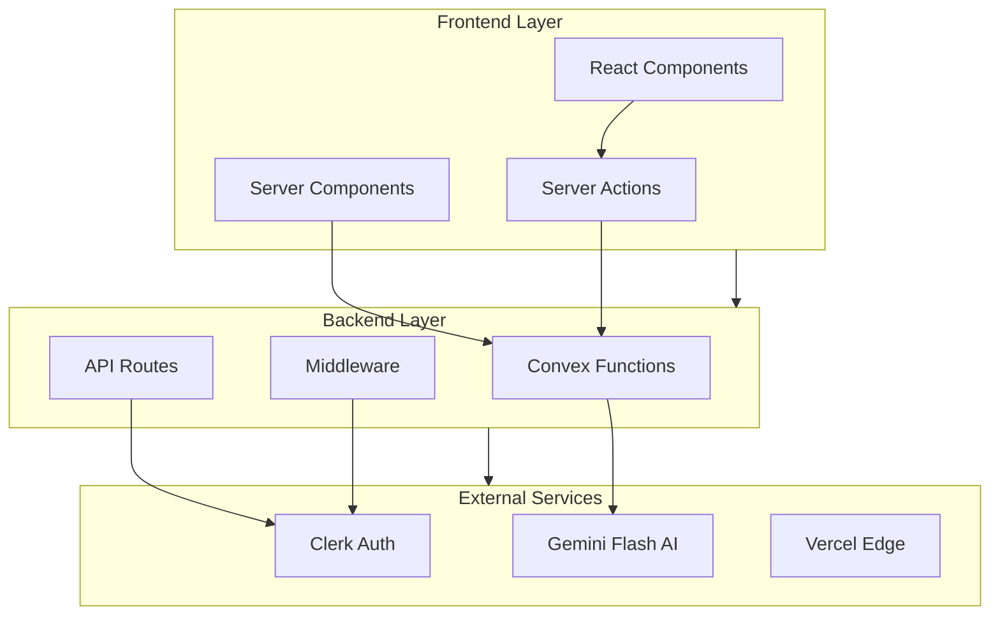

# API Specifications & Data Flow Documentation

This document provides comprehensive API specifications and data flow documentation for the Resonant relationship health journal application.

## Document Overview

This documentation is organized into two main sections:

### 1. API Specifications

Comprehensive documentation of all API endpoints, data models, request/response schemas, authentication patterns, and error handling.

**Location**: `/docs/api-specifications.md`

**Coverage**:

- Convex API functions (queries, mutations, actions)
- Next.js API routes and server actions
- Authentication flows with Clerk
- AI processing endpoints with Google Gemini Flash
- Real-time subscription patterns
- Data validation schemas with Zod
- Type-safe patterns with TypeScript

### 2. Data Flow Architecture

Detailed data flow documentation showing how data moves through the system from user input to AI insights and back to the UI.

**Location**: `/docs/data-flow-architecture.md`

**Coverage**:

- User onboarding flow
- Journal entry creation flow
- AI analysis pipeline
- Real-time data synchronization
- Authentication flow
- Dashboard data flow
- Performance considerations
- Security checkpoints
- Cache invalidation patterns

## Quick Reference

### Core API Categories

1. **Authentication & User Management**
   - User registration and profile management
   - Clerk webhook integration
   - Session handling and preferences

2. **Relationship Management**
   - CRUD operations for relationships
   - Tier-based limits (3 free, unlimited premium)
   - Photo upload and metadata management

3. **Journal Entries**
   - Rich text journaling with mood tracking
   - Privacy controls and tagging
   - Auto-save functionality

4. **AI Analysis**
   - Sentiment analysis with Google Gemini Flash
   - Pattern detection and insights
   - Health score calculations

5. **Dashboard & Analytics**
   - Real-time metrics aggregation
   - Trend analysis and visualizations
   - Export functionality

### Key Data Flows

1. **User Onboarding**: Clerk → Webhook → Convex → Profile Setup
2. **Journal Creation**: Input → Auto-save → AI Analysis → Health Score Update
3. **AI Pipeline**: Text → Gemini Flash → Structured Analysis → Insights
4. **Real-time Sync**: WebSocket → Cache Invalidation → UI Updates
5. **Dashboard**: Multi-source Aggregation → Caching → Chart Rendering

## Architecture Overview

## Technology Stack Integration

### Next.js 15 App Router

- **Server Components**: Data fetching and initial rendering
- **Server Actions**: Form handling and data mutations
- **API Routes**: Webhook endpoints and external integrations
- **Middleware**: Authentication and request processing

### Convex Backend

- **Queries**: Type-safe data fetching with real-time subscriptions
- **Mutations**: CRUD operations with optimistic updates
- **Actions**: External API calls and background processing
- **Scheduled Functions**: Automated tasks and cleanup

### Authentication (Clerk)

- **Middleware Protection**: Route-level security
- **Webhook Sync**: Automatic user creation and updates
- **Session Management**: JWT-based authentication
- **Social Providers**: Google, GitHub integration

### AI Integration (Google Gemini Flash)

- **Sentiment Analysis**: Journal entry emotional analysis
- **Pattern Detection**: Relationship dynamic insights
- **Suggestion Generation**: Personalized recommendations
- **Cost Optimization**: Token usage tracking and caching

## Performance Characteristics

### Response Times (Target)

- **Real-time Updates**: < 100ms (WebSocket)
- **Data Queries**: < 200ms (Convex edge cache)
- **AI Analysis**: < 2s (Gemini Flash)
- **Dashboard Load**: < 500ms (cached aggregations)

### Scalability Features

- **Edge Deployment**: Global CDN with Vercel
- **Database Scaling**: Convex automatic scaling
- **Caching Strategy**: Multi-layer with smart invalidation
- **Rate Limiting**: Tier-based quotas and graceful degradation

### Security Measures

- **Authentication**: Multi-factor with Clerk
- **Authorization**: Function-level permissions
- **Data Privacy**: User-controlled visibility
- **Input Validation**: Zod schemas at all entry points

## Development Workflow

### API Development

1. Define TypeScript interfaces in `/src/lib/types.ts`
2. Create Zod validation schemas in `/src/lib/validations.ts`
3. Implement Convex functions in `/convex/`
4. Add custom hooks in `/src/hooks/`
5. Write comprehensive tests

### Testing Strategy

- **Unit Tests**: Jest for business logic
- **Integration Tests**: API endpoint validation
- **E2E Tests**: Playwright for user journeys
- **Real-time Tests**: WebSocket connection validation

### Documentation Standards

- **API Docs**: OpenAPI-style specifications
- **Data Flow**: Mermaid diagrams for visual clarity
- **Code Examples**: TypeScript with error handling
- **Integration Guides**: Step-by-step implementation

## Getting Started

### For Frontend Developers

1. Review the API specifications document
2. Understand the authentication flow
3. Implement custom hooks for data fetching
4. Follow the real-time subscription patterns

### For Backend Developers

1. Study the data flow architecture
2. Understand the Convex function patterns
3. Implement new API endpoints following the established conventions
4. Ensure proper error handling and validation

### For QA Engineers

1. Use the API specifications for test case creation
2. Follow the data flow diagrams for integration testing
3. Validate error handling scenarios
4. Test real-time functionality thoroughly

## Maintenance and Updates

### Version Control

- API versions managed through Convex deployments
- Breaking changes documented in migration guides
- Backward compatibility maintained for 2 major versions

### Monitoring

- API performance tracking with Vercel Analytics
- Error logging and alerting
- Usage metrics and cost monitoring
- Security audit logs

### Evolution Strategy

- Regular review of API patterns and performance
- Gradual migration to new features
- Community feedback integration
- Industry best practice adoption

---

**Next Steps**: Review the detailed API specifications and data flow documentation in their respective files to understand the complete technical architecture of the Resonant application.
