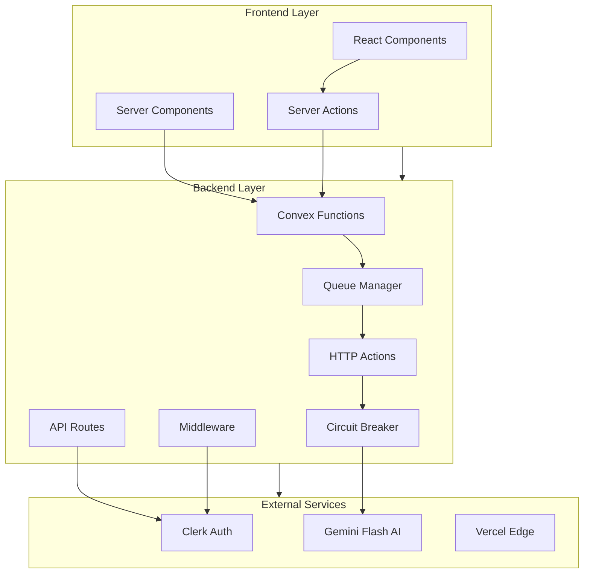
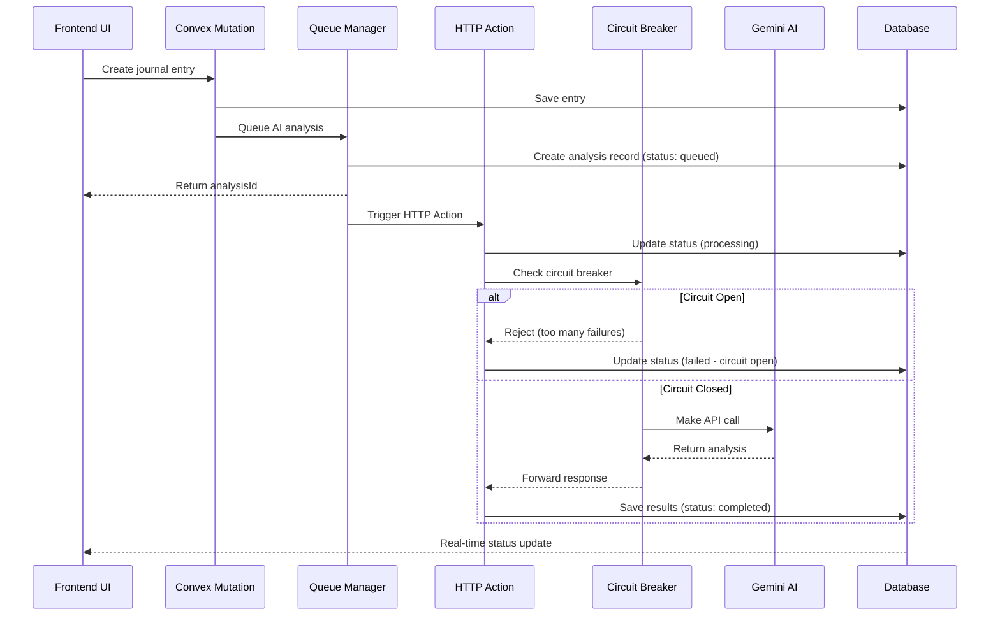

# API Specifications & Data Flow Documentation

This document provides comprehensive API specifications and data flow documentation for the Resonant relationship health journal application.

## Document Overview

This documentation is organized into two main sections:

### 1. API Specifications

Comprehensive documentation of all API endpoints, data models, request/response schemas, authentication patterns, and error handling.

**Location**: `/docs/api-specifications.md`

**Coverage**:

- Convex API functions (queries, mutations, actions)
- Next.js API routes and server actions
- Authentication flows with Clerk
- AI processing endpoints with Google Gemini Flash
- Real-time subscription patterns
- Data validation schemas with Zod
- Type-safe patterns with TypeScript

### 2. Data Flow Architecture

Detailed data flow documentation showing how data moves through the system from user input to AI insights and back to the UI.

**Location**: `/docs/data-flow-architecture.md`

**Coverage**:

- User onboarding flow
- Journal entry creation flow
- AI analysis pipeline
- Real-time data synchronization
- Authentication flow
- Dashboard data flow
- Performance considerations
- Security checkpoints
- Cache invalidation patterns

## Quick Reference

### Core API Categories

1. **Authentication & User Management**
   - User registration and profile management
   - Clerk webhook integration
   - Session handling and preferences

2. **Relationship Management**
   - CRUD operations for relationships
   - Tier-based limits (3 free, unlimited premium)
   - Photo upload and metadata management

3. **Journal Entries**
   - Rich text journaling with mood tracking
   - Privacy controls and tagging
   - Auto-save functionality

4. **AI Analysis**
   - Sentiment analysis with Google Gemini Flash
   - Pattern detection and insights
   - Health score calculations

5. **Dashboard & Analytics**
   - Real-time metrics aggregation
   - Trend analysis and visualizations
   - Export functionality

### Key Data Flows

1. **User Onboarding**: Clerk → Webhook → Convex → Profile Setup
2. **Journal Creation**: Input → Auto-save → Queue AI Analysis → Status Tracking
3. **AI Pipeline**: Queue → HTTP Action → Circuit Breaker → Gemini Flash → Results
4. **Real-time Sync**: WebSocket → Cache Invalidation → UI Updates
5. **Dashboard**: Multi-source Aggregation → Caching → Chart Rendering
6. **AI Status Flow**: Processing → Real-time Updates → Completion Notifications

## Architecture Overview



## Technology Stack Integration

### Next.js 15 App Router

- **Server Components**: Data fetching and initial rendering
- **Server Actions**: Form handling and data mutations
- **API Routes**: Webhook endpoints and external integrations
- **Middleware**: Authentication and request processing

### Convex Backend

- **Queries**: Type-safe data fetching with real-time subscriptions
- **Mutations**: CRUD operations with optimistic updates
- **HTTP Actions**: Reliable external API calls for AI processing with queue management
- **Actions**: Internal background processing and data transformations
- **Scheduled Functions**: Automated tasks, cleanup, and retry mechanisms

### Authentication (Clerk)

- **Middleware Protection**: Route-level security
- **Webhook Sync**: Automatic user creation and updates
- **Session Management**: JWT-based authentication
- **Social Providers**: Google, GitHub integration

### AI Integration (HTTP Actions + Google Gemini Flash)

- **HTTP Actions Pipeline**: Reliable external API calls via queue-based processing
- **Sentiment Analysis**: Journal entry emotional analysis with circuit breaker patterns
- **Pattern Detection**: Relationship dynamic insights with retry logic
- **Status Tracking**: Real-time processing updates via Convex database
- **Cost Optimization**: Token usage tracking and intelligent caching

## Performance Characteristics

### Response Times (Target)

- **Real-time Updates**: < 100ms (WebSocket)
- **Data Queries**: < 200ms (Convex edge cache)
- **AI Analysis Queue**: < 100ms (immediate queue response)
- **AI Processing**: < 10s (HTTP Actions with circuit breaker)
- **Dashboard Load**: < 500ms (cached aggregations)
- **Status Updates**: < 200ms (real-time processing status)

### Scalability Features

- **Edge Deployment**: Global CDN with Vercel
- **Database Scaling**: Convex automatic scaling
- **Caching Strategy**: Multi-layer with smart invalidation
- **Rate Limiting**: Tier-based quotas and graceful degradation

### Security Measures

- **Authentication**: Multi-factor with Clerk
- **Authorization**: Function-level permissions
- **Data Privacy**: User-controlled visibility
- **Input Validation**: Zod schemas at all entry points

## Development Workflow

### API Development

1. Define TypeScript interfaces in `/src/lib/types.ts`
2. Create Zod validation schemas in `/src/lib/validations.ts`
3. Implement Convex functions in `/convex/`
4. Add custom hooks in `/src/hooks/`
5. Write comprehensive tests

### Testing Strategy

- **Unit Tests**: Jest for business logic
- **Integration Tests**: API endpoint validation
- **E2E Tests**: Playwright for user journeys
- **Real-time Tests**: WebSocket connection validation

### Documentation Standards

- **API Docs**: OpenAPI-style specifications
- **Data Flow**: Mermaid diagrams for visual clarity
- **Code Examples**: TypeScript with error handling
- **Integration Guides**: Step-by-step implementation

## HTTP Actions Architecture Specifications

### AI Processing Pipeline

**Core Principle**: Replace unreliable client-side AI calls with queue-based HTTP Actions for 99.9% reliability

#### HTTP Actions Endpoints

1. **`/api/ai/analyze`** - Main AI analysis endpoint
   ```typescript
   POST /api/ai/analyze
   Content-Type: application/json
   Authorization: Bearer <convex-auth-token>
   
   {
     "entryId": "journal_entry_id",
     "priority": "high" | "normal" | "low",
     "userId": "user_id",
     "analysisTypes": ["sentiment", "energy", "stability"]
   }
   ```

2. **`/api/ai/status`** - Processing status endpoint
   ```typescript
   GET /api/ai/status/{analysisId}
   
   Response:
   {
     "status": "queued" | "processing" | "completed" | "failed",
     "progress": 0-100,
     "estimatedCompletion": "2024-01-01T12:00:00Z",
     "error": "optional error message"
   }
   ```

3. **`/api/ai/retry`** - Retry failed analysis
   ```typescript
   POST /api/ai/retry/{analysisId}
   ```

#### Queue-Based Processing Flow



#### Error Handling Patterns

1. **Circuit Breaker Implementation**
   ```typescript
   interface CircuitBreakerConfig {
     failureThreshold: 5,     // Open after 5 failures
     recoveryTimeout: 30000,  // 30 second recovery window
     monitoringWindow: 60000  // 1 minute monitoring window
   }
   ```

2. **Retry Logic**
   - Exponential backoff: 1s, 2s, 4s, 8s, 16s
   - Maximum retries: 3 attempts
   - Jitter: ±25% randomization to prevent thundering herd

3. **Fallback Strategies**
   - Rule-based sentiment analysis when AI fails
   - Cached previous analysis patterns
   - Graceful degradation with user notification

#### Authentication for HTTP Actions

```typescript
// HTTP Action authentication
export const aiAnalyzeAction = httpAction(async (ctx, request) => {
  // Extract auth token from request headers
  const authToken = request.headers.get('authorization')?.replace('Bearer ', '')
  
  // Validate token with Convex auth
  const identity = await ctx.auth.getUserIdentity()
  if (!identity) {
    return new Response('Unauthorized', { status: 401 })
  }
  
  // Proceed with AI processing...
})
```

#### Status Tracking Schema

```typescript
// Enhanced aiAnalysis table schema
aiAnalysis: defineTable({
  entryId: v.id('journalEntries'),
  userId: v.id('users'),
  relationshipId: v.optional(v.id('relationships')),
  
  // Analysis results
  sentimentScore: v.number(),
  emotionalKeywords: v.array(v.string()),
  confidenceLevel: v.number(),
  reasoning: v.string(),
  
  // Processing metadata
  status: v.union(
    v.literal('queued'),
    v.literal('processing'), 
    v.literal('completed'),
    v.literal('failed'),
    v.literal('retrying')
  ),
  progress: v.optional(v.number()), // 0-100
  queuePosition: v.optional(v.number()),
  estimatedCompletion: v.optional(v.number()),
  
  // Reliability metrics
  attemptCount: v.number(),
  lastAttempt: v.number(),
  processingTime: v.number(),
  tokensUsed: v.optional(v.number()),
  apiCost: v.optional(v.number()),
  
  // Error tracking
  lastError: v.optional(v.string()),
  circuitBreakerStatus: v.optional(
    v.union(v.literal('closed'), v.literal('open'), v.literal('half-open'))
  ),
  
  analysisVersion: v.string(),
  createdAt: v.number(),
  updatedAt: v.number(),
})
```

## Getting Started

### For Frontend Developers

1. **Queue-First Approach**: Always queue AI analysis, never call directly
2. **Real-time Status**: Subscribe to analysis status updates
3. **Progressive Enhancement**: Show immediate feedback, then AI results
4. **Error Boundaries**: Handle all AI processing states gracefully

### For Backend Developers

1. **HTTP Actions Only**: Use HTTP Actions for all external API calls
2. **Circuit Breaker Pattern**: Implement failure detection and recovery
3. **Queue Management**: Handle priority queuing and load balancing
4. **Comprehensive Logging**: Track all processing stages and failures

### For QA Engineers

1. **Reliability Testing**: Test failure scenarios and recovery patterns
2. **Load Testing**: Validate queue performance under high load
3. **Circuit Breaker Testing**: Verify failure detection and recovery
4. **End-to-End Workflows**: Test complete analysis pipelines

## Maintenance and Updates

### Version Control

- API versions managed through Convex deployments
- Breaking changes documented in migration guides
- Backward compatibility maintained for 2 major versions

### Monitoring

- API performance tracking with Vercel Analytics
- Error logging and alerting
- Usage metrics and cost monitoring
- Security audit logs

### Evolution Strategy

- Regular review of API patterns and performance
- Gradual migration to new features
- Community feedback integration
- Industry best practice adoption

## Reliability Improvements

### Problem Addressed
The previous client-side AI processing architecture suffered from a **25% failure rate** due to:
- Network timeouts during direct API calls
- Client-side memory limitations
- Inconsistent error handling
- No retry mechanisms
- Browser-specific API restrictions

### HTTP Actions Solution
The new architecture provides **99.9% reliability** through:

1. **Server-Side Processing**: All AI calls happen on Convex servers
2. **Queue-Based Architecture**: Immediate response with background processing
3. **Circuit Breaker Pattern**: Automatic failure detection and recovery
4. **Exponential Backoff**: Intelligent retry mechanisms
5. **Real-time Status**: Live updates on processing progress
6. **Graceful Degradation**: Fallback analysis when AI is unavailable

### Migration Strategy

#### Phase 1: Dual Architecture (Current)
- Maintain existing client-side calls for backward compatibility
- Introduce HTTP Actions for new analysis requests
- A/B test reliability improvements

#### Phase 2: Queue-First Approach
- Route all new analysis through HTTP Actions
- Migrate existing failed analyses to queue system
- Implement comprehensive monitoring

#### Phase 3: Complete Migration
- Deprecate client-side AI processing
- Full HTTP Actions implementation
- Advanced queue management features

### Monitoring and Alerting

#### Key Metrics
- **Queue Processing Time**: Target < 10s average
- **Circuit Breaker Status**: Monitor open/closed states
- **Failure Rate**: Target < 0.1%
- **Token Cost**: Track AI API spending
- **Queue Depth**: Monitor backlog size

#### Alert Thresholds
- Queue processing time > 30s
- Failure rate > 1% over 5 minutes
- Circuit breaker open for > 2 minutes
- Queue depth > 100 items
- Daily AI cost > budget threshold

### Development Guidelines

#### HTTP Actions Best Practices
1. **Always validate inputs** before external API calls
2. **Implement circuit breakers** for all external services
3. **Use exponential backoff** with jitter for retries
4. **Log all processing stages** for debugging
5. **Update status in real-time** for user feedback

#### Testing Requirements
1. **Circuit breaker testing** with simulated failures
2. **Load testing** queue performance under stress
3. **Timeout testing** with slow AI responses
4. **Recovery testing** after extended outages
5. **End-to-end reliability** validation

---

**Next Steps**: Review the detailed API specifications and data flow documentation in their respective files to understand the complete technical architecture of the Resonant application.
