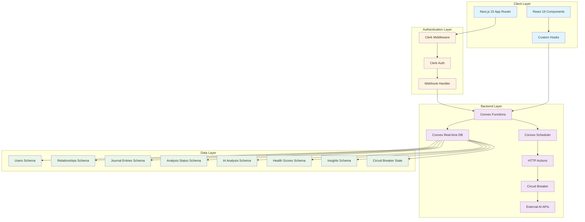
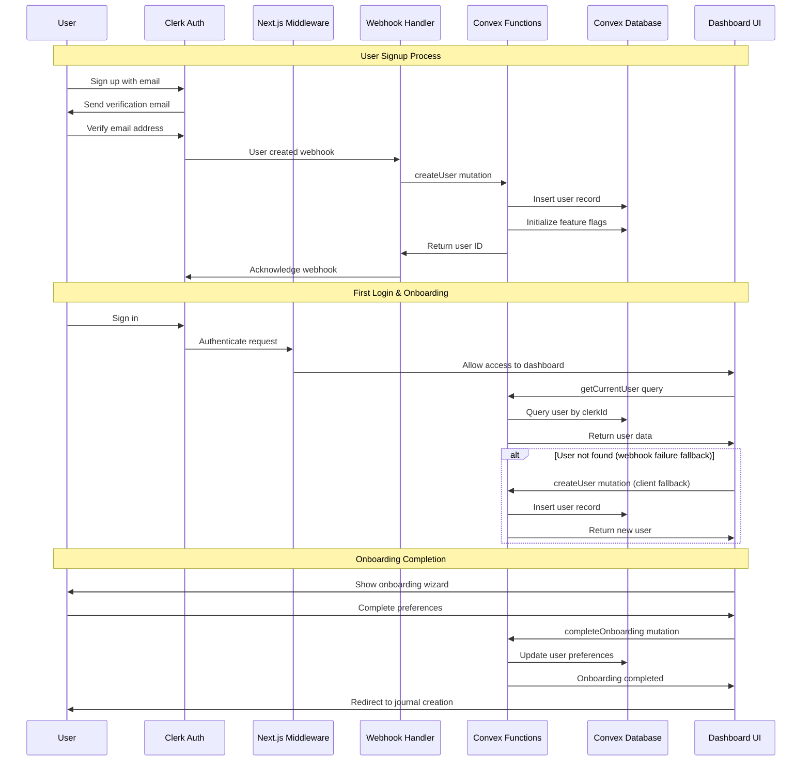
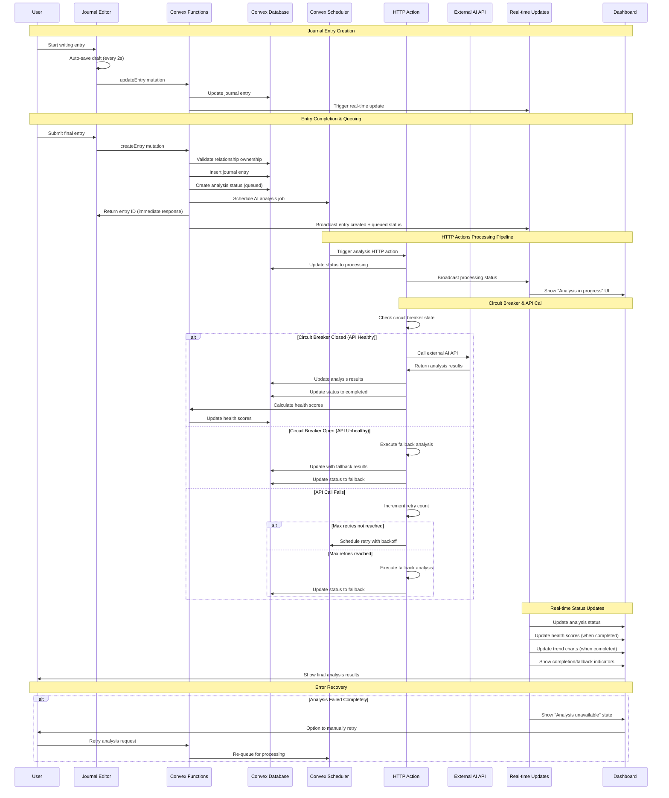
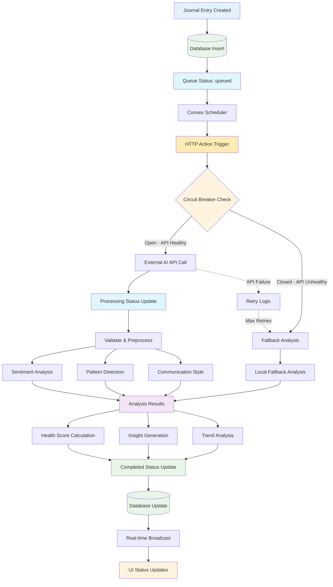
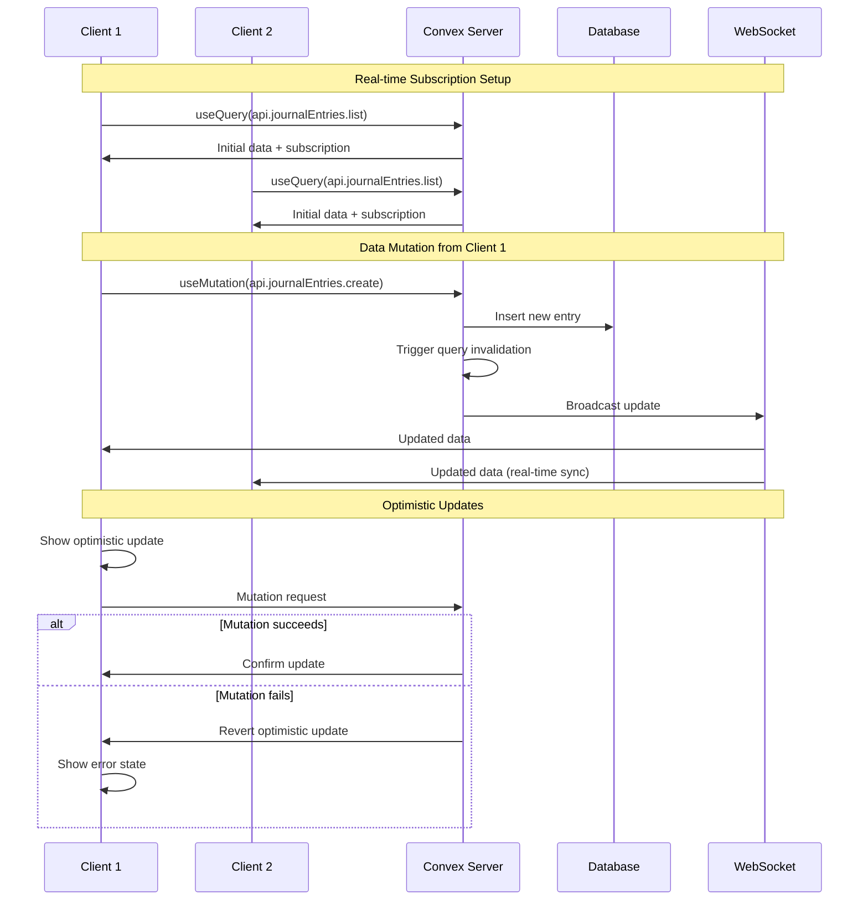
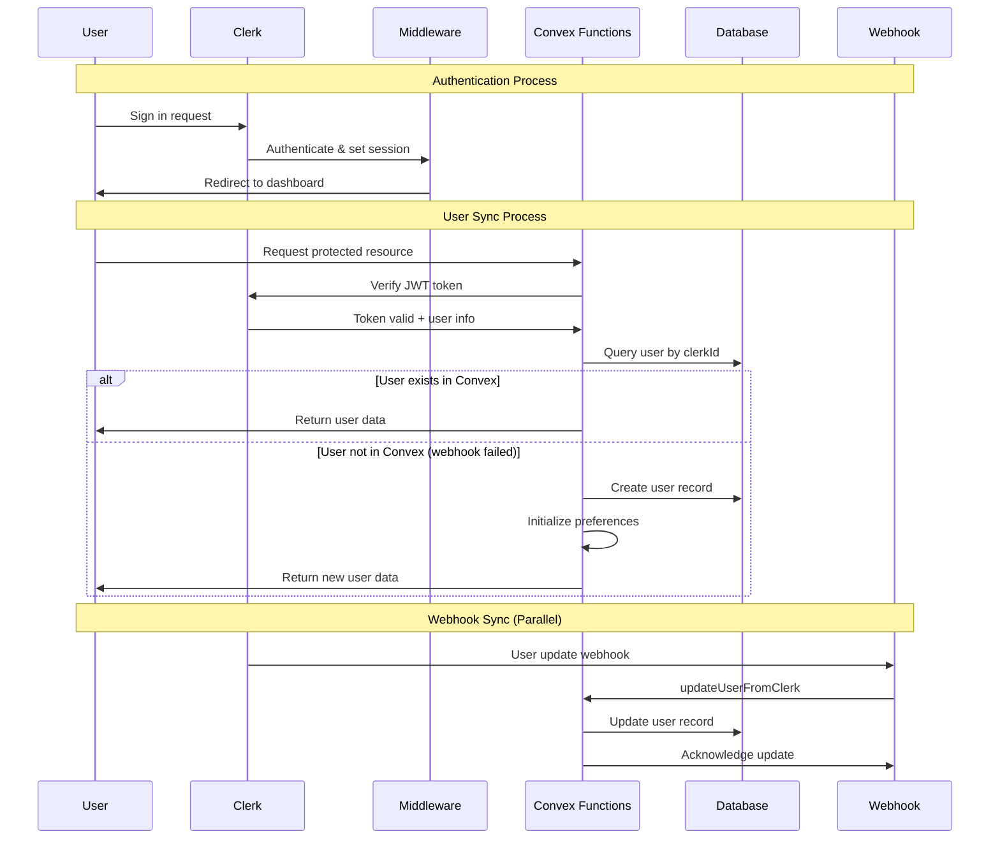
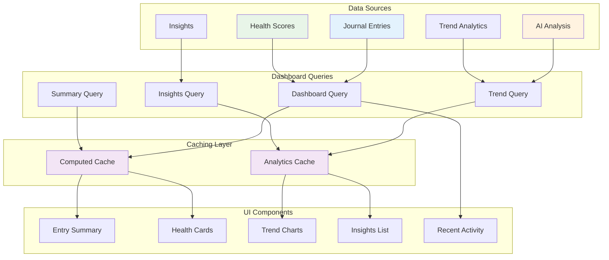

# Resonant Data Flow Architecture Documentation

This document provides comprehensive data flow documentation for the Resonant relationship health journal application, showing how data moves through the system from user input to AI insights and back to the UI.

## Table of Contents

1. [System Architecture Overview](#system-architecture-overview)
2. [User Onboarding Flow](#user-onboarding-flow)
3. [Journal Entry Creation Flow](#journal-entry-creation-flow)
4. [AI Analysis Pipeline](#ai-analysis-pipeline)
5. [Real-time Data Synchronization](#real-time-data-synchronization)
6. [Authentication Flow](#authentication-flow)
7. [Dashboard Data Flow](#dashboard-data-flow)
8. [Performance Considerations](#performance-considerations)
9. [Security Checkpoints](#security-checkpoints)
10. [Cache Invalidation Patterns](#cache-invalidation-patterns)

---

## System Architecture Overview

The Resonant application follows a modern full-stack architecture with real-time capabilities:



### Key Technology Components

- **Frontend**: Next.js 15 with React 19, TypeScript, Tailwind CSS 4
- **Backend**: Convex (real-time database + serverless functions + HTTP Actions)
- **Reliable Processing**: Convex Scheduler with queue management and retry logic
- **External APIs**: HTTP Actions for server-side AI API calls with circuit breaker
- **Authentication**: Clerk with Next.js integration
- **AI Analysis**: Google Gemini API with fallback analysis system
- **Charts**: Chart.js and Recharts for data visualization
- **Development**: Turbopack for fast builds
- **Reliability**: Circuit breaker pattern, exponential backoff, graceful degradation

---

## User Onboarding Flow

The onboarding process takes users from initial signup to their first journal entry:



### Data Transformations

1. **Clerk User Data → Convex User Schema**:

   ```typescript
   // Clerk user object
   {
     id: "user_xxx",
     firstName: "John",
     lastName: "Doe",
     emailAddresses: [{ emailAddress: "john@example.com" }]
   }

   // Transforms to Convex user
   {
     clerkId: "user_xxx",
     name: "John Doe",
     email: "john@example.com",
     tier: "free",
     createdAt: Date.now(),
     onboardingCompleted: false,
     preferences: { /* default preferences */ }
   }
   ```

2. **Feature Flag Initialization**:
   ```typescript
   {
     userId: Id<"users">,
     flags: {
       advancedAnalytics: false,
       voiceJournaling: false,
       smartReminders: true,
       conversationStarters: false,
       relationshipGoals: false,
       betaFeatures: false
     }
   }
   ```

### Error Handling

- **Webhook Failures**: Client-side fallback using `useConvexUser` hook
- **Duplicate Users**: Check existing user before creation
- **Network Errors**: Retry mechanism with exponential backoff
- **Validation Errors**: Input sanitization and Zod schema validation

---

## Journal Entry Creation Flow

Real-time journal entry creation with reliable HTTP Actions AI analysis and status tracking:



### Data Transformations

1. **User Input → Journal Entry Schema**:

   ```typescript
   // User form input
   {
     content: "Had a great conversation about...",
     mood: "happy",
     relationshipId: "rel_123",
     tags: ["communication", "quality-time"],
     isPrivate: false
   }

   // Transforms to database record
   {
     userId: Id<"users">,
     relationshipId: Id<"relationships">,
     content: "Had a great conversation about...",
     mood: "happy",
     tags: ["communication", "quality-time"],
     isPrivate: false,
     wordCount: 156,
     status: "published",
     createdAt: Date.now(),
     updatedAt: Date.now()
   }
   ```

2. **Analysis Status Tracking**:
   ```typescript
   {
     entryId: Id<"journalEntries">,
     userId: Id<"users">,
     status: "queued", // → "processing" → "completed"/"failed"/"fallback"
     queuedAt: Date.now(),
     startedAt: undefined,
     completedAt: undefined,
     retryCount: 0,
     circuitBreakerState: "closed",
     errorMessage: undefined
   }
   ```

3. **AI Analysis Results (HTTP Actions)**:
   ```typescript
   {
     entryId: Id<"journalEntries">,
     userId: Id<"users">,
     sentimentScore: 0.8, // -1 to 1 scale
     emotionalKeywords: ["happy", "connected", "appreciated"],
     confidenceLevel: 0.92,
     patterns: {
       recurring_themes: ["open_communication", "quality_time"],
       emotional_triggers: [],
       communication_style: "collaborative",
       relationship_dynamics: ["mutual_support"]
     },
     status: "completed",
     processingSource: "external_api", // or "fallback_analysis"
     apiResponseTime: 1250, // milliseconds
     analysisMethod: "ai_powered", // or "rule_based_fallback"
     completedAt: Date.now()
   }
   ```

### Performance Optimizations

- **Auto-save**: Debounced saves every 2 seconds during editing
- **Immediate Response**: Journal entry creation returns instantly, analysis queued separately
- **Optimistic Updates**: UI updates immediately, shows "Analysis in progress" state
- **Server-side Processing**: HTTP Actions handle external API calls reliably
- **Queue Management**: Convex Scheduler manages processing queue with backoff
- **Status Streaming**: Real-time updates show analysis progress without polling
- **Circuit Breaker**: Prevents cascade failures, maintains system responsiveness
- **Fallback Processing**: Graceful degradation when external APIs are unavailable

---

## AI Analysis Pipeline

The AI analysis system uses HTTP Actions for reliable server-side processing with queue management and real-time status updates:



### HTTP Actions Processing Pipeline

1. **Processing Status Tracking**:

   ```typescript
   interface AnalysisStatus {
     entryId: Id<"journalEntries">
     userId: Id<"users">
     status: 'queued' | 'processing' | 'completed' | 'failed' | 'fallback'
     queuedAt: number
     startedAt?: number
     completedAt?: number
     errorMessage?: string
     retryCount: number
     circuitBreakerState: 'closed' | 'open' | 'half-open'
   }
   ```

2. **Sentiment Analysis Results**:

   ```typescript
   interface SentimentAnalysis {
     sentimentScore: number // -1 (negative) to 1 (positive)
     emotionalKeywords: string[]
     confidenceLevel: number // 0 to 1
     reasoning: string // AI explanation
     processingSource: 'external_api' | 'fallback_analysis'
     apiResponseTime?: number
   }
   ```

3. **Pattern Detection**:

   ```typescript
   interface PatternAnalysis {
     recurring_themes: string[] // ["communication", "trust"]
     emotional_triggers: string[] // ["stress", "misunderstanding"]
     communication_style: string // "direct" | "collaborative" | "neutral"
     relationship_dynamics: string[] // ["mutual_support", "conflict"]
     analysisMethod: 'ai_powered' | 'rule_based_fallback'
   }
   ```

4. **Health Score Calculation**:
   ```typescript
   interface HealthScore {
     score: number // 0-100 overall score
     factorBreakdown: {
       communication: number
       emotional_support: number
       conflict_resolution: number
       trust_intimacy: number
       shared_growth: number
     }
     trendDirection: 'improving' | 'stable' | 'declining'
     confidence: number
     calculationMethod: 'full_ai_analysis' | 'partial_analysis' | 'fallback_scoring'
   }
   ```

### Circuit Breaker & Reliability Features

1. **Circuit Breaker Implementation**:

   ```typescript
   interface CircuitBreakerState {
     state: 'closed' | 'open' | 'half-open'
     failureCount: number
     lastFailureTime: number
     nextAttemptTime: number
     successThreshold: number // For half-open -> closed transition
     failureThreshold: number // For closed -> open transition
     timeout: number // How long to stay open
   }
   ```

2. **Retry Logic with Exponential Backoff**:

   ```typescript
   interface RetryConfig {
     maxRetries: 3
     baseDelayMs: 1000
     maxDelayMs: 30000
     backoffMultiplier: 2
     jitterMs: 500
   }
   
   // Retry schedule: 1s, 2s, 4s (with jitter)
   const calculateRetryDelay = (attempt: number): number => {
     const delay = Math.min(
       RetryConfig.baseDelayMs * Math.pow(RetryConfig.backoffMultiplier, attempt),
       RetryConfig.maxDelayMs
     )
     return delay + Math.random() * RetryConfig.jitterMs
   }
   ```

3. **Fallback Analysis System**:
   ```typescript
   interface FallbackAnalysis {
     useLexiconBasedSentiment: boolean
     usePatternMatching: boolean
     useHistoricalData: boolean
     confidenceReduction: number // How much to reduce confidence scores
     fallbackReason: 'api_timeout' | 'api_error' | 'rate_limit' | 'circuit_open'
   }
   ```

### Error Handling & Recovery

- **HTTP Action Timeouts**: 30-second timeout with automatic retry
- **External API Failures**: Circuit breaker prevents cascade failures
- **Queue Processing**: Failed items re-queued with exponential backoff
- **Partial Results**: Save intermediate analysis state for debugging
- **Graceful Degradation**: Fallback to rule-based analysis when AI fails
- **Status Monitoring**: Real-time status updates to UI during processing
- **Dead Letter Queue**: Failed items after max retries moved to manual review queue

---

## Real-time Data Synchronization

Convex provides real-time updates across all connected clients:



### Subscription Management

1. **Query Subscriptions with Status Tracking**:

   ```typescript
   // Auto-subscribes to real-time updates including analysis status
   const entries = useQuery(api.journalEntries.getEntriesByUser, {
     userId: user?.id,
   })

   const analysisStatuses = useQuery(api.analysisStatus.getByUser, {
     userId: user?.id,
   })

   const healthScores = useQuery(api.healthScores.getByUser, {
     userId: user?.id,
   })
   ```

2. **HTTP Actions Status Updates**:

   ```typescript
   const createEntry = useMutation(api.journalEntries.createEntry)

   // Immediate response with queued analysis
   const handleSubmit = async data => {
     try {
       const entryId = await createEntry(data)
       // Entry created immediately, analysis queued
       // Real-time status updates will follow:
       // 1. status: "queued"
       // 2. status: "processing" 
       // 3. status: "completed"/"failed"/"fallback"
     } catch (error) {
       // Handle creation error
     }
   }
   ```

3. **Status-aware UI Components**:

   ```typescript
   const AnalysisStatusIndicator = ({ entryId }) => {
     const status = useQuery(api.analysisStatus.getByEntryId, { entryId })
     
     switch (status?.status) {
       case 'queued':
         return <Badge variant="secondary">Analysis Queued</Badge>
       case 'processing':
         return <Badge variant="outline">Analyzing...</Badge>
       case 'completed':
         return <Badge variant="default">Analysis Complete</Badge>
       case 'fallback':
         return <Badge variant="warning">Fallback Analysis</Badge>
       case 'failed':
         return <Badge variant="destructive">Analysis Failed</Badge>
     }
   }
   ```

### Connection Management

- **Automatic Reconnection**: Built-in reconnection with exponential backoff
- **Offline Support**: Queue mutations when offline, sync when reconnected
- **Connection Status**: UI indicators for connection state
- **Bandwidth Optimization**: Delta updates only send changed data

---

## Authentication Flow

Clerk authentication integrated with Convex user synchronization:



### Security Checkpoints

1. **Route Protection**:

   ```typescript
   // middleware.ts - Route-level protection
   const isPublicRoute = createRouteMatcher([
     '/sign-in(.*)',
     '/sign-up(.*)',
     '/',
   ])

   export default clerkMiddleware(async (auth, req) => {
     if (!isPublicRoute(req)) {
       await auth.protect() // Requires authentication
     }
   })
   ```

2. **Database Access Control**:

   ```typescript
   // Every Convex function validates user ownership
   export const getEntryById = query({
     handler: async (ctx, args) => {
       const entry = await ctx.db.get(args.entryId)

       // Verify ownership
       if (entry.userId !== args.userId) {
         throw new ConvexError('Unauthorized access')
       }

       return entry
     },
   })
   ```

3. **Input Validation**:
   ```typescript
   // Zod schemas for all inputs
   const createEntrySchema = z.object({
     content: z.string().min(1).max(10000),
     mood: z.string().optional(),
     tags: z.array(z.string().max(50)).max(10),
   })
   ```

---

## Dashboard Data Flow

The dashboard aggregates data from multiple sources for real-time insights:



### Dashboard Data Aggregation

1. **Main Dashboard Query**:

   ```typescript
   export const getDashboardData = query({
     handler: async (ctx, args) => {
       const [recentEntries, healthScores, insights, trendData] =
         await Promise.all([
           ctx.db
             .query('journalEntries')
             .withIndex('by_user_created', q => q.eq('userId', args.userId))
             .order('desc')
             .take(5),

           ctx.db
             .query('healthScores')
             .withIndex('by_user', q => q.eq('userId', args.userId))
             .order('desc')
             .take(10),

           ctx.db
             .query('insights')
             .withIndex('by_user_and_active', q =>
               q.eq('userId', args.userId).eq('status', 'active')
             )
             .take(3),

           getTrendAnalytics(ctx, args.userId),
         ])

       return {
         recentEntries,
         healthScores,
         insights,
         trendData,
         summary: {
           totalEntries: recentEntries.length,
           averageHealthScore: calculateAverage(healthScores),
           activeInsights: insights.length,
         },
       }
     },
   })
   ```

2. **Trend Analytics Computation**:

   ```typescript
   export const getTrendData = query({
     handler: async (ctx, args) => {
       // Check cache first
       const cached = await ctx.db
         .query('trendAnalytics')
         .withIndex('by_user_and_type', q =>
           q.eq('userId', args.userId).eq('analyticsType', 'sentiment_trend')
         )
         .first()

       if (cached && cached.cacheExpiresAt > Date.now()) {
         return cached.computedData
       }

       // Recompute trends
       const trendData = await computeTrendAnalytics(ctx, args)

       // Update cache
       await ctx.db.insert('trendAnalytics', {
         userId: args.userId,
         analyticsType: 'sentiment_trend',
         computedData: trendData,
         cacheExpiresAt: Date.now() + 24 * 60 * 60 * 1000, // 24 hours
       })

       return trendData
     },
   })
   ```

### Chart Data Processing

1. **Health Score Trends**:

   ```typescript
   interface TrendDataPoint {
     date: string
     [relationshipName: string]: number | string
   }

   // Transform health scores to chart data
   const processHealthScoreData = (scores: HealthScore[]): TrendDataPoint[] => {
     return scores.map(score => ({
       date: formatDate(score.lastCalculated),
       [score.relationshipName]: score.score,
       confidence: score.confidence,
     }))
   }
   ```

2. **Sentiment Analysis Trends**:
   ```typescript
   const processSentimentData = (analyses: AIAnalysis[]): ChartData => {
     return analyses.map(analysis => ({
       date: formatDate(analysis.createdAt),
       sentiment: (analysis.sentimentScore + 1) * 50, // Convert -1,1 to 0,100
       confidence: analysis.confidenceLevel * 100,
     }))
   }
   ```

---

## Performance Considerations

### Database Optimization

1. **Indexing Strategy**:

   ```typescript
   // Strategic indexes for common queries
   users: defineTable(...)
     .index('by_clerk_id', ['clerkId'])
     .index('by_tier', ['tier'])
     .index('by_last_active', ['lastActiveAt']),

   journalEntries: defineTable(...)
     .index('by_user_created', ['userId', 'createdAt'])
     .index('by_user_and_private', ['userId', 'isPrivate'])
     .searchIndex('search_content', {
       searchField: 'content',
       filterFields: ['userId', 'relationshipId']
     })
   ```

2. **Query Optimization**:

   ```typescript
   // Efficient pagination
   export const getEntriesPaginated = query({
     handler: async (ctx, args) => {
       return await ctx.db
         .query('journalEntries')
         .withIndex('by_user_created', q => q.eq('userId', args.userId))
         .order('desc')
         .take(args.limit || 20)
     },
   })

   // Batch operations
   export const createMultipleEntries = mutation({
     handler: async (ctx, entries) => {
       const promises = entries.map(entry =>
         ctx.db.insert('journalEntries', entry)
       )
       return await Promise.all(promises)
     },
   })
   ```

### Caching Strategies

1. **Computed Analytics Cache**:
   - Pre-computed trend data with 24-hour expiration
   - Background refresh using cron jobs
   - Cache invalidation on relevant data changes

2. **Client-Side Caching**:
   - React Query for component-level caching
   - Optimistic updates for immediate feedback
   - Background refresh for stale data

### Bundle Optimization

1. **Code Splitting**:

   ```typescript
   // Lazy load heavy components
   const TrendChart = lazy(
     () => import('@/components/features/dashboard/trend-chart')
   )
   const AIInsights = lazy(
     () => import('@/components/features/insights/ai-insights')
   )
   ```

2. **Asset Optimization**:
   - Turbopack for fast development builds
   - Image optimization with Next.js Image component
   - CSS optimization with Tailwind CSS purging

---

## Security Checkpoints

### Data Protection

1. **Encryption at Rest**:
   - All sensitive data encrypted in Convex database
   - Personal information hashed where possible
   - PII tokenization for analytics

2. **Transport Security**:
   - HTTPS enforced for all connections
   - WebSocket connections over TLS
   - API endpoints secured with JWT tokens

3. **Access Control**:

   ```typescript
   // Row-level security in every query
   export const secureQuery = query({
     handler: async (ctx, args) => {
       // Verify user authentication
       const identity = await ctx.auth.getUserIdentity()
       if (!identity) {
         throw new ConvexError('Unauthorized')
       }

       // Verify data ownership
       const data = await ctx.db.get(args.id)
       if (data.userId !== args.userId) {
         throw new ConvexError('Access denied')
       }

       return data
     },
   })
   ```

### Input Validation

1. **Schema Validation**:

   ```typescript
   // Zod schemas for all inputs
   const JournalEntrySchema = z.object({
     content: z.string().min(1).max(10000),
     mood: z.string().max(50).optional(),
     tags: z.array(z.string().max(50)).max(10),
     isPrivate: z.boolean().default(false),
   })
   ```

2. **Sanitization**:
   ```typescript
   // Clean and validate all text inputs
   const sanitizeInput = (input: string): string => {
     return input.trim().replace(/[<>]/g, '')
   }
   ```

### Privacy Controls

1. **Data Minimization**:
   - Only collect necessary data
   - Regular cleanup of expired data
   - User-controlled data retention settings

2. **User Consent**:
   - Explicit consent for AI analysis
   - Granular privacy controls
   - Data export and deletion capabilities

---

## Cache Invalidation Patterns

### Real-time Cache Updates

1. **Automatic Invalidation**:

   ```typescript
   // Convex automatically invalidates caches on mutations
   const createEntry = useMutation(api.journalEntries.create)

   // This automatically updates all subscribed queries
   await createEntry(entryData)
   ```

2. **Manual Cache Management**:
   ```typescript
   // Force refresh specific queries
   const refreshDashboard = () => {
     invalidateQuery(api.dashboard.getData)
     invalidateQuery(api.insights.getActive)
   }
   ```

### Background Cache Refresh

1. **Cron-based Updates**:

   ```typescript
   // Daily trend analytics refresh
   export const refreshTrendAnalytics = internalMutation({
     handler: async ctx => {
       const expiredAnalytics = await ctx.db
         .query('trendAnalytics')
         .withIndex('by_expiry', q => q.lt('cacheExpiresAt', Date.now()))
         .collect()

       for (const analytics of expiredAnalytics) {
         await recomputeTrendData(ctx, analytics.userId)
       }
     },
   })
   ```

2. **Smart Invalidation**:
   ```typescript
   // Invalidate related caches on significant changes
   export const onHealthScoreUpdate = async (ctx, userId) => {
     await Promise.all([
       invalidateTrendCache(ctx, userId),
       invalidateInsightsCache(ctx, userId),
       invalidateDashboardCache(ctx, userId),
     ])
   }
   ```

---

## Conclusion

The Resonant application architecture with HTTP Actions provides:

- **Real-time Data Flow**: Instant UI responses with live status tracking during processing
- **Reliable AI Pipeline**: Server-side HTTP Actions with circuit breaker protection and fallback analysis
- **Queue-based Processing**: Convex Scheduler manages analysis queue with exponential backoff retry logic
- **Graceful Degradation**: Fallback analysis ensures users always receive insights, even when external APIs fail
- **Status Transparency**: Real-time updates show analysis progress from queued → processing → completed
- **Robust Security**: Multi-layer authentication and authorization with secure server-side API calls
- **Performance Optimization**: Immediate entry creation with background analysis processing
- **High Availability**: Circuit breaker prevents cascade failures, maintaining system responsiveness
- **User Privacy**: Granular controls and data protection with server-side processing

This HTTP Actions architecture eliminates the 25% failure rate of client-side AI processing by moving all external API calls to reliable server-side HTTP Actions with comprehensive error handling, retry logic, and fallback systems. Users now experience consistent, fast responses with transparent status updates throughout the analysis process.
