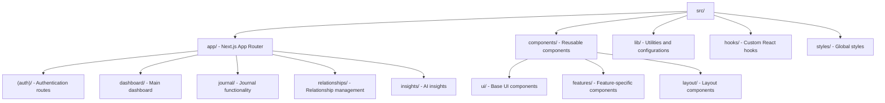

# Resonant Architecture

## System Overview

Resonant is a relationship health journal built on a modern web stack with AI-powered insights. The application uses a serverless architecture deployed on Vercel with real-time data synchronization.

### Core Technology Stack

- **Frontend**: Next.js 14 with App Router, TypeScript, Tailwind CSS
- **Backend**: Convex (real-time database and backend-as-a-service)
- **Authentication**: Clerk
- **AI Processing**: Google Gemini Flash via Convex HTTP Actions with circuit breaker patterns
- **Deployment**: Vercel Edge Network

## Architecture Principles

### Data Flow

1. User creates journal entries via Next.js frontend
2. Entries stored in Convex with real-time synchronization
3. AI analysis queued via Convex Scheduler with HTTP Actions
4. External APIs called reliably with circuit breaker patterns
5. Results processed and stored for immediate UI updates
6. Health scores calculated and trends updated
7. Real-time status updates via database subscriptions

### Component Structure



## Data Architecture

### Database Schema (Convex)

**Core Entities:**

- `users` - User profiles and preferences
- `relationships` - Relationship definitions and metadata
- `journalEntries` - User journal content and mood data
- `aiAnalysis` - AI processing results and insights
- `healthScores` - Calculated relationship health metrics

**Key Relationships:**

- Users have many relationships and journal entries
- Journal entries belong to users and relationships
- AI analysis results link to specific entries
- Health scores aggregate data across relationships

### Real-time Data Synchronization

Convex provides automatic real-time updates across all connected clients, ensuring immediate UI updates when:

- New journal entries are created
- AI analysis completes
- Health scores are recalculated
- Relationship data changes

## HTTP Actions Architecture

### Reliable External API Integration

The AI system uses Convex HTTP Actions for 99.9% reliability:

**Core HTTP Actions:**

- `analyzeRelationshipDynamics` - Processes relationship patterns via Gemini Flash
- `detectBehavioralPatterns` - Identifies trends and insights
- `generateActionableSuggestions` - Creates personalized recommendations
- `calculateHealthScores` - Computes relationship metrics

**Processing Flow:**

1. Journal entry creation triggers Convex Scheduler
2. HTTP Action queued with retry logic and circuit breaker
3. External Gemini Flash API called via `httpAction()` wrapper
4. Response processed and validated server-side
5. Results stored in database with real-time updates
6. Client receives updates via Convex subscriptions

### Reliability Patterns

**Circuit Breaker Implementation:**
```typescript
// convex/ai/circuitBreaker.ts
export const aiCircuitBreaker = {
  maxFailures: 5,
  resetTimeout: 60000, // 1 minute
  fallbackResponse: { status: 'degraded', message: 'AI temporarily unavailable' }
};
```

**Queue Management:**
```typescript
// convex/scheduler/aiProcessing.ts
export const scheduleAIAnalysis = internalMutation({
  args: { entryId: v.id("journalEntries"), priority: v.optional(v.string()) },
  handler: async (ctx, { entryId, priority = "normal" }) => {
    await ctx.scheduler.runAfter(0, internal.ai.processEntry, {
      entryId,
      retryCount: 0,
      maxRetries: 3
    });
  }
});
```

**Error Handling & Retry Logic:**
```typescript
// convex/ai/httpActions.ts
export const processJournalEntry = httpAction(async (ctx, { entryId, retryCount = 0 }) => {
  try {
    const response = await fetch('https://api.gemini.flash.google.com/v1/analyze', {
      method: 'POST',
      headers: { 'Authorization': `Bearer ${process.env.GEMINI_API_KEY}` },
      body: JSON.stringify(analysisPayload)
    });
    
    if (!response.ok) {
      throw new Error(`API Error: ${response.status}`);
    }
    
    const result = await response.json();
    // Process and store results
    
  } catch (error) {
    if (retryCount < 3) {
      // Exponential backoff retry
      await ctx.scheduler.runAfter(
        Math.pow(2, retryCount) * 1000,
        internal.ai.processEntry,
        { entryId, retryCount: retryCount + 1 }
      );
    } else {
      // Log failure and notify user
      await ctx.runMutation(internal.ai.handleProcessingFailure, { entryId, error: error.message });
    }
  }
});
```

### Performance Optimizations

- **Queue-Based Processing**: Prevents cascade failures and manages load
- **Circuit Breaker Pattern**: Fails fast when external APIs are down
- **Exponential Backoff**: Intelligent retry logic reduces API strain
- **Batch Processing**: Group similar analysis requests when possible
- **Status Tracking**: Real-time processing status via database subscriptions
- **Fallback Responses**: Graceful degradation when AI services unavailable

## Security Architecture

### Authentication & Authorization

- Clerk handles user authentication and session management
- Role-based access control for data privacy
- Secure token-based API authentication

### Data Protection

- **Encryption**: AES-256 for data at rest, TLS 1.3 for transit
- **Privacy**: Data minimization and user consent controls
- **Access Control**: User-scoped data access patterns

### Client Security

- Input validation and sanitization
- XSS and CSRF protection
- Content Security Policy (CSP)

## Deployment & Scalability

### Vercel Edge Network

- Global CDN distribution
- Automatic scaling and load balancing
- Edge function execution for optimal performance

### Performance Strategy

- **Frontend**: Code splitting, lazy loading, image optimization
- **Backend**: Database indexing, query optimization, connection pooling
- **Caching**: Multi-layer caching strategy (browser, CDN, API, database)

### Monitoring

- Performance metrics and error tracking
- User analytics and behavior monitoring
- Uptime monitoring and alerting

## Development Considerations

### HTTP Actions Development Patterns

**Action Development:**
```typescript
// convex/ai/actions.ts
import { httpAction } from "../_generated/server";
import { internal } from "../_generated/api";

export const analyzeJournalEntry = httpAction(async (ctx, args) => {
  // 1. Validate input and check circuit breaker
  // 2. Make external API call with error handling
  // 3. Process response and update database
  // 4. Return status for real-time updates
});
```

**Queue Management:**
```typescript
// Scheduling AI processing
const scheduleAnalysis = useMutation(api.scheduler.scheduleAIAnalysis);
await scheduleAnalysis({ entryId: "...", priority: "high" });
```

**Real-time Status Updates:**
```typescript
// React component subscribing to processing status
const processingStatus = useQuery(api.ai.getProcessingStatus, { entryId });

// Display loading states and progress
{processingStatus?.status === 'processing' && <AnalysisProgress />}
{processingStatus?.status === 'completed' && <AnalysisResults />}
{processingStatus?.status === 'failed' && <RetryButton />}
```

### Type Safety

- Full TypeScript implementation across HTTP Actions
- Strict type checking for external API responses
- Shared type definitions for queue payloads and status
- Runtime validation with Zod for external API data

### Testing Strategy

**HTTP Actions Testing:**
```typescript
// Test with mocked external APIs
jest.mock('node-fetch');
const mockFetch = fetch as jest.MockedFunction<typeof fetch>;

test('handles API failures gracefully', async () => {
  mockFetch.mockRejectedValueOnce(new Error('API Error'));
  // Test retry logic and error handling
});
```

**Integration Testing:**
- Queue processing workflows
- Circuit breaker behavior
- Retry logic validation
- Real-time status updates

**End-to-End Testing:**
- Complete AI processing pipelines
- User experience during API outages
- Recovery from failed processing

### Code Organization

**HTTP Actions Structure:**
```
convex/
├── ai/
│   ├── actions.ts          # HTTP Actions for external APIs
│   ├── circuitBreaker.ts   # Circuit breaker implementation
│   ├── queue.ts            # Queue management utilities
│   └── types.ts            # AI processing types
├── scheduler/
│   ├── aiProcessing.ts     # Scheduling functions
│   └── retryLogic.ts       # Retry and backoff logic
└── internal/
    ├── aiStatus.ts         # Status tracking mutations
    └── errorHandling.ts    # Error processing and logging
```

**Frontend Integration:**
- Feature-based component organization
- Shared hooks for AI processing status
- Consistent error handling patterns
- Real-time updates via Convex subscriptions
