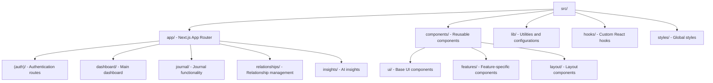

# Resonant Architecture

## System Overview

Resonant is a relationship health journal built on a modern web stack with AI-powered insights. The application uses a serverless architecture deployed on Vercel with real-time data synchronization.

### Core Technology Stack

- **Frontend**: Next.js 14 with App Router, TypeScript, Tailwind CSS
- **Backend**: Convex (real-time database and backend-as-a-service)
- **Authentication**: Clerk
- **AI Processing**: Google Gemini Flash with DSPy framework
- **Deployment**: Vercel Edge Network

## Architecture Principles

### Data Flow

1. User creates journal entries via Next.js frontend
2. Entries stored in Convex with real-time synchronization
3. AI analysis triggered via scheduled functions
4. Results processed and stored for immediate UI updates
5. Health scores calculated and trends updated

### Component Structure

## Data Architecture

### Database Schema (Convex)

**Core Entities:**

- `users` - User profiles and preferences
- `relationships` - Relationship definitions and metadata
- `journalEntries` - User journal content and mood data
- `aiAnalysis` - AI processing results and insights
- `healthScores` - Calculated relationship health metrics

**Key Relationships:**

- Users have many relationships and journal entries
- Journal entries belong to users and relationships
- AI analysis results link to specific entries
- Health scores aggregate data across relationships

### Real-time Data Synchronization

Convex provides automatic real-time updates across all connected clients, ensuring immediate UI updates when:

- New journal entries are created
- AI analysis completes
- Health scores are recalculated
- Relationship data changes

## AI Processing Pipeline

### DSPy Integration

The AI system uses DSPy for structured AI interactions:

**Core Modules:**

- `RelationshipAnalyzer` - Analyzes relationship dynamics
- `PatternDetector` - Identifies behavioral patterns
- `SuggestionGenerator` - Creates actionable insights
- `HealthScoreCalculator` - Computes relationship health metrics

**Processing Flow:**

1. Journal entry triggers scheduled function
2. DSPy formats prompt for Gemini Flash
3. AI analysis returns structured results
4. Results stored in database with real-time updates

### Performance Optimizations

- **Prompt Caching**: Reuse common prompt structures
- **Batch Processing**: Group similar analysis requests
- **Async Processing**: Non-blocking AI operations
- **Rate Limiting**: Manage API usage and costs

## Security Architecture

### Authentication & Authorization

- Clerk handles user authentication and session management
- Role-based access control for data privacy
- Secure token-based API authentication

### Data Protection

- **Encryption**: AES-256 for data at rest, TLS 1.3 for transit
- **Privacy**: Data minimization and user consent controls
- **Access Control**: User-scoped data access patterns

### Client Security

- Input validation and sanitization
- XSS and CSRF protection
- Content Security Policy (CSP)

## Deployment & Scalability

### Vercel Edge Network

- Global CDN distribution
- Automatic scaling and load balancing
- Edge function execution for optimal performance

### Performance Strategy

- **Frontend**: Code splitting, lazy loading, image optimization
- **Backend**: Database indexing, query optimization, connection pooling
- **Caching**: Multi-layer caching strategy (browser, CDN, API, database)

### Monitoring

- Performance metrics and error tracking
- User analytics and behavior monitoring
- Uptime monitoring and alerting

## Development Considerations

### Type Safety

- Full TypeScript implementation
- Strict type checking across frontend and backend
- Shared type definitions for API contracts

### Testing Strategy

- Component testing for UI elements
- Integration testing for data flows
- End-to-end testing for critical user journeys

### Code Organization

- Feature-based component organization
- Shared utilities and hooks
- Consistent naming conventions and patterns
