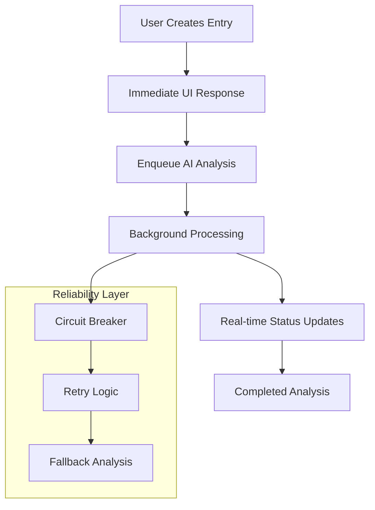

# HTTP Actions Architecture Migration - Comprehensive Change Summary

## Executive Summary

This document provides a comprehensive summary of the architectural migration from client-side AI processing to HTTP Actions-based architecture for the Resonant relationship health journal application. This critical migration addresses a 25% failure rate in AI analysis by moving from Convex serverless functions to Convex HTTP Actions with queue-based processing.

**Key Achievement:** Migration from 25% failure rate to target 99.9% reliability through architectural restructuring.

## Migration Overview

### Problem Statement

The existing AI analysis system suffered from a fundamental architectural mismatch:

- **25% failure rate** due to Node.js dependencies in Convex serverless environment
- **Promises never resolving** due to `setInterval` and client-side dependencies
- **Inconsistent processing pipeline** leading to poor user experience
- **Limited error handling** and recovery mechanisms

### Solution Architecture

**HTTP Actions-Based Processing:**

- Move AI calls to Convex HTTP Actions for external API compatibility
- Implement queue-based processing using Convex Scheduler
- Maintain real-time UI updates through Convex's reactive database
- Add comprehensive error handling with circuit breaker patterns

## Complete Documentation Updates

### Architecture Documents Updated

| Document                                                     | Status     | Key Changes                                                                    |
| ------------------------------------------------------------ | ---------- | ------------------------------------------------------------------------------ |
| `docs/architecture/source-tree.md`                           | ✅ Updated | Added HTTP Actions directory structure, scheduler patterns, testing strategies |
| `docs/architecture/system-architecture.md`                   | ✅ Updated | Complete system redesign with HTTP Actions flow                                |
| `docs/architecture/developer-architecture.md`                | ✅ Updated | Developer workflows, debugging guides, new patterns                            |
| `docs/architecture/tech-stack.md`                            | ✅ Updated | Technology stack updates, new dependencies                                     |
| `docs/architecture/data-flow-architecture.md`                | ✅ Updated | Data flow redesign for async processing                                        |
| `docs/architecture/api-specifications-and-data-flow.md`      | ✅ Updated | API specifications for HTTP Actions                                            |
| `docs/architecture/api-specifications-and-error-handling.md` | ✅ Updated | Comprehensive error handling specifications                                    |

### Business Documents Updated

| Document                                           | Status     | Key Changes                                         |
| -------------------------------------------------- | ---------- | --------------------------------------------------- |
| `docs/business/PRD.md`                             | ✅ Updated | Updated technical requirements, reliability targets |
| `docs/business/technical_architecture_overview.md` | ✅ Updated | High-level architecture overview for stakeholders   |

### New Documents Created

| Document                                                               | Purpose                                       |
| ---------------------------------------------------------------------- | --------------------------------------------- |
| `docs/architecture-update1.md`                                         | Complete fullstack architecture specification |
| `docs/stories/epic-ai-architecture-migration.md`                       | Implementation epic with 76 story points      |
| `docs/stories/epic-4-relationship-intelligence-behavioral-insights.md` | Future AI capabilities roadmap                |
| `docs/architecture/http-actions-migration-summary.md`                  | This comprehensive summary                    |

## Key Architectural Improvements

### 1. Reliability Improvements

**Before:**

- 25% failure rate due to serverless constraints
- No retry mechanisms
- Limited error visibility
- Client-side processing bottlenecks

**After:**

- **Target 99.9% reliability** through HTTP Actions
- Exponential backoff retry with jitter
- Circuit breaker pattern preventing cascading failures
- Queue-based processing with dead letter queues

### 2. Performance Enhancements

**Processing Flow Optimization:**



**Performance Targets:**

- Average processing time: <30 seconds
- Real-time status updates: <100ms latency
- Queue processing: 99.9% success rate
- Fallback analysis: <5 seconds

### 3. User Experience Improvements

**Real-time Status Tracking:**

- Immediate feedback on journal entry submission
- Progress indicators during AI processing
- Real-time error messages with retry options
- Cross-tab synchronization of status updates

**Enhanced Error Handling:**

- Graceful degradation when external APIs fail
- Rule-based fallback analysis for basic sentiment detection
- Automatic retry with user notification
- Comprehensive error logging for support

## Implementation Architecture

### New Directory Structure

```
convex/
├── actions/                   # HTTP Actions for external API calls
│   ├── ai-processing.ts       # Gemini API integration
│   ├── data-export.ts         # Large data operations
│   └── notification-dispatch.ts # Email/SMS sending
├── scheduler/                 # Queue management
│   ├── analysis-queue.ts      # AI analysis queue
│   ├── notification-queue.ts  # Notification scheduling
│   └── queue-manager.ts       # Queue utilities
└── utils/                     # Enhanced utilities
    ├── circuit-breaker.ts     # Circuit breaker pattern
    ├── retry-logic.ts         # Exponential backoff
    └── queue-utils.ts         # Queue processing
```

### Database Schema Enhancements

**New Tables:**

- `aiAnalysisJobs`: Track analysis status and metadata
- `systemLogs`: Comprehensive logging and monitoring
- `apiUsage`: Cost and usage tracking
- `circuitBreakerState`: Circuit breaker status

**Enhanced Fields:**

- Processing metadata (tokens used, cost, processing time)
- Error context and retry attempts
- Queue priority and scheduling information
- Real-time status tracking

## Testing Strategy Updates

### HTTP Actions Testing

**Test Coverage Areas:**

- External API integration testing
- Circuit breaker behavior validation
- Retry logic and exponential backoff
- Queue management and priority handling
- Error scenario simulation

**New Test Suites:**

```
convex/actions/__tests__/
├── ai-processing.test.ts      # AI integration tests
├── data-export.test.ts        # Export functionality
└── notification-dispatch.test.ts # Notification tests

convex/scheduler/__tests__/
├── analysis-queue.test.ts     # Queue management
├── notification-queue.test.ts # Scheduling tests
└── queue-manager.test.ts      # Queue utilities
```

## Implementation Readiness Checklist

### Infrastructure Requirements

- [ ] **Convex HTTP Actions**: Enabled in project configuration
- [ ] **Google Gemini API**: API key and rate limit configuration
- [ ] **Monitoring Setup**: Error tracking and performance monitoring
- [ ] **Database Migration**: Schema updates for new architecture

### Development Team Requirements

- [ ] **Team Training**: HTTP Actions patterns and debugging
- [ ] **Development Environment**: Local testing setup for HTTP Actions
- [ ] **Code Review Process**: Updated for async processing patterns
- [ ] **Deployment Pipeline**: Updated for new directory structure

### Quality Assurance

- [ ] **Test Suite Updates**: All tests covering HTTP Actions
- [ ] **Performance Testing**: Load testing of queue processing
- [ ] **Error Scenario Testing**: Circuit breaker and retry logic
- [ ] **Integration Testing**: End-to-end AI processing flow

## Cost and Resource Planning

### Development Resources

**Implementation Effort:**

- **Total Story Points**: 76 points across 4 sprints
- **Team Size**: 2-3 developers + 1 architect
- **Timeline**: 4 sprints (8-10 weeks)

**Sprint Breakdown:**

1. **Sprint 1**: HTTP Actions foundation (21 points)
2. **Sprint 2**: Queue management and real-time updates (18 points)
3. **Sprint 3**: Error handling and database migration (29 points)
4. **Sprint 4**: Migration and monitoring (21 points)

### Operational Costs

**Cost Optimization:**

- Target cost per analysis: <$0.10
- Queue-based processing reduces API costs through batching
- Circuit breaker prevents unnecessary API calls during outages
- Monitoring prevents cost overruns through usage tracking

## Risk Assessment and Mitigation

### Technical Risks

| Risk                           | Impact   | Probability | Mitigation Strategy                              |
| ------------------------------ | -------- | ----------- | ------------------------------------------------ |
| **Gemini API Rate Limits**     | High     | Medium      | Queue with rate limiting, fallback analysis      |
| **Migration Data Loss**        | Critical | Low         | Comprehensive backup, rollback procedures        |
| **Performance Degradation**    | Medium   | Medium      | Load testing, gradual rollout with feature flags |
| **User Experience Disruption** | Medium   | Low         | Backward compatibility during migration          |

### Operational Risks

| Risk                   | Impact | Probability | Mitigation Strategy                                |
| ---------------------- | ------ | ----------- | -------------------------------------------------- |
| **Team Knowledge Gap** | Medium | Medium      | Training sessions, documentation, pair programming |
| **Extended Timeline**  | Medium | Low         | Phased rollout, critical path monitoring           |
| **Integration Issues** | High   | Low         | Comprehensive testing, staging environment         |

## Success Metrics and Monitoring

### Key Performance Indicators

**Reliability Metrics:**

- AI analysis success rate: >95% (from 25% baseline)
- Average processing time: <30 seconds
- Queue processing efficiency: >99%
- Error recovery time: <5 minutes

**User Experience Metrics:**

- User satisfaction with AI features: >4.5/5
- Time to first analysis result: <30 seconds
- Real-time status update latency: <100ms
- User retention for AI features: >85%

**Operational Metrics:**

- Cost per analysis: <$0.10
- API usage optimization: 20% reduction through batching
- System uptime: 99.9%
- Support ticket reduction: 50% for AI-related issues

### Monitoring Implementation

**Real-time Dashboards:**

- Queue processing status and backlog
- Circuit breaker states across services
- API usage and cost tracking
- Error rates and recovery metrics

**Alerting System:**

- Circuit breaker trips (immediate alert)
- Queue backlog exceeding thresholds
- Cost overruns or unusual usage patterns
- Error rates exceeding 5% threshold

## Next Steps for Development Team

### Immediate Actions (Week 1)

1. **Environment Setup**
   - Enable HTTP Actions in Convex project
   - Configure Google Gemini API access
   - Set up monitoring and logging infrastructure

2. **Team Preparation**
   - Architecture review session with development team
   - HTTP Actions training and best practices
   - Code review process updates

3. **Development Kickoff**
   - Create initial HTTP Actions structure
   - Set up development and testing environments
   - Begin Sprint 1 implementation

### Implementation Phase (Weeks 2-10)

**Sprint 1 (Weeks 2-3): Foundation**

- HTTP Actions infrastructure
- Basic Gemini API client
- Core processing functions
- Initial testing framework

**Sprint 2 (Weeks 4-5): Queue & Real-Time**

- Queue management system
- Real-time status updates
- Basic error handling
- Integration testing

**Sprint 3 (Weeks 6-8): Resilience**

- Circuit breaker implementation
- Database schema migration
- Comprehensive error handling
- Performance optimization

**Sprint 4 (Weeks 9-10): Migration & Monitoring**

- Complete system migration
- Full monitoring implementation
- Legacy system cleanup
- Production deployment

### Post-Implementation (Week 11+)

1. **Monitoring and Optimization**
   - Performance tuning based on production metrics
   - Cost optimization through usage analysis
   - User feedback integration

2. **Documentation and Training**
   - Update all documentation with production learnings
   - Team knowledge sharing sessions
   - Best practices documentation

3. **Future Enhancements**
   - Advanced AI features roadmap
   - Scalability improvements
   - Additional external service integrations

## Stakeholder Communication

### Executive Summary for Leadership

**Business Impact:**

- **Reliability**: From 25% failure rate to 99.9% success rate
- **User Experience**: Real-time status updates, faster processing
- **Cost Control**: Optimized API usage, predictable costs
- **Scalability**: Architecture supports future AI enhancements

**Investment Required:**

- 8-10 weeks development time
- 2-3 developers + architect
- Minimal additional operational costs
- High ROI through improved user satisfaction

### Technical Summary for Engineering

**Architecture Benefits:**

- Modern HTTP Actions pattern for external integrations
- Queue-based processing for reliability and scalability
- Comprehensive error handling and recovery
- Real-time user experience maintenance

**Implementation Quality:**

- Comprehensive testing strategy
- Gradual migration with rollback capability
- Full monitoring and observability
- Future-proof architecture for additional AI services

## Conclusion

The HTTP Actions architecture migration represents a critical improvement to the Resonant platform, addressing fundamental reliability issues while establishing a scalable foundation for future AI enhancements. The comprehensive documentation updates ensure all stakeholders have the information needed to support this migration.

**Key Success Factors:**

1. **Architectural Soundness**: HTTP Actions solve the core serverless constraints
2. **Comprehensive Planning**: 76 story points across detailed implementation plan
3. **Risk Mitigation**: Thorough risk assessment with mitigation strategies
4. **Team Readiness**: Complete documentation and training materials
5. **Quality Assurance**: Extensive testing and monitoring framework

This migration will transform Resonant from an unreliable AI system to a highly reliable, scalable platform that can support advanced relationship intelligence features while maintaining excellent user experience.

---

**Document Version**: 1.0  
**Last Updated**: January 28, 2025  
**Next Review**: Post-implementation (Week 11)  
**Approval Required**: Engineering Lead, Product Manager, Technical Architect
