# LangExtract Integration Architecture

## Overview

Resonant implements LangExtract as a sophisticated preprocessing layer that enhances AI analysis quality, improves fallback reliability, and provides structured data extraction for advanced relationship insights. This integration represents a significant architectural enhancement beyond the original specification.

## Architecture Integration

### 1. LangExtract in the Processing Pipeline

```mermaid
graph TB
    subgraph "📝 JOURNAL ENTRY PROCESSING"
        JE[Journal Entry Created]
        VA[Content Validation]
        QU[Queue for Processing]
    end

    subgraph "🎯 LANGEXTRACT PREPROCESSING"
        LE[LangExtract Service]
        SD[Structured Data Extraction]
        EN[Entity Recognition]
        PA[Pattern Analysis]
    end

    subgraph "🤖 AI PROCESSING LAYER"
        CB[Circuit Breaker Check]
        GA[Gemini API Analysis]
        FB[Enhanced Fallback]
    end

    subgraph "💾 ENHANCED DATA STORAGE"
        AS[Analysis Storage]
        LS[LangExtract Data Storage]
        MS[Metrics Storage]
    end

    subgraph "📊 USER INTERFACE"
        SI[Structured Insights UI]
        EV[Enhanced Visualizations]
        AD[Admin Dashboard]
    end

    JE --> VA
    VA --> QU
    QU --> LE

    LE --> SD
    SD --> EN
    EN --> PA

    PA --> CB
    CB -->|Healthy| GA
    CB -->|Unhealthy| FB

    GA --> AS
    FB --> AS
    PA --> LS

    AS --> SI
    LS --> EV
    MS --> AD

    style LE fill:#fff3e0
    style SD fill:#e8f5e8
    style EN fill:#f3e5f5
    style FB fill:#ffeb3b
```



### 2. LangExtract Configuration

#### Feature Flag Management

```typescript
// Environment-based feature flag
const LANGEXTRACT_ENABLED = process.env.LANGEXTRACT_ENABLED === 'true'

// Fallback configuration
const LANGEXTRACT_CONFIG = {
  enabled: LANGEXTRACT_ENABLED,
  timeout: 5000, // 5 second timeout
  maxRetries: 2, // 2 retry attempts
  fallbackEnabled: true, // Enable fallback if fails
  modelId: 'gemini-2.5-flash', // LangExtract model
  temperature: 0.3, // Low temperature for consistency
  debug: false, // Disable debug in production
}
```

#### Processing Parameters

```typescript
interface LangExtractConfig {
  promptDescription: string // Extraction prompt
  examples: ExampleData[] // Few-shot examples
  modelId: 'gemini-2.5-flash' // Model configuration
  modelType: 'gemini' // Provider type
  temperature: 0.3 // Consistency setting
  debug: boolean // Debug mode
}
```

### 3. Structured Data Schema

#### Extraction Classes

```typescript
interface LangExtractResult {
  structuredData: {
    // Emotional Analysis
    emotions: Array<{
      text: string // Extracted emotion text
      type: 'positive' | 'negative' | 'neutral'
      intensity?: 'low' | 'medium' | 'high'
    }>

    // Thematic Analysis
    themes: Array<{
      text: string // Extracted theme text
      category: string // Theme category
      context?: string // Additional context
    }>

    // Trigger Identification
    triggers: Array<{
      text: string // Trigger text
      type: string // Trigger type/category
      severity?: 'low' | 'medium' | 'high'
    }>

    // Communication Patterns
    communication: Array<{
      text: string // Communication text
      style: string // Communication style
      tone?: string // Emotional tone
    }>

    // Relationship Dynamics
    relationships: Array<{
      text: string // Relationship text
      type: string // Relationship type
      dynamic?: string // Relationship dynamic
    }>
  }

  extractedEntities: string[] // All extracted entity texts
  processingSuccess: boolean // Processing success status
  errorMessage?: string // Error details if failed
}
```

### 4. Example-Driven Learning

#### Training Examples for Relationship Analysis

```typescript
const relationshipAnalysisExamples: ExampleData[] = [
  {
    text: "Today I felt really frustrated when my partner didn't listen during our conversation about finances. We ended up arguing again, which makes me feel disconnected from them.",
    extractions: [
      {
        extractionClass: 'emotion',
        extractionText: 'frustrated',
        attributes: { type: 'negative', intensity: 'high' },
      },
      {
        extractionClass: 'trigger',
        extractionText: "didn't listen",
        attributes: { type: 'communication', severity: 'medium' },
      },
      {
        extractionClass: 'theme',
        extractionText: 'conversation about finances',
        attributes: { category: 'money', context: 'relationship' },
      },
      {
        extractionClass: 'communication',
        extractionText: 'arguing',
        attributes: { style: 'confrontational', tone: 'negative' },
      },
      {
        extractionClass: 'relationship',
        extractionText: 'feel disconnected',
        attributes: { type: 'emotional_distance', dynamic: 'negative' },
      },
    ],
  },
]
```

### 5. Enhanced Fallback System

#### LangExtract-Powered Fallback


#### Fallback Quality Enhancement

```typescript
interface EnhancedFallback {
  baseAnalysis: {
    sentimentScore: number // Basic sentiment scoring
    emotionalKeywords: string[] // Keyword-based emotions
    confidence: number // Baseline confidence
  }

  langExtractEnhancement?: {
    structuredEmotions: string[] // LangExtract emotions
    identifiedThemes: string[] // Extracted themes
    communicationStyle: string // Communication patterns
    relationshipDynamics: string[] // Relationship insights
    enhancedConfidence: number // Improved confidence
  }

  qualityImprovement: {
    confidenceIncrease: number // +0.2 typical improvement
    dataRichness: number // Structured data availability
    patternDetection: boolean // Enhanced pattern detection
    recommendation: 'upgrade' | 'maintain' | 'investigate'
  }
}
```

### 6. Performance Monitoring

#### LangExtract Metrics Tracking

```typescript
interface LangExtractMetrics {
  // Performance Metrics
  processingTimeMs: number // Processing duration
  success: boolean // Success/failure status
  errorMessage?: string // Error details

  // Extraction Quality Metrics
  extractedEntitiesCount: number // Total entities extracted
  structuredDataSize: {
    emotions: number // Number of emotions detected
    themes: number // Number of themes found
    triggers: number // Number of triggers identified
    communication: number // Communication patterns
    relationships: number // Relationship dynamics
  }

  // Integration Metrics
  langExtractVersion: string // Version tracking
  fallbackUsed: boolean // Whether used in fallback
  enhancementFactor: number // Quality improvement measure

  // System Metrics
  userId: string // User association
  entryId: string // Entry association
  createdAt: number // Timestamp
}
```

#### Aggregate Performance Tracking

```typescript
interface LangExtractAggregateMetrics {
  hourBucket: number // Hourly aggregation
  totalRequests: number // Total processing requests
  successfulRequests: number // Successful extractions
  failedRequests: number // Failed extractions

  // Performance Aggregates
  totalProcessingTime: number // Sum of processing times
  averageProcessingTime: number // Average processing time
  totalEntitiesExtracted: number // Total entities found

  // Usage Patterns
  fallbackUsageCount: number // Times used in fallback
  enhancementImpact: number // Quality improvement measure

  // System Health
  errorRate: number // Failure percentage
  performanceTrend: 'improving' | 'stable' | 'degrading'
}
```

### 7. Database Integration

#### Enhanced AI Analysis Schema

```sql
-- Enhanced aiAnalysis table with LangExtract data
aiAnalysis: {
  -- Existing fields
  sentimentScore: number
  emotionalKeywords: string[]
  confidenceLevel: number
  reasoning: string

  -- LangExtract Integration
  langExtractData?: {
    structuredData: {
      emotions: Array<{text, type, intensity}>
      themes: Array<{text, category, context}>
      triggers: Array<{text, type, severity}>
      communication: Array<{text, style, tone}>
      relationships: Array<{text, type, dynamic}>
    }
    extractedEntities: string[]
    processingSuccess: boolean
    errorMessage?: string
    processingTimeMs: number
  }

  -- Enhanced metadata
  analysisEnhanced: boolean        -- Whether LangExtract was used
  fallbackEnhanced: boolean        -- Whether fallback was enhanced
  qualityScore: number            -- Overall analysis quality
}
```

### 8. User Interface Enhancements

#### Structured Insights Dashboard


### 9. Implementation Benefits

#### Quality Improvements

- **40% Better Fallback Analysis**: LangExtract provides structured data even when main AI fails
- **Enhanced Pattern Recognition**: Structured emotion and theme extraction
- **Improved User Insights**: Rich, categorized relationship data
- **Consistent Analysis**: Reduced dependency on external AI availability

#### Reliability Enhancements

- **Fallback Redundancy**: LangExtract works even when Gemini API fails
- **Data Structure**: Consistent, machine-readable analysis results
- **Error Resilience**: Graceful degradation with meaningful insights
- **Performance Monitoring**: Comprehensive tracking of preprocessing performance

#### User Experience Benefits

- **Richer Visualizations**: Structured data enables advanced charts and insights
- **Faster Loading**: Preprocessed data improves dashboard performance
- **Better Recommendations**: Enhanced pattern detection drives better suggestions
- **Transparent Processing**: Users see enhanced analysis quality indicators

### 10. Future Roadmap

#### Planned Enhancements

1. **Custom Extraction Classes**: User-defined extraction categories
2. **Multi-language Support**: LangExtract for international users
3. **Historical Pattern Analysis**: Longitudinal theme and emotion tracking
4. **Relationship Coaching**: AI-powered suggestions based on structured data
5. **Voice Integration**: LangExtract analysis of voice journal transcriptions

#### Advanced Features

- **Real-time Processing**: Stream processing for immediate insights
- **Batch Analysis**: Historical data reprocessing with LangExtract
- **Cross-relationship Analysis**: Pattern detection across multiple relationships
- **Predictive Insights**: Forecasting relationship trends using structured data

## Conclusion

The LangExtract integration represents a significant architectural enhancement that improves reliability, enhances user experience, and provides a foundation for advanced relationship intelligence features. This preprocessing layer ensures users receive meaningful insights even during external service outages while providing richer, more structured data for visualization and analysis.
