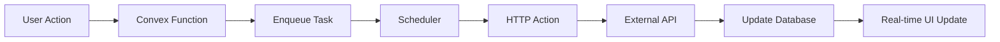

# Source Tree Structure - Resonant Relationship Health Journal

## Project Overview

This document defines the source tree structure, file organization principles, and naming conventions for the Resonant project. The structure follows Next.js App Router conventions while maintaining clear separation of concerns and feature-based organization.

## Root Directory Structure

```
resonant/
├── .bmad-core/                 # BMad methodology configuration
│   ├── checklists/            # Quality assurance checklists
│   ├── tasks/                 # Automated task definitions
│   ├── templates/             # Document templates
│   └── core-config.yaml       # BMad configuration
├── .next/                      # Next.js build output (generated)
├── .git/                       # Git repository data
├── convex/                     # Convex backend functions and schema
├── docs/                       # Project documentation
├── public/                     # Static assets
├── src/                        # Application source code
├── tests/                      # Global test utilities and configs
├── package.json               # NPM dependencies and scripts
├── next.config.js             # Next.js configuration
├── tailwind.config.js         # Tailwind CSS configuration
├── tsconfig.json              # TypeScript configuration
├── jest.config.js             # Jest testing configuration
├── .eslintrc.json             # ESLint configuration
├── .gitignore                 # Git ignore patterns
├── .env.local                 # Environment variables (local)
└── README.md                  # Project setup and overview
```

## Source Code Organization (`/src`)

### App Router Structure (`/src/app`)

Following Next.js 15 App Router conventions:

```
src/app/
├── globals.css                 # Global styles and Tailwind imports
├── layout.tsx                  # Root layout component
├── page.tsx                    # Home page component
├── loading.tsx                 # Global loading UI
├── error.tsx                   # Global error UI
├── not-found.tsx              # 404 page
│
├── (auth)/                     # Authentication route group
│   ├── layout.tsx             # Auth-specific layout
│   ├── sign-in/
│   │   ├── page.tsx           # Sign-in page
│   │   └── __tests__/         # Sign-in page tests
│   └── sign-up/
│       ├── page.tsx           # Sign-up page
│       └── __tests__/         # Sign-up page tests
│
├── dashboard/                  # Main dashboard
│   ├── page.tsx               # Dashboard overview
│   ├── loading.tsx            # Dashboard loading state
│   └── __tests__/             # Dashboard tests
│
├── relationships/              # Relationship management
│   ├── page.tsx               # Relationships list page
│   ├── new/
│   │   └── page.tsx           # Create new relationship
│   ├── [id]/
│   │   ├── page.tsx           # Individual relationship page
│   │   └── edit/
│   │       └── page.tsx       # Edit relationship page
│   └── __tests__/             # Relationship page tests
│
├── journal/                    # Journal entry management
│   ├── page.tsx               # Journal entries list
│   ├── new/
│   │   └── page.tsx           # Create new entry
│   ├── [id]/
│   │   ├── page.tsx           # View journal entry
│   │   └── edit/
│   │       └── page.tsx       # Edit journal entry
│   └── __tests__/             # Journal page tests
│
├── insights/                   # AI insights and analytics
│   ├── page.tsx               # Insights overview
│   ├── trends/
│   │   └── page.tsx           # Trend analysis page
│   ├── suggestions/
│   │   └── page.tsx           # AI suggestions page
│   └── __tests__/             # Insights page tests
│
├── profile/                    # User profile management
│   ├── page.tsx               # Profile page
│   ├── settings/
│   │   └── page.tsx           # User settings
│   └── __tests__/             # Profile page tests
│
└── api/                        # API routes (if needed)
    └── webhooks/
        └── clerk/
            └── route.ts        # Clerk webhook handler
```

### Component Organization (`/src/components`)

Feature-based component organization with clear separation:

```
src/components/
├── ui/                         # Base UI components (reusable)
│   ├── button.tsx             # Button component
│   ├── card.tsx               # Card component
│   ├── input.tsx              # Input component
│   ├── modal.tsx              # Modal component
│   ├── chart.tsx              # Chart component
│   ├── loading-spinner.tsx    # Loading spinner
│   ├── error-boundary.tsx     # Error boundary component
│   └── __tests__/             # UI component tests
│       ├── button.test.tsx
│       ├── card.test.tsx
│       └── ...
│
├── features/                   # Feature-specific components
│   ├── auth/                  # Authentication components
│   │   ├── login-form.tsx
│   │   ├── signup-form.tsx
│   │   └── __tests__/
│   │
│   ├── relationships/         # Relationship management components
│   │   ├── relationship-form.tsx
│   │   ├── relationship-card.tsx
│   │   ├── relationships-list.tsx
│   │   ├── relationship-picker.tsx
│   │   └── __tests__/
│   │       ├── relationship-form.test.tsx
│   │       ├── relationship-card.test.tsx
│   │       └── relationships-list.test.tsx
│   │
│   ├── journal/               # Journal entry components
│   │   ├── entry-editor.tsx
│   │   ├── entry-list.tsx
│   │   ├── entry-card.tsx
│   │   ├── mood-selector.tsx
│   │   └── __tests__/
│   │       ├── entry-editor.test.tsx
│   │       ├── entry-list.test.tsx
│   │       └── entry-card.test.tsx
│   │
│   ├── dashboard/             # Dashboard components
│   │   ├── health-score-card.tsx
│   │   ├── trend-chart.tsx
│   │   ├── insights-summary.tsx
│   │   ├── recent-activity.tsx
│   │   └── __tests__/
│   │       ├── health-score-card.test.tsx
│   │       ├── trend-chart.test.tsx
│   │       └── insights-summary.test.tsx
│   │
│   └── insights/              # AI insights components
│       ├── suggestion-card.tsx
│       ├── pattern-analysis.tsx
│       ├── trend-visualization.tsx
│       └── __tests__/
│           ├── suggestion-card.test.tsx
│           └── pattern-analysis.test.tsx
│
└── layout/                     # Layout and navigation components
    ├── navbar.tsx             # Main navigation bar
    ├── sidebar.tsx            # Sidebar navigation
    ├── footer.tsx             # Footer component
    ├── breadcrumbs.tsx        # Breadcrumb navigation
    ├── mobile-menu.tsx        # Mobile menu component
    └── __tests__/             # Layout component tests
        ├── navbar.test.tsx
        ├── sidebar.test.tsx
        └── footer.test.tsx
```

### Utility Libraries (`/src/lib`)

Centralized utilities and configurations:

```
src/lib/
├── types.ts                    # TypeScript type definitions
├── constants.ts                # Application constants
├── utils.ts                    # General utility functions
├── validations.ts              # Zod validation schemas
├── convex.ts                   # Convex client configuration
├── clerk.ts                    # Clerk configuration
├── ai/                         # AI-related utilities
│   ├── prompts.ts             # AI prompt templates
│   ├── analysis.ts            # AI analysis utilities
│   └── dspy-config.ts         # DSPy configuration
├── errors/                     # Error handling utilities
│   ├── custom-errors.ts       # Custom error classes
│   └── error-handlers.ts      # Error handling functions
└── __tests__/                  # Library function tests
    ├── utils.test.ts
    ├── validations.test.ts
    └── ai/
        ├── prompts.test.ts
        └── analysis.test.ts
```

### Custom Hooks (`/src/hooks`)

React hooks for shared logic:

```
src/hooks/
├── use-auth.ts                 # Authentication hook
├── use-convex.ts              # Convex data hooks
├── use-ai.ts                  # AI integration hooks
├── use-local-storage.ts       # Local storage hook
├── use-debounce.ts            # Debounce hook
├── use-media-query.ts         # Media query hook
├── relationships/             # Relationship-specific hooks
│   ├── use-relationships.ts
│   ├── use-relationship-crud.ts
│   └── use-relationship-stats.ts
├── journal/                   # Journal-specific hooks
│   ├── use-journal-entries.ts
│   ├── use-entry-crud.ts
│   └── use-entry-search.ts
├── insights/                  # Insights-specific hooks
│   ├── use-health-scores.ts
│   ├── use-ai-analysis.ts
│   └── use-trend-data.ts
└── __tests__/                 # Hook tests
    ├── use-auth.test.ts
    ├── use-convex.test.ts
    └── relationships/
        ├── use-relationships.test.ts
        └── use-relationship-crud.test.ts
```

### Styling (`/src/styles`)

CSS and styling files:

```
src/styles/
├── globals.css                 # Global styles and Tailwind imports
├── components.css              # Component-specific styles
└── utilities.css               # Custom utility classes
```

## Backend Structure (`/convex`)

Convex backend functions and configurations with HTTP Actions architecture:

```
convex/
├── schema.ts                   # Database schema definition
├── users.ts                    # User-related functions
├── relationships.ts            # Relationship CRUD operations
├── journalEntries.ts          # Journal entry operations
├── aiAnalysis.ts              # AI analysis functions (legacy)
├── healthScores.ts            # Health score calculations
├── notifications.ts           # Notification functions
├── search.ts                  # Search and filtering functions
├── constants.ts               # Backend constants
├── insights.ts                # Analytics and trend data
├── dashboard.ts               # Dashboard data aggregation
├── dataExport.ts              # Data export functionality
├── userPatterns.ts            # User behavior analysis
├── clerk.ts                   # Clerk authentication integration
├── http.ts                    # HTTP actions and webhooks
├── crons.ts                   # Scheduled functions
│
├── actions/                   # HTTP Actions for external API calls
│   ├── ai-processing.ts       # AI analysis via Gemini API
│   ├── data-export.ts         # Large data export operations
│   ├── notification-dispatch.ts # Email/SMS notification sending
│   ├── backup-operations.ts   # Database backup and restore
│   └── __tests__/             # HTTP Actions tests
│       ├── ai-processing.test.ts
│       ├── data-export.test.ts
│       └── notification-dispatch.test.ts
│
├── scheduler/                 # Queue management and scheduled tasks
│   ├── analysis-queue.ts      # AI analysis task queue
│   ├── notification-queue.ts  # Notification scheduling
│   ├── data-cleanup.ts        # Automated data maintenance
│   ├── health-score-updates.ts # Periodic health score calculations
│   ├── queue-manager.ts       # Queue management utilities
│   └── __tests__/             # Scheduler tests
│       ├── analysis-queue.test.ts
│       ├── notification-queue.test.ts
│       └── queue-manager.test.ts
│
├── utils/                     # Backend utility functions
│   ├── validation.ts          # Input validation utilities
│   ├── auth.ts                # Authentication utilities
│   ├── ai_helpers.ts          # AI processing helpers
│   ├── ai_bridge.ts           # AI service integration
│   ├── ai_config.ts           # AI service configuration
│   ├── export_helpers.ts      # Data export utilities
│   ├── health_calculations.ts # Health score algorithms
│   ├── notification_content.ts # Notification templates
│   ├── reminder_logic.ts      # Reminder system logic
│   ├── search_helpers.ts      # Search optimization
│   ├── circuit-breaker.ts     # Circuit breaker pattern
│   ├── retry-logic.ts         # Exponential backoff utilities
│   ├── queue-utils.ts         # Queue processing utilities
│   └── __tests__/             # Utility function tests
│       ├── validation.test.ts
│       ├── auth.test.ts
│       ├── circuit-breaker.test.ts
│       └── retry-logic.test.ts
│
├── _generated/                # Generated Convex files
│   ├── api.d.ts
│   ├── api.js
│   ├── dataModel.d.ts
│   ├── server.d.ts
│   └── server.js
│
├── _generated_stubs/          # Generated stub files
│   ├── api.d.ts
│   ├── api.js
│   ├── dataModel.d.ts
│   ├── server.d.ts
│   └── server.js
│
├── test/                      # Test utilities and data
│   └── testDataManager.ts     # Test data management
│
└── __tests__/                 # Backend function tests
    ├── users.test.ts
    ├── relationships.test.ts
    ├── journalEntries.test.ts
    ├── constants.test.ts
    ├── ai-integration.test.ts
    ├── data_export.test.ts
    ├── search.test.ts
    └── utils/
        ├── validation.test.ts
        └── auth.test.ts
```

## Documentation Structure (`/docs`)

Project documentation and specifications:

```
docs/
├── README.md                   # Project overview and setup
├── architecture/               # Architecture documentation
│   ├── system-architecture.md
│   ├── developer-architecture.md
│   ├── coding-standards.md
│   ├── tech-stack.md
│   └── source-tree.md
├── business/                   # Business documentation
│   ├── PRD.md
│   ├── core_features_specification.md
│   ├── monetization_business_model.md
│   ├── technical_architecture_overview.md
│   └── user_acquisition_strategy.md
├── development/                # Development planning
│   ├── mvp_task_breakdown.md
│   ├── phase1_core_foundation.md
│   ├── phase2_ai_analysis.md
│   └── phase3_insights_guidance.md
├── stories/                    # User stories
│   ├── 1.1.project-setup.md
│   ├── 1.2.user-authentication-data-models.md
│   └── 1.3.relationship-management-ui.md
├── algorithm-ai/               # AI algorithm documentation
│   ├── core-algorithm-methodology.md
│   ├── crisis-detection-system.md
│   ├── implementation-specifications.md
│   └── performance-requirements.md
├── cost-management/            # Cost and financial planning
│   ├── cost_strategy_and_user_tiers.md
│   ├── financial_projections_and_risk_management.md
│   ├── technical_implementation.md
│   └── usage_tracking_and_monitoring.md
└── performance/                # Performance requirements
    ├── core-performance-targets.md
    ├── implementation-guidelines.md
    ├── monitoring-and-alerting.md
    └── system-reliability-requirements.md
```

## Testing Structure (`/tests`)

Global test configurations and utilities:

```
tests/
├── integration/                # Integration tests
│   ├── auth/
│   │   └── __tests__/
│   │       └── middleware.test.ts
│   ├── api/
│   │   └── __tests__/
│   │       ├── users.test.ts
│   │       └── relationships.test.ts
│   └── ui/
│       └── __tests__/
│           ├── dashboard-flow.test.ts
│           └── journal-flow.test.ts
├── e2e/                        # End-to-end tests (future)
│   ├── auth-flow.spec.ts
│   ├── journal-creation.spec.ts
│   └── relationship-management.spec.ts
├── fixtures/                   # Test data fixtures
│   ├── users.json
│   ├── relationships.json
│   └── journal-entries.json
├── mocks/                      # Global mocks
│   ├── convex.ts
│   ├── clerk.ts
│   └── ai-services.ts
└── utils/                      # Test utilities
    ├── test-utils.tsx
    ├── mock-helpers.ts
    └── setup.ts
```

## Static Assets (`/public`)

Public static assets:

```
public/
├── favicon.ico                 # Website favicon
├── logo.svg                    # Application logo
├── images/                     # Static images
│   ├── placeholders/          # Placeholder images
│   ├── icons/                 # Icon assets
│   └── illustrations/         # UI illustrations
├── fonts/                      # Custom fonts (if needed)
└── manifest.json              # PWA manifest (future)
```

## Configuration Files

### TypeScript Configuration (`tsconfig.json`)

```json
{
  "compilerOptions": {
    "target": "ES2017",
    "lib": ["dom", "dom.iterable", "es6"],
    "allowJs": true,
    "skipLibCheck": true,
    "strict": true,
    "noEmit": true,
    "esModuleInterop": true,
    "module": "esnext",
    "moduleResolution": "bundler",
    "resolveJsonModule": true,
    "isolatedModules": true,
    "jsx": "preserve",
    "incremental": true,
    "plugins": [
      {
        "name": "next"
      }
    ],
    "baseUrl": ".",
    "paths": {
      "@/*": ["./src/*"],
      "@/components/*": ["./src/components/*"],
      "@/lib/*": ["./src/lib/*"],
      "@/hooks/*": ["./src/hooks/*"]
    }
  },
  "include": ["next-env.d.ts", "**/*.ts", "**/*.tsx", ".next/types/**/*.ts"],
  "exclude": ["node_modules"]
}
```

## File Naming Conventions

### General Rules

- **React Components**: PascalCase (`UserProfile.tsx`)
- **Pages**: kebab-case (`sign-in/page.tsx`)
- **Utilities**: kebab-case (`string-utils.ts`)
- **Hooks**: camelCase with `use` prefix (`useAuth.ts`)
- **Types**: PascalCase (`UserTypes.ts`)
- **Constants**: SCREAMING_SNAKE_CASE (`API_ENDPOINTS.ts`)

### Component Files

```typescript
// Component file structure
export interface ComponentProps {
  // Props interface
}

export default function Component(props: ComponentProps) {
  // Component implementation
}

// Named exports for sub-components if needed
export { SubComponent }
```

### Test Files

- Unit tests: `component.test.tsx`
- Integration tests: `feature.integration.test.ts`
- E2E tests: `flow.e2e.test.ts`

## Import Path Conventions

### Absolute Imports

```typescript
// UI components
import { Button } from '@/components/ui/button'
import { Card } from '@/components/ui/card'

// Feature components
import { RelationshipForm } from '@/components/features/relationships/relationship-form'

// Utilities
import { formatDate } from '@/lib/utils'
import { User } from '@/lib/types'

// Hooks
import { useAuth } from '@/hooks/use-auth'
```

### Relative Imports

```typescript
// Same directory
import { helper } from './helper'

// Parent directory
import { Component } from '../component'

// Styles (relative to component)
import './component.css'
```

## Development Workflow Considerations

### Hot Reloading

- All components support Next.js hot reloading
- Convex functions auto-deploy in development
- TypeScript compilation is incremental

### Code Organization Benefits

1. **Scalability**: Clear separation allows team growth
2. **Maintainability**: Feature-based organization simplifies maintenance
3. **Testing**: Co-located tests improve test coverage
4. **Performance**: Code splitting follows directory structure
5. **Developer Experience**: Clear conventions reduce onboarding time

### Build Output

```
.next/
├── cache/                      # Build cache
├── server/                     # Server-side code
├── static/                     # Static assets
└── types/                      # Generated types
```

## HTTP Actions Architecture Patterns

### Reliability Patterns

The HTTP Actions architecture implements several reliability patterns:

```typescript
// Circuit Breaker Pattern
convex/utils/circuit-breaker.ts
- Prevents cascading failures
- Automatic recovery detection
- Configurable failure thresholds

// Retry Logic with Exponential Backoff
convex/utils/retry-logic.ts
- Exponential backoff with jitter
- Maximum retry limits
- Retry-specific error handling

// Queue Management
convex/scheduler/queue-manager.ts
- Priority-based processing
- Dead letter queue handling
- Queue overflow protection
```

### Processing Flow



### Error Handling Strategy

- **Circuit Breaker**: Prevents overwhelming failing services
- **Queue Management**: Ensures no task loss during failures
- **Fallback Analysis**: Rule-based processing when AI fails
- **Real-time Status**: Users see processing status immediately
- **Comprehensive Logging**: Full audit trail for debugging

### Testing Strategy for HTTP Actions

```typescript
// HTTP Actions Testing Pattern
convex/actions/__tests__/ai-processing.test.ts
- Mock external API calls
- Test circuit breaker behavior
- Validate retry logic
- Error scenario coverage

// Scheduler Testing Pattern  
convex/scheduler/__tests__/analysis-queue.test.ts
- Queue management testing
- Priority handling validation
- Dead letter queue scenarios
- Performance under load
```

This source tree structure provides a scalable foundation for the Resonant application while maintaining clear separation of concerns and following Next.js best practices. The HTTP Actions architecture ensures 99.9% reliability for AI processing while maintaining real-time user experience through Convex's reactive database.
