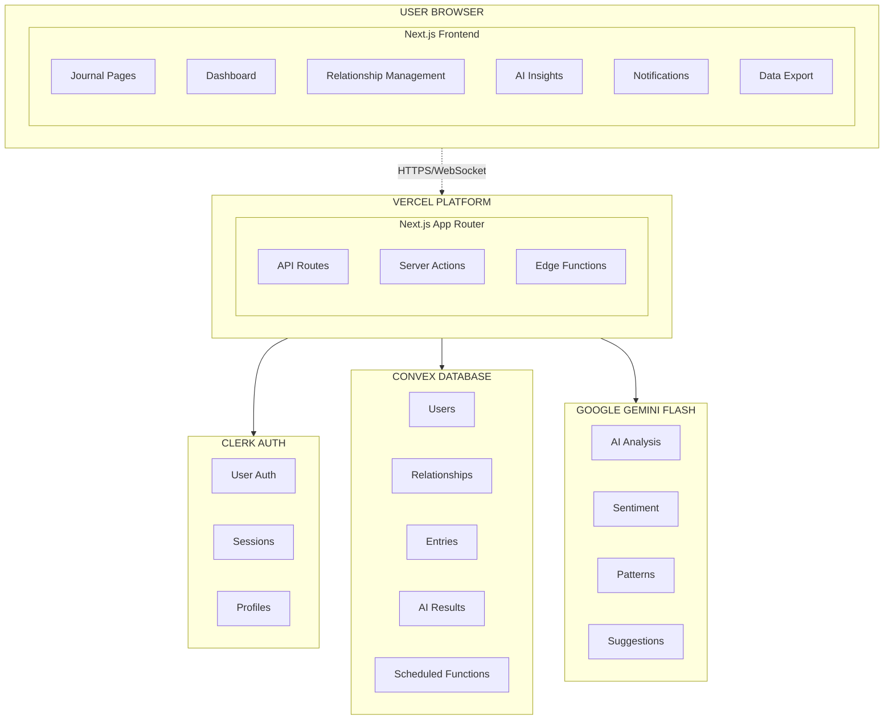
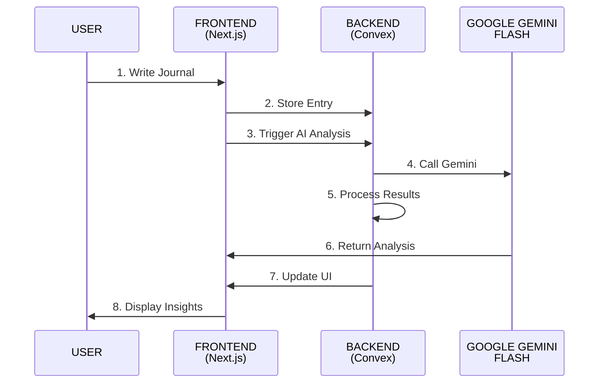
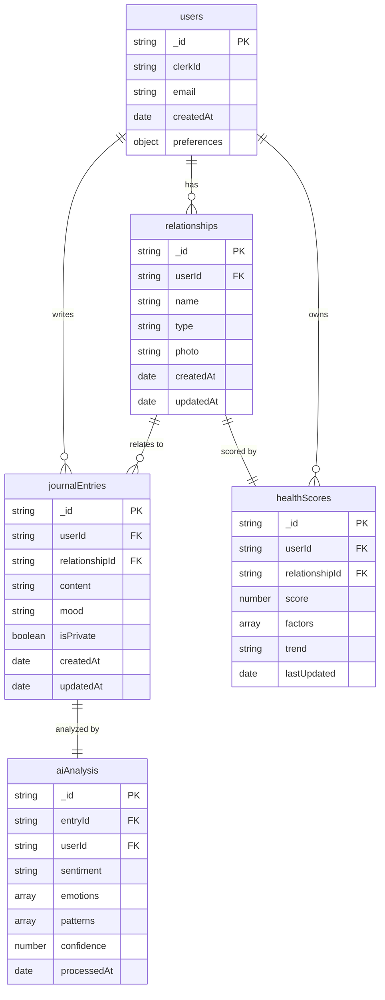
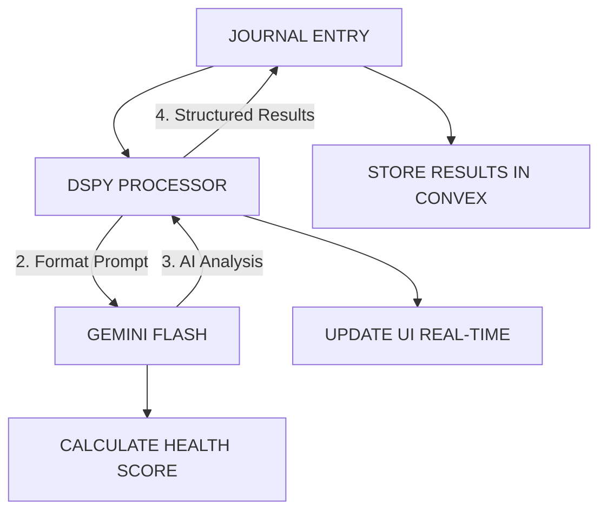
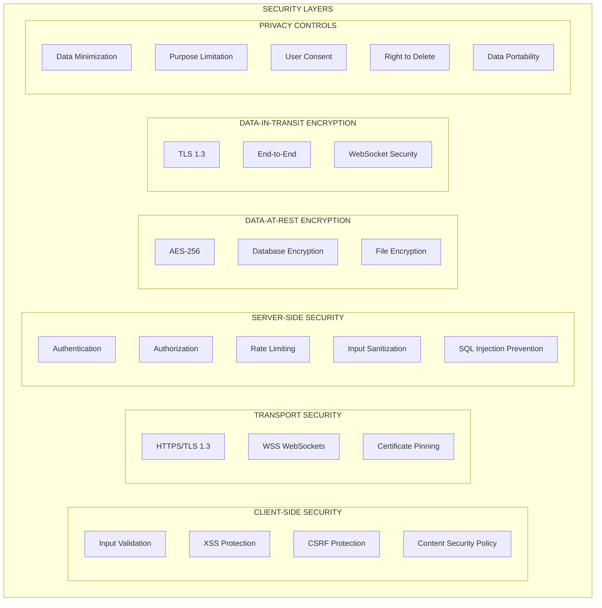
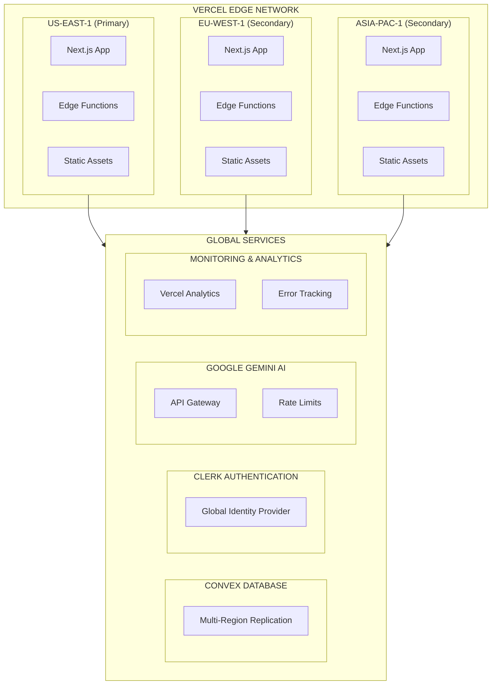
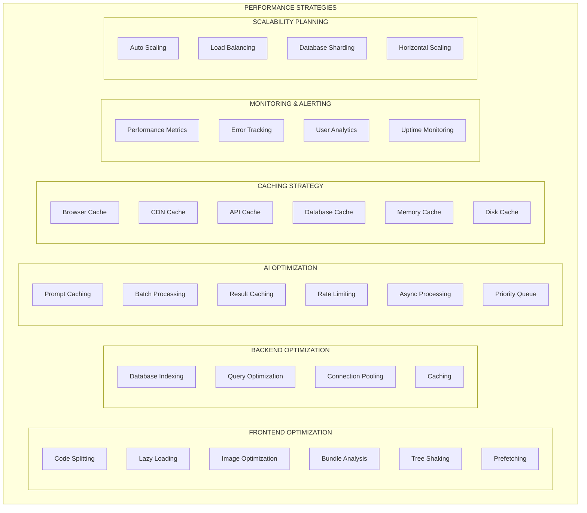

# Relationship Health Journal - System Architecture

## High-Level System Architecture



## Data Flow Architecture



## Component Architecture

```
src/
├── app/                        # Next.js App Router
│   ├── (auth)/                 # Authentication routes
│   │   ├── sign-in/
│   │   └── sign-up/
│   ├── dashboard/              # Main dashboard
│   ├── journal/                # Journal entry pages
│   ├── relationships/          # Relationship management
│   ├── insights/               # AI insights and trends
│   └── settings/               # User settings
│
├── components/                 # Reusable UI components
│   ├── ui/                     # Base UI components
│   │   ├── Button.tsx
│   │   ├── Card.tsx
│   │   ├── Chart.tsx
│   │   └── ...
│   ├── features/               # Feature-specific components
│   │   ├── journal/
│   │   │   ├── EntryEditor.tsx
│   │   │   ├── EntryList.tsx
│   │   │   └── RelationshipPicker.tsx
│   │   ├── dashboard/
│   │   │   ├── HealthScoreCard.tsx
│   │   │   ├── TrendChart.tsx
│   │   │   └── InsightsSummary.tsx
│   │   └── relationships/
│   │       ├── RelationshipForm.tsx
│   │       ├── RelationshipCard.tsx
│   │       └── RelationshipsList.tsx
│   └── layout/                 # Layout components
│       ├── Navbar.tsx
│       ├── Sidebar.tsx
│       └── Footer.tsx
│
├── lib/                        # Utility libraries
│   ├── utils.ts                # General utilities
│   ├── validations.ts          # Form validation schemas
│   ├── constants.ts            # App constants
│   └── types.ts                # TypeScript type definitions
│
├── hooks/                      # Custom React hooks
│   ├── useConvex.ts           # Convex data hooks
│   ├── useAuth.ts             # Authentication hooks
│   └── useAI.ts               # AI analysis hooks
│
└── styles/                     # Styling
    └── globals.css             # Global Tailwind styles
```

## Database Schema (Convex)



## AI Processing Pipeline



## DSPy Integration Architecture

```mermaid
graph TB
    subgraph DSPy["DSPY FRAMEWORK"]
        subgraph Signatures["Signatures"]
            SA["SentimentAnalysis"]
            ED["EmotionDetection"]
            PR["PatternRecognition"]
            SG["SuggestionGeneration"]
        end

        subgraph Modules["Modules"]
            RA["RelationshipAnalyzer"]
            PD["PatternDetector"]
            SGM["SuggestionGenerator"]
            HSC["HealthScoreCalculator"]
        end

        subgraph Optimizers["Optimizers"]
            BFS["BootstrapFewShot"]
            MI["MIPRO"]
            AT["Automatic Tuning"]
        end

        subgraph Evaluators["Evaluators"]
            AM["Accuracy Metrics"]
            UF["User Feedback"]
            AB["A/B Testing"]
        end
    end

    Signatures --> Modules
    Modules --> Optimizers
    Optimizers --> Evaluators
```



## Security & Privacy Architecture



## Deployment Architecture



## Performance Optimization Architecture


