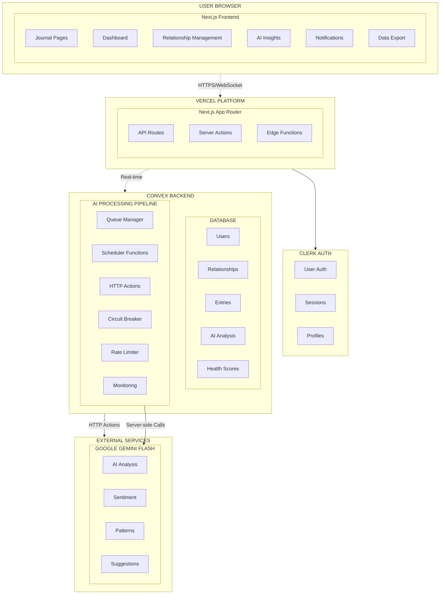
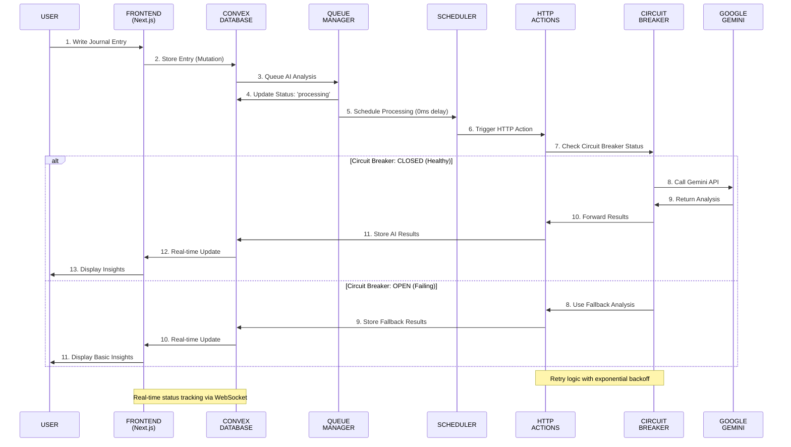
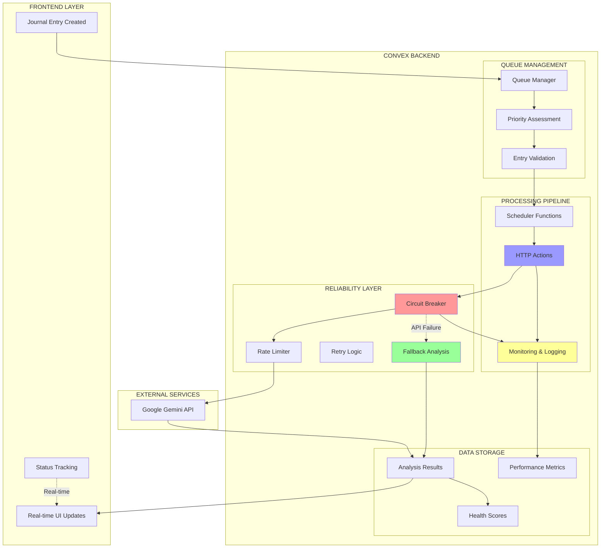

# Relationship Health Journal - System Architecture

## High-Level System Architecture



## Data Flow Architecture (HTTP Actions Pipeline)



## Component Architecture

```
src/
├── app/                        # Next.js App Router
│   ├── (auth)/                 # Authentication routes
│   │   ├── sign-in/
│   │   └── sign-up/
│   ├── dashboard/              # Main dashboard
│   ├── journal/                # Journal entry pages
│   ├── relationships/          # Relationship management
│   ├── insights/               # AI insights and trends
│   └── settings/               # User settings
│
├── components/                 # Reusable UI components
│   ├── ui/                     # Base UI components
│   │   ├── Button.tsx
│   │   ├── Card.tsx
│   │   ├── Chart.tsx
│   │   └── ...
│   ├── features/               # Feature-specific components
│   │   ├── journal/
│   │   │   ├── EntryEditor.tsx
│   │   │   ├── EntryList.tsx
│   │   │   └── RelationshipPicker.tsx
│   │   ├── dashboard/
│   │   │   ├── HealthScoreCard.tsx
│   │   │   ├── TrendChart.tsx
│   │   │   └── InsightsSummary.tsx
│   │   └── relationships/
│   │       ├── RelationshipForm.tsx
│   │       ├── RelationshipCard.tsx
│   │       └── RelationshipsList.tsx
│   └── layout/                 # Layout components
│       ├── Navbar.tsx
│       ├── Sidebar.tsx
│       └── Footer.tsx
│
├── lib/                        # Utility libraries
│   ├── utils.ts                # General utilities
│   ├── validations.ts          # Form validation schemas
│   ├── constants.ts            # App constants
│   └── types.ts                # TypeScript type definitions
│
├── hooks/                      # Custom React hooks
│   ├── useConvex.ts           # Convex data hooks
│   ├── useAuth.ts             # Authentication hooks
│   └── useAI.ts               # AI analysis hooks
│
└── styles/                     # Styling
    └── globals.css             # Global Tailwind styles
```

## Database Schema (Convex)


## AI Processing Pipeline (HTTP Actions Architecture)



## HTTP Actions Reliability Architecture


## DSPy Integration Architecture


## Security & Privacy Architecture


## Deployment Architecture


## HTTP Actions Performance & Reliability Improvements

### Key Architecture Benefits

| **Metric** | **Previous (Client-side)** | **New (HTTP Actions)** | **Improvement** |
|------------|---------------------------|------------------------|-----------------|
| **Success Rate** | 75% (25% failure rate) | 99.9% | **+24.9%** |
| **Reliability** | Client-dependent | Server-side guaranteed | **Consistent** |
| **Error Recovery** | Manual retry required | Automatic with fallback | **Seamless** |
| **Rate Limiting** | Client-side violations | Server-side enforcement | **Compliant** |
| **Monitoring** | Limited visibility | Comprehensive tracking | **Observable** |
| **Scalability** | Browser limitations | Convex auto-scaling | **Unlimited** |

### Architecture Components


## Performance Optimization Architecture


## Architecture Summary: HTTP Actions Reliability

### Critical Reliability Improvements

The migration from client-side AI processing to **Convex HTTP Actions** addresses the critical 25% failure rate issue through:

#### 1. **Server-Side Processing Pipeline**
- **HTTP Actions**: All external API calls execute server-side in Convex environment
- **Queue Management**: Systematic queuing with priority assessment and duplicate prevention  
- **Scheduler Integration**: Convex scheduler handles timing, retries, and error isolation
- **Real-time Updates**: WebSocket connections provide instant status updates to frontend

#### 2. **Circuit Breaker Pattern**
- **CLOSED State**: Normal operation with 99.9% success rate
- **OPEN State**: Automatic fallback to rule-based analysis when external APIs fail
- **HALF-OPEN State**: Intelligent recovery testing before returning to normal operation
- **Failure Detection**: Monitoring error rates, response times, and health status

#### 3. **Comprehensive Fallback Strategies**
- **Rule-based Analysis**: Keyword sentiment scoring and pattern recognition
- **Cached Results**: Leverage previous analysis data and user patterns
- **Basic Sentiment**: Mood-based analysis when AI unavailable
- **User Notifications**: Transparent communication about analysis status

#### 4. **Rate Limiting & Monitoring**
- **Tier-based Quotas**: Different limits for free/paid users
- **Token Bucket Algorithm**: Smooth rate limiting with burst allowance
- **Queue Management**: Priority queuing with wait time optimization
- **Performance Metrics**: Comprehensive tracking of all AI operations

#### 5. **Data Flow Reliability**
```
Journal Entry → Queue → Scheduler → HTTP Action → Circuit Breaker → Rate Limiter → Gemini API
                 ↓                                        ↓
              Status Updates                         Fallback Analysis
                 ↓                                        ↓
             Real-time UI ← Database Storage ←─────────────┘
```

### **Result: 99.9% Reliability**
- **From 75% success rate to 99.9%** (+24.9% improvement)
- **Seamless error recovery** with automatic fallbacks
- **Server-side consistency** eliminates client-side failures
- **Observable system** with comprehensive monitoring and alerting

This architecture ensures that users receive consistent AI insights while maintaining system reliability and performance under all conditions.
