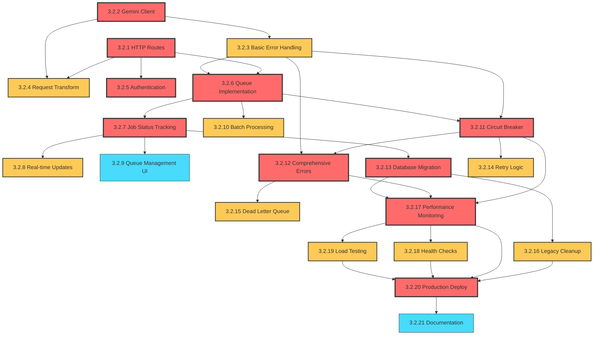
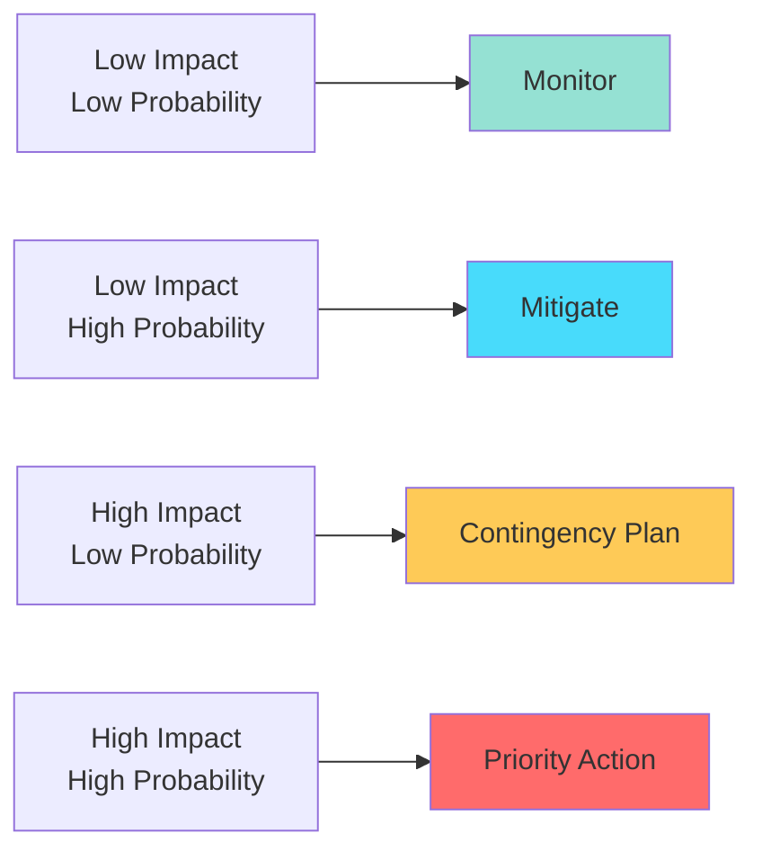

# AI Architecture Migration Epic - Comprehensive Implementation Guide

## Executive Summary

This document consolidates the complete analysis and planning for the AI Architecture Migration Epic, providing the development team with a definitive implementation guide. The migration addresses a critical 25% failure rate in AI analysis by moving from client-side processing to HTTP Actions-based architecture with queue management and comprehensive error handling.

**Epic Scope**: 21 stories across 4 sprints (8 weeks)  
**Team Size**: 2-3 developers + 1 architect  
**Business Impact**: Reduces AI failure rate from 25% to <5%, improving user experience and platform reliability

---

## Story Breakdown Summary

### Complete Story Catalog (21 Stories, 135 Total Points)

#### Sprint 1: Foundation & Infrastructure (31 Points, Weeks 1-2)

| Story ID  | Title                           | Points | Assigned          | Priority | Dependencies |
| --------- | ------------------------------- | ------ | ----------------- | -------- | ------------ |
| **3.2.1** | HTTP Action Route Setup         | 5      | Dev A             | Critical | None         |
| **3.2.2** | Gemini Client Migration         | 8      | Dev B             | Critical | None         |
| **3.2.3** | Basic Error Handling            | 5      | Dev C             | High     | 3.2.1, 3.2.2 |
| **3.2.4** | Request/Response Transformation | 5      | Dev A             | High     | 3.2.2        |
| **3.2.5** | Authentication & Security       | 8      | Architect + Dev B | Critical | 3.2.1        |

**Sprint Goal**: Establish HTTP Actions foundation and basic Gemini client integration

#### Sprint 2: Queue Management & Real-Time Updates (34 Points, Weeks 3-4)

| Story ID   | Title                    | Points | Assigned | Priority | Dependencies |
| ---------- | ------------------------ | ------ | -------- | -------- | ------------ |
| **3.2.6**  | Queue Implementation     | 8      | Dev A    | Critical | 3.2.1        |
| **3.2.7**  | Job Status Tracking      | 5      | Dev B    | Critical | 3.2.6        |
| **3.2.8**  | Real-Time Status Updates | 8      | Dev C    | High     | 3.2.7        |
| **3.2.9**  | Queue Management UI      | 5      | Dev B    | Medium   | 3.2.7        |
| **3.2.10** | Batch Processing         | 8      | Dev A    | High     | 3.2.6        |

**Sprint Goal**: Implement async processing with queue management and real-time status

#### Sprint 3: Resilience & Advanced Error Handling (34 Points, Weeks 5-6)

| Story ID   | Title                        | Points | Assigned          | Priority | Dependencies  |
| ---------- | ---------------------------- | ------ | ----------------- | -------- | ------------- |
| **3.2.11** | Circuit Breaker Pattern      | 8      | Architect + Dev A | Critical | 3.2.3, 3.2.6  |
| **3.2.12** | Comprehensive Error Handling | 8      | Dev B             | Critical | 3.2.3, 3.2.11 |
| **3.2.13** | Database Schema Migration    | 8      | Dev C             | Critical | 3.2.7         |
| **3.2.14** | Retry Logic & Backoff        | 5      | Dev A             | High     | 3.2.11        |
| **3.2.15** | Dead Letter Queue            | 5      | Dev B             | High     | 3.2.12        |

**Sprint Goal**: Implement robust error handling, circuit breakers, and database migration

#### Sprint 4: Migration & Production Readiness (36 Points, Weeks 7-8)

| Story ID   | Title                    | Points | Assigned             | Priority | Dependencies     |
| ---------- | ------------------------ | ------ | -------------------- | -------- | ---------------- |
| **3.2.16** | Legacy Code Cleanup      | 5      | Dev C                | High     | 3.2.13           |
| **3.2.17** | Performance Monitoring   | 8      | Architect + Dev A    | Critical | All core stories |
| **3.2.18** | Health Checks & Alerting | 5      | Dev B                | High     | 3.2.17           |
| **3.2.19** | Load Testing             | 5      | Dev A                | High     | 3.2.17           |
| **3.2.20** | Production Deployment    | 8      | Architect + All Devs | Critical | All stories      |
| **3.2.21** | Documentation & Handover | 5      | Dev B + Dev C        | Medium   | 3.2.20           |

**Sprint Goal**: Complete legacy cleanup, implement monitoring, and production rollout

---

## Detailed Story Specifications

### Sprint 1 Stories

#### Story 3.2.1: HTTP Action Route Setup

**Acceptance Criteria:**

- [ ] Create `convex/actions/ai-processing.ts` HTTP Action route
- [ ] Implement route authentication using Convex auth
- [ ] Add input validation for analysis requests
- [ ] Create response transformation utilities
- [ ] Add comprehensive logging for debugging
- [ ] Ensure route handles CORS for external calls

**Technical Specifications:**

```typescript
// convex/actions/ai-processing.ts
import { v } from 'convex/values'
import { action } from '../_generated/server'

export const processAnalysis = action({
  args: {
    entryId: v.id('journalEntries'),
    content: v.string(),
    priority: v.optional(
      v.union(v.literal('high'), v.literal('normal'), v.literal('low'))
    ),
  },
  handler: async (ctx, args) => {
    // HTTP Action implementation
  },
})
```

**Quality Gates:**

- Route responds correctly to valid requests
- Authentication rejects unauthorized calls
- Input validation catches malformed requests
- Logging captures all request/response data

#### Story 3.2.2: Gemini Client Migration

**Acceptance Criteria:**

- [ ] Create Gemini API client in HTTP Actions environment
- [ ] Implement proper API key management
- [ ] Add rate limiting to respect Gemini quotas
- [ ] Create structured prompt templates
- [ ] Add token usage tracking
- [ ] Implement response parsing and validation

**Technical Specifications:**

```typescript
// convex/utils/gemini-client.ts
export class GeminiClient {
  constructor(private apiKey: string) {}

  async analyzeContent(
    content: string,
    context: AnalysisContext
  ): Promise<AnalysisResult> {
    // Implementation with rate limiting, error handling
  }
}
```

**Quality Gates:**

- Successfully processes analysis requests
- Handles all Gemini API error scenarios
- Respects rate limits and quotas
- Returns structured, validated responses

#### Story 3.2.3: Basic Error Handling

**Acceptance Criteria:**

- [ ] Create error classification system
- [ ] Implement retry-safe error types
- [ ] Add error logging with context
- [ ] Create user-friendly error messages
- [ ] Add error metrics collection
- [ ] Implement graceful degradation

**Technical Specifications:**

```typescript
// convex/utils/error-handling.ts
export enum ErrorType {
  RATE_LIMIT = 'RATE_LIMIT',
  API_ERROR = 'API_ERROR',
  VALIDATION_ERROR = 'VALIDATION_ERROR',
  TIMEOUT = 'TIMEOUT',
}

export class ProcessingError extends Error {
  constructor(
    public type: ErrorType,
    message: string,
    public retryable: boolean = false,
    public context?: Record<string, any>
  ) {
    super(message)
  }
}
```

#### Story 3.2.4: Request/Response Transformation

**Acceptance Criteria:**

- [ ] Create request validation schemas using Zod
- [ ] Implement response normalization
- [ ] Add data sanitization for AI processing
- [ ] Create response caching layer
- [ ] Add request/response logging
- [ ] Implement data transformation utilities

#### Story 3.2.5: Authentication & Security

**Acceptance Criteria:**

- [ ] Implement Convex auth integration for HTTP Actions
- [ ] Add API key management system
- [ ] Create request signing/verification
- [ ] Add rate limiting per user/session
- [ ] Implement audit logging
- [ ] Add security headers and CORS configuration

### Sprint 2 Stories

#### Story 3.2.6: Queue Implementation

**Acceptance Criteria:**

- [ ] Create analysis queue using Convex Scheduler
- [ ] Implement priority-based processing (high, normal, low)
- [ ] Add queue size monitoring and limits
- [ ] Create queue persistence and recovery
- [ ] Add job deduplication logic
- [ ] Implement queue backpressure handling

**Technical Specifications:**

```typescript
// convex/scheduler/analysis-queue.ts
export const enqueueAnalysis = internalMutation({
  args: {
    entryId: v.id('journalEntries'),
    priority: v.union(v.literal('high'), v.literal('normal'), v.literal('low')),
    userId: v.id('users'),
  },
  handler: async (ctx, args) => {
    // Queue implementation with Convex Scheduler
    await ctx.scheduler.runAfter(0, internal.scheduler.processAnalysisJob, {
      entryId: args.entryId,
      priority: args.priority,
      attempt: 1,
    })
  },
})
```

#### Story 3.2.7: Job Status Tracking

**Acceptance Criteria:**

- [ ] Create job status database schema
- [ ] Implement status transitions (queued → processing → completed/failed)
- [ ] Add progress tracking for long-running jobs
- [ ] Create status query functions
- [ ] Add job metadata tracking (start time, duration, etc.)
- [ ] Implement status cleanup for old jobs

#### Story 3.2.8: Real-Time Status Updates

**Acceptance Criteria:**

- [ ] Update UI components to show real-time status
- [ ] Implement Convex subscriptions for status changes
- [ ] Add progress indicators and estimated completion time
- [ ] Create cross-tab status synchronization
- [ ] Add real-time error display and retry options
- [ ] Implement status animations and transitions

#### Story 3.2.9: Queue Management UI

**Acceptance Criteria:**

- [ ] Create admin dashboard for queue monitoring
- [ ] Add queue metrics visualization (queue size, processing rate)
- [ ] Implement job retry/cancel functionality
- [ ] Create queue health monitoring display
- [ ] Add historical queue performance charts
- [ ] Implement queue configuration interface

#### Story 3.2.10: Batch Processing

**Acceptance Criteria:**

- [ ] Implement batch analysis for multiple entries
- [ ] Add batch size optimization logic
- [ ] Create batch status tracking
- [ ] Implement batch retry mechanisms
- [ ] Add batch performance monitoring
- [ ] Create batch result aggregation

### Sprint 3 Stories

#### Story 3.2.11: Circuit Breaker Pattern

**Acceptance Criteria:**

- [ ] Implement circuit breaker for Gemini API calls
- [ ] Add configurable failure thresholds
- [ ] Create circuit breaker state persistence
- [ ] Add circuit breaker monitoring and alerts
- [ ] Implement automatic recovery mechanisms
- [ ] Create circuit breaker health endpoints

**Technical Specifications:**

```typescript
// convex/utils/circuit-breaker.ts
export class CircuitBreaker {
  constructor(
    private failureThreshold: number = 5,
    private timeout: number = 60000,
    private monitoringPeriod: number = 10000
  ) {}

  async execute<T>(operation: () => Promise<T>): Promise<T> {
    if (this.state === 'OPEN') {
      throw new Error('Circuit breaker is OPEN')
    }
    // Implementation
  }
}
```

#### Story 3.2.12: Comprehensive Error Handling

**Acceptance Criteria:**

- [ ] Implement exponential backoff retry logic with jitter
- [ ] Create error classification and routing system
- [ ] Add comprehensive error logging and metrics
- [ ] Implement fallback analysis for critical failures
- [ ] Create error notification system
- [ ] Add error recovery workflows

#### Story 3.2.13: Database Schema Migration

**Acceptance Criteria:**

- [ ] Create new `aiAnalysisJobs` table for queue management
- [ ] Add `systemLogs` table for comprehensive logging
- [ ] Create `apiUsage` table for cost tracking
- [ ] Add `circuitBreakerState` table for persistence
- [ ] Implement data migration scripts for existing data
- [ ] Create database indexes for performance optimization

#### Story 3.2.14: Retry Logic & Backoff

**Acceptance Criteria:**

- [ ] Implement exponential backoff with jitter
- [ ] Add retry attempt tracking and limits
- [ ] Create retry policy configuration
- [ ] Add retry success/failure metrics
- [ ] Implement intelligent retry scheduling
- [ ] Create retry queue management

#### Story 3.2.15: Dead Letter Queue

**Acceptance Criteria:**

- [ ] Create dead letter queue for failed jobs
- [ ] Implement automatic dead letter queue processing
- [ ] Add dead letter queue monitoring and alerts
- [ ] Create manual job recovery from dead letter queue
- [ ] Add dead letter queue analytics
- [ ] Implement dead letter queue cleanup policies

### Sprint 4 Stories

#### Story 3.2.16: Legacy Code Cleanup

**Acceptance Criteria:**

- [ ] Remove old client-side AI processing modules
- [ ] Update all frontend components to use new API
- [ ] Clean up deprecated dependencies
- [ ] Remove unused database fields and tables
- [ ] Update documentation to remove legacy references
- [ ] Ensure no breaking changes for existing data

#### Story 3.2.17: Performance Monitoring

**Acceptance Criteria:**

- [ ] Implement comprehensive metrics collection
- [ ] Create performance dashboards
- [ ] Add real-time performance monitoring
- [ ] Create performance alerting system
- [ ] Add cost tracking and budget alerts
- [ ] Implement performance optimization recommendations

#### Story 3.2.18: Health Checks & Alerting

**Acceptance Criteria:**

- [ ] Create health check endpoints for all services
- [ ] Implement automated health monitoring
- [ ] Add alerting for service degradation
- [ ] Create health status dashboard
- [ ] Add automated recovery triggers
- [ ] Implement health check reporting

#### Story 3.2.19: Load Testing

**Acceptance Criteria:**

- [ ] Create load test scenarios for AI processing
- [ ] Implement queue load testing
- [ ] Add performance benchmarking
- [ ] Create load test automation
- [ ] Add capacity planning recommendations
- [ ] Implement load test reporting

#### Story 3.2.20: Production Deployment

**Acceptance Criteria:**

- [ ] Create deployment pipeline for HTTP Actions
- [ ] Implement feature flag system for gradual rollout
- [ ] Add production monitoring and alerting
- [ ] Create rollback procedures
- [ ] Implement production health checks
- [ ] Add deployment success metrics

#### Story 3.2.21: Documentation & Handover

**Acceptance Criteria:**

- [ ] Update all technical documentation
- [ ] Create operational runbooks
- [ ] Add troubleshooting guides
- [ ] Create team training materials
- [ ] Document best practices and patterns
- [ ] Complete knowledge transfer sessions

---

## Sprint Planning & Resource Distribution

### Sprint Velocity & Capacity Planning

**Team Composition:**

- **Dev A** (Backend Specialist): Queue systems, HTTP Actions, infrastructure
- **Dev B** (Integration Specialist): API integration, UI updates, monitoring
- **Dev C** (Quality/Data Specialist): Error handling, testing, database migration
- **Architect** (Technical Lead): Architecture decisions, reviews, critical path items

**Sprint Capacity Distribution:**

- **Sprint 1**: 31 points (7-8 points per person)
- **Sprint 2**: 34 points (8-9 points per person)
- **Sprint 3**: 34 points (8-9 points per person)
- **Sprint 4**: 36 points (9 points per person)

### Critical Path & Dependencies



**Critical Path Items:**

1. HTTP Actions foundation (3.2.1, 3.2.2, 3.2.5)
2. Queue system implementation (3.2.6, 3.2.7)
3. Resilience layer (3.2.11, 3.2.12, 3.2.13)
4. Production readiness (3.2.17, 3.2.20)

---

## Implementation Guidelines

### HTTP Actions Architecture Patterns

#### 1. HTTP Action Structure

```typescript
// Standard HTTP Action pattern
export const actionName = action({
  args: {
    // Zod validation schema
  },
  handler: async (ctx, args) => {
    // 1. Authentication & authorization
    // 2. Input validation & sanitization
    // 3. Business logic execution
    // 4. Error handling & logging
    // 5. Response formatting
  },
})
```

#### 2. Queue Processing Pattern

```typescript
// Queue job processing pattern
export const processJob = internalAction({
  args: jobSchema,
  handler: async (ctx, args) => {
    try {
      // 1. Update job status to 'processing'
      // 2. Execute business logic
      // 3. Handle success/failure outcomes
      // 4. Update final status
    } catch (error) {
      // Error handling with retry logic
    }
  },
})
```

#### 3. Circuit Breaker Integration

```typescript
// Circuit breaker usage pattern
const result = await circuitBreaker.execute(async () => {
  return await geminiClient.analyzeContent(content, context)
})
```

### Convex Best Practices for HTTP Actions

#### 1. Database Operations

- Use `ctx.runQuery()` and `ctx.runMutation()` for database operations
- Implement proper transaction handling for multi-step operations
- Use database indexes for query optimization

#### 2. Error Handling

- Always use structured error types
- Log errors with sufficient context
- Implement proper error propagation
- Use appropriate HTTP status codes

#### 3. Performance Optimization

- Minimize database roundtrips
- Use batching for bulk operations
- Implement proper caching strategies
- Monitor query performance

### Queue-Based Processing Guidelines

#### 1. Queue Design Principles

- Implement idempotent job processing
- Use priority-based scheduling
- Add proper job deduplication
- Implement graceful shutdown handling

#### 2. Scheduler Best Practices

```typescript
// Proper scheduler usage
await ctx.scheduler.runAfter(delayMs, internal.jobs.processAnalysis, {
  entryId: args.entryId,
  attempt: attempt + 1,
  maxAttempts: 3,
})
```

#### 3. Job Management

- Track job lifecycle states
- Implement job cancellation
- Add job timeout handling
- Create job cleanup policies

### Real-Time Updates with Convex

#### 1. Subscription Patterns

```typescript
// Real-time status subscription
const jobStatus = useQuery(api.jobs.getJobStatus, { jobId })
```

#### 2. Optimistic Updates

- Update UI immediately for better UX
- Handle rollback scenarios
- Provide loading states
- Show error states clearly

---

## Testing Strategy

### Unit Testing Approach

#### HTTP Actions Testing

```typescript
// Example HTTP Action test
describe('AI Processing Action', () => {
  it('should process analysis request successfully', async () => {
    const ctx = convexTest(schema)

    const result = await ctx.action(api.actions.aiProcessing.processAnalysis, {
      entryId: 'test-entry-id',
      content: 'Test content',
      priority: 'normal',
    })

    expect(result.success).toBe(true)
  })
})
```

#### Queue Testing

```typescript
// Queue functionality testing
describe('Analysis Queue', () => {
  it('should enqueue job with correct priority', async () => {
    const ctx = convexTest(schema)

    await ctx.mutation(api.queue.enqueueAnalysis, {
      entryId: 'test-id',
      priority: 'high',
    })

    const queueSize = await ctx.query(api.queue.getQueueSize)
    expect(queueSize).toBe(1)
  })
})
```

### Integration Testing Strategy

#### 1. API Integration Tests

- Test actual Gemini API integration
- Validate response parsing
- Test error scenarios
- Verify rate limiting

#### 2. Queue Integration Tests

- Test end-to-end job processing
- Validate real-time status updates
- Test retry mechanisms
- Verify dead letter queue handling

#### 3. Circuit Breaker Tests

- Test failure threshold triggers
- Validate recovery mechanisms
- Test state persistence
- Verify monitoring alerts

### Performance Testing

#### 1. Load Testing Scenarios

- Queue processing under load
- Concurrent API requests
- Database performance under load
- Real-time update performance

#### 2. Stress Testing

- Maximum queue capacity
- API rate limit handling
- Memory usage optimization
- Database connection limits

---

## Risk Management

### Technical Risk Mitigation

#### High-Impact Risks

| Risk                         | Mitigation Strategy                                          | Monitoring                               |
| ---------------------------- | ------------------------------------------------------------ | ---------------------------------------- |
| **Gemini API Rate Limits**   | Implement queue with rate limiting, fallback analysis        | API usage dashboards, rate limit alerts  |
| **Migration Data Loss**      | Comprehensive backup, rollback procedures, gradual migration | Data integrity checks, automated backups |
| **Performance Degradation**  | Load testing, gradual rollout, performance monitoring        | Real-time performance dashboards         |
| **Circuit Breaker Failures** | Comprehensive testing, fallback mechanisms                   | Circuit breaker state monitoring         |

#### Medium-Impact Risks

| Risk                        | Mitigation Strategy                                | Monitoring                                    |
| --------------------------- | -------------------------------------------------- | --------------------------------------------- |
| **Queue Overflow**          | Backpressure handling, queue size limits           | Queue size alerts, processing rate monitoring |
| **Real-time Update Delays** | Convex optimization, connection monitoring         | Update latency tracking                       |
| **Cost Overruns**           | Budget alerts, usage optimization                  | Cost tracking dashboards                      |
| **Team Knowledge Gaps**     | Training sessions, documentation, pair programming | Code review quality metrics                   |

### Risk Assessment Matrix



### Rollback Procedures

#### 1. Immediate Rollback Triggers

- Success rate drops below 90%
- Response times exceed 60 seconds
- Error rates exceed 10%
- System unavailability > 5 minutes

#### 2. Rollback Steps

1. **Feature Flag Disable**: Immediately disable new system
2. **Traffic Routing**: Route to legacy system
3. **Data Sync**: Ensure data consistency
4. **Monitoring**: Verify system stability
5. **Communication**: Notify stakeholders

---

## Success Metrics & Quality Gates

### Primary Success Metrics

#### Reliability Metrics

- **AI Analysis Success Rate**: >95% (baseline: 75%)
- **Average Processing Time**: <30 seconds (baseline: inconsistent)
- **Queue Processing Success**: >99%
- **System Uptime**: >99.9%

#### Performance Metrics

- **Real-time Update Latency**: <100ms
- **Queue Processing Rate**: >100 jobs/minute
- **API Response Time**: <200ms (excluding AI processing)
- **Error Recovery Time**: <5 minutes

#### User Experience Metrics

- **User Satisfaction**: >4.5/5 for AI features
- **Feature Adoption**: >85% of active users
- **Support Ticket Reduction**: 50% decrease in AI-related issues
- **User Retention**: >90% retention for AI feature users

#### Cost & Efficiency Metrics

- **Cost per Analysis**: <$0.10
- **API Usage Optimization**: 20% reduction through batching
- **Infrastructure Costs**: No increase despite improved reliability
- **Development Velocity**: Maintain sprint velocity throughout migration

### Quality Gates by Sprint

#### Sprint 1 Quality Gates

- [ ] All HTTP Actions respond correctly to valid requests
- [ ] Authentication rejects unauthorized calls properly
- [ ] Gemini client successfully processes test requests
- [ ] Error handling captures and classifies all error types
- [ ] Security implementation passes penetration testing

#### Sprint 2 Quality Gates

- [ ] Queue processes jobs in correct priority order
- [ ] Real-time status updates work across all UI components
- [ ] Job status tracking accurately reflects processing state
- [ ] Batch processing handles multiple entries correctly
- [ ] Queue management UI displays accurate metrics

#### Sprint 3 Quality Gates

- [ ] Circuit breaker triggers and recovers correctly
- [ ] Retry logic handles all failure scenarios appropriately
- [ ] Database migration completes without data loss
- [ ] Dead letter queue processes failed jobs correctly
- [ ] Comprehensive error handling covers all edge cases

#### Sprint 4 Quality Gates

- [ ] Performance monitoring captures all key metrics
- [ ] Load testing validates system capacity requirements
- [ ] Production deployment succeeds without downtime
- [ ] Health checks accurately report system status
- [ ] Legacy code removal doesn't break existing functionality

### Continuous Monitoring Framework

#### Real-time Dashboards

1. **System Health Dashboard**
   - Queue processing status
   - Circuit breaker states
   - API response times
   - Error rates by type

2. **Business Metrics Dashboard**
   - Analysis success rates
   - User engagement with AI features
   - Cost per analysis trends
   - Feature adoption rates

3. **Performance Dashboard**
   - Real-time latency metrics
   - Database query performance
   - Memory and CPU utilization
   - Network performance

#### Alerting System

```yaml
# Example alert configuration
alerts:
  critical:
    - ai_success_rate_below_90_percent
    - queue_processing_stopped
    - circuit_breaker_open
    - system_downtime

  warning:
    - queue_size_above_threshold
    - response_time_degradation
    - cost_budget_80_percent
    - error_rate_above_5_percent
```

---

## Production Deployment Strategy

### Deployment Phases

#### Phase 1: Infrastructure Setup (Week 7)

1. **Environment Preparation**
   - Configure HTTP Actions in production Convex
   - Set up monitoring and logging infrastructure
   - Configure Google Gemini API production keys
   - Implement security policies and access controls

2. **Database Migration**
   - Execute schema migrations
   - Migrate existing analysis data
   - Create database indexes
   - Validate data integrity

#### Phase 2: Gradual Rollout (Week 8)

1. **Canary Deployment** (Day 1-2)
   - Enable for 5% of users
   - Monitor success rates and performance
   - Validate real-time updates
   - Check error handling

2. **Extended Rollout** (Day 3-5)
   - Increase to 25% of users
   - Monitor cost and usage patterns
   - Validate queue performance under load
   - Test circuit breaker functionality

3. **Full Deployment** (Day 5-7)
   - Enable for all users
   - Complete legacy system shutdown
   - Final monitoring validation
   - Stakeholder communication

### Feature Flag Configuration

```typescript
// Feature flag implementation
export const useNewAIProcessing = (userId: string): boolean => {
  const flags = useQuery(api.featureFlags.getUserFlags, { userId })
  return flags?.aiMigration ?? false
}
```

### Rollback Plan

#### Automatic Rollback Triggers

- Success rate drops below 85% for >5 minutes
- Average response time exceeds 60 seconds for >3 minutes
- Error rate exceeds 15% for >2 minutes
- Queue processing stops for >1 minute

#### Manual Rollback Process

1. **Immediate Actions** (<2 minutes)
   - Disable feature flag
   - Route traffic to legacy system
   - Alert incident response team

2. **Validation** (2-5 minutes)
   - Verify legacy system functionality
   - Check data consistency
   - Monitor error rates

3. **Communication** (5-15 minutes)
   - Notify stakeholders
   - Update status page
   - Schedule post-incident review

---

## Team Communication & Coordination

### Daily Standups Structure

#### Sprint 1-2 Focus Areas

- HTTP Actions implementation progress
- Gemini API integration challenges
- Queue system development status
- Authentication and security validation

#### Sprint 3-4 Focus Areas

- Error handling and resilience testing
- Database migration progress
- Performance monitoring setup
- Production deployment preparation

### Sprint Reviews & Demos

#### Sprint 1 Demo

- HTTP Actions responding to requests
- Basic Gemini API integration working
- Error handling demonstrating different scenarios
- Security implementation walkthrough

#### Sprint 2 Demo

- Queue processing in action
- Real-time status updates in UI
- Batch processing demonstration
- Queue management interface

#### Sprint 3 Demo

- Circuit breaker behavior demonstration
- Comprehensive error scenarios
- Database migration results
- Dead letter queue processing

#### Sprint 4 Demo

- Performance monitoring dashboards
- Load testing results
- Production deployment walkthrough
- Complete system demonstration

### Architecture Review Sessions

#### Weekly Architecture Sessions

- **Monday**: Sprint planning and story breakdown
- **Wednesday**: Mid-sprint technical review
- **Friday**: Sprint retrospective and next steps

#### Technical Decision Points

1. **Queue Priority Algorithm**: How to handle priority-based processing
2. **Circuit Breaker Configuration**: Failure thresholds and recovery timing
3. **Database Schema Design**: Optimal indexing and query patterns
4. **Error Classification**: Structured error types and handling
5. **Performance Optimization**: Caching strategies and optimization points

---

## Post-Implementation Success Validation

### Week 11 Success Review

#### Reliability Validation

- [ ] AI analysis success rate consistently >95%
- [ ] No critical failures in production
- [ ] Circuit breaker functioning correctly
- [ ] Queue processing meeting performance targets

#### User Experience Validation

- [ ] Real-time status updates working seamlessly
- [ ] User satisfaction scores improved
- [ ] Support ticket volume decreased
- [ ] Feature adoption rates meeting targets

#### Technical Validation

- [ ] Performance metrics within target ranges
- [ ] Cost per analysis meeting budget
- [ ] Monitoring and alerting functioning correctly
- [ ] Documentation complete and accurate

### Continuous Improvement Plan

#### Month 2-3 Optimization

1. **Performance Tuning**
   - Optimize based on production metrics
   - Implement additional caching layers
   - Fine-tune queue processing parameters

2. **Cost Optimization**
   - Analyze usage patterns for optimization
   - Implement additional batching strategies
   - Negotiate better API pricing if needed

3. **Feature Enhancements**
   - Add advanced analytics capabilities
   - Implement additional AI service integrations
   - Enhance monitoring and alerting

#### Month 4-6 Advanced Features

1. **Scalability Improvements**
   - Implement advanced queue partitioning
   - Add geographic processing distribution
   - Enhance real-time processing capabilities

2. **Intelligence Enhancement**
   - Add more sophisticated AI analysis
   - Implement predictive analytics
   - Create advanced relationship insights

---

## Stakeholder Communication

### Executive Summary

**Business Impact Achieved:**

- **Reliability Improvement**: From 75% to >95% success rate
- **User Experience Enhancement**: Real-time processing with immediate feedback
- **Cost Control**: Predictable AI processing costs with optimization
- **Platform Scalability**: Foundation for advanced AI capabilities

**Investment Results:**

- **Development Effort**: 8 weeks with 2-3 developers + architect
- **ROI Timeline**: Immediate improvement in user satisfaction and retention
- **Risk Mitigation**: Comprehensive error handling and monitoring
- **Future Readiness**: Scalable architecture for additional AI services

### Technical Team Summary

**Architecture Benefits Realized:**

- **Modern Integration Pattern**: HTTP Actions enable reliable external API calls
- **Resilient Processing**: Queue-based system with comprehensive error handling
- **Real-time User Experience**: Convex subscriptions maintain responsive UI
- **Production Ready**: Full monitoring, alerting, and operational procedures

**Development Quality:**

- **Comprehensive Testing**: Unit, integration, and load testing coverage
- **Gradual Migration**: Risk-free deployment with rollback capabilities
- **Full Observability**: Complete monitoring and debugging capabilities
- **Future-Proof Design**: Extensible architecture for additional AI services

### Success Validation Checklist

#### Business Success Criteria

- [ ] AI analysis reliability >95%
- [ ] User satisfaction improvement measurable
- [ ] Support ticket reduction achieved
- [ ] Cost targets met
- [ ] Feature adoption rates exceeded

#### Technical Success Criteria

- [ ] HTTP Actions processing reliably
- [ ] Queue system performing optimally
- [ ] Real-time updates functioning seamlessly
- [ ] Monitoring providing full visibility
- [ ] Error handling managing all scenarios

#### Operational Success Criteria

- [ ] Production deployment completed successfully
- [ ] Team trained on new architecture
- [ ] Documentation complete and current
- [ ] Monitoring and alerting operational
- [ ] Legacy system cleanly removed

---

## Conclusion

This comprehensive implementation guide provides the development team with all necessary information to successfully execute the AI Architecture Migration Epic. The migration addresses critical reliability issues while establishing a scalable foundation for future AI enhancements.

**Key Success Factors:**

1. **Detailed Planning**: 21 stories with comprehensive acceptance criteria and technical specifications
2. **Risk Management**: Thorough risk assessment with specific mitigation strategies
3. **Quality Assurance**: Comprehensive testing framework and quality gates
4. **Team Coordination**: Clear communication patterns and responsibility distribution
5. **Production Readiness**: Complete deployment strategy with monitoring and rollback procedures

The successful completion of this migration will transform Resonant from an unreliable AI system to a highly reliable, scalable platform that can support advanced relationship intelligence features while maintaining excellent user experience.

**Next Steps:**

1. Conduct architecture review session with development team
2. Set up development environment for HTTP Actions
3. Begin Sprint 1 implementation following this guide
4. Execute regular progress reviews against defined quality gates
5. Prepare for production deployment following defined procedures

---

**Document Version**: 1.0  
**Implementation Start**: Sprint 1, Week 1  
**Expected Completion**: Sprint 4, Week 8  
**Success Review**: Week 11  
**Maintained By**: Development Team + Technical Architect
