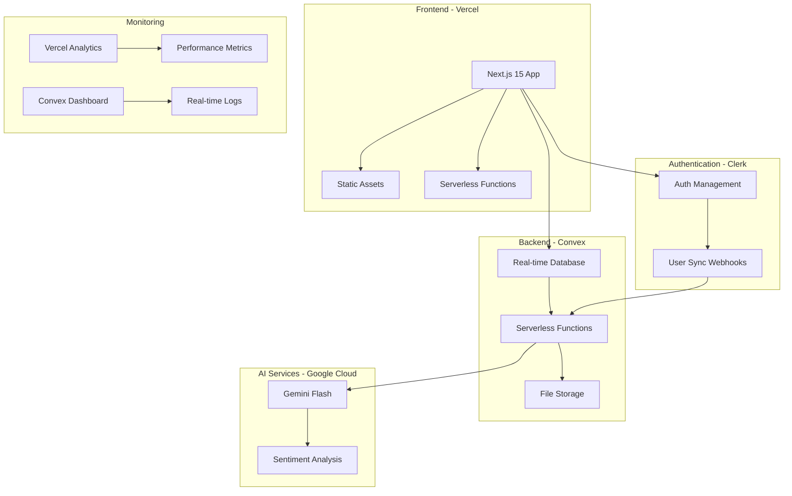

# Deployment & DevOps Documentation

Comprehensive deployment and DevOps guide for the Resonant relationship health journal application.

## Table of Contents

1. [Quick Start Deployment](#quick-start-deployment)
2. [Architecture Overview](#architecture-overview)
3. [Environment Configuration](#environment-configuration)
4. [Production Deployment](#production-deployment)
5. [CI/CD Pipeline](#cicd-pipeline)
6. [Monitoring & Alerting](#monitoring--alerting)
7. [Database Operations](#database-operations)
8. [Secret Management](#secret-management)
9. [Troubleshooting](#troubleshooting)
10. [Performance Optimization](#performance-optimization)

## Quick Start Deployment

### Prerequisites

- Node.js 18+ with npm
- Vercel account
- Convex account
- Clerk account
- Google Cloud account (for Gemini AI)

### One-Command Production Deploy

```bash
# 1. Deploy Convex backend
npm run convex:deploy

# 2. Deploy frontend to Vercel
vercel --prod

# 3. Verify deployment health
npm run test:smoke
```

## Architecture Overview



### Technology Stack

- **Frontend**: Next.js 15 + React 19 + TypeScript + Tailwind CSS 4
- **Backend**: Convex real-time database + serverless functions
- **Hosting**: Vercel (frontend) + Convex Cloud (backend)
- **Authentication**: Clerk with webhook integration
- **AI**: Google Gemini Flash for sentiment analysis
- **Monitoring**: Vercel Analytics + Convex Dashboard + Custom metrics

## Environment Configuration

### Development Environment

```bash
# .env.local (Development)
# Convex
NEXT_PUBLIC_CONVEX_URL=https://your-dev-deployment.convex.cloud
CONVEX_DEPLOY_KEY=your-dev-deploy-key

# Clerk Authentication
NEXT_PUBLIC_CLERK_PUBLISHABLE_KEY=pk_test_...
CLERK_SECRET_KEY=sk_test_...
CLERK_WEBHOOK_SECRET=whsec_...

# AI Features
GOOGLE_GEMINI_API_KEY=your-dev-api-key

# Environment Identification
NODE_ENV=development
VERCEL_ENV=development
```

### Staging Environment

```bash
# Environment Variables (Staging)
# Convex
NEXT_PUBLIC_CONVEX_URL=https://your-staging-deployment.convex.cloud
CONVEX_DEPLOY_KEY=your-staging-deploy-key

# Clerk Authentication
NEXT_PUBLIC_CLERK_PUBLISHABLE_KEY=pk_test_...
CLERK_SECRET_KEY=sk_test_...
CLERK_WEBHOOK_SECRET=whsec_...

# AI Features
GOOGLE_GEMINI_API_KEY=your-staging-api-key

# Environment Identification
NODE_ENV=production
VERCEL_ENV=preview
```

### Production Environment

```bash
# Environment Variables (Production)
# Convex
NEXT_PUBLIC_CONVEX_URL=https://your-prod-deployment.convex.cloud
CONVEX_DEPLOY_KEY=your-prod-deploy-key

# Clerk Authentication
NEXT_PUBLIC_CLERK_PUBLISHABLE_KEY=pk_live_...
CLERK_SECRET_KEY=sk_live_...
CLERK_WEBHOOK_SECRET=whsec_...

# AI Features
GOOGLE_GEMINI_API_KEY=your-prod-api-key

# Environment Identification
NODE_ENV=production
VERCEL_ENV=production
```

## Production Deployment

### Step-by-Step Production Deployment

#### 1. Pre-Deployment Checks

```bash
# Run all quality checks
npm run check

# Run full test suite
npm run test:ci

# Validate test accounts
npm run test:accounts:validate

# Check environment variables
node -e "console.log('Convex URL:', process.env.NEXT_PUBLIC_CONVEX_URL)"
```

#### 2. Convex Backend Deployment

```bash
# Set production deploy key
export CONVEX_DEPLOY_KEY=your-production-deploy-key

# Deploy backend with pre-build command
npx convex deploy --cmd 'npm run build'

# Verify deployment
npx convex env list
npx convex logs --prod
```

#### 3. Vercel Frontend Deployment

```bash
# Configure Vercel project
vercel

# Deploy to production
vercel --prod

# Verify deployment
vercel ls
curl -I https://your-domain.com
```

#### 4. Post-Deployment Verification

```bash
# Health checks
npm run test:smoke

# Performance checks
npm run test:performance

# Generate deployment report
npm run test:report:generate
```

### Environment Variable Management

#### Vercel Environment Variables

Set these in the Vercel dashboard for each environment:

```bash
# Production
NEXT_PUBLIC_CONVEX_URL=https://your-prod.convex.cloud
NEXT_PUBLIC_CLERK_PUBLISHABLE_KEY=pk_live_...
CLERK_SECRET_KEY=sk_live_...
CLERK_WEBHOOK_SECRET=whsec_...
GOOGLE_GEMINI_API_KEY=your-prod-key

# Preview
NEXT_PUBLIC_CONVEX_URL=https://your-staging.convex.cloud
NEXT_PUBLIC_CLERK_PUBLISHABLE_KEY=pk_test_...
CLERK_SECRET_KEY=sk_test_...
CLERK_WEBHOOK_SECRET=whsec_...
GOOGLE_GEMINI_API_KEY=your-staging-key
```

#### Convex Environment Variables

```bash
# Set via CLI
npx convex env set GOOGLE_GEMINI_API_KEY your-api-key
npx convex env set CLERK_WEBHOOK_SECRET whsec_...

# List all variables
npx convex env list

# Remove variable
npx convex env remove OLD_VARIABLE
```

## CI/CD Pipeline

### GitHub Actions Workflow

See [CI/CD Pipeline Setup Guide](./deployment/ci-cd-pipeline-setup.md) for complete GitHub Actions configuration.

#### Core Workflow Features

- **Automated Testing**: Unit, integration, and E2E tests
- **Quality Gates**: ESLint, Prettier, TypeScript checks
- **Dependency Caching**: npm cache optimization
- **Preview Deployments**: Automatic staging on PRs
- **Production Deployment**: Triggered on main branch
- **Rollback Support**: Automatic rollback on health check failures

#### Quality Gates

```yaml
# Quality checks that must pass
- name: Quality Checks
  run: |
    npm run lint
    npm run typecheck
    npm run format:check
    npm run test:ci

- name: E2E Tests
  run: npm run test:ci:auth && npm run test:ci:journeys
```

## Monitoring & Alerting

### Production Monitoring Stack

See [Monitoring & Alerting Guide](./deployment/monitoring-alerting-guide.md) for detailed setup.

#### Key Metrics

1. **Application Performance**
   - Page load times
   - API response times
   - Database query performance
   - Real-time connection health

2. **Business Metrics**
   - User registration rate
   - Journal entry creation
   - Feature adoption
   - Error rates

3. **Infrastructure Metrics**
   - Vercel function execution
   - Convex function performance
   - Database storage usage
   - API rate limits

#### Alerting Rules

```yaml
# Example alert configuration
alerts:
  - name: High Error Rate
    condition: error_rate > 5%
    duration: 5m
    channels: [slack, email]
  
  - name: Slow API Response
    condition: p95_response_time > 2000ms
    duration: 2m
    channels: [slack]
  
  - name: Low User Activity
    condition: daily_active_users < 50
    duration: 1h
    channels: [email]
```

## Database Operations

### Convex Schema Migrations

#### Safe Schema Changes

```typescript
// convex/schema.ts - Adding new fields
export default defineSchema({
  journalEntries: defineTable({
    userId: v.id("users"),
    content: v.string(),
    mood: v.number(),
    tags: v.array(v.string()),
    relationshipIds: v.array(v.id("relationships")),
    // New field - nullable for backward compatibility
    sentiment: v.optional(v.object({
      score: v.number(),
      confidence: v.number(),
    })),
  }),
});
```

#### Migration Process

```bash
# 1. Update schema
vim convex/schema.ts

# 2. Deploy to staging
CONVEX_DEPLOY_KEY=$STAGING_KEY npx convex deploy

# 3. Test migration
npm run test:integration

# 4. Deploy to production
CONVEX_DEPLOY_KEY=$PROD_KEY npx convex deploy

# 5. Verify data integrity
npx convex run debug:validateData
```

### Data Backup & Recovery

```bash
# Create backup
npx convex export --path ./backups/$(date +%Y%m%d_%H%M%S)

# Restore from backup
npx convex import --replace backup.zip

# Selective restore
npx convex import --table journalEntries backup.zip
```

## Secret Management

### Environment Variable Security

#### Sensitive Data Handling

1. **Never commit secrets to version control**
2. **Use environment-specific keys**
3. **Rotate keys regularly**
4. **Implement least-privilege access**

#### Secret Rotation Procedure

```bash
# 1. Generate new keys
# 2. Update staging environment
vercel env add GOOGLE_GEMINI_API_KEY preview staging

# 3. Test staging
npm run test:staging

# 4. Update production
vercel env add GOOGLE_GEMINI_API_KEY production

# 5. Remove old keys
vercel env rm OLD_API_KEY production
```

### Webhook Security

#### Clerk Webhook Verification

```typescript
// API route: /api/webhooks/clerk
import { Webhook } from 'svix'

export async function POST(req: Request) {
  const payload = await req.text()
  const headers = {
    'svix-id': req.headers.get('svix-id')!,
    'svix-timestamp': req.headers.get('svix-timestamp')!,
    'svix-signature': req.headers.get('svix-signature')!,
  }

  const wh = new Webhook(process.env.CLERK_WEBHOOK_SECRET!)
  
  try {
    const evt = wh.verify(payload, headers)
    // Process webhook...
  } catch (err) {
    return new Response('Invalid signature', { status: 400 })
  }
}
```

## Troubleshooting

### Common Deployment Issues

#### Build Failures

```bash
# Check build logs
vercel logs your-deployment-url

# Local build testing
npm run build

# Dependency issues
rm -rf node_modules package-lock.json
npm install
```

#### Convex Connection Issues

```bash
# Check deployment status
npx convex status

# Verify environment variables
npx convex env list

# Check function logs
npx convex logs --tail
```

#### Authentication Issues

```bash
# Verify Clerk configuration
curl -H "Authorization: Bearer $CLERK_SECRET_KEY" \
  https://api.clerk.dev/v1/users

# Check webhook delivery
# View Clerk dashboard > Webhooks > Logs
```

### Performance Issues

#### Database Query Optimization

```typescript
// Use indexes for common queries
export default defineSchema({
  journalEntries: defineTable({
    userId: v.id("users"),
    createdAt: v.number(),
    // ... other fields
  })
  .index("by_user_created", ["userId", "createdAt"])
  .index("by_created", ["createdAt"]),
});
```

#### Frontend Performance

```bash
# Analyze bundle size
npm run build
npx @next/bundle-analyzer

# Performance testing
npm run test:performance
```

## Performance Optimization

### Caching Strategy

#### Vercel Edge Caching

```typescript
// next.config.ts
export default {
  async headers() {
    return [
      {
        source: '/api/public/:path*',
        headers: [
          {
            key: 'Cache-Control',
            value: 's-maxage=3600, stale-while-revalidate',
          },
        ],
      },
    ]
  },
}
```

#### Convex Query Optimization

```typescript
// Optimized query patterns
export const getRecentEntries = query({
  args: { userId: v.id("users"), limit: v.optional(v.number()) },
  handler: async (ctx, args) => {
    const limit = args.limit ?? 10;
    return await ctx.db
      .query("journalEntries")
      .withIndex("by_user_created", q => 
        q.eq("userId", args.userId)
      )
      .order("desc")
      .take(limit);
  },
});
```

### CDN and Asset Optimization

```typescript
// Image optimization
import Image from 'next/image'

<Image
  src="/profile-photo.jpg"
  alt="Profile"
  width={100}
  height={100}
  priority={false}
  placeholder="blur"
/>
```

## Support and Escalation

### Incident Response

1. **Severity Levels**
   - P0: Complete service outage
   - P1: Major feature unavailable
   - P2: Performance degradation
   - P3: Minor issues

2. **Response Times**
   - P0: 15 minutes
   - P1: 1 hour
   - P2: 4 hours
   - P3: Next business day

3. **Escalation Path**
   - On-call developer → Team lead → Engineering manager

### Emergency Procedures

#### Complete Service Outage

```bash
# 1. Check service status
curl -I https://your-domain.com

# 2. Check Vercel status
vercel status

# 3. Check Convex status
npx convex status

# 4. Rollback if needed
vercel rollback

# 5. Update status page
# (Update incident management system)
```

#### Database Issues

```bash
# 1. Check Convex dashboard
# 2. Review function logs
npx convex logs --tail

# 3. Check for schema conflicts
npx convex schema

# 4. Emergency data export
npx convex export --path emergency-backup
```

## Additional Resources

- [Production Deployment Guide](./deployment/production-deployment-guide.md)
- [CI/CD Pipeline Setup](./deployment/ci-cd-pipeline-setup.md)
- [Monitoring & Alerting Guide](./deployment/monitoring-alerting-guide.md)
- [Convex Documentation](https://docs.convex.dev/)
- [Vercel Documentation](https://vercel.com/docs)
- [Clerk Documentation](https://clerk.com/docs)

---

**Last Updated**: January 2025
**Version**: 1.0.0
**Maintained By**: Resonant Development Team