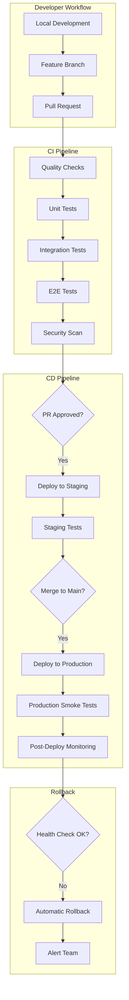

# CI/CD Pipeline Setup Guide

Complete GitHub Actions CI/CD pipeline configuration for the Resonant application.

## Table of Contents

1. [Pipeline Overview](#pipeline-overview)
2. [GitHub Actions Setup](#github-actions-setup)
3. [Workflow Configurations](#workflow-configurations)
4. [Environment Management](#environment-management)
5. [Quality Gates](#quality-gates)
6. [Deployment Strategies](#deployment-strategies)
7. [Monitoring and Notifications](#monitoring-and-notifications)

## Pipeline Overview



### Pipeline Features

- **Automated Testing**: Unit, integration, and E2E tests
- **Quality Gates**: Code quality, security, and performance checks
- **Progressive Deployment**: Staging → Production with approval gates
- **Automatic Rollback**: Health check failures trigger rollback
- **Performance Monitoring**: Bundle size and performance tracking
- **Security Scanning**: Dependency and code security checks

## GitHub Actions Setup

### Repository Configuration

#### 1. Required Secrets

Set these in GitHub Settings > Secrets and variables > Actions:

```bash
# Vercel Deployment
VERCEL_TOKEN=your_vercel_token
VERCEL_ORG_ID=team_xxxxx
VERCEL_PROJECT_ID=prj_xxxxx

# Convex Deployment
CONVEX_DEPLOY_KEY_STAGING=staging_deploy_key
CONVEX_DEPLOY_KEY_PRODUCTION=production_deploy_key

# Authentication
CLERK_PUBLISHABLE_KEY_STAGING=pk_test_...
CLERK_SECRET_KEY_STAGING=sk_test_...
CLERK_WEBHOOK_SECRET_STAGING=whsec_...
CLERK_PUBLISHABLE_KEY_PRODUCTION=pk_live_...
CLERK_SECRET_KEY_PRODUCTION=sk_live_...
CLERK_WEBHOOK_SECRET_PRODUCTION=whsec_...

# AI Services
GOOGLE_GEMINI_API_KEY_STAGING=staging_api_key
GOOGLE_GEMINI_API_KEY_PRODUCTION=production_api_key

# Monitoring
SLACK_WEBHOOK_URL=https://hooks.slack.com/...
SENTRY_DSN=https://sentry.io/...
```

#### 2. Repository Variables

Set these in GitHub Settings > Secrets and variables > Actions > Variables:

```bash
# Environment URLs
STAGING_URL=https://staging.yourdomain.com
PRODUCTION_URL=https://yourdomain.com

# Deployment Configuration
NODE_VERSION=18
ENABLE_PERFORMANCE_MONITORING=true
ENABLE_SECURITY_SCANNING=true
```

### Workflow Directory Structure

```
.github/
├── workflows/
│   ├── ci.yml                    # Continuous Integration
│   ├── deploy-staging.yml        # Staging Deployment
│   ├── deploy-production.yml     # Production Deployment
│   ├── security-scan.yml         # Security Scanning
│   ├── performance-test.yml      # Performance Testing
│   └── cleanup.yml              # Cache and Resource Cleanup
├── actions/                      # Custom Actions
│   ├── setup-node/
│   ├── deploy-convex/
│   └── notify-slack/
└── CODEOWNERS                   # Code review requirements
```

## Workflow Configurations

### 1. Continuous Integration Workflow

```yaml
# .github/workflows/ci.yml
name: Continuous Integration

on:
  push:
    branches: [main, develop]
  pull_request:
    branches: [main, develop]

env:
  NODE_VERSION: 18
  CACHE_KEY_SUFFIX: v1

jobs:
  quality-checks:
    name: Quality Checks
    runs-on: ubuntu-latest
    timeout-minutes: 15

    steps:
      - name: Checkout code
        uses: actions/checkout@v4
        with:
          fetch-depth: 0

      - name: Setup Node.js
        uses: actions/setup-node@v4
        with:
          node-version: ${{ env.NODE_VERSION }}
          cache: 'npm'

      - name: Get npm cache directory
        id: npm-cache-dir
        shell: bash
        run: echo "dir=$(npm config get cache)" >> ${GITHUB_OUTPUT}

      - name: Cache npm dependencies
        uses: actions/cache@v4
        id: npm-cache
        with:
          path: ${{ steps.npm-cache-dir.outputs.dir }}
          key: ${{ runner.os }}-node-${{ hashFiles('**/package-lock.json') }}-${{ env.CACHE_KEY_SUFFIX }}
          restore-keys: |
            ${{ runner.os }}-node-${{ hashFiles('**/package-lock.json') }}-
            ${{ runner.os }}-node-

      - name: Install dependencies
        run: npm ci

      - name: Run ESLint
        run: npm run lint

      - name: Run Prettier check
        run: npm run format:check

      - name: Run TypeScript check
        run: npm run typecheck

      - name: Build application
        run: npm run build
        env:
          NEXT_PUBLIC_CONVEX_URL: ${{ secrets.CONVEX_URL_STAGING }}
          NEXT_PUBLIC_CLERK_PUBLISHABLE_KEY: ${{ secrets.CLERK_PUBLISHABLE_KEY_STAGING }}

  unit-tests:
    name: Unit Tests
    runs-on: ubuntu-latest
    timeout-minutes: 15
    needs: quality-checks

    steps:
      - name: Checkout code
        uses: actions/checkout@v4

      - name: Setup Node.js
        uses: actions/setup-node@v4
        with:
          node-version: ${{ env.NODE_VERSION }}
          cache: 'npm'

      - name: Cache dependencies
        uses: actions/cache@v4
        with:
          path: ~/.npm
          key: ${{ runner.os }}-node-${{ hashFiles('**/package-lock.json') }}-${{ env.CACHE_KEY_SUFFIX }}
          restore-keys: |
            ${{ runner.os }}-node-

      - name: Install dependencies
        run: npm ci

      - name: Run unit tests
        run: npm run test:ci
        env:
          CI: true

      - name: Upload coverage reports
        uses: codecov/codecov-action@v4
        with:
          file: ./coverage/lcov.info
          flags: unittests
          name: codecov-umbrella

  integration-tests:
    name: Integration Tests
    runs-on: ubuntu-latest
    timeout-minutes: 20
    needs: unit-tests

    services:
      # Add any required services here

    steps:
      - name: Checkout code
        uses: actions/checkout@v4

      - name: Setup Node.js
        uses: actions/setup-node@v4
        with:
          node-version: ${{ env.NODE_VERSION }}
          cache: 'npm'

      - name: Install dependencies
        run: npm ci

      - name: Run integration tests
        run: npm run test:ci:auth
        env:
          NEXT_PUBLIC_CONVEX_URL: ${{ secrets.CONVEX_URL_STAGING }}
          NEXT_PUBLIC_CLERK_PUBLISHABLE_KEY: ${{ secrets.CLERK_PUBLISHABLE_KEY_STAGING }}
          CLERK_SECRET_KEY: ${{ secrets.CLERK_SECRET_KEY_STAGING }}

  e2e-tests:
    name: E2E Tests
    runs-on: ubuntu-latest
    timeout-minutes: 30
    needs: integration-tests

    steps:
      - name: Checkout code
        uses: actions/checkout@v4

      - name: Setup Node.js
        uses: actions/setup-node@v4
        with:
          node-version: ${{ env.NODE_VERSION }}
          cache: 'npm'

      - name: Install dependencies
        run: npm ci

      - name: Install Playwright browsers
        run: npx playwright install --with-deps chromium

      - name: Run E2E tests
        run: npm run test:e2e
        env:
          NEXT_PUBLIC_CONVEX_URL: ${{ secrets.CONVEX_URL_STAGING }}
          NEXT_PUBLIC_CLERK_PUBLISHABLE_KEY: ${{ secrets.CLERK_PUBLISHABLE_KEY_STAGING }}
          CLERK_SECRET_KEY: ${{ secrets.CLERK_SECRET_KEY_STAGING }}

      - name: Upload E2E test results
        uses: actions/upload-artifact@v4
        if: failure()
        with:
          name: e2e-test-results
          path: test-results/
          retention-days: 7

  security-scan:
    name: Security Scan
    runs-on: ubuntu-latest
    timeout-minutes: 10
    needs: quality-checks

    steps:
      - name: Checkout code
        uses: actions/checkout@v4

      - name: Run npm audit
        run: npm audit --audit-level high

      - name: Run CodeQL Analysis
        uses: github/codeql-action/analyze@v3
        with:
          languages: typescript

      - name: Run Trivy security scan
        uses: aquasecurity/trivy-action@master
        with:
          scan-type: 'fs'
          scan-ref: '.'
          format: 'sarif'
          output: 'trivy-results.sarif'

      - name: Upload Trivy scan results
        uses: github/codeql-action/upload-sarif@v3
        if: always()
        with:
          sarif_file: 'trivy-results.sarif'

  performance-check:
    name: Performance Check
    runs-on: ubuntu-latest
    timeout-minutes: 15
    needs: quality-checks

    steps:
      - name: Checkout code
        uses: actions/checkout@v4

      - name: Setup Node.js
        uses: actions/setup-node@v4
        with:
          node-version: ${{ env.NODE_VERSION }}
          cache: 'npm'

      - name: Install dependencies
        run: npm ci

      - name: Build for analysis
        run: npm run build
        env:
          ANALYZE: true
          NEXT_PUBLIC_CONVEX_URL: ${{ secrets.CONVEX_URL_STAGING }}

      - name: Check bundle size
        run: |
          npm run build
          npx bundlesize

      - name: Run performance tests
        run: npm run test:performance
```

### 2. Staging Deployment Workflow

```yaml
# .github/workflows/deploy-staging.yml
name: Deploy to Staging

on:
  pull_request:
    branches: [main]
    types: [opened, synchronize, reopened]

env:
  VERCEL_ORG_ID: ${{ secrets.VERCEL_ORG_ID }}
  VERCEL_PROJECT_ID: ${{ secrets.VERCEL_PROJECT_ID }}

jobs:
  deploy-staging:
    name: Deploy to Staging
    runs-on: ubuntu-latest
    timeout-minutes: 15
    environment:
      name: staging
      url: ${{ steps.deploy.outputs.url }}

    steps:
      - name: Checkout code
        uses: actions/checkout@v4

      - name: Setup Node.js
        uses: actions/setup-node@v4
        with:
          node-version: 18
          cache: 'npm'

      - name: Install dependencies
        run: npm ci

      - name: Install Vercel CLI
        run: npm install --global vercel@latest

      - name: Pull Vercel environment
        run: vercel pull --yes --environment=preview --token=${{ secrets.VERCEL_TOKEN }}

      - name: Deploy Convex to staging
        run: |
          npx convex deploy --cmd 'npm run build'
        env:
          CONVEX_DEPLOY_KEY: ${{ secrets.CONVEX_DEPLOY_KEY_STAGING }}

      - name: Build project artifacts
        run: vercel build --token=${{ secrets.VERCEL_TOKEN }}

      - name: Deploy to Vercel
        id: deploy
        run: |
          url=$(vercel deploy --prebuilt --token=${{ secrets.VERCEL_TOKEN }})
          echo "url=$url" >> $GITHUB_OUTPUT
          echo "Deployed to: $url"

      - name: Run staging smoke tests
        run: |
          sleep 30  # Wait for deployment to be ready
          npm run test:smoke
        env:
          TEST_URL: ${{ steps.deploy.outputs.url }}
          NEXT_PUBLIC_CONVEX_URL: ${{ secrets.CONVEX_URL_STAGING }}

      - name: Comment deployment URL
        uses: actions/github-script@v7
        with:
          script: |
            github.rest.issues.createComment({
              issue_number: context.issue.number,
              owner: context.repo.owner,
              repo: context.repo.repo,
              body: `🚀 **Staging Deployment Ready**\n\n**URL**: ${{ steps.deploy.outputs.url }}\n\n**Environment**: Staging\n**Commit**: ${context.sha.substring(0, 7)}\n\n*This deployment will be automatically cleaned up when the PR is closed.*`
            })

      - name: Notify Slack
        if: failure()
        uses: 8398a7/action-slack@v3
        with:
          status: failure
          webhook_url: ${{ secrets.SLACK_WEBHOOK_URL }}
          text: 'Staging deployment failed for PR #${{ github.event.number }}'
```

### 3. Production Deployment Workflow

```yaml
# .github/workflows/deploy-production.yml
name: Deploy to Production

on:
  push:
    branches: [main]
  workflow_dispatch:
    inputs:
      skip_tests:
        description: 'Skip pre-deployment tests (emergency deploy)'
        required: false
        default: false
        type: boolean

env:
  VERCEL_ORG_ID: ${{ secrets.VERCEL_ORG_ID }}
  VERCEL_PROJECT_ID: ${{ secrets.VERCEL_PROJECT_ID }}

jobs:
  pre-deployment-checks:
    name: Pre-deployment Checks
    runs-on: ubuntu-latest
    timeout-minutes: 20
    if: ${{ !inputs.skip_tests }}

    steps:
      - name: Checkout code
        uses: actions/checkout@v4

      - name: Setup Node.js
        uses: actions/setup-node@v4
        with:
          node-version: 18
          cache: 'npm'

      - name: Install dependencies
        run: npm ci

      - name: Run quality checks
        run: |
          npm run lint
          npm run typecheck
          npm run format:check

      - name: Run comprehensive tests
        run: |
          npm run test:ci
          npm run test:ci:auth
          npm run test:ci:journeys

      - name: Build verification
        run: npm run build
        env:
          NEXT_PUBLIC_CONVEX_URL: ${{ secrets.CONVEX_URL_PRODUCTION }}
          NEXT_PUBLIC_CLERK_PUBLISHABLE_KEY: ${{ secrets.CLERK_PUBLISHABLE_KEY_PRODUCTION }}

  deploy-production:
    name: Deploy to Production
    runs-on: ubuntu-latest
    timeout-minutes: 20
    needs: [pre-deployment-checks]
    if: always() && (needs.pre-deployment-checks.result == 'success' || inputs.skip_tests)
    environment:
      name: production
      url: https://yourdomain.com

    steps:
      - name: Checkout code
        uses: actions/checkout@v4

      - name: Setup Node.js
        uses: actions/setup-node@v4
        with:
          node-version: 18
          cache: 'npm'

      - name: Install dependencies
        run: npm ci

      - name: Install Vercel CLI
        run: npm install --global vercel@latest

      - name: Pull Vercel environment
        run: vercel pull --yes --environment=production --token=${{ secrets.VERCEL_TOKEN }}

      - name: Deploy Convex to production
        id: convex-deploy
        run: |
          npx convex deploy --cmd 'npm run build'
          echo "convex_deployed=true" >> $GITHUB_OUTPUT
        env:
          CONVEX_DEPLOY_KEY: ${{ secrets.CONVEX_DEPLOY_KEY_PRODUCTION }}

      - name: Build project artifacts
        run: vercel build --prod --token=${{ secrets.VERCEL_TOKEN }}

      - name: Deploy to Vercel
        id: deploy
        run: |
          url=$(vercel deploy --prebuilt --prod --token=${{ secrets.VERCEL_TOKEN }})
          echo "url=$url" >> $GITHUB_OUTPUT
          echo "Deployed to: $url"

      - name: Wait for deployment propagation
        run: sleep 60

      - name: Run production smoke tests
        id: smoke-tests
        run: |
          npm run test:smoke
          echo "smoke_tests_passed=true" >> $GITHUB_OUTPUT
        env:
          TEST_URL: https://yourdomain.com
          NEXT_PUBLIC_CONVEX_URL: ${{ secrets.CONVEX_URL_PRODUCTION }}

      - name: Run performance verification
        run: |
          npm run test:performance
        env:
          TEST_URL: https://yourdomain.com

      - name: Notify successful deployment
        uses: 8398a7/action-slack@v3
        with:
          status: success
          webhook_url: ${{ secrets.SLACK_WEBHOOK_URL }}
          text: |
            🚀 **Production Deployment Successful**

            **URL**: https://yourdomain.com
            **Commit**: ${{ github.sha }}
            **Author**: ${{ github.actor }}
            **Tests**: ✅ Passed

      - name: Create deployment tag
        run: |
          git tag "deploy-$(date +%Y%m%d-%H%M%S)"
          git push origin --tags

  rollback-on-failure:
    name: Rollback on Failure
    runs-on: ubuntu-latest
    needs: [deploy-production]
    if: failure()

    steps:
      - name: Install Vercel CLI
        run: npm install --global vercel@latest

      - name: Rollback deployment
        run: |
          # Get previous deployment
          PREVIOUS_DEPLOYMENT=$(vercel ls --token=${{ secrets.VERCEL_TOKEN }} --json | jq -r '.[1].url')
          vercel rollback $PREVIOUS_DEPLOYMENT --token=${{ secrets.VERCEL_TOKEN }}
        env:
          VERCEL_ORG_ID: ${{ secrets.VERCEL_ORG_ID }}
          VERCEL_PROJECT_ID: ${{ secrets.VERCEL_PROJECT_ID }}

      - name: Notify rollback
        uses: 8398a7/action-slack@v3
        with:
          status: failure
          webhook_url: ${{ secrets.SLACK_WEBHOOK_URL }}
          text: |
            🚨 **Production Deployment Failed - Rollback Initiated**

            **Failed Commit**: ${{ github.sha }}
            **Author**: ${{ github.actor }}
            **Action**: Automatic rollback completed
```

### 4. Performance Testing Workflow

```yaml
# .github/workflows/performance-test.yml
name: Performance Testing

on:
  schedule:
    - cron: '0 2 * * *' # Daily at 2 AM
  workflow_dispatch:

jobs:
  lighthouse-ci:
    name: Lighthouse CI
    runs-on: ubuntu-latest
    timeout-minutes: 15

    steps:
      - name: Checkout code
        uses: actions/checkout@v4

      - name: Setup Node.js
        uses: actions/setup-node@v4
        with:
          node-version: 18

      - name: Install Lighthouse CI
        run: npm install -g @lhci/cli@0.12.x

      - name: Run Lighthouse CI
        run: lhci autorun
        env:
          LHCI_GITHUB_APP_TOKEN: ${{ secrets.LHCI_GITHUB_APP_TOKEN }}

  bundle-analysis:
    name: Bundle Analysis
    runs-on: ubuntu-latest
    timeout-minutes: 10

    steps:
      - name: Checkout code
        uses: actions/checkout@v4

      - name: Setup Node.js
        uses: actions/setup-node@v4
        with:
          node-version: 18
          cache: 'npm'

      - name: Install dependencies
        run: npm ci

      - name: Build and analyze
        run: |
          npm run build
          npx @next/bundle-analyzer
        env:
          ANALYZE: true
          NEXT_PUBLIC_CONVEX_URL: ${{ secrets.CONVEX_URL_PRODUCTION }}

      - name: Check bundle size limits
        run: npx bundlesize

  api-performance:
    name: API Performance Tests
    runs-on: ubuntu-latest
    timeout-minutes: 15

    steps:
      - name: Checkout code
        uses: actions/checkout@v4

      - name: Setup Node.js
        uses: actions/setup-node@v4
        with:
          node-version: 18
          cache: 'npm'

      - name: Install dependencies
        run: npm ci

      - name: Run API performance tests
        run: npm run test:performance
        env:
          TEST_URL: https://yourdomain.com
```

## Environment Management

### Branch-based Environments

```yaml
# Environment mapping strategy
environments:
  development:
    branches: [develop, feature/*]
    auto_deploy: true
    convex_deployment: dev

  staging:
    branches: [main]
    auto_deploy: pull_request
    convex_deployment: staging

  production:
    branches: [main]
    auto_deploy: false # Manual approval required
    convex_deployment: production
```

### Environment Variables Strategy

```yaml
# .github/workflows/shared/env-setup.yml
name: Environment Setup

on:
  workflow_call:
    inputs:
      environment:
        required: true
        type: string
    secrets:
      convex_deploy_key:
        required: true
      clerk_publishable_key:
        required: true
      clerk_secret_key:
        required: true

jobs:
  setup:
    runs-on: ubuntu-latest
    steps:
      - name: Set environment variables
        run: |
          case "${{ inputs.environment }}" in
            "production")
              echo "CONVEX_DEPLOY_KEY=${{ secrets.CONVEX_DEPLOY_KEY_PRODUCTION }}" >> $GITHUB_ENV
              echo "NEXT_PUBLIC_CLERK_PUBLISHABLE_KEY=${{ secrets.CLERK_PUBLISHABLE_KEY_PRODUCTION }}" >> $GITHUB_ENV
              ;;
            "staging")
              echo "CONVEX_DEPLOY_KEY=${{ secrets.CONVEX_DEPLOY_KEY_STAGING }}" >> $GITHUB_ENV
              echo "NEXT_PUBLIC_CLERK_PUBLISHABLE_KEY=${{ secrets.CLERK_PUBLISHABLE_KEY_STAGING }}" >> $GITHUB_ENV
              ;;
          esac
```

## Quality Gates

### Code Quality Checks

```yaml
# Quality gate configuration
quality_gates:
  - name: Code Coverage
    threshold: 80%
    action: fail

  - name: ESLint Errors
    threshold: 0
    action: fail

  - name: TypeScript Errors
    threshold: 0
    action: fail

  - name: Bundle Size
    threshold: 1MB
    action: warn

  - name: Performance Score
    threshold: 90
    action: warn
```

### Custom Quality Check Action

```yaml
# .github/actions/quality-check/action.yml
name: 'Quality Check'
description: 'Run comprehensive quality checks'

inputs:
  fail-on-warning:
    description: 'Fail on warnings'
    required: false
    default: 'false'

runs:
  using: 'composite'
  steps:
    - name: ESLint
      shell: bash
      run: |
        output=$(npm run lint 2>&1) || {
          echo "❌ ESLint failed"
          echo "$output"
          exit 1
        }
        echo "✅ ESLint passed"

    - name: TypeScript
      shell: bash
      run: |
        output=$(npm run typecheck 2>&1) || {
          echo "❌ TypeScript check failed"
          echo "$output"
          exit 1
        }
        echo "✅ TypeScript check passed"

    - name: Prettier
      shell: bash
      run: |
        output=$(npm run format:check 2>&1) || {
          echo "❌ Prettier check failed"
          echo "$output"
          exit 1
        }
        echo "✅ Prettier check passed"

    - name: Tests
      shell: bash
      run: |
        output=$(npm run test:ci 2>&1) || {
          echo "❌ Tests failed"
          echo "$output"
          exit 1
        }
        echo "✅ Tests passed"
```

## Deployment Strategies

### Blue-Green Deployment

```yaml
# Blue-green deployment strategy
name: Blue-Green Deployment

jobs:
  deploy-green:
    name: Deploy Green Environment
    runs-on: ubuntu-latest
    steps:
      - name: Deploy to green slot
        run: |
          # Deploy new version to green environment
          vercel deploy --token=${{ secrets.VERCEL_TOKEN }}

      - name: Run health checks on green
        run: |
          # Comprehensive health checks
          npm run test:smoke
          npm run test:performance

      - name: Switch traffic to green
        run: |
          # Promote green to production
          vercel alias set green.yourdomain.com yourdomain.com

      - name: Monitor production metrics
        run: |
          # Monitor for 5 minutes
          sleep 300
          # Check error rates, response times
```

### Canary Deployment

```yaml
# Canary deployment with traffic splitting
name: Canary Deployment

jobs:
  canary-deploy:
    name: Canary Deployment
    runs-on: ubuntu-latest
    steps:
      - name: Deploy canary version
        run: |
          # Deploy to canary environment
          vercel deploy --token=${{ secrets.VERCEL_TOKEN }}

      - name: Route 10% traffic to canary
        run: |
          # Configure traffic splitting
          # This would integrate with your load balancer/CDN

      - name: Monitor canary metrics
        run: |
          # Monitor error rates, performance
          # If metrics are good, increase traffic
          # If metrics are bad, rollback
```

## Monitoring and Notifications

### Slack Integration

```yaml
# .github/workflows/notify.yml
name: Notification Workflow

on:
  workflow_run:
    workflows: ['Deploy to Production']
    types: [completed]

jobs:
  notify:
    runs-on: ubuntu-latest
    steps:
      - name: Notify deployment status
        uses: 8398a7/action-slack@v3
        with:
          status: ${{ job.status }}
          webhook_url: ${{ secrets.SLACK_WEBHOOK_URL }}
          channel: '#deployments'
          username: 'GitHub Actions'
          icon_emoji: ':rocket:'
          text: |
            Deployment Status: ${{ job.status }}
            Repository: ${{ github.repository }}
            Branch: ${{ github.ref }}
            Commit: ${{ github.sha }}
            Author: ${{ github.actor }}
```

### Custom Monitoring Action

```yaml
# .github/actions/monitor-deployment/action.yml
name: 'Monitor Deployment'
description: 'Monitor deployment health and performance'

inputs:
  url:
    description: 'URL to monitor'
    required: true
  duration:
    description: 'Monitoring duration in seconds'
    required: false
    default: '300'

runs:
  using: 'composite'
  steps:
    - name: Health check monitoring
      shell: bash
      run: |
        start_time=$(date +%s)
        end_time=$((start_time + ${{ inputs.duration }}))

        while [ $(date +%s) -lt $end_time ]; do
          response=$(curl -s -o /dev/null -w "%{http_code}" ${{ inputs.url }})
          
          if [ "$response" != "200" ]; then
            echo "❌ Health check failed: HTTP $response"
            exit 1
          fi
          
          echo "✅ Health check passed: HTTP $response"
          sleep 30
        done

        echo "✅ Monitoring completed successfully"
```

### Performance Monitoring

```yaml
# Performance monitoring job
performance-monitoring:
  name: Performance Monitoring
  runs-on: ubuntu-latest
  if: github.ref == 'refs/heads/main'

  steps:
    - name: Monitor Core Web Vitals
      run: |
        # Use Lighthouse CI or similar tool
        npx lhci autorun --collect.url=https://yourdomain.com

    - name: Check API performance
      run: |
        # Monitor API response times
        for endpoint in "/api/health" "/api/user" "/api/journal-entries"; do
          response_time=$(curl -w "%{time_total}" -s -o /dev/null https://yourdomain.com$endpoint)
          echo "API $endpoint: ${response_time}s"
          
          # Alert if response time > 2 seconds
          if (( $(echo "$response_time > 2.0" | bc -l) )); then
            echo "⚠️  Slow API response: $endpoint (${response_time}s)"
          fi
        done
```

---

**Version**: 1.0.0  
**Last Updated**: January 2025  
**Next Review**: February 2025
