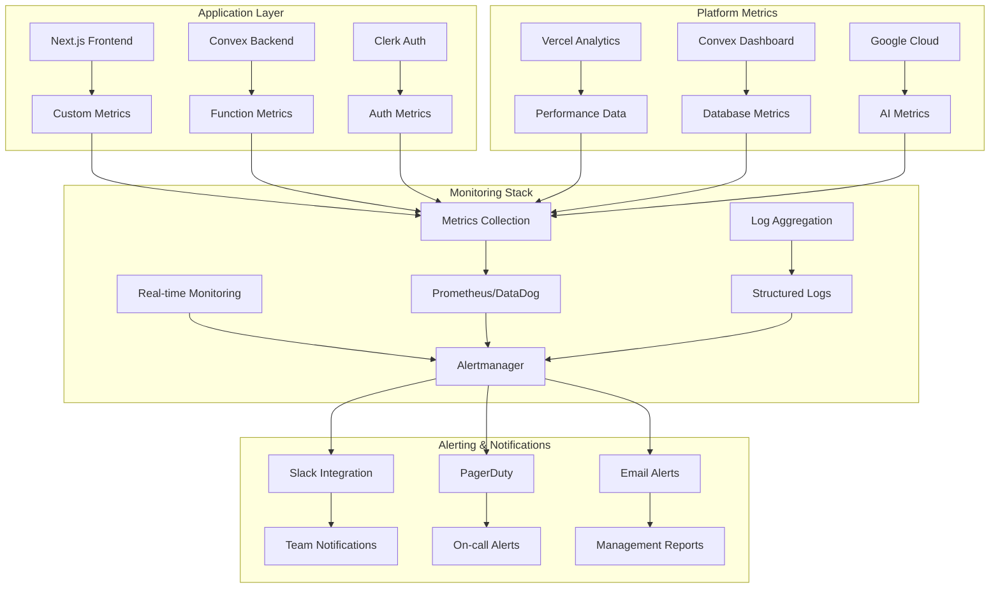

# Monitoring & Alerting Guide

Comprehensive monitoring and alerting setup for the Resonant application in production.

## Table of Contents

1. [Monitoring Architecture](#monitoring-architecture)
2. [Key Metrics](#key-metrics)
3. [Alerting Strategy](#alerting-strategy)
4. [Monitoring Tools Setup](#monitoring-tools-setup)
5. [Dashboard Configuration](#dashboard-configuration)
6. [Incident Response](#incident-response)
7. [Performance Optimization](#performance-optimization)

## Monitoring Architecture



### Monitoring Layers

1. **Application Metrics**: Custom business and performance metrics
2. **Infrastructure Metrics**: Platform and resource utilization
3. **User Experience Metrics**: Real user monitoring and synthetic checks
4. **Security Metrics**: Authentication, authorization, and security events

## Key Metrics

### Application Performance Metrics

#### Frontend Metrics

```typescript
// Custom metrics collection
export const trackMetric = (
  name: string,
  value: number,
  tags?: Record<string, string>
) => {
  // Development: Console logging
  if (process.env.NODE_ENV === 'development') {
    console.log(`Metric: ${name}`, { value, tags })
    return
  }

  // Production: Send to monitoring service
  if (typeof window !== 'undefined') {
    // Vercel Analytics
    window.va?.track(name, { value, ...tags })

    // Custom metrics endpoint
    fetch('/api/metrics', {
      method: 'POST',
      headers: { 'Content-Type': 'application/json' },
      body: JSON.stringify({ name, value, tags, timestamp: Date.now() }),
    }).catch(console.error)
  }
}

// Core Web Vitals tracking
export const trackWebVitals = () => {
  if (typeof window !== 'undefined') {
    import('web-vitals').then(({ getCLS, getFID, getFCP, getLCP, getTTFB }) => {
      getCLS(({ value }) => trackMetric('web_vitals.cls', value))
      getFID(({ value }) => trackMetric('web_vitals.fid', value))
      getFCP(({ value }) => trackMetric('web_vitals.fcp', value))
      getLCP(({ value }) => trackMetric('web_vitals.lcp', value))
      getTTFB(({ value }) => trackMetric('web_vitals.ttfb', value))
    })
  }
}

// User interaction tracking
export const trackUserAction = (
  action: string,
  context?: Record<string, any>
) => {
  trackMetric('user_action', 1, {
    action,
    page: window.location.pathname,
    ...context,
  })
}
```

#### Backend Metrics

```typescript
// convex/lib/metrics.ts
import { v } from 'convex/values'
import { internal } from './_generated/api'

export const trackConvexMetric = async (
  ctx: any,
  name: string,
  value: number,
  tags?: Record<string, string>
) => {
  // Store metrics for aggregation
  await ctx.db.insert('metrics', {
    name,
    value,
    tags: tags || {},
    timestamp: Date.now(),
    environment: process.env.CONVEX_CLOUD_URL?.includes('dev')
      ? 'development'
      : 'production',
  })

  // Real-time alerting for critical metrics
  if (name.includes('error') && value > 0) {
    await ctx.scheduler.runAfter(0, internal.alerts.triggerAlert, {
      metric: name,
      value,
      severity: 'high',
    })
  }
}

// Function performance wrapper
export const withMetrics = <T extends any[], R>(
  functionName: string,
  handler: (...args: T) => Promise<R>
) => {
  return async (...args: T): Promise<R> => {
    const startTime = Date.now()
    const ctx = args[0] // Convex context is always first argument

    try {
      const result = await handler(...args)

      await trackConvexMetric(
        ctx,
        `function.duration.${functionName}`,
        Date.now() - startTime
      )
      await trackConvexMetric(ctx, `function.success.${functionName}`, 1)

      return result
    } catch (error) {
      await trackConvexMetric(ctx, `function.error.${functionName}`, 1, {
        error: error.message,
      })

      throw error
    }
  }
}
```

### Business Metrics

#### User Engagement

```typescript
// User activity metrics
export const userEngagementMetrics = {
  // Daily/Monthly Active Users
  trackActiveUser: (userId: string, timeframe: 'daily' | 'monthly') => {
    trackMetric(`active_users.${timeframe}`, 1, { userId })
  },

  // Feature adoption
  trackFeatureUsage: (feature: string, userId: string) => {
    trackMetric('feature_usage', 1, { feature, userId })
  },

  // Journal entry metrics
  trackJournalEntry: (entryData: {
    wordCount: number
    mood: number
    hasRelationships: boolean
    userId: string
  }) => {
    trackMetric('journal_entry.created', 1, {
      userId: entryData.userId,
      mood_range: Math.floor(entryData.mood / 2).toString(), // 0-4 scale
      has_relationships: entryData.hasRelationships.toString(),
    })

    trackMetric('journal_entry.word_count', entryData.wordCount)
  },

  // Relationship management
  trackRelationshipAction: (
    action: 'create' | 'update' | 'delete',
    userId: string,
    relationshipType: string
  ) => {
    trackMetric('relationship.action', 1, {
      action,
      userId,
      type: relationshipType,
    })
  },
}
```

#### AI Usage Metrics

```typescript
// AI analysis tracking
export const aiMetrics = {
  trackAnalysisRequest: (userId: string, analysisType: string) => {
    trackMetric('ai_analysis.request', 1, {
      userId,
      type: analysisType,
    })
  },

  trackAnalysisLatency: (duration: number, analysisType: string) => {
    trackMetric('ai_analysis.latency', duration, {
      type: analysisType,
    })
  },

  trackAnalysisError: (error: string, userId: string) => {
    trackMetric('ai_analysis.error', 1, {
      error,
      userId,
    })
  },

  trackTokenUsage: (tokens: number, model: string) => {
    trackMetric('ai_analysis.tokens', tokens, {
      model,
    })
  },
}
```

### Infrastructure Metrics

#### Database Performance

```typescript
// convex/lib/dbMetrics.ts
export const dbMetrics = {
  trackQueryDuration: async (ctx: any, queryName: string, duration: number) => {
    await trackConvexMetric(ctx, `db.query.duration.${queryName}`, duration)

    // Alert on slow queries (> 1000ms)
    if (duration > 1000) {
      await trackConvexMetric(ctx, `db.slow_query`, 1, {
        query: queryName,
        duration: duration.toString(),
      })
    }
  },

  trackQueryCount: async (ctx: any, queryName: string) => {
    await trackConvexMetric(ctx, `db.query.count.${queryName}`, 1)
  },

  trackDocumentCount: async (ctx: any, tableName: string, count: number) => {
    await trackConvexMetric(ctx, `db.documents.${tableName}`, count)
  },
}

// Query wrapper with metrics
export const withDbMetrics = <T>(
  queryName: string,
  queryFn: () => Promise<T>
) => {
  return async (): Promise<T> => {
    const startTime = Date.now()

    try {
      const result = await queryFn()
      const duration = Date.now() - startTime

      // Note: In actual implementation, you'd need access to ctx
      console.log(`Query ${queryName} completed in ${duration}ms`)

      return result
    } catch (error) {
      console.error(`Query ${queryName} failed:`, error)
      throw error
    }
  }
}
```

## Alerting Strategy

### Alert Severity Levels

```typescript
// Alert configuration
export const alertConfig = {
  severityLevels: {
    critical: {
      description: 'Service is down or severely degraded',
      responseTime: '5 minutes',
      escalation: ['on-call-engineer', 'engineering-manager'],
      channels: ['pagerduty', 'slack-critical', 'sms'],
    },
    high: {
      description: 'Service degradation affecting users',
      responseTime: '15 minutes',
      escalation: ['on-call-engineer'],
      channels: ['slack-alerts', 'email'],
    },
    medium: {
      description: 'Performance issues or minor errors',
      responseTime: '1 hour',
      escalation: ['team-lead'],
      channels: ['slack-alerts'],
    },
    low: {
      description: 'Informational or trending issues',
      responseTime: '24 hours',
      escalation: [],
      channels: ['slack-info'],
    },
  },

  alertRules: {
    // Critical alerts
    serviceDown: {
      condition: 'http_status_5xx_rate > 50%',
      duration: '1m',
      severity: 'critical',
      message: '🚨 Service experiencing high error rates',
    },

    databaseDown: {
      condition: 'convex_connection_errors > 10',
      duration: '2m',
      severity: 'critical',
      message: '🚨 Database connection failures detected',
    },

    // High severity alerts
    highErrorRate: {
      condition: 'error_rate > 5%',
      duration: '5m',
      severity: 'high',
      message: '⚠️ Error rate exceeding threshold',
    },

    slowResponse: {
      condition: 'p95_response_time > 2000ms',
      duration: '5m',
      severity: 'high',
      message: '⚠️ API response times degraded',
    },

    // Medium severity alerts
    highMemoryUsage: {
      condition: 'memory_usage > 80%',
      duration: '10m',
      severity: 'medium',
      message: '⚠️ High memory usage detected',
    },

    aiServiceSlow: {
      condition: 'ai_analysis_latency > 10000ms',
      duration: '5m',
      severity: 'medium',
      message: '⚠️ AI analysis latency high',
    },

    // Low severity alerts
    lowUserActivity: {
      condition: 'daily_active_users < 50',
      duration: '1h',
      severity: 'low',
      message: 'ℹ️ Lower than expected user activity',
    },
  },
}
```

### Alert Implementation

```typescript
// convex/alerts.ts
import { internal } from './_generated/api'
import { internalMutation } from './_generated/server'
import { v } from 'convex/values'

export const triggerAlert = internalMutation({
  args: {
    metric: v.string(),
    value: v.number(),
    severity: v.string(),
    context: v.optional(v.any()),
  },
  handler: async (ctx, args) => {
    const alert = {
      id: crypto.randomUUID(),
      metric: args.metric,
      value: args.value,
      severity: args.severity,
      context: args.context,
      timestamp: Date.now(),
      status: 'firing',
    }

    // Store alert
    await ctx.db.insert('alerts', alert)

    // Send notifications based on severity
    await sendAlert(alert)
  },
})

async function sendAlert(alert: any) {
  const config = alertConfig.severityLevels[alert.severity]

  if (
    config.channels.includes('slack-critical') ||
    config.channels.includes('slack-alerts')
  ) {
    await sendSlackAlert(alert)
  }

  if (config.channels.includes('pagerduty')) {
    await sendPagerDutyAlert(alert)
  }

  if (config.channels.includes('email')) {
    await sendEmailAlert(alert)
  }
}

async function sendSlackAlert(alert: any) {
  const webhook = process.env.SLACK_WEBHOOK_URL
  if (!webhook) return

  const severity_emoji = {
    critical: '🚨',
    high: '⚠️',
    medium: '⚠️',
    low: 'ℹ️',
  }

  const message = {
    text: `${severity_emoji[alert.severity]} ${alert.severity.toUpperCase()} Alert`,
    blocks: [
      {
        type: 'section',
        text: {
          type: 'mrkdwn',
          text: `*${alert.severity.toUpperCase()} Alert*\n\n*Metric:* ${alert.metric}\n*Value:* ${alert.value}\n*Time:* ${new Date(alert.timestamp).toISOString()}`,
        },
      },
      {
        type: 'context',
        elements: [
          {
            type: 'mrkdwn',
            text: `Alert ID: ${alert.id}`,
          },
        ],
      },
    ],
  }

  try {
    await fetch(webhook, {
      method: 'POST',
      headers: { 'Content-Type': 'application/json' },
      body: JSON.stringify(message),
    })
  } catch (error) {
    console.error('Failed to send Slack alert:', error)
  }
}
```

## Monitoring Tools Setup

### 1. Vercel Analytics Integration

```typescript
// app/layout.tsx
import { Analytics } from '@vercel/analytics/react';
import { SpeedInsights } from '@vercel/speed-insights/next';

export default function RootLayout({
  children,
}: {
  children: React.ReactNode;
}) {
  return (
    <html lang="en">
      <body>
        {children}
        <Analytics />
        <SpeedInsights />
      </body>
    </html>
  );
}
```

### 2. Custom Metrics API

```typescript
// app/api/metrics/route.ts
import { NextRequest, NextResponse } from 'next/server'
import { auth } from '@clerk/nextjs'

interface MetricData {
  name: string
  value: number
  tags?: Record<string, string>
  timestamp: number
}

export async function POST(request: NextRequest) {
  try {
    const { userId } = auth()
    const metric: MetricData = await request.json()

    // Validate metric data
    if (!metric.name || typeof metric.value !== 'number') {
      return NextResponse.json(
        { error: 'Invalid metric data' },
        { status: 400 }
      )
    }

    // Add user context if available
    const tags = {
      ...metric.tags,
      ...(userId && { userId }),
      environment: process.env.VERCEL_ENV || 'development',
    }

    // Send to monitoring service (e.g., DataDog, Prometheus)
    await sendToMonitoringService({
      ...metric,
      tags,
    })

    return NextResponse.json({ success: true })
  } catch (error) {
    console.error('Metrics API error:', error)
    return NextResponse.json(
      { error: 'Failed to record metric' },
      { status: 500 }
    )
  }
}

async function sendToMonitoringService(
  metric: MetricData & { tags: Record<string, string> }
) {
  // Example: Send to DataDog
  if (process.env.DATADOG_API_KEY) {
    await fetch('https://api.datadoghq.com/api/v1/series', {
      method: 'POST',
      headers: {
        'Content-Type': 'application/json',
        'DD-API-KEY': process.env.DATADOG_API_KEY,
      },
      body: JSON.stringify({
        series: [
          {
            metric: `resonant.${metric.name}`,
            points: [[metric.timestamp / 1000, metric.value]],
            tags: Object.entries(metric.tags).map(([k, v]) => `${k}:${v}`),
          },
        ],
      }),
    })
  }

  // Example: Store in Convex for custom dashboards
  // This would require a separate API call to Convex
}
```

### 3. Health Check Endpoints

```typescript
// app/api/health/route.ts
import { NextResponse } from 'next/server'
import { ConvexHttpClient } from 'convex/browser'
import { api } from '@/convex/_generated/api'

const convex = new ConvexHttpClient(process.env.NEXT_PUBLIC_CONVEX_URL!)

export async function GET() {
  const checks = {
    timestamp: new Date().toISOString(),
    status: 'healthy',
    checks: {},
  }

  try {
    // Database connectivity
    const dbStart = Date.now()
    await convex.query(api.health.ping)
    checks.checks.database = {
      status: 'healthy',
      responseTime: Date.now() - dbStart,
    }
  } catch (error) {
    checks.status = 'unhealthy'
    checks.checks.database = {
      status: 'unhealthy',
      error: error.message,
    }
  }

  // AI service connectivity
  try {
    const aiStart = Date.now()
    // Test AI service endpoint
    checks.checks.ai_service = {
      status: 'healthy',
      responseTime: Date.now() - aiStart,
    }
  } catch (error) {
    checks.checks.ai_service = {
      status: 'unhealthy',
      error: error.message,
    }
  }

  const statusCode = checks.status === 'healthy' ? 200 : 503
  return NextResponse.json(checks, { status: statusCode })
}
```

### 4. Convex Health Check

```typescript
// convex/health.ts
import { query } from './_generated/server'

export const ping = query({
  args: {},
  handler: async ctx => {
    // Basic connectivity test
    const timestamp = Date.now()

    // Test database read
    const testQuery = await ctx.db.query('users').first()

    return {
      status: 'healthy',
      timestamp,
      database: 'connected',
      version: '1.0.0',
    }
  },
})

export const detailedHealth = query({
  args: {},
  handler: async ctx => {
    const checks = {
      timestamp: Date.now(),
      status: 'healthy',
      checks: {},
    }

    try {
      // Database performance check
      const dbStart = Date.now()
      const userCount = await ctx.db
        .query('users')
        .collect()
        .then(users => users.length)
      checks.checks.database = {
        status: 'healthy',
        responseTime: Date.now() - dbStart,
        userCount,
      }

      // Check recent errors
      const recentErrors = await ctx.db
        .query('metrics')
        .filter(q =>
          q.and(
            q.gte(q.field('timestamp'), Date.now() - 300000), // Last 5 minutes
            q.eq(q.field('name'), 'function.error')
          )
        )
        .collect()

      checks.checks.error_rate = {
        status: recentErrors.length < 10 ? 'healthy' : 'degraded',
        errorCount: recentErrors.length,
      }
    } catch (error) {
      checks.status = 'unhealthy'
      checks.checks.error = {
        message: error.message,
      }
    }

    return checks
  },
})
```

## Dashboard Configuration

### 1. Real-time Metrics Dashboard

```typescript
// components/admin/MetricsDashboard.tsx
import { useQuery } from 'convex/react';
import { api } from '@/convex/_generated/api';
import { Card } from '@/components/ui/card';
import { Line, Bar } from 'react-chartjs-2';

export function MetricsDashboard() {
  const recentMetrics = useQuery(api.metrics.getRecentMetrics, {
    timeRange: '1h',
  });

  const healthStatus = useQuery(api.health.detailedHealth);

  if (!recentMetrics || !healthStatus) {
    return <div>Loading metrics...</div>;
  }

  return (
    <div className="grid grid-cols-1 md:grid-cols-2 lg:grid-cols-3 gap-6">
      {/* System Health */}
      <Card className="p-6">
        <h3 className="text-lg font-semibold mb-4">System Health</h3>
        <div className="space-y-2">
          <div className="flex justify-between">
            <span>Status:</span>
            <span className={`px-2 py-1 rounded text-sm ${
              healthStatus.status === 'healthy'
                ? 'bg-green-100 text-green-800'
                : 'bg-red-100 text-red-800'
            }`}>
              {healthStatus.status}
            </span>
          </div>
          <div className="flex justify-between">
            <span>Database:</span>
            <span>{healthStatus.checks.database?.responseTime}ms</span>
          </div>
          <div className="flex justify-between">
            <span>Error Rate:</span>
            <span>{healthStatus.checks.error_rate?.errorCount || 0} errors/5min</span>
          </div>
        </div>
      </Card>

      {/* Response Times */}
      <Card className="p-6">
        <h3 className="text-lg font-semibold mb-4">Response Times</h3>
        <Line
          data={{
            labels: recentMetrics.responseTimes.map(m =>
              new Date(m.timestamp).toLocaleTimeString()
            ),
            datasets: [
              {
                label: 'API Response Time (ms)',
                data: recentMetrics.responseTimes.map(m => m.value),
                borderColor: 'rgb(59, 130, 246)',
                tension: 0.1,
              },
            ],
          }}
          options={{
            responsive: true,
            scales: {
              y: {
                beginAtZero: true,
              },
            },
          }}
        />
      </Card>

      {/* User Activity */}
      <Card className="p-6">
        <h3 className="text-lg font-semibold mb-4">User Activity</h3>
        <div className="space-y-4">
          <div>
            <div className="flex justify-between text-sm">
              <span>Active Users (1h)</span>
              <span>{recentMetrics.activeUsers.hourly}</span>
            </div>
            <div className="w-full bg-gray-200 rounded-full h-2">
              <div
                className="bg-blue-600 h-2 rounded-full"
                style={{ width: `${Math.min(recentMetrics.activeUsers.hourly / 100 * 100, 100)}%` }}
              ></div>
            </div>
          </div>
          <div>
            <div className="flex justify-between text-sm">
              <span>Journal Entries (1h)</span>
              <span>{recentMetrics.journalEntries.hourly}</span>
            </div>
            <div className="w-full bg-gray-200 rounded-full h-2">
              <div
                className="bg-green-600 h-2 rounded-full"
                style={{ width: `${Math.min(recentMetrics.journalEntries.hourly / 50 * 100, 100)}%` }}
              ></div>
            </div>
          </div>
        </div>
      </Card>

      {/* Error Rate Trends */}
      <Card className="p-6 md:col-span-2">
        <h3 className="text-lg font-semibold mb-4">Error Rate Trends</h3>
        <Bar
          data={{
            labels: recentMetrics.errorRates.map(m =>
              new Date(m.timestamp).toLocaleTimeString()
            ),
            datasets: [
              {
                label: 'Errors per minute',
                data: recentMetrics.errorRates.map(m => m.value),
                backgroundColor: 'rgba(239, 68, 68, 0.8)',
              },
            ],
          }}
          options={{
            responsive: true,
            scales: {
              y: {
                beginAtZero: true,
              },
            },
          }}
        />
      </Card>

      {/* AI Service Metrics */}
      <Card className="p-6">
        <h3 className="text-lg font-semibold mb-4">AI Service</h3>
        <div className="space-y-2">
          <div className="flex justify-between">
            <span>Requests (1h):</span>
            <span>{recentMetrics.aiRequests.hourly}</span>
          </div>
          <div className="flex justify-between">
            <span>Avg Latency:</span>
            <span>{recentMetrics.aiLatency.average}ms</span>
          </div>
          <div className="flex justify-between">
            <span>Tokens Used:</span>
            <span>{recentMetrics.aiTokens.hourly.toLocaleString()}</span>
          </div>
          <div className="flex justify-between">
            <span>Cost (est):</span>
            <span>${(recentMetrics.aiTokens.hourly * 0.000001).toFixed(4)}</span>
          </div>
        </div>
      </Card>
    </div>
  );
}
```

### 2. Convex Metrics Queries

```typescript
// convex/metrics.ts
import { query } from './_generated/server'
import { v } from 'convex/values'

export const getRecentMetrics = query({
  args: {
    timeRange: v.string(), // '1h', '24h', '7d'
  },
  handler: async (ctx, args) => {
    const timeRangeMs =
      {
        '1h': 60 * 60 * 1000,
        '24h': 24 * 60 * 60 * 1000,
        '7d': 7 * 24 * 60 * 60 * 1000,
      }[args.timeRange] || 60 * 60 * 1000

    const since = Date.now() - timeRangeMs

    // Get response time metrics
    const responseTimes = await ctx.db
      .query('metrics')
      .filter(q =>
        q.and(
          q.eq(q.field('name'), 'api.response_time'),
          q.gte(q.field('timestamp'), since)
        )
      )
      .order('desc')
      .take(100)

    // Get error rates
    const errorRates = await aggregateMetricsByMinute(
      ctx,
      'function.error',
      since
    )

    // Get active users
    const activeUsers = await getActiveUserCounts(ctx, since)

    // Get journal entry counts
    const journalEntries = await aggregateMetricsByHour(
      ctx,
      'journal_entry.created',
      since
    )

    // Get AI service metrics
    const aiRequests = await aggregateMetricsByHour(
      ctx,
      'ai_analysis.request',
      since
    )

    const aiLatency = await getAverageMetric(ctx, 'ai_analysis.latency', since)

    const aiTokens = await aggregateMetricsByHour(
      ctx,
      'ai_analysis.tokens',
      since
    )

    return {
      responseTimes: responseTimes.reverse(),
      errorRates,
      activeUsers: {
        hourly: activeUsers.length,
        total: await getTotalActiveUsers(ctx, since),
      },
      journalEntries: {
        hourly: journalEntries.reduce((sum, entry) => sum + entry.value, 0),
        timeline: journalEntries,
      },
      aiRequests: {
        hourly: aiRequests.reduce((sum, req) => sum + req.value, 0),
        timeline: aiRequests,
      },
      aiLatency: {
        average: aiLatency,
      },
      aiTokens: {
        hourly: aiTokens.reduce((sum, token) => sum + token.value, 0),
        timeline: aiTokens,
      },
    }
  },
})

async function aggregateMetricsByMinute(
  ctx: any,
  metricName: string,
  since: number
) {
  const metrics = await ctx.db
    .query('metrics')
    .filter(q =>
      q.and(
        q.eq(q.field('name'), metricName),
        q.gte(q.field('timestamp'), since)
      )
    )
    .collect()

  // Group by minute
  const aggregated = new Map()

  metrics.forEach(metric => {
    const minute = Math.floor(metric.timestamp / (60 * 1000)) * (60 * 1000)
    aggregated.set(minute, (aggregated.get(minute) || 0) + metric.value)
  })

  return Array.from(aggregated.entries()).map(([timestamp, value]) => ({
    timestamp,
    value,
  }))
}

async function aggregateMetricsByHour(
  ctx: any,
  metricName: string,
  since: number
) {
  const metrics = await ctx.db
    .query('metrics')
    .filter(q =>
      q.and(
        q.eq(q.field('name'), metricName),
        q.gte(q.field('timestamp'), since)
      )
    )
    .collect()

  // Group by hour
  const aggregated = new Map()

  metrics.forEach(metric => {
    const hour =
      Math.floor(metric.timestamp / (60 * 60 * 1000)) * (60 * 60 * 1000)
    aggregated.set(hour, (aggregated.get(hour) || 0) + metric.value)
  })

  return Array.from(aggregated.entries()).map(([timestamp, value]) => ({
    timestamp,
    value,
  }))
}

async function getAverageMetric(ctx: any, metricName: string, since: number) {
  const metrics = await ctx.db
    .query('metrics')
    .filter(q =>
      q.and(
        q.eq(q.field('name'), metricName),
        q.gte(q.field('timestamp'), since)
      )
    )
    .collect()

  if (metrics.length === 0) return 0

  const sum = metrics.reduce((acc, metric) => acc + metric.value, 0)
  return Math.round(sum / metrics.length)
}

async function getActiveUserCounts(ctx: any, since: number) {
  const userActivity = await ctx.db
    .query('metrics')
    .filter(q =>
      q.and(
        q.eq(q.field('name'), 'user_action'),
        q.gte(q.field('timestamp'), since)
      )
    )
    .collect()

  // Get unique users
  const uniqueUsers = new Set(
    userActivity
      .filter(metric => metric.tags?.userId)
      .map(metric => metric.tags.userId)
  )

  return Array.from(uniqueUsers)
}

async function getTotalActiveUsers(ctx: any, since: number) {
  const users = await getActiveUserCounts(ctx, since)
  return users.length
}
```

## Incident Response

### Incident Response Playbook

```typescript
// Incident response procedures
export const incidentResponse = {
  severity: {
    P0: {
      description: 'Complete service outage',
      responseTime: '5 minutes',
      actions: [
        'Page on-call engineer immediately',
        'Create incident channel in Slack',
        'Begin status page updates',
        'Start incident timeline documentation',
      ],
    },
    P1: {
      description: 'Major feature unavailable',
      responseTime: '15 minutes',
      actions: [
        'Alert engineering team',
        'Assess impact and user communication needs',
        'Begin troubleshooting',
      ],
    },
    P2: {
      description: 'Performance degradation',
      responseTime: '1 hour',
      actions: [
        'Create tracking ticket',
        'Schedule investigation',
        'Monitor for escalation',
      ],
    },
  },

  escalationMatrix: {
    primaryOnCall: {
      role: 'Primary On-call Engineer',
      escalateAfter: '15 minutes',
      escalateTo: 'secondaryOnCall',
    },
    secondaryOnCall: {
      role: 'Secondary On-call Engineer',
      escalateAfter: '30 minutes',
      escalateTo: 'engineeringManager',
    },
    engineeringManager: {
      role: 'Engineering Manager',
      escalateAfter: '45 minutes',
      escalateTo: 'cto',
    },
  },

  communicationTemplates: {
    initialAlert: `
🚨 **INCIDENT DETECTED** 🚨

**Severity**: {severity}
**Service**: Resonant App
**Issue**: {description}
**Time**: {timestamp}
**Assigned**: {assignee}

**Status**: Investigating
**Next Update**: {next_update_time}
    `,

    updateMessage: `
🔄 **INCIDENT UPDATE** 

**Incident**: {incident_id}
**Status**: {status}
**Progress**: {progress_description}
**ETA**: {estimated_resolution}
**Next Update**: {next_update_time}
    `,

    resolutionMessage: `
✅ **INCIDENT RESOLVED**

**Incident**: {incident_id}
**Duration**: {total_duration}
**Root Cause**: {root_cause}
**Resolution**: {resolution_summary}
**Post-mortem**: {postmortem_link}
    `,
  },
}
```

### Automated Incident Response

```typescript
// convex/incidents.ts
import { internal } from './_generated/api'
import { internalMutation, mutation } from './_generated/server'
import { v } from 'convex/values'

export const createIncident = internalMutation({
  args: {
    title: v.string(),
    severity: v.string(),
    description: v.string(),
    affectedServices: v.array(v.string()),
    detectedAt: v.number(),
  },
  handler: async (ctx, args) => {
    const incident = {
      id: `INC-${Date.now()}`,
      ...args,
      status: 'investigating',
      assignee: null,
      timeline: [
        {
          timestamp: args.detectedAt,
          event: 'incident_detected',
          description: 'Incident automatically detected by monitoring system',
        },
      ],
      createdAt: Date.now(),
    }

    const incidentId = await ctx.db.insert('incidents', incident)

    // Trigger automated response
    await ctx.scheduler.runAfter(
      0,
      internal.incidents.triggerIncidentResponse,
      {
        incidentId,
        severity: args.severity,
      }
    )

    return incidentId
  },
})

export const triggerIncidentResponse = internalMutation({
  args: {
    incidentId: v.id('incidents'),
    severity: v.string(),
  },
  handler: async (ctx, args) => {
    const incident = await ctx.db.get(args.incidentId)
    if (!incident) return

    // Send notifications based on severity
    const config = incidentResponse.severity[args.severity]
    if (config) {
      // Send Slack notification
      await sendIncidentNotification(incident, config)

      // Page on-call if critical
      if (args.severity === 'P0') {
        await pageOnCallEngineer(incident)
      }

      // Update status page
      if (['P0', 'P1'].includes(args.severity)) {
        await updateStatusPage(incident)
      }
    }

    // Schedule automatic escalation
    const escalationTime = getEscalationTime(args.severity)
    await ctx.scheduler.runAfter(
      escalationTime,
      internal.incidents.escalateIncident,
      {
        incidentId: args.incidentId,
      }
    )
  },
})

export const updateIncident = mutation({
  args: {
    incidentId: v.id('incidents'),
    status: v.optional(v.string()),
    assignee: v.optional(v.string()),
    update: v.string(),
  },
  handler: async (ctx, args) => {
    const incident = await ctx.db.get(args.incidentId)
    if (!incident) throw new Error('Incident not found')

    const updates: any = {
      timeline: [
        ...incident.timeline,
        {
          timestamp: Date.now(),
          event: 'incident_update',
          description: args.update,
          author: args.assignee,
        },
      ],
    }

    if (args.status) updates.status = args.status
    if (args.assignee) updates.assignee = args.assignee

    await ctx.db.patch(args.incidentId, updates)

    // Send update notification
    await sendIncidentUpdate(incident, args.update)
  },
})

export const resolveIncident = mutation({
  args: {
    incidentId: v.id('incidents'),
    resolution: v.string(),
    rootCause: v.string(),
    preventiveMeasures: v.array(v.string()),
  },
  handler: async (ctx, args) => {
    const incident = await ctx.db.get(args.incidentId)
    if (!incident) throw new Error('Incident not found')

    const resolvedAt = Date.now()
    const duration = resolvedAt - incident.createdAt

    await ctx.db.patch(args.incidentId, {
      status: 'resolved',
      resolvedAt,
      duration,
      resolution: args.resolution,
      rootCause: args.rootCause,
      preventiveMeasures: args.preventiveMeasures,
      timeline: [
        ...incident.timeline,
        {
          timestamp: resolvedAt,
          event: 'incident_resolved',
          description: args.resolution,
        },
      ],
    })

    // Send resolution notification
    await sendIncidentResolution(incident, args.resolution, duration)

    // Schedule post-mortem creation
    await ctx.scheduler.runAfter(60000, internal.incidents.createPostMortem, {
      incidentId: args.incidentId,
    })
  },
})

async function sendIncidentNotification(incident: any, config: any) {
  // Implementation would send to Slack, PagerDuty, etc.
  console.log(
    `Sending ${config.description} notification for incident ${incident.id}`
  )
}

async function pageOnCallEngineer(incident: any) {
  // Implementation would integrate with PagerDuty or similar
  console.log(`Paging on-call engineer for critical incident ${incident.id}`)
}

async function updateStatusPage(incident: any) {
  // Implementation would update status page
  console.log(`Updating status page for incident ${incident.id}`)
}

function getEscalationTime(severity: string): number {
  const times = {
    P0: 15 * 60 * 1000, // 15 minutes
    P1: 30 * 60 * 1000, // 30 minutes
    P2: 60 * 60 * 1000, // 1 hour
  }
  return times[severity] || 60 * 60 * 1000
}
```

---

**Version**: 1.0.0  
**Last Updated**: January 2025  
**Next Review**: February 2025
