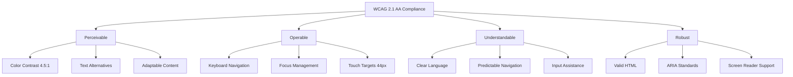

# Accessibility Guidelines

## Overview

This document establishes comprehensive accessibility standards for the Resonant design system, ensuring WCAG 2.1 AA compliance and inclusive user experiences. Our approach combines Headless UI's accessibility primitives with custom implementations to create universally accessible components.

## Accessibility Principles

### Core Standards



### Accessibility Requirements

1. **WCAG 2.1 AA Compliance**: Minimum standard for all components
2. **Keyboard Navigation**: Full functionality without mouse
3. **Screen Reader Support**: Semantic HTML and ARIA attributes
4. **Color Independence**: Information not conveyed by color alone
5. **Touch Accessibility**: Minimum 44px touch targets
6. **Focus Management**: Visible focus indicators and logical flow

## Implementation Standards

### Semantic HTML Foundation

Always start with semantic HTML elements:

```html
<!-- ✅ GOOD: Semantic HTML -->
<button type="button" aria-expanded="false" aria-controls="menu-items">
  Open Menu
</button>
<ul role="menu" id="menu-items" hidden>
  <li><a href="/profile" role="menuitem">Profile</a></li>
  <li><a href="/settings" role="menuitem">Settings</a></li>
</ul>

<!-- ❌ BAD: Generic elements -->
<div onclick="toggleMenu()" class="menu-trigger">Open Menu</div>
<div id="menu-items" style="display: none;">
  <div><a href="/profile">Profile</a></div>
  <div><a href="/settings">Settings</a></div>
</div>
```

### ARIA Patterns Integration

Use established ARIA patterns for complex interactions:

```typescript
// Menu Button Pattern Implementation
export function MenuButton() {
  const [isOpen, setIsOpen] = useState(false);
  const menuRef = useRef<HTMLUListElement>(null);
  const buttonRef = useRef<HTMLButtonElement>(null);

  const handleKeyDown = (event: KeyboardEvent) => {
    switch (event.key) {
      case 'ArrowDown':
        event.preventDefault();
        if (!isOpen) {
          setIsOpen(true);
        }
        // Focus first menu item
        setTimeout(() => {
          const firstItem = menuRef.current?.querySelector('[role="menuitem"]') as HTMLElement;
          firstItem?.focus();
        }, 0);
        break;

      case 'Escape':
        if (isOpen) {
          setIsOpen(false);
          buttonRef.current?.focus();
        }
        break;
    }
  };

  return (
    <>
      <button
        ref={buttonRef}
        type="button"
        aria-expanded={isOpen}
        aria-controls="menu-list"
        aria-haspopup="menu"
        onKeyDown={handleKeyDown}
        onClick={() => setIsOpen(!isOpen)}
        className="inline-flex items-center justify-center rounded-md bg-primary px-4 py-2 text-primary-foreground focus:outline-none focus:ring-2 focus:ring-ring focus:ring-offset-2"
      >
        Menu
        <ChevronDownIcon className={`ml-2 h-4 w-4 transition-transform ${isOpen ? 'rotate-180' : ''}`} />
      </button>

      {isOpen && (
        <ul
          ref={menuRef}
          id="menu-list"
          role="menu"
          aria-labelledby="menu-button"
          className="absolute mt-1 w-56 rounded-md bg-popover shadow-lg ring-1 ring-border"
          onKeyDown={handleMenuKeyDown}
        >
          <MenuItem href="/profile">Profile</MenuItem>
          <MenuItem href="/settings">Settings</MenuItem>
          <MenuItem href="/logout">Sign Out</MenuItem>
        </ul>
      )}
    </>
  );
}
```

### Headless UI Integration

Leverage Headless UI for complex accessibility patterns:

```typescript
// Dialog with proper focus management
import { Dialog, DialogPanel, DialogTitle, DialogDescription } from '@headlessui/react';

export function AccessibleDialog({ isOpen, onClose, title, description, children }) {
  return (
    <Dialog
      open={isOpen}
      onClose={onClose}
      className="relative z-50"
      aria-labelledby="dialog-title"
      aria-describedby="dialog-description"
    >
      {/* Backdrop */}
      <div className="fixed inset-0 bg-background/80 backdrop-blur-sm" aria-hidden="true" />

      {/* Dialog panel */}
      <div className="fixed inset-0 flex items-center justify-center p-4">
        <DialogPanel className="mx-auto max-w-sm rounded-lg bg-card p-6 shadow-lg">
          <DialogTitle className="text-lg font-medium text-card-foreground">
            {title}
          </DialogTitle>

          {description && (
            <DialogDescription className="mt-2 text-sm text-muted-foreground">
              {description}
            </DialogDescription>
          )}

          <div className="mt-4">
            {children}
          </div>
        </DialogPanel>
      </div>
    </Dialog>
  );
}

// Combobox with full keyboard navigation
import { Combobox, ComboboxInput, ComboboxOptions, ComboboxOption } from '@headlessui/react';

export function AccessibleCombobox({ items, value, onChange, placeholder }) {
  const [query, setQuery] = useState('');

  const filteredItems = query === ''
    ? items
    : items.filter(item =>
        item.name.toLowerCase().includes(query.toLowerCase())
      );

  return (
    <Combobox value={value} onChange={onChange}>
      <div className="relative">
        <ComboboxInput
          className="w-full rounded-md border border-input bg-background px-3 py-2 text-sm ring-offset-background placeholder:text-muted-foreground focus:outline-none focus:ring-2 focus:ring-ring focus:ring-offset-2"
          displayValue={(item) => item?.name || ''}
          onChange={(event) => setQuery(event.target.value)}
          placeholder={placeholder}
        />

        <ComboboxOptions className="absolute z-10 mt-1 max-h-60 w-full overflow-auto rounded-md bg-popover py-1 shadow-lg ring-1 ring-border">
          {filteredItems.length === 0 && query !== '' ? (
            <div className="relative cursor-default select-none px-4 py-2 text-muted-foreground">
              Nothing found.
            </div>
          ) : (
            filteredItems.map((item) => (
              <ComboboxOption
                key={item.id}
                value={item}
                className={({ focus }) =>
                  `relative cursor-default select-none py-2 pl-3 pr-4 ${
                    focus ? 'bg-accent text-accent-foreground' : 'text-foreground'
                  }`
                }
              >
                {({ selected, focus }) => (
                  <>
                    <span className={`block truncate ${selected ? 'font-medium' : 'font-normal'}`}>
                      {item.name}
                    </span>
                    {selected && (
                      <span className="absolute inset-y-0 left-0 flex items-center pl-3 text-accent-foreground">
                        <CheckIcon className="h-5 w-5" aria-hidden="true" />
                      </span>
                    )}
                  </>
                )}
              </ComboboxOption>
            ))
          )}
        </ComboboxOptions>
      </div>
    </Combobox>
  );
}
```

## Component-Specific Guidelines

### Form Controls

#### Input Fields

```typescript
// Accessible input with proper labeling and validation
export function AccessibleInput({
  label,
  description,
  error,
  required = false,
  ...props
}: InputProps) {
  const inputId = useId();
  const descriptionId = description ? `${inputId}-description` : undefined;
  const errorId = error ? `${inputId}-error` : undefined;

  return (
    <div className="space-y-2">
      <label
        htmlFor={inputId}
        className="text-sm font-medium text-foreground"
      >
        {label}
        {required && <span aria-label="required" className="text-destructive">*</span>}
      </label>

      {description && (
        <p id={descriptionId} className="text-sm text-muted-foreground">
          {description}
        </p>
      )}

      <input
        id={inputId}
        aria-describedby={[descriptionId, errorId].filter(Boolean).join(' ') || undefined}
        aria-invalid={error ? 'true' : undefined}
        aria-required={required}
        className={`
          w-full rounded-md border bg-background px-3 py-2 text-sm ring-offset-background
          placeholder:text-muted-foreground focus:outline-none focus:ring-2 focus:ring-ring focus:ring-offset-2
          ${error ? 'border-destructive' : 'border-input'}
        `}
        {...props}
      />

      {error && (
        <p id={errorId} role="alert" className="text-sm text-destructive">
          {error}
        </p>
      )}
    </div>
  );
}
```

#### Select Elements

```typescript
// Accessible select with proper labeling
export function AccessibleSelect({
  label,
  description,
  error,
  required = false,
  options,
  ...props
}: SelectProps) {
  const selectId = useId();
  const descriptionId = description ? `${selectId}-description` : undefined;
  const errorId = error ? `${selectId}-error` : undefined;

  return (
    <div className="space-y-2">
      <label
        htmlFor={selectId}
        className="text-sm font-medium text-foreground"
      >
        {label}
        {required && <span aria-label="required" className="text-destructive">*</span>}
      </label>

      {description && (
        <p id={descriptionId} className="text-sm text-muted-foreground">
          {description}
        </p>
      )}

      <select
        id={selectId}
        aria-describedby={[descriptionId, errorId].filter(Boolean).join(' ') || undefined}
        aria-invalid={error ? 'true' : undefined}
        aria-required={required}
        className={`
          w-full rounded-md border bg-background px-3 py-2 text-sm ring-offset-background
          focus:outline-none focus:ring-2 focus:ring-ring focus:ring-offset-2
          ${error ? 'border-destructive' : 'border-input'}
        `}
        {...props}
      >
        {options.map(option => (
          <option key={option.value} value={option.value}>
            {option.label}
          </option>
        ))}
      </select>

      {error && (
        <p id={errorId} role="alert" className="text-sm text-destructive">
          {error}
        </p>
      )}
    </div>
  );
}
```

### Navigation Components

#### Breadcrumb Navigation

```typescript
// Accessible breadcrumb with proper landmarks
export function Breadcrumb({ items }: BreadcrumbProps) {
  return (
    <nav aria-label="Breadcrumb" className="flex" role="navigation">
      <ol className="flex items-center space-x-1">
        {items.map((item, index) => {
          const isLast = index === items.length - 1;

          return (
            <li key={item.href || item.label} className="flex items-center">
              {index > 0 && (
                <ChevronRightIcon
                  className="mx-2 h-4 w-4 text-muted-foreground"
                  aria-hidden="true"
                />
              )}

              {isLast ? (
                <span
                  className="text-sm font-medium text-foreground"
                  aria-current="page"
                >
                  {item.label}
                </span>
              ) : (
                <Link
                  href={item.href}
                  className="text-sm text-muted-foreground hover:text-foreground"
                >
                  {item.label}
                </Link>
              )}
            </li>
          );
        })}
      </ol>
    </nav>
  );
}
```

#### Pagination

```typescript
// Accessible pagination with proper labeling
export function Pagination({ currentPage, totalPages, onPageChange }: PaginationProps) {
  const generatePageNumbers = () => {
    const pages = [];
    const maxVisible = 5;

    // Logic to generate visible page numbers
    for (let i = Math.max(1, currentPage - 2); i <= Math.min(totalPages, currentPage + 2); i++) {
      pages.push(i);
    }

    return pages;
  };

  return (
    <nav aria-label="Pagination Navigation" role="navigation">
      <ul className="flex items-center justify-center space-x-1">
        {/* Previous button */}
        <li>
          <button
            onClick={() => onPageChange(currentPage - 1)}
            disabled={currentPage === 1}
            aria-label="Go to previous page"
            className="rounded-md px-3 py-2 text-sm text-muted-foreground hover:bg-accent hover:text-accent-foreground disabled:opacity-50 disabled:pointer-events-none"
          >
            Previous
          </button>
        </li>

        {/* Page numbers */}
        {generatePageNumbers().map(pageNumber => (
          <li key={pageNumber}>
            <button
              onClick={() => onPageChange(pageNumber)}
              aria-label={`Go to page ${pageNumber}`}
              aria-current={pageNumber === currentPage ? 'page' : undefined}
              className={`
                rounded-md px-3 py-2 text-sm
                ${pageNumber === currentPage
                  ? 'bg-primary text-primary-foreground'
                  : 'text-muted-foreground hover:bg-accent hover:text-accent-foreground'
                }
              `}
            >
              {pageNumber}
            </button>
          </li>
        ))}

        {/* Next button */}
        <li>
          <button
            onClick={() => onPageChange(currentPage + 1)}
            disabled={currentPage === totalPages}
            aria-label="Go to next page"
            className="rounded-md px-3 py-2 text-sm text-muted-foreground hover:bg-accent hover:text-accent-foreground disabled:opacity-50 disabled:pointer-events-none"
          >
            Next
          </button>
        </li>
      </ul>
    </nav>
  );
}
```

### Data Display Components

#### Data Tables

```typescript
// Accessible table with proper headers and navigation
export function AccessibleTable({ data, columns }: TableProps) {
  const [sortColumn, setSortColumn] = useState<string | null>(null);
  const [sortDirection, setSortDirection] = useState<'asc' | 'desc'>('asc');

  const handleSort = (columnKey: string) => {
    if (sortColumn === columnKey) {
      setSortDirection(sortDirection === 'asc' ? 'desc' : 'asc');
    } else {
      setSortColumn(columnKey);
      setSortDirection('asc');
    }
  };

  return (
    <div className="overflow-x-auto">
      <table className="w-full border-collapse" role="table">
        <caption className="sr-only">
          {data.length} items in table. Use arrow keys to navigate.
        </caption>

        <thead>
          <tr>
            {columns.map(column => (
              <th
                key={column.key}
                scope="col"
                className="border-b border-border px-4 py-3 text-left"
              >
                {column.sortable ? (
                  <button
                    onClick={() => handleSort(column.key)}
                    className="flex items-center space-x-1 font-medium text-foreground hover:text-foreground/80"
                    aria-label={`Sort by ${column.label} ${
                      sortColumn === column.key
                        ? sortDirection === 'asc' ? 'descending' : 'ascending'
                        : 'ascending'
                    }`}
                  >
                    <span>{column.label}</span>
                    {sortColumn === column.key && (
                      <span aria-hidden="true">
                        {sortDirection === 'asc' ? '↑' : '↓'}
                      </span>
                    )}
                  </button>
                ) : (
                  <span className="font-medium text-foreground">{column.label}</span>
                )}
              </th>
            ))}
          </tr>
        </thead>

        <tbody>
          {data.map((row, rowIndex) => (
            <tr
              key={row.id}
              className="border-b border-border hover:bg-accent/50"
            >
              {columns.map((column, colIndex) => (
                <td
                  key={column.key}
                  className="px-4 py-3 text-sm text-foreground"
                  {...(colIndex === 0 && { scope: 'row' })}
                >
                  {column.render ? column.render(row[column.key], row) : row[column.key]}
                </td>
              ))}
            </tr>
          ))}
        </tbody>
      </table>
    </div>
  );
}
```

## Keyboard Navigation Patterns

### Standard Key Bindings

```typescript
// Standardized keyboard navigation hook
export function useKeyboardNavigation({
  onEscape,
  onEnter,
  onArrowUp,
  onArrowDown,
  onArrowLeft,
  onArrowRight,
  onTab,
  onSpace,
}: KeyboardNavigationOptions) {
  const handleKeyDown = useCallback((event: KeyboardEvent) => {
    switch (event.key) {
      case 'Escape':
        event.preventDefault();
        onEscape?.();
        break;

      case 'Enter':
        event.preventDefault();
        onEnter?.();
        break;

      case 'ArrowUp':
        event.preventDefault();
        onArrowUp?.();
        break;

      case 'ArrowDown':
        event.preventDefault();
        onArrowDown?.();
        break;

      case 'ArrowLeft':
        event.preventDefault();
        onArrowLeft?.();
        break;

      case 'ArrowRight':
        event.preventDefault();
        onArrowRight?.();
        break;

      case 'Tab':
        // Don't prevent default for Tab unless specifically needed
        onTab?.(event.shiftKey);
        break;

      case ' ':
        event.preventDefault();
        onSpace?.();
        break;
    }
  }, [onEscape, onEnter, onArrowUp, onArrowDown, onArrowLeft, onArrowRight, onTab, onSpace]);

  return { handleKeyDown };
}

// Usage in component
export function KeyboardNavigableList({ items, onSelect }: ListProps) {
  const [focusedIndex, setFocusedIndex] = useState(0);
  const listRef = useRef<HTMLUListElement>(null);

  const { handleKeyDown } = useKeyboardNavigation({
    onArrowDown: () => {
      setFocusedIndex(prev => Math.min(prev + 1, items.length - 1));
    },
    onArrowUp: () => {
      setFocusedIndex(prev => Math.max(prev - 1, 0));
    },
    onEnter: () => {
      onSelect(items[focusedIndex]);
    },
    onSpace: () => {
      onSelect(items[focusedIndex]);
    },
  });

  useEffect(() => {
    const focusedElement = listRef.current?.children[focusedIndex] as HTMLElement;
    focusedElement?.focus();
  }, [focusedIndex]);

  return (
    <ul
      ref={listRef}
      role="listbox"
      aria-activedescendant={`item-${focusedIndex}`}
      onKeyDown={handleKeyDown}
      className="space-y-1"
    >
      {items.map((item, index) => (
        <li
          key={item.id}
          id={`item-${index}`}
          role="option"
          aria-selected={index === focusedIndex}
          tabIndex={index === focusedIndex ? 0 : -1}
          className={`
            cursor-pointer rounded-md px-3 py-2 text-sm
            ${index === focusedIndex
              ? 'bg-accent text-accent-foreground'
              : 'text-foreground hover:bg-accent/50'
            }
          `}
          onClick={() => onSelect(item)}
        >
          {item.label}
        </li>
      ))}
    </ul>
  );
}
```

### Focus Management

```typescript
// Focus management utilities
export function useFocusManagement() {
  const focusableSelectors = [
    'button:not([disabled])',
    'input:not([disabled])',
    'select:not([disabled])',
    'textarea:not([disabled])',
    'a[href]',
    '[tabindex]:not([tabindex="-1"])',
  ].join(', ');

  const getFocusableElements = (container: HTMLElement): HTMLElement[] => {
    return Array.from(container.querySelectorAll(focusableSelectors));
  };

  const trapFocus = (container: HTMLElement) => {
    const focusableElements = getFocusableElements(container);
    const firstElement = focusableElements[0];
    const lastElement = focusableElements[focusableElements.length - 1];

    const handleKeyDown = (event: KeyboardEvent) => {
      if (event.key === 'Tab') {
        if (event.shiftKey) {
          if (document.activeElement === firstElement) {
            event.preventDefault();
            lastElement?.focus();
          }
        } else {
          if (document.activeElement === lastElement) {
            event.preventDefault();
            firstElement?.focus();
          }
        }
      }
    };

    container.addEventListener('keydown', handleKeyDown);
    firstElement?.focus();

    return () => {
      container.removeEventListener('keydown', handleKeyDown);
    };
  };

  const restoreFocus = (previouslyFocused: HTMLElement | null) => {
    if (previouslyFocused && document.contains(previouslyFocused)) {
      previouslyFocused.focus();
    }
  };

  return {
    getFocusableElements,
    trapFocus,
    restoreFocus,
  };
}

// Modal with focus trap
export function AccessibleModal({ isOpen, onClose, children }: ModalProps) {
  const modalRef = useRef<HTMLDivElement>(null);
  const previouslyFocused = useRef<HTMLElement | null>(null);
  const { trapFocus, restoreFocus } = useFocusManagement();

  useEffect(() => {
    if (isOpen) {
      previouslyFocused.current = document.activeElement as HTMLElement;

      const cleanup = modalRef.current ? trapFocus(modalRef.current) : undefined;

      return () => {
        cleanup?.();
        restoreFocus(previouslyFocused.current);
      };
    }
  }, [isOpen, trapFocus, restoreFocus]);

  if (!isOpen) return null;

  return (
    <div
      className="fixed inset-0 z-50 flex items-center justify-center bg-background/80 backdrop-blur-sm"
      onClick={onClose}
    >
      <div
        ref={modalRef}
        role="dialog"
        aria-modal="true"
        aria-labelledby="modal-title"
        className="relative rounded-lg bg-card p-6 shadow-lg"
        onClick={(e) => e.stopPropagation()}
      >
        <button
          onClick={onClose}
          className="absolute right-4 top-4 rounded-sm opacity-70 ring-offset-background transition-opacity hover:opacity-100 focus:outline-none focus:ring-2 focus:ring-ring focus:ring-offset-2"
          aria-label="Close modal"
        >
          <XIcon className="h-4 w-4" />
        </button>
        {children}
      </div>
    </div>
  );
}
```

## Testing and Validation

### Automated Accessibility Testing

```typescript
// Jest + axe-core integration
import { render } from '@testing-library/react';
import { axe, toHaveNoViolations } from 'jest-axe';

expect.extend(toHaveNoViolations);

describe('Button Accessibility', () => {
  it('should not have accessibility violations', async () => {
    const { container } = render(<Button>Test Button</Button>);
    const results = await axe(container);
    expect(results).toHaveNoViolations();
  });

  it('should be keyboard accessible', async () => {
    const handleClick = jest.fn();
    const { getByRole } = render(<Button onClick={handleClick}>Test</Button>);

    const button = getByRole('button');

    // Test focus
    button.focus();
    expect(button).toHaveFocus();

    // Test keyboard activation
    fireEvent.keyDown(button, { key: 'Enter' });
    expect(handleClick).toHaveBeenCalled();

    fireEvent.keyDown(button, { key: ' ' });
    expect(handleClick).toHaveBeenCalledTimes(2);
  });

  it('should have proper ARIA attributes', () => {
    const { getByRole } = render(
      <Button aria-label="Close dialog" aria-expanded="false">
        ×
      </Button>
    );

    const button = getByRole('button');
    expect(button).toHaveAttribute('aria-label', 'Close dialog');
    expect(button).toHaveAttribute('aria-expanded', 'false');
  });
});

// Storybook accessibility testing
import { composeStories } from '@storybook/react';
import * as stories from './button.stories';

const { Default, AllVariants } = composeStories(stories);

describe('Button Stories Accessibility', () => {
  it('Default story should be accessible', async () => {
    const { container } = render(<Default />);
    const results = await axe(container);
    expect(results).toHaveNoViolations();
  });

  it('All variants should be accessible', async () => {
    const { container } = render(<AllVariants />);
    const results = await axe(container);
    expect(results).toHaveNoViolations();
  });
});
```

### Manual Testing Checklist

#### Keyboard Navigation Testing

- [ ] **Tab Navigation**: All interactive elements are reachable via Tab
- [ ] **Focus Indicators**: Visible focus indicators on all focusable elements
- [ ] **Logical Order**: Tab order follows logical reading sequence
- [ ] **Escape Handling**: Escape key closes modals and menus
- [ ] **Arrow Keys**: Arrow keys navigate within components where appropriate
- [ ] **Enter/Space**: Both keys activate buttons and interactive elements

#### Screen Reader Testing

- [ ] **Element Roles**: All elements have appropriate roles
- [ ] **Labels**: All interactive elements have accessible names
- [ ] **Descriptions**: Complex interactions have descriptions
- [ ] **Live Regions**: Dynamic content updates are announced
- [ ] **Landmarks**: Page sections are properly marked up
- [ ] **Headings**: Proper heading hierarchy (h1, h2, h3, etc.)

#### Visual Testing

- [ ] **Color Contrast**: 4.5:1 ratio for normal text, 3:1 for large text
- [ ] **Color Independence**: Information not conveyed by color alone
- [ ] **Focus Indicators**: 2px minimum thickness, 3:1 contrast ratio
- [ ] **Touch Targets**: 44px minimum for touch interfaces
- [ ] **Text Scaling**: Readable at 200% zoom level
- [ ] **Motion**: Respects prefers-reduced-motion setting

### Accessibility Testing Tools

```bash
# Install accessibility testing dependencies
npm install --save-dev @axe-core/react jest-axe @testing-library/jest-dom

# Storybook accessibility addon
npm install --save-dev @storybook/addon-a11y
```

```typescript
// React development mode accessibility checking
import React from 'react'

if (process.env.NODE_ENV === 'development') {
  import('@axe-core/react').then(axe => {
    axe.default(React, ReactDOM, 1000)
  })
}
```

## Common Accessibility Patterns

### Live Regions for Dynamic Content

```typescript
// Live region for status updates
export function LiveRegion({
  message,
  priority = 'polite'
}: {
  message: string;
  priority?: 'polite' | 'assertive'
}) {
  return (
    <div
      aria-live={priority}
      aria-atomic="true"
      className="sr-only"
    >
      {message}
    </div>
  );
}

// Usage in form validation
export function FormWithLiveRegion() {
  const [status, setStatus] = useState('');
  const [errors, setErrors] = useState<string[]>([]);

  const handleSubmit = async (data: FormData) => {
    setStatus('Saving...');
    setErrors([]);

    try {
      await saveData(data);
      setStatus('Saved successfully');
    } catch (error) {
      setErrors(['Failed to save data']);
      setStatus('');
    }
  };

  return (
    <form onSubmit={handleSubmit}>
      {/* Form fields */}

      <LiveRegion message={status} />

      {errors.length > 0 && (
        <div role="alert" className="text-destructive">
          <ul>
            {errors.map((error, index) => (
              <li key={index}>{error}</li>
            ))}
          </ul>
        </div>
      )}
    </form>
  );
}
```

### Skip Links for Navigation

```typescript
// Skip navigation component
export function SkipNavigation() {
  return (
    <a
      href="#main-content"
      className="absolute left-0 top-0 z-50 -translate-y-full transform bg-primary px-4 py-2 text-primary-foreground transition-transform focus:translate-y-0"
    >
      Skip to main content
    </a>
  );
}

// Usage in layout
export function Layout({ children }: { children: React.ReactNode }) {
  return (
    <>
      <SkipNavigation />
      <nav aria-label="Main navigation">
        {/* Navigation content */}
      </nav>
      <main id="main-content" tabIndex={-1}>
        {children}
      </main>
    </>
  );
}
```

### Accessible Icon Usage

```typescript
// Icon component with accessibility options
export function Icon({
  icon: IconComponent,
  label,
  decorative = false,
  className
}: IconProps) {
  if (decorative) {
    return (
      <IconComponent
        className={className}
        aria-hidden="true"
      />
    );
  }

  return (
    <IconComponent
      className={className}
      aria-label={label}
      role="img"
    />
  );
}

// Usage examples
export function IconExamples() {
  return (
    <div>
      {/* Decorative icon */}
      <Button>
        <Icon icon={PlusIcon} decorative />
        Add Item
      </Button>

      {/* Meaningful icon */}
      <Button>
        <Icon icon={TrashIcon} label="Delete item" />
      </Button>

      {/* Icon-only button */}
      <Button aria-label="Close dialog">
        <Icon icon={XIcon} decorative />
      </Button>
    </div>
  );
}
```

## Performance and Accessibility

### Reduced Motion Support

```css
/* Respect user's motion preferences */
@media (prefers-reduced-motion: reduce) {
  *,
  *::before,
  *::after {
    animation-duration: 0.01ms !important;
    animation-iteration-count: 1 !important;
    transition-duration: 0.01ms !important;
    scroll-behavior: auto !important;
  }
}
```

```typescript
// React hook for motion preferences
export function useReducedMotion() {
  const [prefersReducedMotion, setPrefersReducedMotion] = useState(false);

  useEffect(() => {
    const mediaQuery = window.matchMedia('(prefers-reduced-motion: reduce)');
    setPrefersReducedMotion(mediaQuery.matches);

    const handleChange = (event: MediaQueryListEvent) => {
      setPrefersReducedMotion(event.matches);
    };

    mediaQuery.addEventListener('change', handleChange);
    return () => mediaQuery.removeEventListener('change', handleChange);
  }, []);

  return prefersReducedMotion;
}

// Usage in components
export function AnimatedComponent() {
  const prefersReducedMotion = useReducedMotion();

  return (
    <div
      className={`transition-transform duration-300 ${
        prefersReducedMotion ? '' : 'hover:scale-105'
      }`}
    >
      Content
    </div>
  );
}
```

### High Contrast Mode Support

```css
/* Windows High Contrast Mode support */
@media (prefers-contrast: high) {
  .button {
    border: 2px solid ButtonText;
    background: ButtonFace;
    color: ButtonText;
  }

  .button:hover {
    background: Highlight;
    color: HighlightText;
  }

  .button:focus {
    outline: 2px solid ButtonText;
    outline-offset: 2px;
  }
}

/* Forced colors mode */
@media (forced-colors: active) {
  .button {
    forced-color-adjust: none;
    border: 1px solid ButtonText;
    background: ButtonFace;
    color: ButtonText;
  }
}
```

## Documentation and Training

### Accessibility Component Documentation

Each component should include:

1. **Accessibility Features**: What accessibility features are built-in
2. **ARIA Patterns**: Which ARIA patterns are implemented
3. **Keyboard Navigation**: How keyboard navigation works
4. **Screen Reader Behavior**: What screen readers will announce
5. **Usage Guidelines**: How to use the component accessibly
6. **Testing Instructions**: How to test accessibility

### Team Training Resources

1. **Accessibility Fundamentals**: WCAG 2.1 guidelines and principles
2. **Screen Reader Testing**: How to test with NVDA, JAWS, and VoiceOver
3. **Keyboard Navigation**: Comprehensive keyboard testing procedures
4. **Automated Testing**: Setting up and running accessibility tests
5. **Manual Testing**: Checklist-based manual accessibility testing

### Accessibility Review Process

1. **Design Review**: Accessibility considerations in design phase
2. **Code Review**: Accessibility checks in code review process
3. **Testing Requirements**: Mandatory accessibility testing before release
4. **User Testing**: Testing with actual users with disabilities
5. **Ongoing Monitoring**: Regular accessibility audits and updates

---

**Last Updated**: January 2025  
**Version**: 1.0.0  
**Next Review**: February 2025
