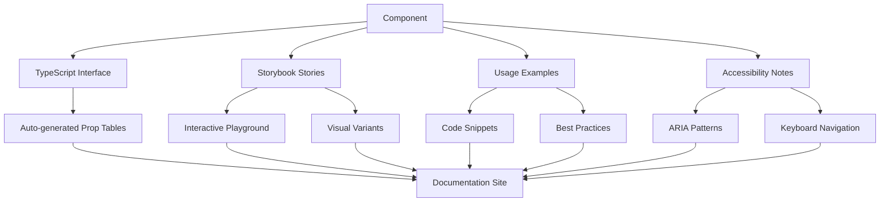

# Component Documentation Standards

## Overview

This document establishes comprehensive standards for documenting React components in the Resonant design system using Storybook 9.0+, TypeScript, and automated tooling. Our documentation approach ensures components are discoverable, understandable, and properly maintained.

## Documentation Architecture

### Documentation Structure



### Required Documentation Components

Each component must include:

1. **Component Definition** - TypeScript interface with JSDoc comments
2. **Storybook Stories** - Interactive examples and variants
3. **Usage Examples** - Real-world implementation patterns
4. **Accessibility Documentation** - ARIA patterns and keyboard support
5. **Design Token Usage** - Which tokens are consumed
6. **Migration Guides** - Version change documentation

## Storybook Configuration

### Project Setup

```typescript
// .storybook/main.ts
import type { StorybookConfig } from '@storybook/nextjs'

const config: StorybookConfig = {
  stories: [
    '../src/**/*.stories.@(js|jsx|ts|tsx|mdx)',
    '../docs/**/*.stories.@(js|jsx|ts|tsx|mdx)',
  ],

  addons: [
    '@storybook/addon-essentials',
    '@storybook/addon-a11y',
    '@storybook/addon-design-tokens',
    '@storybook/addon-docs',
    '@storybook/addon-controls',
    '@storybook/addon-actions',
    '@storybook/addon-viewport',
    '@storybook/addon-backgrounds',
  ],

  framework: {
    name: '@storybook/nextjs',
    options: {},
  },

  typescript: {
    reactDocgen: 'react-docgen-typescript',
    reactDocgenTypescriptOptions: {
      shouldExtractLiteralValuesFromEnum: true,
      shouldRemoveUndefinedFromOptional: true,
      propFilter: prop => {
        // Filter out props from node_modules
        if (prop.parent) {
          return !/node_modules/.test(prop.parent.fileName)
        }
        return true
      },
    },
  },

  docs: {
    autodocs: 'tag',
    defaultName: 'Documentation',
  },

  staticDirs: ['../public'],
}

export default config
```

### Preview Configuration

```typescript
// .storybook/preview.ts
import type { Preview } from '@storybook/react';
import { ThemeProvider } from '../src/components/providers/theme-provider';
import '../src/styles/globals.css';

const preview: Preview = {
  parameters: {
    controls: {
      matchers: {
        color: /(background|color)$/i,
        date: /Date$/,
      },
    },

    docs: {
      theme: {
        base: 'light',
        brandTitle: 'Resonant Design System',
        brandUrl: 'https://resonant.dev',
        brandImage: '/logo.svg',
      },
    },

    backgrounds: {
      default: 'light',
      values: [
        { name: 'light', value: '#ffffff' },
        { name: 'dark', value: '#0f172a' },
        { name: 'gray', value: '#f8fafc' },
      ],
    },

    viewport: {
      viewports: {
        mobile: {
          name: 'Mobile',
          styles: { width: '375px', height: '667px' },
        },
        tablet: {
          name: 'Tablet',
          styles: { width: '768px', height: '1024px' },
        },
        desktop: {
          name: 'Desktop',
          styles: { width: '1280px', height: '720px' },
        },
      },
    },
  },

  decorators: [
    (Story) => (
      <ThemeProvider defaultTheme="light" storageKey="storybook-theme">
        <div className="min-h-screen bg-background text-foreground">
          <Story />
        </div>
      </ThemeProvider>
    ),
  ],

  globalTypes: {
    theme: {
      description: 'Global theme for components',
      defaultValue: 'light',
      toolbar: {
        title: 'Theme',
        icon: 'paintbrush',
        items: [
          { value: 'light', title: 'Light', icon: 'sun' },
          { value: 'dark', title: 'Dark', icon: 'moon' },
        ],
        dynamicTitle: true,
      },
    },
  },
};

export default preview;
```

## Component Documentation Standards

### TypeScript Interface Documentation

Use comprehensive JSDoc comments for all component props:

````typescript
// src/components/ui/button.tsx
import React from 'react';
import { Slot } from '@radix-ui/react-slot';
import { type VariantProps, cva } from 'class-variance-authority';
import { cn } from '@/lib/utils';

const buttonVariants = cva(
  'inline-flex items-center justify-center whitespace-nowrap rounded-md text-sm font-medium transition-colors focus-visible:outline-none focus-visible:ring-2 focus-visible:ring-ring focus-visible:ring-offset-2 disabled:pointer-events-none disabled:opacity-50',
  {
    variants: {
      variant: {
        default: 'bg-primary text-primary-foreground hover:bg-primary/90',
        destructive: 'bg-destructive text-destructive-foreground hover:bg-destructive/90',
        outline: 'border border-input bg-background hover:bg-accent hover:text-accent-foreground',
        secondary: 'bg-secondary text-secondary-foreground hover:bg-secondary/80',
        ghost: 'hover:bg-accent hover:text-accent-foreground',
        link: 'text-primary underline-offset-4 hover:underline',
      },
      size: {
        default: 'h-10 px-4 py-2',
        sm: 'h-9 rounded-md px-3',
        lg: 'h-11 rounded-md px-8',
        icon: 'h-10 w-10',
      },
    },
    defaultVariants: {
      variant: 'default',
      size: 'default',
    },
  }
);

export interface ButtonProps
  extends React.ButtonHTMLAttributes<HTMLButtonElement>,
    VariantProps<typeof buttonVariants> {
  /**
   * Render the button as a child component.
   * Useful for wrapping buttons with Link components.
   * @default false
   * @example
   * <Button asChild>
   *   <Link href="/dashboard">Go to Dashboard</Link>
   * </Button>
   */
  asChild?: boolean;

  /**
   * The visual style variant of the button.
   * @default "default"
   * @example "primary" | "secondary" | "destructive" | "outline" | "ghost" | "link"
   */
  variant?: VariantProps<typeof buttonVariants>['variant'];

  /**
   * The size of the button.
   * @default "default"
   * @example "sm" | "default" | "lg" | "icon"
   */
  size?: VariantProps<typeof buttonVariants>['size'];

  /**
   * Whether the button is in a loading state.
   * When true, shows a loading indicator and disables the button.
   * @default false
   */
  loading?: boolean;

  /**
   * Icon to display before the button text.
   * @example <IconUser />
   */
  leftIcon?: React.ReactNode;

  /**
   * Icon to display after the button text.
   * @example <IconChevronRight />
   */
  rightIcon?: React.ReactNode;
}

/**
 * Button component that provides a clickable element for user interactions.
 *
 * Built on top of HTML button element with enhanced styling and functionality.
 * Supports multiple variants, sizes, and states including loading and disabled.
 *
 * @example
 * ```tsx
 * // Basic usage
 * <Button>Click me</Button>
 *
 * // With variant and size
 * <Button variant="outline" size="lg">Large Outline Button</Button>
 *
 * // With icons
 * <Button leftIcon={<IconUser />}>Profile</Button>
 *
 * // Loading state
 * <Button loading onClick={handleSubmit}>Submit</Button>
 *
 * // As child component
 * <Button asChild>
 *   <Link href="/dashboard">Dashboard</Link>
 * </Button>
 * ```
 *
 * @accessibility
 * - Supports keyboard navigation (Enter and Space keys)
 * - Provides proper focus indication
 * - Maintains semantic button role
 * - Supports aria-* attributes for enhanced accessibility
 *
 * @design-tokens
 * - Uses `--color-primary` for default variant
 * - Uses `--spacing-*` tokens for padding
 * - Uses `--radius-md` for border radius
 * - Uses `--shadow-sm` for focus ring
 */
export const Button = React.forwardRef<HTMLButtonElement, ButtonProps>(
  ({ className, variant, size, asChild = false, loading, leftIcon, rightIcon, disabled, children, ...props }, ref) => {
    const Comp = asChild ? Slot : 'button';

    return (
      <Comp
        className={cn(buttonVariants({ variant, size, className }))}
        ref={ref}
        disabled={disabled || loading}
        {...props}
      >
        {loading && <LoadingSpinner className="mr-2 h-4 w-4" />}
        {leftIcon && !loading && <span className="mr-2">{leftIcon}</span>}
        {children}
        {rightIcon && <span className="ml-2">{rightIcon}</span>}
      </Comp>
    );
  }
);

Button.displayName = 'Button';
````

### Storybook Stories Documentation

Create comprehensive stories with all variants and use cases:

```typescript
// src/components/ui/button.stories.tsx
import type { Meta, StoryObj } from '@storybook/react';
import { action } from '@storybook/addon-actions';
import { within, userEvent, expect } from '@storybook/test';
import { Button } from './button';
import { IconUser, IconChevronRight, IconDownload } from '@/components/icons';

const meta = {
  title: 'UI/Button',
  component: Button,
  parameters: {
    layout: 'centered',
    docs: {
      description: {
        component: `
The Button component is a fundamental UI element that triggers actions when clicked.
It provides multiple visual variants and sizes to fit different use cases and design requirements.

## Features

- **Multiple Variants**: Default, destructive, outline, secondary, ghost, and link styles
- **Flexible Sizing**: Small, default, large, and icon-only sizes
- **Loading States**: Built-in loading indicator with automatic disabling
- **Icon Support**: Left and right icon positioning
- **Accessibility**: Full keyboard navigation and screen reader support
- **Polymorphic**: Can render as different elements using the \`asChild\` prop

## Design Tokens Used

- \`--color-primary\` - Primary button background
- \`--color-primary-foreground\` - Primary button text color
- \`--spacing-*\` - Internal padding and margins
- \`--radius-md\` - Border radius
- \`--transition-colors\` - Hover and focus transitions
        `,
      },
    },
  },
  argTypes: {
    variant: {
      control: { type: 'select' },
      options: ['default', 'destructive', 'outline', 'secondary', 'ghost', 'link'],
      description: 'The visual style variant of the button',
      table: {
        type: { summary: 'string' },
        defaultValue: { summary: 'default' },
      },
    },
    size: {
      control: { type: 'select' },
      options: ['sm', 'default', 'lg', 'icon'],
      description: 'The size of the button',
      table: {
        type: { summary: 'string' },
        defaultValue: { summary: 'default' },
      },
    },
    loading: {
      control: { type: 'boolean' },
      description: 'Whether the button is in a loading state',
      table: {
        type: { summary: 'boolean' },
        defaultValue: { summary: 'false' },
      },
    },
    disabled: {
      control: { type: 'boolean' },
      description: 'Whether the button is disabled',
      table: {
        type: { summary: 'boolean' },
        defaultValue: { summary: 'false' },
      },
    },
    asChild: {
      control: { type: 'boolean' },
      description: 'Render as a child component',
      table: {
        type: { summary: 'boolean' },
        defaultValue: { summary: 'false' },
      },
    },
    onClick: {
      action: 'clicked',
      description: 'Function called when the button is clicked',
      table: {
        type: { summary: '() => void' },
      },
    },
  },
} satisfies Meta<typeof Button>;

export default meta;
type Story = StoryObj<typeof meta>;

// Default story
export const Default: Story = {
  args: {
    children: 'Button',
    onClick: action('button-click'),
  },
};

// All variants showcase
export const Variants: Story = {
  render: () => (
    <div className="flex flex-wrap gap-4">
      <Button variant="default">Default</Button>
      <Button variant="destructive">Destructive</Button>
      <Button variant="outline">Outline</Button>
      <Button variant="secondary">Secondary</Button>
      <Button variant="ghost">Ghost</Button>
      <Button variant="link">Link</Button>
    </div>
  ),
  parameters: {
    docs: {
      description: {
        story: 'All available button variants showcasing different visual styles.',
      },
    },
  },
};

// All sizes showcase
export const Sizes: Story = {
  render: () => (
    <div className="flex items-center gap-4">
      <Button size="sm">Small</Button>
      <Button size="default">Default</Button>
      <Button size="lg">Large</Button>
      <Button size="icon">
        <IconUser />
      </Button>
    </div>
  ),
  parameters: {
    docs: {
      description: {
        story: 'All available button sizes from small to large, including icon-only variant.',
      },
    },
  },
};

// With icons
export const WithIcons: Story = {
  render: () => (
    <div className="flex flex-col gap-4">
      <div className="flex gap-4">
        <Button leftIcon={<IconUser />}>Profile</Button>
        <Button rightIcon={<IconChevronRight />}>Next</Button>
        <Button leftIcon={<IconDownload />} rightIcon={<IconChevronRight />}>
          Download
        </Button>
      </div>
      <div className="flex gap-4">
        <Button variant="outline" leftIcon={<IconUser />}>
          Edit Profile
        </Button>
        <Button variant="ghost" rightIcon={<IconChevronRight />}>
          Continue
        </Button>
      </div>
    </div>
  ),
  parameters: {
    docs: {
      description: {
        story: 'Buttons with left icons, right icons, or both. Icons work with all variants.',
      },
    },
  },
};

// Loading states
export const LoadingStates: Story = {
  render: () => (
    <div className="flex gap-4">
      <Button loading>Loading</Button>
      <Button loading variant="outline">
        Processing
      </Button>
      <Button loading variant="secondary" leftIcon={<IconDownload />}>
        Downloading
      </Button>
    </div>
  ),
  parameters: {
    docs: {
      description: {
        story: 'Buttons in loading state with automatic spinner and disabled interaction.',
      },
    },
  },
};

// Disabled states
export const DisabledStates: Story = {
  render: () => (
    <div className="flex gap-4">
      <Button disabled>Disabled Default</Button>
      <Button disabled variant="outline">
        Disabled Outline
      </Button>
      <Button disabled variant="destructive">
        Disabled Destructive
      </Button>
    </div>
  ),
  parameters: {
    docs: {
      description: {
        story: 'Disabled buttons showing reduced opacity and no interaction capability.',
      },
    },
  },
};

// Interactive playground
export const Playground: Story = {
  args: {
    children: 'Interactive Button',
    variant: 'default',
    size: 'default',
    loading: false,
    disabled: false,
    onClick: action('playground-click'),
  },
  parameters: {
    docs: {
      description: {
        story: 'Interactive playground to test different combinations of props.',
      },
    },
  },
};

// Accessibility test
export const AccessibilityTest: Story = {
  args: {
    children: 'Test Accessibility',
    'aria-label': 'Test button for accessibility',
    'aria-describedby': 'button-description',
  },
  render: (args) => (
    <div>
      <Button {...args} />
      <p id="button-description" className="mt-2 text-sm text-muted-foreground">
        This button demonstrates accessibility features including ARIA attributes.
      </p>
    </div>
  ),
  play: async ({ canvasElement }) => {
    const canvas = within(canvasElement);
    const button = canvas.getByRole('button');

    // Test keyboard interaction
    await userEvent.tab();
    await expect(button).toHaveFocus();

    // Test click interaction
    await userEvent.click(button);

    // Test space key activation
    await userEvent.keyboard(' ');

    // Test enter key activation
    await userEvent.keyboard('{Enter}');
  },
  parameters: {
    docs: {
      description: {
        story: 'Automated accessibility tests ensuring keyboard navigation and ARIA support.',
      },
    },
  },
};

// Real-world usage examples
export const RealWorldExamples: Story = {
  render: () => (
    <div className="space-y-8">
      {/* Form submission */}
      <div className="space-y-4">
        <h3 className="text-lg font-semibold">Form Submission</h3>
        <div className="flex gap-2">
          <Button variant="outline">Cancel</Button>
          <Button>Save Changes</Button>
        </div>
      </div>

      {/* Navigation */}
      <div className="space-y-4">
        <h3 className="text-lg font-semibold">Navigation</h3>
        <div className="flex gap-2">
          <Button variant="ghost" leftIcon={<IconChevronRight className="rotate-180" />}>
            Back
          </Button>
          <Button rightIcon={<IconChevronRight />}>
            Continue
          </Button>
        </div>
      </div>

      {/* Actions */}
      <div className="space-y-4">
        <h3 className="text-lg font-semibold">Actions</h3>
        <div className="flex gap-2">
          <Button variant="destructive">Delete Account</Button>
          <Button variant="outline" leftIcon={<IconDownload />}>
            Export Data
          </Button>
          <Button variant="secondary">Settings</Button>
        </div>
      </div>
    </div>
  ),
  parameters: {
    docs: {
      description: {
        story: 'Real-world usage patterns showing how buttons are used in different contexts.',
      },
    },
  },
};
```

### Auto-generated Documentation

Create MDX documentation files for complex components:

````mdx
<!-- src/components/ui/button.stories.mdx -->

import {
  Canvas,
  Meta,
  ArgTypes,
  Primary,
  Controls,
  Story,
} from '@storybook/blocks'
import * as ButtonStories from './button.stories'

<Meta of={ButtonStories} />

# Button

The Button component is the primary way users trigger actions in the interface.
It provides a consistent, accessible way to handle user interactions across the application.

<Primary />

<Controls />

## Overview

The Button component supports multiple visual variants, sizes, and states to accommodate
different use cases throughout the application. It's built with accessibility in mind
and follows WCAG 2.1 AA guidelines.

### Key Features

- **Semantic HTML**: Built on native `<button>` element
- **Keyboard Navigation**: Full support for keyboard interaction
- **Loading States**: Built-in loading indicators
- **Icon Support**: Flexible icon positioning
- **Polymorphic**: Can render as different elements

## Usage Guidelines

### When to Use

- **Primary Actions**: Use the default variant for the most important action
- **Secondary Actions**: Use outline or secondary variants for supporting actions
- **Destructive Actions**: Use the destructive variant for dangerous operations
- **Navigation**: Use the link variant for navigation between pages

### When Not to Use

- **Navigation**: Use Link components for navigation that doesn't trigger actions
- **Toggle States**: Use Toggle or Switch components for boolean states
- **Multiple Selection**: Use Checkbox or RadioGroup for selection interfaces

## Variants

<Canvas of={ButtonStories.Variants} />

### Default

The primary button style for the most important actions on a page.

### Destructive

Use for dangerous or destructive actions like deleting data.

### Outline

Secondary button style that works well alongside primary buttons.

### Secondary

Alternative secondary style with filled background.

### Ghost

Minimal button style for subtle actions.

### Link

Button that looks like a text link for navigation actions.

## Sizes

<Canvas of={ButtonStories.Sizes} />

### Small

Compact size for dense interfaces or secondary actions.

### Default

Standard size for most use cases.

### Large

Prominent size for important actions or hero sections.

### Icon

Square button optimized for icon-only content.

## States

### Loading

<Canvas of={ButtonStories.LoadingStates} />

Use the loading state to provide feedback during asynchronous operations.
The button automatically becomes disabled and shows a loading spinner.

### Disabled

<Canvas of={ButtonStories.DisabledStates} />

Disabled buttons cannot be interacted with and have reduced visual prominence.

## Icons

<Canvas of={ButtonStories.WithIcons} />

Buttons support icons on the left, right, or both sides of the text content.
Icons should be 16px (1rem) for optimal visual balance.

## Accessibility

The Button component follows WCAG 2.1 AA accessibility guidelines:

- **Keyboard Navigation**: Activates with Space or Enter keys
- **Focus Management**: Visible focus indicators with proper contrast
- **Screen Readers**: Semantic button role with proper labeling
- **Touch Targets**: Minimum 44px touch target size
- **Color Contrast**: 4.5:1 minimum contrast ratio

### ARIA Attributes

```tsx
// Basic accessibility
<Button aria-label="Close dialog">×</Button>

// With description
<Button aria-describedby="delete-description">
  Delete Account
</Button>
<p id="delete-description">This action cannot be undone</p>

// Loading state
<Button loading aria-label="Saving changes">
  Save
</Button>
```
````

## Design Tokens

The Button component uses these design tokens:

| Token                        | Usage                      | Value      |
| ---------------------------- | -------------------------- | ---------- |
| `--color-primary`            | Default button background  | `#3b82f6`  |
| `--color-primary-foreground` | Default button text        | `#ffffff`  |
| `--spacing-4`                | Default padding horizontal | `1rem`     |
| `--spacing-2`                | Default padding vertical   | `0.5rem`   |
| `--radius-md`                | Border radius              | `0.375rem` |
| `--transition-colors`        | Hover/focus transitions    | `150ms`    |

## Examples

### Form Submission

```tsx
function ContactForm() {
  const [isSubmitting, setIsSubmitting] = useState(false)

  return (
    <form onSubmit={handleSubmit}>
      {/* form fields */}
      <div className="flex gap-2 pt-4">
        <Button variant="outline" type="button">
          Cancel
        </Button>
        <Button type="submit" loading={isSubmitting}>
          Send Message
        </Button>
      </div>
    </form>
  )
}
```

### Navigation

```tsx
function NavigationButtons() {
  return (
    <div className="flex justify-between">
      <Button variant="ghost" leftIcon={<IconArrowLeft />}>
        Back to Dashboard
      </Button>
      <Button rightIcon={<IconArrowRight />}>Continue to Next Step</Button>
    </div>
  )
}
```

### Action Groups

```tsx
function ActionButtons() {
  return (
    <div className="flex gap-2">
      <Button variant="destructive">Delete</Button>
      <Button variant="outline" leftIcon={<IconEdit />}>
        Edit
      </Button>
      <Button variant="secondary" leftIcon={<IconShare />}>
        Share
      </Button>
    </div>
  )
}
```

## API Reference

<ArgTypes of={ButtonStories} />

## Related Components

- **Link**: For navigation between pages
- **Toggle**: For boolean state changes
- **Switch**: For settings and preferences
- **Checkbox**: For multiple selection
- **RadioGroup**: For single selection from multiple options

````

## Testing Documentation

### Component Testing Standards

```typescript
// src/components/ui/button.test.tsx
import { render, screen, fireEvent } from '@testing-library/react';
import userEvent from '@testing-library/user-event';
import { Button } from './button';

describe('Button', () => {
  // Basic rendering tests
  describe('Rendering', () => {
    it('renders with correct text content', () => {
      render(<Button>Click me</Button>);
      expect(screen.getByRole('button', { name: 'Click me' })).toBeInTheDocument();
    });

    it('renders all variants correctly', () => {
      const variants = ['default', 'destructive', 'outline', 'secondary', 'ghost', 'link'] as const;

      variants.forEach(variant => {
        const { rerender } = render(<Button variant={variant}>Test</Button>);
        expect(screen.getByRole('button')).toHaveClass(expect.stringContaining(variant));
        rerender(<></>);
      });
    });

    it('renders all sizes correctly', () => {
      const sizes = ['sm', 'default', 'lg', 'icon'] as const;

      sizes.forEach(size => {
        const { rerender } = render(<Button size={size}>Test</Button>);
        expect(screen.getByRole('button')).toHaveClass(expect.stringContaining(size));
        rerender(<></>);
      });
    });
  });

  // Interaction tests
  describe('Interactions', () => {
    it('calls onClick when clicked', async () => {
      const handleClick = jest.fn();
      render(<Button onClick={handleClick}>Click me</Button>);

      await userEvent.click(screen.getByRole('button'));
      expect(handleClick).toHaveBeenCalledTimes(1);
    });

    it('calls onClick when Enter key is pressed', async () => {
      const handleClick = jest.fn();
      render(<Button onClick={handleClick}>Click me</Button>);

      const button = screen.getByRole('button');
      button.focus();
      await userEvent.keyboard('{Enter}');
      expect(handleClick).toHaveBeenCalledTimes(1);
    });

    it('calls onClick when Space key is pressed', async () => {
      const handleClick = jest.fn();
      render(<Button onClick={handleClick}>Click me</Button>);

      const button = screen.getByRole('button');
      button.focus();
      await userEvent.keyboard(' ');
      expect(handleClick).toHaveBeenCalledTimes(1);
    });

    it('does not call onClick when disabled', async () => {
      const handleClick = jest.fn();
      render(<Button disabled onClick={handleClick}>Click me</Button>);

      await userEvent.click(screen.getByRole('button'));
      expect(handleClick).not.toHaveBeenCalled();
    });

    it('does not call onClick when loading', async () => {
      const handleClick = jest.fn();
      render(<Button loading onClick={handleClick}>Click me</Button>);

      await userEvent.click(screen.getByRole('button'));
      expect(handleClick).not.toHaveBeenCalled();
    });
  });

  // Accessibility tests
  describe('Accessibility', () => {
    it('has proper button role', () => {
      render(<Button>Test</Button>);
      expect(screen.getByRole('button')).toBeInTheDocument();
    });

    it('supports aria-label', () => {
      render(<Button aria-label="Close dialog">×</Button>);
      expect(screen.getByLabelText('Close dialog')).toBeInTheDocument();
    });

    it('supports aria-describedby', () => {
      render(
        <>
          <Button aria-describedby="description">Test</Button>
          <p id="description">Button description</p>
        </>
      );
      expect(screen.getByRole('button')).toHaveAttribute('aria-describedby', 'description');
    });

    it('has proper disabled state', () => {
      render(<Button disabled>Test</Button>);
      expect(screen.getByRole('button')).toBeDisabled();
    });

    it('is focusable when not disabled', () => {
      render(<Button>Test</Button>);
      const button = screen.getByRole('button');
      button.focus();
      expect(button).toHaveFocus();
    });

    it('is not focusable when disabled', () => {
      render(<Button disabled>Test</Button>);
      const button = screen.getByRole('button');
      button.focus();
      expect(button).not.toHaveFocus();
    });
  });

  // State tests
  describe('States', () => {
    it('shows loading indicator when loading', () => {
      render(<Button loading>Test</Button>);
      expect(screen.getByTestId('loading-spinner')).toBeInTheDocument();
    });

    it('hides left icon when loading', () => {
      render(<Button loading leftIcon={<span data-testid="left-icon">Icon</span>}>Test</Button>);
      expect(screen.queryByTestId('left-icon')).not.toBeInTheDocument();
    });

    it('renders icons correctly', () => {
      render(
        <Button
          leftIcon={<span data-testid="left-icon">Left</span>}
          rightIcon={<span data-testid="right-icon">Right</span>}
        >
          Test
        </Button>
      );
      expect(screen.getByTestId('left-icon')).toBeInTheDocument();
      expect(screen.getByTestId('right-icon')).toBeInTheDocument();
    });
  });

  // Custom props tests
  describe('Custom Props', () => {
    it('forwards additional props to button element', () => {
      render(<Button data-testid="custom-button" title="Custom title">Test</Button>);
      const button = screen.getByTestId('custom-button');
      expect(button).toHaveAttribute('title', 'Custom title');
    });

    it('merges custom className with default classes', () => {
      render(<Button className="custom-class">Test</Button>);
      const button = screen.getByRole('button');
      expect(button).toHaveClass('custom-class');
      expect(button).toHaveClass('inline-flex'); // Default class
    });
  });
});
````

## Documentation Automation

### Scripts for Documentation Generation

```typescript
// scripts/generate-component-docs.ts
import { promises as fs } from 'fs'
import { glob } from 'glob'
import * as parser from '@typescript-eslint/typescript-estree'

interface ComponentInfo {
  name: string
  path: string
  props: PropInfo[]
  description: string
  examples: string[]
}

interface PropInfo {
  name: string
  type: string
  required: boolean
  defaultValue?: string
  description: string
}

export async function generateComponentDocs() {
  const componentFiles = await glob('src/components/**/*.tsx', {
    ignore: ['**/*.test.tsx', '**/*.stories.tsx'],
  })

  const components: ComponentInfo[] = []

  for (const file of componentFiles) {
    const content = await fs.readFile(file, 'utf-8')
    const componentInfo = parseComponent(content, file)

    if (componentInfo) {
      components.push(componentInfo)
    }
  }

  // Generate markdown documentation
  const docsContent = generateMarkdownDocs(components)
  await fs.writeFile('docs/generated/component-api.md', docsContent)

  // Generate JSON for programmatic access
  await fs.writeFile(
    'docs/generated/component-api.json',
    JSON.stringify(components, null, 2)
  )

  console.log(`Generated documentation for ${components.length} components`)
}

function parseComponent(
  content: string,
  filePath: string
): ComponentInfo | null {
  try {
    const ast = parser.parse(content, {
      loc: true,
      range: true,
      jsx: true,
    })

    // Extract component information from AST
    // This is a simplified example - real implementation would be more complex
    const componentName = extractComponentName(ast)
    const props = extractProps(ast)
    const description = extractDescription(ast)
    const examples = extractExamples(content)

    if (componentName) {
      return {
        name: componentName,
        path: filePath,
        props,
        description,
        examples,
      }
    }

    return null
  } catch (error) {
    console.warn(`Failed to parse ${filePath}:`, error)
    return null
  }
}

function generateMarkdownDocs(components: ComponentInfo[]): string {
  const sections = components.map(
    component => `
# ${component.name}

${component.description}

## Props

| Name | Type | Required | Default | Description |
|------|------|----------|---------|-------------|
${component.props
  .map(
    prop =>
      `| ${prop.name} | \`${prop.type}\` | ${prop.required ? 'Yes' : 'No'} | ${prop.defaultValue || '-'} | ${prop.description} |`
  )
  .join('\n')}

## Examples

${component.examples.map(example => `\`\`\`tsx\n${example}\n\`\`\``).join('\n\n')}

---
`
  )

  return `# Component API Reference

Generated automatically from TypeScript definitions.

${sections.join('\n')}`
}

// Run the generator
if (require.main === module) {
  generateComponentDocs().catch(console.error)
}
```

### Package Scripts

```json
{
  "scripts": {
    "docs:generate": "node scripts/generate-component-docs.ts",
    "docs:build": "npm run docs:generate && storybook build",
    "docs:dev": "storybook dev -p 6006",
    "docs:test": "test-storybook",
    "docs:deploy": "npm run docs:build && gh-pages -d storybook-static"
  }
}
```

## Quality Assurance

### Documentation Checklist

Before marking component documentation as complete, ensure:

- [ ] **TypeScript Interface**: Complete with JSDoc comments
- [ ] **Storybook Stories**: All variants and states covered
- [ ] **Accessibility Notes**: ARIA patterns and keyboard navigation documented
- [ ] **Usage Examples**: Real-world implementation patterns
- [ ] **Design Token Usage**: Which tokens are consumed
- [ ] **Testing**: Unit tests and accessibility tests included
- [ ] **Visual Regression**: Chromatic tests configured
- [ ] **Performance**: Bundle size impact documented

### Automated Quality Checks

```typescript
// .github/workflows/docs-quality.yml
name: Documentation Quality

on:
  pull_request:
    paths:
      - 'src/components/**/*.tsx'
      - 'src/components/**/*.stories.tsx'

jobs:
  check-documentation:
    runs-on: ubuntu-latest
    steps:
      - uses: actions/checkout@v4

      - name: Setup Node.js
        uses: actions/setup-node@v4
        with:
          node-version: 18
          cache: 'npm'

      - name: Install dependencies
        run: npm ci

      - name: Check for missing stories
        run: |
          # Check that every component has a corresponding story file
          for component in src/components/**/*.tsx; do
            if [[ ! "$component" =~ \.(test|stories)\.tsx$ ]]; then
              story_file="${component%.tsx}.stories.tsx"
              if [[ ! -f "$story_file" ]]; then
                echo "Missing story file for $component"
                exit 1
              fi
            fi
          done

      - name: Validate prop documentation
        run: npm run docs:validate

      - name: Build Storybook
        run: npm run docs:build

      - name: Run accessibility tests
        run: npm run docs:test
```

## Best Practices

### Documentation Writing Guidelines

1. **Clear and Concise**: Write for developers who need to implement quickly
2. **Example-Driven**: Show real usage patterns, not just API definitions
3. **Accessibility First**: Document ARIA patterns and keyboard interactions
4. **Visual Examples**: Use Storybook to show all variants and states
5. **Maintenance**: Keep documentation in sync with code changes

### Component Evolution

1. **Version Documentation**: Document breaking changes and migration paths
2. **Deprecation Warnings**: Provide clear timeline for component retirement
3. **Usage Analytics**: Track which components and props are most used
4. **Feedback Loops**: Regular reviews with design and engineering teams

### Performance Considerations

1. **Bundle Impact**: Document the cost of including each component
2. **Lazy Loading**: Use dynamic imports for heavy components
3. **Tree Shaking**: Ensure components can be imported individually
4. **Asset Optimization**: Optimize images and icons used in documentation

---

**Last Updated**: January 2025  
**Version**: 1.0.0  
**Next Review**: February 2025
