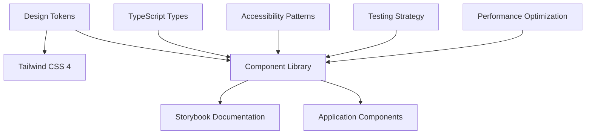

# Component Library & Design System Documentation

## Overview

This document provides comprehensive guidance for developing, maintaining, and using the Resonant application's component library and design system. Built on Next.js 15, React 19, TypeScript, and Tailwind CSS 4, our design system ensures consistency, accessibility, and developer productivity across the entire application.

## Architecture Overview

Our design system follows modern 2025 best practices, combining:

- **Design Tokens**: Semantic naming with Tailwind CSS 4's `@theme` directive
- **Component Architecture**: Composition-first React components with TypeScript
- **Documentation**: Storybook 9.0+ with automated prop tables
- **Accessibility**: WCAG 2.1 AA compliance with Headless UI integration
- **Development Workflow**: Integrated testing, linting, and automated quality gates



## Design System Foundation

### Core Principles

1. **Consistency**: Unified visual language across all touchpoints
2. **Accessibility**: WCAG 2.1 AA compliance by default
3. **Performance**: Optimized for runtime and build performance
4. **Developer Experience**: Type-safe, well-documented, easy to use
5. **Maintainability**: Clear contribution guidelines and automated quality gates

### Technology Stack Integration

- **Tailwind CSS 4**: Utility-first styling with design token integration
- **Headless UI**: Unstyled, accessible component primitives
- **React 19**: Latest React features including concurrent rendering
- **TypeScript 5.8+**: Strict typing with enhanced inference
- **Storybook 9.0+**: Component documentation and testing

## Implementation Guides

This documentation is organized into five detailed implementation guides:

### 1. [Design Tokens & Theming System](./design-system/design-tokens-theming.md)

- Tailwind CSS 4 `@theme` directive implementation
- Semantic token naming conventions
- Dark mode and theme switching
- Token validation and maintenance

### 2. [Component Documentation Standards](./design-system/component-documentation-standards.md)

- Storybook 9.0+ configuration and best practices
- Automated prop table generation
- Interactive examples and playground
- Accessibility documentation requirements

### 3. [Component Architecture Guidelines](./design-system/component-architecture-guidelines.md)

- Modern React component patterns
- TypeScript integration and strict typing
- Composition vs inheritance strategies
- Custom hooks and shared logic

### 4. [Accessibility Guidelines](./design-system/accessibility-guidelines.md)

- WCAG 2.1 AA compliance requirements
- Headless UI integration patterns
- Keyboard navigation and screen reader support
- Testing and validation procedures

### 5. [Usage Examples & Best Practices](./design-system/usage-examples-best-practices.md)

- Real-world implementation examples
- Common patterns and anti-patterns
- Performance optimization techniques
- Migration and adoption strategies

## Quick Start Guide

### Setting Up the Development Environment

1. **Install Dependencies**

   ```bash
   npm install
   npm run storybook:install  # Install Storybook dependencies
   ```

2. **Start Development Servers**

   ```bash
   # Terminal 1: Next.js development server
   npm run dev

   # Terminal 2: Convex backend
   npm run convex:dev

   # Terminal 3: Storybook component library
   npm run storybook
   ```

3. **Access Documentation**
   - Component Library: `http://localhost:6006` (Storybook)
   - Application: `http://localhost:3000`
   - Convex Dashboard: Available during `convex:dev`

### Creating Your First Component

```typescript
// src/components/ui/example-button.tsx
import React from 'react';
import { cn } from '@/lib/utils';

export interface ExampleButtonProps {
  /**
   * The visual style variant of the button
   */
  variant?: 'primary' | 'secondary' | 'ghost';

  /**
   * The size of the button
   */
  size?: 'sm' | 'md' | 'lg';

  /**
   * Whether the button is disabled
   */
  disabled?: boolean;

  /**
   * Button content
   */
  children: React.ReactNode;

  /**
   * Click handler
   */
  onClick?: () => void;
}

export const ExampleButton: React.FC<ExampleButtonProps> = ({
  variant = 'primary',
  size = 'md',
  disabled = false,
  children,
  onClick,
  ...props
}) => {
  const baseClasses = 'inline-flex items-center justify-center font-medium transition-colors focus:outline-none focus:ring-2 focus:ring-offset-2';

  const variantClasses = {
    primary: 'bg-blue-600 text-white hover:bg-blue-700 focus:ring-blue-500',
    secondary: 'bg-gray-200 text-gray-900 hover:bg-gray-300 focus:ring-gray-500',
    ghost: 'text-gray-600 hover:bg-gray-100 focus:ring-gray-500',
  };

  const sizeClasses = {
    sm: 'px-3 py-1.5 text-sm',
    md: 'px-4 py-2 text-base',
    lg: 'px-6 py-3 text-lg',
  };

  return (
    <button
      className={cn(
        baseClasses,
        variantClasses[variant],
        sizeClasses[size],
        disabled && 'opacity-50 cursor-not-allowed'
      )}
      disabled={disabled}
      onClick={onClick}
      {...props}
    >
      {children}
    </button>
  );
};
```

### Component Story Example

```typescript
// src/components/ui/example-button.stories.tsx
import type { Meta, StoryObj } from '@storybook/react';
import { ExampleButton } from './example-button';

const meta: Meta<typeof ExampleButton> = {
  title: 'UI/ExampleButton',
  component: ExampleButton,
  parameters: {
    layout: 'centered',
    docs: {
      description: {
        component: 'A versatile button component with multiple variants and sizes.',
      },
    },
  },
  argTypes: {
    variant: {
      control: { type: 'radio' },
      options: ['primary', 'secondary', 'ghost'],
    },
    size: {
      control: { type: 'radio' },
      options: ['sm', 'md', 'lg'],
    },
  },
} satisfies Meta<typeof ExampleButton>;

export default meta;
type Story = StoryObj<typeof meta>;

export const Primary: Story = {
  args: {
    variant: 'primary',
    children: 'Button',
  },
};

export const Secondary: Story = {
  args: {
    variant: 'secondary',
    children: 'Button',
  },
};

export const AllSizes: Story = {
  render: () => (
    <div className="flex gap-4 items-center">
      <ExampleButton size="sm">Small</ExampleButton>
      <ExampleButton size="md">Medium</ExampleButton>
      <ExampleButton size="lg">Large</ExampleButton>
    </div>
  ),
};
```

## Component Categories

### Base Components (`src/components/ui/`)

- **Button**: Primary action triggers with variants
- **Input**: Form input with validation states
- **Card**: Content containers with consistent styling
- **Badge**: Status indicators and labels
- **Avatar**: User profile images with fallbacks

### Layout Components (`src/components/layout/`)

- **Container**: Responsive content wrappers
- **Grid**: Flexible grid system
- **Stack**: Vertical and horizontal stacking
- **Sidebar**: Navigation and menu layouts

### Feature Components (`src/components/features/`)

- **Journal Components**: Entry creation, editing, display
- **Relationship Components**: Management and visualization
- **Dashboard Components**: Analytics and insights
- **Search Components**: Filtering and results display
- **Notification Components**: Alerts and messaging

### Composite Components

- **Forms**: Complete form implementations
- **Data Tables**: Sortable, filterable data display
- **Navigation**: Menu systems and breadcrumbs
- **Modals**: Dialog and overlay implementations

## Design Token System

### Token Categories

```css
/* Design tokens using Tailwind CSS 4 @theme directive */
@theme {
  /* Colors */
  --color-primary: #3b82f6;
  --color-primary-foreground: #ffffff;
  --color-secondary: #64748b;
  --color-secondary-foreground: #ffffff;
  --color-muted: #f1f5f9;
  --color-muted-foreground: #64748b;

  /* Spacing */
  --spacing-xs: 0.25rem;
  --spacing-sm: 0.5rem;
  --spacing-md: 1rem;
  --spacing-lg: 1.5rem;
  --spacing-xl: 2rem;

  /* Typography */
  --font-size-xs: 0.75rem;
  --font-size-sm: 0.875rem;
  --font-size-base: 1rem;
  --font-size-lg: 1.125rem;
  --font-size-xl: 1.25rem;

  /* Shadows */
  --shadow-sm: 0 1px 2px 0 rgb(0 0 0 / 0.05);
  --shadow-md: 0 4px 6px -1px rgb(0 0 0 / 0.1);
  --shadow-lg: 0 10px 15px -3px rgb(0 0 0 / 0.1);

  /* Border Radius */
  --radius-sm: 0.125rem;
  --radius-md: 0.375rem;
  --radius-lg: 0.5rem;
}
```

### Token Usage

```typescript
// Using tokens in components
const cardClasses = 'bg-background text-foreground rounded-md shadow-md p-md'
const buttonClasses =
  'bg-primary text-primary-foreground px-lg py-sm rounded-sm'
```

## Quality Assurance

### Code Quality Standards

1. **TypeScript Strict Mode**: No `any` types, strict null checks
2. **ESLint Configuration**: Custom rules for design system patterns
3. **Prettier Integration**: Consistent code formatting
4. **Pre-commit Hooks**: Automated quality checks

### Testing Strategy

1. **Unit Tests**: Jest + React Testing Library for component logic
2. **Visual Regression Tests**: Chromatic for UI consistency
3. **Accessibility Tests**: axe-core integration in tests
4. **Performance Tests**: Bundle size and runtime performance monitoring

### Accessibility Requirements

- **WCAG 2.1 AA**: Minimum compliance level
- **Keyboard Navigation**: Full keyboard accessibility
- **Screen Reader Support**: Proper ARIA attributes
- **Color Contrast**: 4.5:1 minimum ratio
- **Focus Management**: Visible focus indicators

## Maintenance and Governance

### Component Lifecycle

1. **Proposal**: RFC process for new components
2. **Design Review**: Figma designs and accessibility audit
3. **Implementation**: TypeScript component with tests
4. **Documentation**: Storybook stories and usage examples
5. **Review**: Code review and accessibility testing
6. **Release**: Semantic versioning and migration guides

### Contribution Guidelines

1. **Follow existing patterns**: Consistent with established components
2. **Write comprehensive tests**: Unit tests and accessibility tests
3. **Document thoroughly**: Storybook stories and prop descriptions
4. **Consider accessibility**: WCAG 2.1 AA compliance from the start
5. **Performance conscious**: Bundle size and runtime performance

### Version Management

- **Semantic Versioning**: Major.Minor.Patch
- **Breaking Change Process**: Deprecation warnings and migration guides
- **Automated Updates**: Dependabot for dependency management
- **Release Notes**: Detailed changelogs with examples

## Performance Considerations

### Bundle Optimization

- **Tree Shaking**: Individual component imports
- **Code Splitting**: Lazy loading for non-critical components
- **Bundle Analysis**: Regular bundle size monitoring
- **Dead Code Elimination**: Automated removal of unused code

### Runtime Performance

- **React.memo**: Memoization for expensive components
- **useMemo/useCallback**: Prevent unnecessary re-renders
- **Lazy Loading**: Virtualization for large lists
- **Image Optimization**: Next.js Image component integration

## Migration and Adoption

### Gradual Adoption Strategy

1. **Start with new features**: Use design system for all new development
2. **Identify high-impact areas**: Components used across multiple pages
3. **Create migration scripts**: Automated component replacement where possible
4. **Provide training**: Developer workshops and documentation
5. **Monitor adoption**: Metrics and feedback collection

### Migration Tools

- **Codemods**: Automated code transformations
- **ESLint Rules**: Enforce design system usage
- **Type Definitions**: Progressive TypeScript adoption
- **Documentation**: Step-by-step migration guides

## Resources and Tools

### Development Tools

- **Storybook**: Component documentation and testing
- **Chromatic**: Visual regression testing
- **Figma**: Design collaboration and token sync
- **TypeScript**: Type safety and developer experience

### External Libraries

- **Headless UI**: Accessible component primitives
- **Tailwind CSS**: Utility-first styling
- **Lucide React**: Consistent icon library
- **Framer Motion**: Animation and transitions

### Useful Links

- [Tailwind CSS Documentation](https://tailwindcss.com)
- [Headless UI Documentation](https://headlessui.com)
- [Storybook Documentation](https://storybook.js.org)
- [WCAG 2.1 Guidelines](https://www.w3.org/WAI/WCAG21/quickref/)

---

**Last Updated**: January 2025  
**Version**: 1.0.0  
**Next Review**: February 2025  
**Maintainers**: Engineering Team
