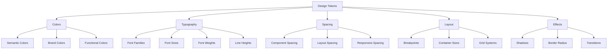

# Design Tokens & Theming System

## Overview

This document outlines the comprehensive design token system for Resonant, built on Tailwind CSS 4's `@theme` directive. Our token system ensures visual consistency, supports dark mode, and provides a scalable foundation for the design system.

## Token Architecture

### Token Categories

Our design tokens are organized into five primary categories:



## Implementation

### Tailwind CSS 4 Integration

Create the main theme configuration using the `@theme` directive:

```css
/* src/styles/theme.css */
@import 'tailwindcss';

@theme {
  /* === COLOR TOKENS === */

  /* Brand Colors */
  --color-brand-primary: #3b82f6;
  --color-brand-secondary: #8b5cf6;
  --color-brand-accent: #10b981;

  /* Semantic Colors */
  --color-primary: var(--color-brand-primary);
  --color-primary-foreground: #ffffff;
  --color-secondary: #64748b;
  --color-secondary-foreground: #ffffff;
  --color-muted: #f1f5f9;
  --color-muted-foreground: #64748b;
  --color-accent: #f1f5f9;
  --color-accent-foreground: #0f172a;

  /* Background Colors */
  --color-background: #ffffff;
  --color-foreground: #0f172a;
  --color-card: #ffffff;
  --color-card-foreground: #0f172a;
  --color-popover: #ffffff;
  --color-popover-foreground: #0f172a;

  /* Border Colors */
  --color-border: #e2e8f0;
  --color-input: #e2e8f0;
  --color-ring: #3b82f6;

  /* Status Colors */
  --color-destructive: #ef4444;
  --color-destructive-foreground: #ffffff;
  --color-warning: #f59e0b;
  --color-warning-foreground: #ffffff;
  --color-success: #10b981;
  --color-success-foreground: #ffffff;
  --color-info: #3b82f6;
  --color-info-foreground: #ffffff;

  /* === TYPOGRAPHY TOKENS === */

  /* Font Families */
  --font-sans: ui-sans-serif, system-ui, sans-serif;
  --font-mono: ui-monospace, 'SF Mono', 'Consolas', monospace;

  /* Font Sizes */
  --font-size-xs: 0.75rem; /* 12px */
  --font-size-sm: 0.875rem; /* 14px */
  --font-size-base: 1rem; /* 16px */
  --font-size-lg: 1.125rem; /* 18px */
  --font-size-xl: 1.25rem; /* 20px */
  --font-size-2xl: 1.5rem; /* 24px */
  --font-size-3xl: 1.875rem; /* 30px */
  --font-size-4xl: 2.25rem; /* 36px */

  /* Font Weights */
  --font-weight-normal: 400;
  --font-weight-medium: 500;
  --font-weight-semibold: 600;
  --font-weight-bold: 700;

  /* Line Heights */
  --line-height-none: 1;
  --line-height-tight: 1.25;
  --line-height-snug: 1.375;
  --line-height-normal: 1.5;
  --line-height-relaxed: 1.625;
  --line-height-loose: 2;

  /* === SPACING TOKENS === */

  /* Base Spacing Scale */
  --spacing-0: 0;
  --spacing-px: 1px;
  --spacing-0_5: 0.125rem; /* 2px */
  --spacing-1: 0.25rem; /* 4px */
  --spacing-1_5: 0.375rem; /* 6px */
  --spacing-2: 0.5rem; /* 8px */
  --spacing-2_5: 0.625rem; /* 10px */
  --spacing-3: 0.75rem; /* 12px */
  --spacing-3_5: 0.875rem; /* 14px */
  --spacing-4: 1rem; /* 16px */
  --spacing-5: 1.25rem; /* 20px */
  --spacing-6: 1.5rem; /* 24px */
  --spacing-7: 1.75rem; /* 28px */
  --spacing-8: 2rem; /* 32px */
  --spacing-9: 2.25rem; /* 36px */
  --spacing-10: 2.5rem; /* 40px */
  --spacing-12: 3rem; /* 48px */
  --spacing-16: 4rem; /* 64px */
  --spacing-20: 5rem; /* 80px */
  --spacing-24: 6rem; /* 96px */
  --spacing-32: 8rem; /* 128px */

  /* Semantic Spacing */
  --spacing-xs: var(--spacing-1);
  --spacing-sm: var(--spacing-2);
  --spacing-md: var(--spacing-4);
  --spacing-lg: var(--spacing-6);
  --spacing-xl: var(--spacing-8);
  --spacing-2xl: var(--spacing-12);

  /* === LAYOUT TOKENS === */

  /* Breakpoints */
  --breakpoint-sm: 640px;
  --breakpoint-md: 768px;
  --breakpoint-lg: 1024px;
  --breakpoint-xl: 1280px;
  --breakpoint-2xl: 1536px;

  /* Container Sizes */
  --container-sm: 640px;
  --container-md: 768px;
  --container-lg: 1024px;
  --container-xl: 1280px;
  --container-2xl: 1536px;

  /* === EFFECTS TOKENS === */

  /* Shadows */
  --shadow-xs: 0 1px 2px 0 rgb(0 0 0 / 0.05);
  --shadow-sm: 0 1px 3px 0 rgb(0 0 0 / 0.1), 0 1px 2px -1px rgb(0 0 0 / 0.1);
  --shadow-md: 0 4px 6px -1px rgb(0 0 0 / 0.1), 0 2px 4px -2px rgb(0 0 0 / 0.1);
  --shadow-lg:
    0 10px 15px -3px rgb(0 0 0 / 0.1), 0 4px 6px -4px rgb(0 0 0 / 0.1);
  --shadow-xl:
    0 20px 25px -5px rgb(0 0 0 / 0.1), 0 8px 10px -6px rgb(0 0 0 / 0.1);
  --shadow-2xl: 0 25px 50px -12px rgb(0 0 0 / 0.25);
  --shadow-inner: inset 0 2px 4px 0 rgb(0 0 0 / 0.05);

  /* Border Radius */
  --radius-none: 0;
  --radius-sm: 0.125rem; /* 2px */
  --radius-base: 0.25rem; /* 4px */
  --radius-md: 0.375rem; /* 6px */
  --radius-lg: 0.5rem; /* 8px */
  --radius-xl: 0.75rem; /* 12px */
  --radius-2xl: 1rem; /* 16px */
  --radius-3xl: 1.5rem; /* 24px */
  --radius-full: 9999px;

  /* Transitions */
  --transition-none: none;
  --transition-all: all 150ms cubic-bezier(0.4, 0, 0.2, 1);
  --transition-colors:
    color, background-color, border-color, text-decoration-color, fill,
    stroke 150ms cubic-bezier(0.4, 0, 0.2, 1);
  --transition-opacity: opacity 150ms cubic-bezier(0.4, 0, 0.2, 1);
  --transition-shadow: box-shadow 150ms cubic-bezier(0.4, 0, 0.2, 1);
  --transition-transform: transform 150ms cubic-bezier(0.4, 0, 0.2, 1);

  /* Animation Durations */
  --duration-75: 75ms;
  --duration-100: 100ms;
  --duration-150: 150ms;
  --duration-200: 200ms;
  --duration-300: 300ms;
  --duration-500: 500ms;
  --duration-700: 700ms;
  --duration-1000: 1000ms;
}
```

### Dark Mode Implementation

Implement dark mode using CSS custom properties and data attributes:

```css
/* Dark Mode Tokens */
@theme {
  /* Dark mode color overrides */
  --color-background: light-dark(#ffffff, #0f172a);
  --color-foreground: light-dark(#0f172a, #f8fafc);
  --color-card: light-dark(#ffffff, #1e293b);
  --color-card-foreground: light-dark(#0f172a, #f8fafc);
  --color-popover: light-dark(#ffffff, #1e293b);
  --color-popover-foreground: light-dark(#0f172a, #f8fafc);
  --color-muted: light-dark(#f1f5f9, #1e293b);
  --color-muted-foreground: light-dark(#64748b, #94a3b8);
  --color-accent: light-dark(#f1f5f9, #1e293b);
  --color-accent-foreground: light-dark(#0f172a, #f8fafc);
  --color-border: light-dark(#e2e8f0, #334155);
  --color-input: light-dark(#e2e8f0, #334155);
}

/* Alternative approach using data attributes */
[data-theme='dark'] {
  --color-background: #0f172a;
  --color-foreground: #f8fafc;
  --color-card: #1e293b;
  --color-card-foreground: #f8fafc;
  --color-popover: #1e293b;
  --color-popover-foreground: #f8fafc;
  --color-muted: #1e293b;
  --color-muted-foreground: #94a3b8;
  --color-accent: #1e293b;
  --color-accent-foreground: #f8fafc;
  --color-border: #334155;
  --color-input: #334155;
}
```

### TypeScript Token Definitions

Create type-safe token definitions:

```typescript
// src/lib/design-tokens.ts

export const designTokens = {
  colors: {
    // Brand colors
    brand: {
      primary: '#3b82f6',
      secondary: '#8b5cf6',
      accent: '#10b981',
    },

    // Semantic colors
    primary: '#3b82f6',
    secondary: '#64748b',
    muted: '#f1f5f9',
    accent: '#f1f5f9',
    destructive: '#ef4444',
    warning: '#f59e0b',
    success: '#10b981',
    info: '#3b82f6',

    // Background colors
    background: '#ffffff',
    foreground: '#0f172a',
    card: '#ffffff',
    popover: '#ffffff',

    // Border colors
    border: '#e2e8f0',
    input: '#e2e8f0',
    ring: '#3b82f6',
  },

  typography: {
    fontFamily: {
      sans: 'ui-sans-serif, system-ui, sans-serif',
      mono: "ui-monospace, 'SF Mono', 'Consolas', monospace",
    },

    fontSize: {
      xs: '0.75rem',
      sm: '0.875rem',
      base: '1rem',
      lg: '1.125rem',
      xl: '1.25rem',
      '2xl': '1.5rem',
      '3xl': '1.875rem',
      '4xl': '2.25rem',
    },

    fontWeight: {
      normal: 400,
      medium: 500,
      semibold: 600,
      bold: 700,
    },

    lineHeight: {
      none: 1,
      tight: 1.25,
      snug: 1.375,
      normal: 1.5,
      relaxed: 1.625,
      loose: 2,
    },
  },

  spacing: {
    0: '0',
    px: '1px',
    0.5: '0.125rem',
    1: '0.25rem',
    1.5: '0.375rem',
    2: '0.5rem',
    2.5: '0.625rem',
    3: '0.75rem',
    3.5: '0.875rem',
    4: '1rem',
    5: '1.25rem',
    6: '1.5rem',
    7: '1.75rem',
    8: '2rem',
    9: '2.25rem',
    10: '2.5rem',
    12: '3rem',
    16: '4rem',
    20: '5rem',
    24: '6rem',
    32: '8rem',

    // Semantic spacing
    xs: '0.25rem',
    sm: '0.5rem',
    md: '1rem',
    lg: '1.5rem',
    xl: '2rem',
    '2xl': '3rem',
  },

  effects: {
    boxShadow: {
      xs: '0 1px 2px 0 rgb(0 0 0 / 0.05)',
      sm: '0 1px 3px 0 rgb(0 0 0 / 0.1), 0 1px 2px -1px rgb(0 0 0 / 0.1)',
      md: '0 4px 6px -1px rgb(0 0 0 / 0.1), 0 2px 4px -2px rgb(0 0 0 / 0.1)',
      lg: '0 10px 15px -3px rgb(0 0 0 / 0.1), 0 4px 6px -4px rgb(0 0 0 / 0.1)',
      xl: '0 20px 25px -5px rgb(0 0 0 / 0.1), 0 8px 10px -6px rgb(0 0 0 / 0.1)',
      '2xl': '0 25px 50px -12px rgb(0 0 0 / 0.25)',
      inner: 'inset 0 2px 4px 0 rgb(0 0 0 / 0.05)',
    },

    borderRadius: {
      none: '0',
      sm: '0.125rem',
      base: '0.25rem',
      md: '0.375rem',
      lg: '0.5rem',
      xl: '0.75rem',
      '2xl': '1rem',
      '3xl': '1.5rem',
      full: '9999px',
    },

    transitionDuration: {
      75: '75ms',
      100: '100ms',
      150: '150ms',
      200: '200ms',
      300: '300ms',
      500: '500ms',
      700: '700ms',
      1000: '1000ms',
    },
  },
} as const

// Type definitions for token usage
export type ColorToken = keyof typeof designTokens.colors
export type SpacingToken = keyof typeof designTokens.spacing
export type FontSizeToken = keyof typeof designTokens.typography.fontSize
export type ShadowToken = keyof typeof designTokens.effects.boxShadow
export type RadiusToken = keyof typeof designTokens.effects.borderRadius
```

## Usage Guidelines

### Token Naming Conventions

Follow these conventions for consistent token usage:

```typescript
// ✅ GOOD: Semantic naming
'bg-primary text-primary-foreground'
'text-muted-foreground'
'border-input'
'shadow-md'

// ❌ BAD: Hard-coded values
'bg-blue-600 text-white'
'text-gray-500'
'border-gray-300'
'shadow-[0_4px_6px_rgba(0,0,0,0.1)]'
```

### Component Token Usage

Use tokens consistently in components:

```typescript
// src/components/ui/button.tsx
import { cn } from '@/lib/utils';
import { type VariantProps, cva } from 'class-variance-authority';

const buttonVariants = cva(
  // Base styles using design tokens
  'inline-flex items-center justify-center transition-colors focus-visible:outline-none focus-visible:ring-2 focus-visible:ring-ring focus-visible:ring-offset-2 disabled:pointer-events-none disabled:opacity-50',
  {
    variants: {
      variant: {
        default: 'bg-primary text-primary-foreground hover:bg-primary/90',
        destructive: 'bg-destructive text-destructive-foreground hover:bg-destructive/90',
        outline: 'border border-input bg-background hover:bg-accent hover:text-accent-foreground',
        secondary: 'bg-secondary text-secondary-foreground hover:bg-secondary/80',
        ghost: 'hover:bg-accent hover:text-accent-foreground',
        link: 'text-primary underline-offset-4 hover:underline',
      },
      size: {
        default: 'h-10 px-4 py-2',
        sm: 'h-9 rounded-md px-3',
        lg: 'h-11 rounded-md px-8',
        icon: 'h-10 w-10',
      },
    },
    defaultVariants: {
      variant: 'default',
      size: 'default',
    },
  }
);

export interface ButtonProps
  extends React.ButtonHTMLAttributes<HTMLButtonElement>,
    VariantProps<typeof buttonVariants> {
  asChild?: boolean;
}

export const Button = React.forwardRef<HTMLButtonElement, ButtonProps>(
  ({ className, variant, size, asChild = false, ...props }, ref) => {
    return (
      <button
        className={cn(buttonVariants({ variant, size, className }))}
        ref={ref}
        {...props}
      />
    );
  }
);
```

### Responsive Token Usage

Use tokens with responsive breakpoints:

```typescript
// Responsive spacing using tokens
const responsiveSpacing = 'p-4 md:p-6 lg:p-8'

// Responsive typography using tokens
const responsiveText = 'text-sm md:text-base lg:text-lg'

// Responsive layout using tokens
const responsiveGrid =
  'grid-cols-1 md:grid-cols-2 lg:grid-cols-3 gap-4 md:gap-6'
```

## Theme Switching Implementation

### React Hook for Theme Management

```typescript
// src/hooks/use-theme.ts
import { createContext, useContext, useEffect, useState } from 'react';

type Theme = 'light' | 'dark' | 'system';

interface ThemeProviderContext {
  theme: Theme;
  setTheme: (theme: Theme) => void;
  actualTheme: 'light' | 'dark';
}

const ThemeProviderContext = createContext<ThemeProviderContext | undefined>(undefined);

export function ThemeProvider({
  children,
  defaultTheme = 'system',
  storageKey = 'resonant-theme',
}: {
  children: React.ReactNode;
  defaultTheme?: Theme;
  storageKey?: string;
}) {
  const [theme, setTheme] = useState<Theme>(() => {
    if (typeof window !== 'undefined') {
      return (localStorage.getItem(storageKey) as Theme) || defaultTheme;
    }
    return defaultTheme;
  });

  const [actualTheme, setActualTheme] = useState<'light' | 'dark'>('light');

  useEffect(() => {
    const root = window.document.documentElement;

    const updateTheme = () => {
      root.classList.remove('light', 'dark');

      let resolvedTheme: 'light' | 'dark';

      if (theme === 'system') {
        resolvedTheme = window.matchMedia('(prefers-color-scheme: dark)').matches
          ? 'dark'
          : 'light';
      } else {
        resolvedTheme = theme;
      }

      root.classList.add(resolvedTheme);
      root.setAttribute('data-theme', resolvedTheme);
      setActualTheme(resolvedTheme);
    };

    updateTheme();

    if (theme === 'system') {
      const mediaQuery = window.matchMedia('(prefers-color-scheme: dark)');
      mediaQuery.addEventListener('change', updateTheme);
      return () => mediaQuery.removeEventListener('change', updateTheme);
    }
  }, [theme]);

  const value = {
    theme,
    setTheme: (theme: Theme) => {
      localStorage.setItem(storageKey, theme);
      setTheme(theme);
    },
    actualTheme,
  };

  return (
    <ThemeProviderContext.Provider value={value}>
      {children}
    </ThemeProviderContext.Provider>
  );
}

export const useTheme = () => {
  const context = useContext(ThemeProviderContext);

  if (context === undefined) {
    throw new Error('useTheme must be used within a ThemeProvider');
  }

  return context;
};
```

### Theme Toggle Component

```typescript
// src/components/theme-toggle.tsx
import { Moon, Sun } from 'lucide-react';
import { Button } from '@/components/ui/button';
import { useTheme } from '@/hooks/use-theme';

export function ThemeToggle() {
  const { theme, setTheme, actualTheme } = useTheme();

  return (
    <Button
      variant="ghost"
      size="icon"
      onClick={() => setTheme(actualTheme === 'light' ? 'dark' : 'light')}
      aria-label={`Switch to ${actualTheme === 'light' ? 'dark' : 'light'} mode`}
    >
      <Sun className="h-4 w-4 rotate-0 scale-100 transition-all dark:-rotate-90 dark:scale-0" />
      <Moon className="absolute h-4 w-4 rotate-90 scale-0 transition-all dark:rotate-0 dark:scale-100" />
    </Button>
  );
}
```

## Token Validation and Maintenance

### Automated Token Validation

```typescript
// scripts/validate-tokens.ts
import { designTokens } from '../src/lib/design-tokens'

interface TokenValidationRule {
  category: string
  rule: (value: any) => boolean
  message: string
}

const validationRules: TokenValidationRule[] = [
  {
    category: 'colors',
    rule: (value: string) =>
      /^#[0-9A-F]{6}$/i.test(value) ||
      value.startsWith('rgb') ||
      value.startsWith('hsl'),
    message: 'Color values must be valid hex, rgb, or hsl values',
  },
  {
    category: 'spacing',
    rule: (value: string) =>
      /^\d+(\.\d+)?(rem|px|em)$/.test(value) || value === '0',
    message: 'Spacing values must be valid CSS units (rem, px, em) or 0',
  },
  {
    category: 'fontSize',
    rule: (value: string) => /^\d+(\.\d+)?(rem|px|em)$/.test(value),
    message: 'Font size values must be valid CSS units (rem, px, em)',
  },
]

export function validateTokens() {
  const errors: string[] = []

  validationRules.forEach(rule => {
    const categoryTokens = (designTokens as any)[rule.category]

    if (categoryTokens) {
      Object.entries(categoryTokens).forEach(([key, value]) => {
        if (typeof value === 'string' && !rule.rule(value)) {
          errors.push(`${rule.category}.${key}: ${rule.message}`)
        } else if (typeof value === 'object') {
          Object.entries(value).forEach(([nestedKey, nestedValue]) => {
            if (typeof nestedValue === 'string' && !rule.rule(nestedValue)) {
              errors.push(
                `${rule.category}.${key}.${nestedKey}: ${rule.message}`
              )
            }
          })
        }
      })
    }
  })

  return errors
}

// Run validation
const errors = validateTokens()
if (errors.length > 0) {
  console.error('Token validation errors:')
  errors.forEach(error => console.error(`  - ${error}`))
  process.exit(1)
} else {
  console.log('✅ All tokens are valid')
}
```

### Token Usage Analytics

```typescript
// scripts/analyze-token-usage.ts
import { glob } from 'glob'
import { readFileSync } from 'fs'

interface TokenUsage {
  token: string
  files: string[]
  count: number
}

export async function analyzeTokenUsage(): Promise<TokenUsage[]> {
  const files = await glob(['src/**/*.{ts,tsx,js,jsx}', '!src/**/*.test.*'])
  const tokenPattern =
    /(?:bg-|text-|border-|shadow-|p-|m-|px-|py-|pt-|pb-|pl-|pr-|mt-|mb-|ml-|mr-|space-|gap-|w-|h-|min-w-|min-h-|max-w-|max-h-|rounded-)([a-zA-Z0-9-]+)/g
  const tokenUsage = new Map<string, TokenUsage>()

  files.forEach(file => {
    const content = readFileSync(file, 'utf-8')
    const matches = content.matchAll(tokenPattern)

    for (const match of matches) {
      const fullToken = match[0]

      if (!tokenUsage.has(fullToken)) {
        tokenUsage.set(fullToken, {
          token: fullToken,
          files: [],
          count: 0,
        })
      }

      const usage = tokenUsage.get(fullToken)!
      if (!usage.files.includes(file)) {
        usage.files.push(file)
      }
      usage.count++
    }
  })

  return Array.from(tokenUsage.values()).sort((a, b) => b.count - a.count)
}

// Generate usage report
analyzeTokenUsage().then(usage => {
  console.log('Token Usage Report:')
  console.log('==================')

  usage.slice(0, 20).forEach(({ token, count, files }) => {
    console.log(`${token}: ${count} uses across ${files.length} files`)
  })

  const unusedTokens = usage.filter(u => u.count === 0)
  if (unusedTokens.length > 0) {
    console.log('\nUnused tokens:')
    unusedTokens.forEach(({ token }) => console.log(`  - ${token}`))
  }
})
```

## Best Practices

### Token Organization

1. **Semantic over Visual**: Use `text-muted-foreground` instead of `text-gray-500`
2. **Consistent Naming**: Follow the established naming conventions
3. **Layered Architecture**: Base tokens → semantic tokens → component tokens
4. **Documentation**: Document the purpose and usage of each token

### Performance Considerations

1. **CSS Custom Properties**: Use for runtime theme switching
2. **Build-time Optimization**: Static analysis for unused token removal
3. **Minimal Bundle Size**: Only include used tokens in production
4. **Cache Efficiency**: Group related tokens for better caching

### Maintenance Strategy

1. **Regular Audits**: Quarterly review of token usage
2. **Deprecation Process**: Gradual phase-out of unused tokens
3. **Version Control**: Semantic versioning for token changes
4. **Migration Guides**: Clear documentation for breaking changes

## Integration with Figma

### Token Sync Process

1. **Export from Figma**: Use Figma Tokens plugin
2. **Transform to Code**: Process tokens through Style Dictionary
3. **Validate Consistency**: Automated validation scripts
4. **Update Documentation**: Regenerate token documentation

### Figma Token Structure

```json
{
  "global": {
    "colors": {
      "brand": {
        "primary": { "value": "#3b82f6", "type": "color" },
        "secondary": { "value": "#8b5cf6", "type": "color" }
      },
      "semantic": {
        "primary": { "value": "{colors.brand.primary}", "type": "color" },
        "background": { "value": "#ffffff", "type": "color" }
      }
    },
    "spacing": {
      "xs": { "value": "4px", "type": "spacing" },
      "sm": { "value": "8px", "type": "spacing" },
      "md": { "value": "16px", "type": "spacing" }
    }
  }
}
```

## Troubleshooting

### Common Issues

1. **Token Not Applied**: Check if the token is properly defined in the theme
2. **Dark Mode Not Working**: Verify theme toggle implementation and CSS classes
3. **Build Errors**: Ensure all custom properties are properly defined
4. **Type Errors**: Update TypeScript definitions when adding new tokens

### Debugging Tools

```typescript
// Token debugging utility
export function debugTokens() {
  const root = document.documentElement
  const computedStyle = getComputedStyle(root)

  const tokens = [
    '--color-primary',
    '--color-background',
    '--spacing-md',
    '--font-size-base',
  ]

  tokens.forEach(token => {
    const value = computedStyle.getPropertyValue(token)
    console.log(`${token}: ${value}`)
  })
}

// Usage in development
if (process.env.NODE_ENV === 'development') {
  ;(window as any).debugTokens = debugTokens
}
```

---

**Last Updated**: January 2025  
**Version**: 1.0.0  
**Next Review**: February 2025
