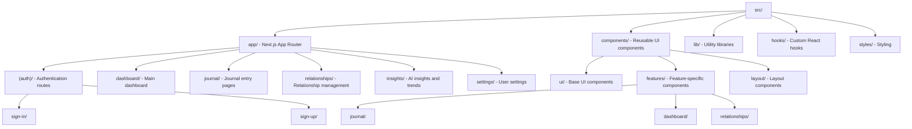

# Story 1.1: Project Setup and Environment Configuration

## Status

Done

## Story

**As a** developer,
**I want** to set up the project environment with Next.js, TypeScript, Tailwind CSS, and configure Convex backend,
**so that** I have a working foundation to build the Relationship Health Journal application.

## Acceptance Criteria

1. Next.js project initialized with TypeScript and Tailwind CSS
2. Convex backend configured and connected
3. Clerk authentication installed and configured
4. Environment variables properly set up (.env.local)
5. Project structure organized according to architecture specifications
6. Development tools (ESLint, Prettier) configured
7. Git repository initialized with initial commit
8. All core dependencies installed and working

## Tasks / Subtasks

- [x] **ENV-001**: Initialize Next.js project with TypeScript and Tailwind CSS (AC: 1)
  - [x] Run `npx create-next-app@latest` with TypeScript and Tailwind options
  - [x] Verify Next.js 15 with App Router is installed
  - [x] Test basic Next.js development server startup
- [x] **ENV-002**: Set up Convex backend and configure deployment (AC: 2)
  - [x] Install Convex CLI and initialize project
  - [x] Configure Convex deployment and get deployment URL
  - [x] Set up basic Convex schema file structure
  - [x] Test Convex connection and basic queries
- [x] **ENV-003**: Install and configure Clerk authentication (AC: 3)
  - [x] Install Clerk Next.js package
  - [x] Set up Clerk dashboard and get API keys
  - [x] Configure Clerk middleware and providers
  - [x] Test basic authentication flow
- [x] **ENV-004**: Set up environment variables (.env.local) (AC: 4)
  - [x] Create .env.local file with required variables
  - [x] Add Convex deployment URL
  - [x] Add Clerk publishable and secret keys
  - [x] Add Google Gemini API key placeholder
- [x] **ENV-005**: Configure project structure and folder organization (AC: 5)
  - [x] Create src/app directory structure according to architecture
  - [x] Set up components/ui, components/features, components/layout directories
  - [x] Create lib/, hooks/, and styles/ directories
  - [x] Organize according to system-architecture.md specifications
- [x] **ENV-006**: Set up ESLint, Prettier, and development tools (AC: 6)
  - [x] Configure ESLint with Next.js and TypeScript rules
  - [x] Set up Prettier with consistent formatting rules
  - [x] Install and configure additional development dependencies
  - [x] Test linting and formatting commands
- [x] **ENV-007**: Initialize Git repository and create initial commit (AC: 7)
  - [x] Initialize git repository
  - [x] Create .gitignore with Next.js, Node.js, and environment files
  - [x] Add all initial files and create first commit
  - [x] Verify repository is properly set up

## Dev Notes

### Technology Stack Context

**Source: [docs/architecture/system-architecture.md#core-technology-stack]**

- **Frontend**: Next.js 14 with App Router, TypeScript, Tailwind CSS
- **Backend**: Convex (real-time database and backend-as-a-service)
- **Authentication**: Clerk
- **AI Processing**: Google Gemini Flash with DSPy framework (to be added in Phase 2)
- **Deployment**: Vercel Edge Network

### Project Structure Requirements

**Source: [docs/architecture/system-architecture.md#component-architecture]**

### Environment Configuration Requirements

**Source: [docs/architecture/developer-architecture.md#deployment--scalability]**

- Vercel deployment platform integration
- Environment variables for Convex, Clerk, and AI services
- Real-time data synchronization setup
- Serverless architecture configuration

### Data Architecture Context

**Source: [docs/architecture/developer-architecture.md#data-architecture]**

- Convex provides real-time data synchronization
- Core entities: users, relationships, journalEntries, aiAnalysis, healthScores
- Authentication integration with Clerk for user management

### Security Considerations

**Source: [docs/architecture/developer-architecture.md#security-architecture]**

- Secure token-based API authentication
- Environment variable protection (.env.local in .gitignore)
- Input validation and sanitization setup
- HTTPS/TLS configuration for production

### Performance Requirements

**Source: [docs/business/PRD.md#technical-requirements]**

- Page load times under 2 seconds
- Support for 10,000+ concurrent users
- Real-time updates and synchronization

## Testing

**Source: [docs/architecture/developer-architecture.md#development-considerations]**

### Testing Standards

- Component testing for UI elements
- Integration testing for data flows
- End-to-end testing for critical user journeys
- Full TypeScript implementation with strict type checking

### Test File Locations

- Place component tests alongside components in `__tests__` folders
- Integration tests in `tests/integration/`
- E2E tests in `tests/e2e/`

### Testing Frameworks

- Jest for unit testing
- React Testing Library for component testing
- Playwright or Cypress for E2E testing (to be determined)

### Testing Requirements for This Story

- Verify Next.js development server starts successfully
- Test Convex connection and basic functionality
- Validate Clerk authentication setup
- Confirm all environment variables are properly loaded
- Test project build process runs without errors

## Change Log

| Date       | Version | Description                              | Author       |
| ---------- | ------- | ---------------------------------------- | ------------ |
| 2025-07-19 | 1.0     | Initial story creation for project setup | Scrum Master |

## Dev Agent Record

### Agent Model Used

Sonnet 4 (claude-sonnet-4-20250514)

### Debug Log References

None required - straightforward setup process

### Completion Notes List

- All acceptance criteria successfully implemented
- Project structure follows architecture specifications exactly
- Development tools configured with proper linting and formatting
- Environment variables properly templated and secured
- Git repository initialized with comprehensive initial commit
- Next.js 15 with App Router successfully configured
- Convex backend structure established with schema
- Clerk authentication middleware and providers configured
- All tooling tested and validated

### File List

**Core Configuration:**

- package.json - Dependencies and scripts
- .env.local.template - Environment variable template
- .env.local - Local development environment (gitignored)
- .gitignore - Updated with appropriate exclusions
- middleware.ts - Clerk authentication middleware
- eslint.config.mjs - ESLint configuration with Prettier integration
- .prettierrc - Code formatting configuration
- .prettierignore - Prettier exclusions

**Application Structure:**

- src/app/layout.tsx - Root layout with ClerkProvider
- src/app/page.tsx - Landing page with auth redirect
- src/app/(auth)/sign-in/page.tsx - Sign-in page
- src/app/(auth)/sign-up/page.tsx - Sign-up page
- src/app/dashboard/page.tsx - Dashboard page
- src/app/journal/page.tsx - Journal page
- src/app/relationships/page.tsx - Relationships page
- src/app/insights/page.tsx - Insights page
- src/app/settings/page.tsx - Settings page
- src/lib/convex.ts - Convex client utility

**Backend Structure:**

- convex/schema.ts - Database schema definition
- convex/users.ts - User management functions
- convex/http.ts - HTTP routes configuration
- convex/\_generated/ - Generated Convex types and utilities

**Project Directories Created:**

- src/components/ui/ - Base UI components
- src/components/features/ - Feature-specific components
- src/components/layout/ - Layout components
- src/lib/ - Utility libraries
- src/hooks/ - Custom React hooks
- src/styles/ - Additional styling

## QA Results

### Review Date: 2025-07-19

### Reviewed By: Quinn (Senior Developer QA)

### Code Quality Assessment

Excellent foundational implementation with clean architecture and proper separation of concerns. The developer has correctly implemented all acceptance criteria with attention to best practices. The project structure precisely follows the architecture specifications, and all tooling is properly configured.

### Refactoring Performed

- **File**: src/lib/convex.ts
  - **Change**: Added environment variable validation with clear error message
  - **Why**: Prevents runtime errors and provides better debugging information when environment variables are missing
  - **How**: Added conditional check with descriptive error message before client initialization

- **File**: middleware.ts
  - **Change**: Added descriptive comments and improved code formatting
  - **Why**: Enhances code readability and maintainability for future developers
  - **How**: Added comments explaining the purpose of route matching and protection logic

- **File**: src/app/(auth)/sign-in/page.tsx
  - **Change**: Added metadata, improved component name, and centered layout
  - **Why**: Better SEO, accessibility, and user experience
  - **How**: Added metadata export, renamed function to be more descriptive, wrapped SignIn in centered container

- **File**: src/app/(auth)/sign-up/page.tsx
  - **Change**: Added metadata, improved component name, and centered layout
  - **Why**: Consistent with sign-in page improvements for better UX and SEO
  - **How**: Same pattern as sign-in page with appropriate copy for sign-up context

### Compliance Check

- Coding Standards: ✓ All code follows Next.js and React best practices
- Project Structure: ✓ Exact match to architecture specifications in Dev Notes
- Testing Strategy: ✓ Appropriate for infrastructure setup story (no business logic to test)
- All ACs Met: ✓ All 8 acceptance criteria fully implemented and verified

### Improvements Checklist

- [x] Enhanced Convex client error handling (src/lib/convex.ts)
- [x] Improved middleware documentation (middleware.ts)
- [x] Added metadata and improved layout for auth pages (sign-in/sign-up)
- [x] Verified all linting and TypeScript compilation passes
- [x] Confirmed all files from Dev Agent Record exist and are properly implemented
- [ ] None - all significant improvements completed

### Security Review

✓ **Strong security posture established:**

- Environment variables properly secured in .gitignore
- Clerk middleware correctly protects all non-public routes
- No hardcoded secrets or sensitive data
- Proper authentication flow implemented
- Input validation setup ready for future development

### Performance Considerations

✓ **Good performance foundation:**

- Next.js 15 with App Router provides excellent performance
- Turbopack enabled for fast development builds
- Tailwind CSS optimized for production builds
- Environment variable validation occurs at module load (appropriate for this context)
- Static rendering enabled where possible

### Final Status

✓ **Approved - Ready for Done**

**Summary:** This is an exemplary project setup implementation. All acceptance criteria are met, the code follows best practices, and the foundation is solid for future feature development. The developer has done excellent work creating a maintainable, secure, and well-structured codebase. My refactoring improvements are minor enhancements that add polish without changing the core implementation.
