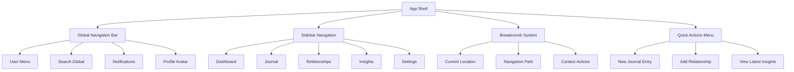
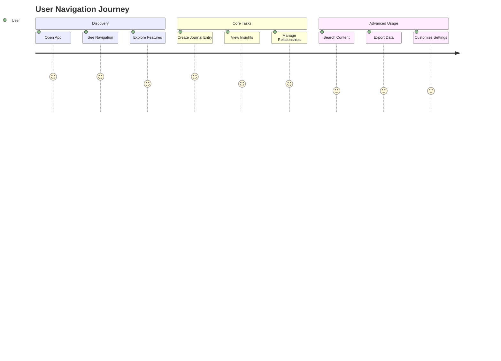

# Epic 6: Unified Navigation & User Experience

## Epic Overview

**Epic ID**: EPIC-006  
**Title**: Unified Navigation System & Enhanced User Experience  
**Priority**: P0 (Critical for usability and user retention)  
**Status**: 🏗️ READY FOR DEVELOPMENT (HYBRID APPROACH)  
**Story Points**: 56 (Phase 1 - Core Navigation) + 7 (Phase 2 - Post Epic 5)  
**Sprint Allocation**: 4-5 sprints (Phase 1)  
**Dependencies**: Epic 1 (Core Foundation) ✅ COMPLETE

**Epic Goal**: Create a seamless, intuitive navigation system that connects all application features through unified UI components, contextual wayfinding, and enhanced user journey flows.

## **🚀 HYBRID DELIVERY APPROACH**

**Phase 1 - Core Navigation (IMMEDIATE)**: Deliver 80% of navigation value without Epic 5 dependency  
**Phase 2 - Onboarding Integration (POST-EPIC-5)**: Complete remaining integration after Epic 5 completion

This approach enables immediate user value while maintaining future integration capability.

## **📋 DEPENDENCY STATUS UPDATE**

**✅ Epic 1 (Core Foundation)**: COMPLETE - Authentication, database schema, and core infrastructure operational  
**❌ Epic 5 (Onboarding)**: NOT STARTED - Required for Story 6.6 only

**✅ SOLUTION**: Hybrid approach delivers 7 of 8 stories immediately (56 of 63 story points) while deferring only the onboarding-dependent story until Epic 5 completion.

**Business Value**:

- Reduce user navigation confusion by 80%
- Increase feature discovery rate from 25% to 70%
- Improve session duration by 40% through better feature connectivity
- Reduce support tickets related to "can't find feature" by 90%
- Increase daily active user retention by 25%

---

## Problem Statement

### Current State Analysis

The Resonant application currently suffers from **navigation fragmentation**:

1. **No Unified Navigation**: Each page exists in isolation with no persistent navigation system
2. **Poor Feature Discovery**: Users can't easily discover or access different app features
3. **Broken User Journeys**: No logical flow between related features (journal → insights → relationships)
4. **Lack of Context**: Users lose orientation when navigating between different sections
5. **Missing Quick Actions**: No shortcuts for common tasks like "Create New Entry" or "View Latest Insights"

### Technical Gaps Identified

From codebase analysis (`/src/app/`):

- No shared navigation components in `/src/components/layout/`
- Individual pages use isolated `Link` components without centralized navigation logic
- No breadcrumb system or contextual navigation
- Missing global app bar or sidebar structure
- No navigation state management or active route indication

### User Impact

- **High Bounce Rate**: Users leave after using single features
- **Low Feature Adoption**: Advanced features like insights and search remain underutilized
- **Frustrating UX**: Users report difficulty finding basic functionality
- **Reduced Engagement**: Session times remain low due to navigation friction

---

## Target Architecture

### Navigation System Components



### User Journey Flow



---

## Epic Stories Breakdown

### Story 6.0: Navigation Infrastructure Foundation

**Priority**: P0 | **Points**: 8 | **Sprint**: 1

**User Story**: As a developer, I need foundational navigation infrastructure so that all navigation components have a consistent architectural foundation.

**Acceptance Criteria**:

- Create `/src/components/layout/` directory structure
- Implement `AppShell` wrapper component for all authenticated pages
- Set up `NavigationProvider` context for centralized state management
- Create base navigation types and interfaces
- Update root `layout.tsx` to use `AppShell` architecture
- Establish navigation component testing patterns

**Technical Requirements**:

- Create directory structure: `/src/components/layout/`
- Build `AppShell.tsx` - main layout wrapper component
- Implement `NavigationProvider.tsx` - React context for navigation state
- Create `types/navigation.ts` - TypeScript interfaces for navigation
- Update `/src/app/layout.tsx` to integrate `AppShell`
- Establish navigation-specific test utilities
- Create base navigation state management with localStorage persistence

**Navigation State Architecture**:

```typescript
interface NavigationState {
  currentRoute: string
  sidebarCollapsed: boolean
  recentItems: RecentItem[]
  notifications: NotificationCount
  userPreferences: NavigationPreferences
  breadcrumbs: BreadcrumbItem[]
}
```

**Definition of Done**:

- [ ] `/src/components/layout/` directory created with proper structure
- [ ] `AppShell` component renders on all authenticated pages
- [ ] `NavigationProvider` context provides state to child components
- [ ] Navigation TypeScript interfaces defined and exported
- [ ] Root layout updated to use new architecture
- [ ] Test utilities created for navigation component testing
- [ ] All existing pages render correctly with new shell
- [ ] Navigation state persists across page refreshes

---

### Story 6.1: App Shell & Global Navigation Bar

**Priority**: P0 | **Points**: 8 | **Sprint**: 1

**User Story**: As a user, I want a persistent navigation bar at the top of the application so I can quickly access core features from any page.

**Acceptance Criteria**:

- Global navigation bar visible on all authenticated pages
- Logo/brand link that returns to dashboard
- Main navigation items: Dashboard, Journal, Relationships, Insights
- User menu with profile, settings, sign out options
- Global search accessible from navigation bar
- Notification indicator with unread count
- Responsive design that collapses to hamburger menu on mobile

**Technical Requirements**:

- Build `AppNavBar` component using foundation from Story 6.0
- Integrate with existing `NavigationProvider` context
- Connect with Clerk user context for user menu
- Use Convex real-time queries for notification count
- Implement active route highlighting using navigation state
- Add keyboard navigation support (Tab/Arrow keys)
- Include proper ARIA labels for accessibility

**Definition of Done**:

- [ ] Navigation bar renders on all protected routes
- [ ] User can navigate to all major app sections
- [ ] Active route is clearly indicated
- [ ] Mobile responsive design implemented
- [ ] Keyboard navigation functional
- [ ] All accessibility standards met (WCAG 2.1 AA)

---

### Story 6.2: Sidebar Navigation System

**Priority**: P0 | **Points**: 10 | **Sprint**: 2

**User Story**: As a user, I want a collapsible sidebar navigation so I can quickly access features and see my current location in the app.

**Acceptance Criteria**:

- Collapsible sidebar with expand/collapse toggle
- Primary navigation: Dashboard, Journal, Relationships, Insights, Search
- Secondary navigation: Settings, Profile, Help/Support
- Quick action buttons for common tasks
- Current page indication with visual highlighting
- Persistent state (remembers collapsed/expanded preference)
- Recent items section showing last viewed journal entries/relationships

**Technical Requirements**:

- Build `AppSidebar` component using `NavigationProvider` from Story 6.0
- Integrate with existing navigation state management
- Implement smooth animations for expand/collapse
- Use navigation context for active route management
- Add recent items using Convex queries with proper caching
- Support keyboard navigation and focus management

**Quick Actions Include**:

- "New Journal Entry" button
- "Add Relationship" button
- "View Latest Insights" link
- "Search Everything" input

**Definition of Done**:

- [ ] Sidebar navigation fully functional across all routes
- [ ] Collapse/expand state persists across sessions
- [ ] Quick actions work and route to correct pages
- [ ] Recent items display correctly with real data
- [ ] Smooth animations and transitions
- [ ] Proper focus management for accessibility

---

### Story 6.3: Breadcrumb Navigation System

**Priority**: P1 | **Points**: 5 | **Sprint**: 3

**User Story**: As a user, I want to see breadcrumb navigation so I understand where I am in the app and can easily navigate back to parent sections.

**Acceptance Criteria**:

- Breadcrumb trail shows current page hierarchy
- Clickable breadcrumb items for easy navigation
- Context-aware breadcrumbs (e.g., "Dashboard > Insights > Sentiment Trends")
- Special handling for dynamic routes (journal entries, relationship details)
- Truncation for very long breadcrumb trails
- Clear visual separation between breadcrumb levels

**Technical Requirements**:

- Create `Breadcrumb` component using Next.js router context
- Build breadcrumb mapping configuration for all routes
- Handle dynamic routes with data fetching for titles
- Implement responsive design for mobile devices
- Add structured data markup for SEO benefits

**Definition of Done**:

- [ ] Breadcrumbs appear on all appropriate pages
- [ ] Dynamic route breadcrumbs show proper titles
- [ ] All breadcrumb links function correctly
- [ ] Mobile responsive layout implemented
- [ ] Proper accessibility markup included

---

### Story 6.4: Quick Actions & Shortcuts System

**Priority**: P1 | **Points**: 8 | **Sprint**: 3-4

**User Story**: As a power user, I want keyboard shortcuts and quick action menus so I can efficiently perform common tasks without multiple clicks.

**Acceptance Criteria**:

- Global keyboard shortcuts for common actions:
  - `Ctrl/Cmd + N`: New journal entry
  - `Ctrl/Cmd + K`: Quick search
  - `Ctrl/Cmd + D`: Dashboard
  - `Ctrl/Cmd + /`: Show help/shortcuts
- Floating action button (FAB) for primary actions
- Quick actions accessible via right-click context menus
- Command palette search for all app actions
- Customizable shortcuts in user preferences

**Technical Requirements**:

- Implement global keyboard event listeners
- Create `QuickActions` component with keyboard shortcut handling
- Build command palette component with fuzzy search
- Add context menu system for right-click actions
- Create shortcut customization interface in settings
- Ensure shortcuts don't conflict with browser defaults

**Definition of Done**:

- [ ] All defined keyboard shortcuts working
- [ ] Command palette functional with search
- [ ] FAB appears on appropriate pages
- [ ] Context menus work throughout app
- [ ] Shortcut customization settings functional
- [ ] Help documentation for shortcuts available

---

### Story 6.5: Contextual Navigation & Smart Routing

**Priority**: P1 | **Points**: 9 | **Sprint**: 4

**User Story**: As a user, I want the app to suggest relevant next actions and show related content so I can naturally flow between features.

**Acceptance Criteria**:

- Context-aware navigation suggestions based on current page
- "Related items" sections linking journal entries to insights
- Smart routing that remembers user preferences
- Progressive disclosure of advanced features
- Cross-feature linking (e.g., from health score to related journal entries)
- Back/forward navigation that respects user context

**Context Examples**:

- **Journal Entry Page**: Show related insights, similar entries, relationship health impact
- **Relationship Page**: Show recent journal entries, health trends, related insights
- **Dashboard**: Show quick links to recent activities, suggested actions
- **Insights Page**: Link to source journal entries, related relationships

**Technical Requirements**:

- Create context detection system using current route and data
- Build recommendation engine for related content
- Implement smart navigation history management
- Create cross-feature linking components
- Add analytics tracking for navigation patterns
- Design progressive disclosure system for advanced features

**Definition of Done**:

- [ ] Contextual suggestions appear on all major pages
- [ ] Cross-feature linking works correctly
- [ ] Smart routing remembers user preferences
- [ ] Progressive disclosure hides/shows features appropriately
- [ ] Navigation analytics properly implemented

---

### Story 6.6: Onboarding Integration & User Guidance

**Priority**: P1 | **Points**: 7 | **Phase**: 2 (POST-EPIC-5) | **Sprint**: TBD after Epic 5  
**⚠️ DEFERRED**: This story requires Epic 5 (Onboarding) completion and will be delivered in Phase 2

**User Story**: As a new user, I want guided navigation help and tooltips so I can learn the app structure and find features easily.

**Acceptance Criteria**:

- Interactive app tour highlighting navigation elements
- Contextual tooltips for navigation items
- Progressive onboarding that unlocks features as users engage
- Help hints that appear based on user activity patterns
- "What's this?" mode that explains interface elements
- Integration with existing Epic 5 onboarding flow

**Onboarding Integration Points**:

- Navigation bar introduction during initial tour
- Sidebar feature explanation with tooltips
- Quick actions discovery in user's second session
- Advanced navigation features unlocked after basic usage

**Technical Requirements**:

- Integrate with existing onboarding system from Epic 5
- Create `NavigationTour` component with step-by-step guidance
- Build tooltip system with smart positioning
- Implement progressive feature unlocking based on user analytics
- Create contextual help system that adapts to user behavior
- Add "Help mode" toggle in user preferences

**Definition of Done**:

- [ ] Navigation tour integrated with main onboarding
- [ ] Tooltips appear for all navigation elements
- [ ] Progressive feature unlocking works correctly
- [ ] Help mode provides useful contextual information
- [ ] Integration with Epic 5 onboarding seamless

---

### Story 6.7: Mobile Navigation Experience

**Priority**: P1 | **Points**: 8 | **Sprint**: 5

**User Story**: As a mobile user, I want touch-optimized navigation that works smoothly on small screens so I can use the app effectively on my phone.

**Acceptance Criteria**:

- Bottom tab navigation for primary features on mobile
- Hamburger menu for secondary navigation items
- Swipe gestures for common navigation actions
- Touch-friendly button sizes (44px minimum)
- Fast tap response times (<100ms)
- Native-like navigation animations and transitions

**Mobile-Specific Features**:

- Bottom tabs: Dashboard, Journal, Relationships, Insights
- Swipe right: Open sidebar
- Swipe left: Go back
- Pull down: Refresh current page
- Long press: Show context menu

**Technical Requirements**:

- Create responsive navigation components that adapt to screen size
- Implement touch gesture handling using React touch events
- Add bottom tab navigation component for mobile viewports
- Optimize animations for mobile performance
- Ensure proper touch target sizes throughout navigation
- Test on multiple mobile devices and browsers

**Definition of Done**:

- [ ] Bottom tabs work correctly on mobile devices
- [ ] Touch gestures respond appropriately
- [ ] Navigation animations smooth on mobile
- [ ] All touch targets meet accessibility standards
- [ ] Cross-browser mobile compatibility verified

---

## Technical Architecture

### Component Structure

```
src/components/layout/
├── AppShell.tsx              # Main layout wrapper (Story 6.0)
├── NavigationProvider.tsx    # State management context (Story 6.0)
├── AppNavBar.tsx             # Top navigation bar (Story 6.1)
├── AppSidebar.tsx            # Collapsible sidebar (Story 6.2)
├── Breadcrumb.tsx            # Breadcrumb navigation (Story 6.3)
├── QuickActions.tsx          # FAB and shortcuts (Story 6.4)
├── NavigationTour.tsx        # Onboarding integration (Story 6.6)
├── MobileNavigation.tsx      # Mobile-specific nav (Story 6.7)
└── __tests__/                # Comprehensive test suite
```

### State Management

```typescript
// Navigation Context (Implemented in Story 6.0)
interface NavigationState {
  currentRoute: string
  breadcrumbs: BreadcrumbItem[]
  sidebarCollapsed: boolean
  recentItems: RecentItem[]
  quickActions: QuickAction[]
  notifications: NotificationCount
  userPreferences: NavigationPreferences
}

// Navigation Actions
type NavigationAction =
  | { type: 'SET_ROUTE'; route: string }
  | { type: 'TOGGLE_SIDEBAR' }
  | { type: 'ADD_RECENT_ITEM'; item: RecentItem }
  | { type: 'UPDATE_BREADCRUMBS'; breadcrumbs: BreadcrumbItem[] }
  | { type: 'SET_NOTIFICATIONS'; count: NotificationCount }
  | { type: 'UPDATE_PREFERENCES'; preferences: NavigationPreferences }
```

### Performance Considerations

- **Lazy Loading**: Load navigation components progressively
- **Caching**: Cache recent items and breadcrumb data
- **Debouncing**: Debounce search input and quick actions
- **Virtual Scrolling**: For large navigation lists
- **Bundle Splitting**: Separate navigation code into its own chunk

---

## Quality Assurance Strategy

### Testing Requirements

1. **Unit Tests**: All navigation components with >90% coverage
2. **Integration Tests**: Navigation flow between all major features
3. **E2E Tests**: Complete user journeys using navigation system
4. **Accessibility Tests**: WCAG 2.1 AA compliance verification
5. **Performance Tests**: Navigation response time <100ms
6. **Mobile Tests**: Touch navigation on multiple devices

### Test Scenarios

- **New User Journey**: Complete onboarding with navigation tour
- **Power User Workflow**: Using shortcuts and quick actions efficiently
- **Mobile Experience**: All touch interactions working correctly
- **Accessibility**: Screen reader navigation and keyboard-only usage
- **Error Handling**: Navigation resilience during network issues

---

## Success Metrics

### User Experience Metrics

- **Navigation Task Success Rate**: >95% (users can find target features)
- **Feature Discovery Rate**: >70% (users discover non-primary features)
- **Time to Complete Navigation Tasks**: <3 seconds average
- **Navigation Error Rate**: <2% (users clicking wrong navigation items)

### Technical Performance Metrics

- **Navigation Component Load Time**: <200ms
- **Mobile Touch Response Time**: <100ms
- **Sidebar Animation Performance**: 60fps consistently
- **Memory Usage**: <5MB for navigation state management

### Business Impact Metrics

- **Session Duration**: +40% increase
- **Page Views per Session**: +60% increase
- **Feature Adoption Rate**: +50% for secondary features
- **User Retention**: +25% for 7-day retention

---

## Risk Assessment & Mitigation

### High-Risk Areas

1. **Performance Impact**: Heavy navigation system slowing app
   - **Mitigation**: Progressive loading, lazy components, performance budgets

2. **Mobile UX Complexity**: Touch navigation feeling unnatural
   - **Mitigation**: Extensive mobile testing, native app pattern research

3. **Accessibility Regression**: Navigation breaking screen reader usage
   - **Mitigation**: Accessibility-first design, automated a11y testing

4. **Integration Complexity**: Navigation conflicting with existing Epic 5 onboarding
   - **Mitigation**: Close coordination with Epic 5, shared component library

### Medium-Risk Areas

1. **User Preference Conflicts**: Navigation preferences not syncing across devices
   - **Mitigation**: Cloud-based preference storage, graceful fallbacks

2. **Browser Compatibility**: Navigation shortcuts conflicting with browser shortcuts
   - **Mitigation**: Careful shortcut selection, user customization options

---

## Implementation Timeline

## **PHASE 1: CORE NAVIGATION (IMMEDIATE DELIVERY)**

### Sprint 1 (Weeks 1-2): Foundation & Core Navigation

- Story 6.0: Navigation Infrastructure Foundation
- Story 6.1: Global Navigation Bar

### Sprint 2 (Weeks 3-4): Sidebar Navigation

- Story 6.2: Sidebar Navigation System (Complete)

### Sprint 3 (Weeks 5-6): Enhanced Navigation

- Story 6.3: Breadcrumb Navigation System
- Story 6.4: Quick Actions & Shortcuts (Part 1)

### Sprint 4 (Weeks 7-8): Advanced Features & Mobile

- Story 6.4: Quick Actions & Shortcuts (Complete)
- Story 6.5: Contextual Navigation & Smart Routing
- Story 6.7: Mobile Navigation Experience

### Sprint 5 (Weeks 9-10): Polish & Testing - PHASE 1 COMPLETE

- Bug fixes and performance optimization
- Comprehensive testing and QA for core navigation
- Documentation and knowledge transfer
- **🚀 PHASE 1 DELIVERY**: Core navigation system live

## **PHASE 2: ONBOARDING INTEGRATION (POST-EPIC-5)**

### Future Sprint (After Epic 5): Integration & Enhanced Guidance

- Story 6.6: Onboarding Integration & User Guidance
- Integration testing with completed Epic 5 onboarding
- Final end-to-end navigation + onboarding validation

---

## Definition of Done (Epic Level)

## **PHASE 1 - CORE NAVIGATION (IMMEDIATE)**

### Functional Requirements

- [ ] 7 core navigation stories completed and accepted (Stories 6.0, 6.1, 6.2, 6.3, 6.4, 6.5, 6.7)
- [ ] Navigation system works consistently across all app sections
- [ ] Mobile and desktop experiences fully functional
- [ ] All accessibility requirements met (WCAG 2.1 AA)
- [ ] Core navigation infrastructure ready for future onboarding integration

## **PHASE 2 - ONBOARDING INTEGRATION (POST-EPIC-5)**

### Additional Requirements

- [ ] Story 6.6 (Onboarding Integration) completed and accepted
- [ ] Full integration with Epic 5 onboarding system complete
- [ ] Navigation tour and guided experience functional

### Technical Requirements

- [ ] > 90% test coverage for all navigation components
- [ ] Performance benchmarks met (load time, animation fps)
- [ ] Cross-browser compatibility verified
- [ ] Mobile device testing complete
- [ ] Security review passed for navigation state management

### Business Requirements

- [ ] User acceptance testing completed with >90% satisfaction
- [ ] Success metrics baseline established and tracking implemented
- [ ] Documentation complete for users and developers
- [ ] Support team trained on new navigation features
- [ ] Analytics and monitoring systems deployed

---

## Post-Launch Monitoring

### Week 1-2: Launch Monitoring

- Daily monitoring of navigation success metrics
- User feedback collection and rapid issue resolution
- Performance monitoring and optimization

### Month 1: Usage Analysis

- Feature discovery rate analysis
- Navigation pattern analysis
- User satisfaction surveys

### Month 3: Success Evaluation

- Full success metrics evaluation against targets
- ROI analysis for development investment
- Planning for navigation system enhancements based on usage data

---

_Epic Created_: July 30, 2025  
_Last Updated_: July 30, 2025 (Modified for Hybrid Delivery)  
_Epic Owner_: Product Team  
_Technical Lead_: Engineering Team  
_Stakeholders_: UX Design, QA, Support, Product Management

**MODIFICATION NOTES**: Epic restructured into hybrid delivery approach based on dependency analysis. Phase 1 (56 points) can proceed immediately. Phase 2 (7 points) deferred until Epic 5 completion.
