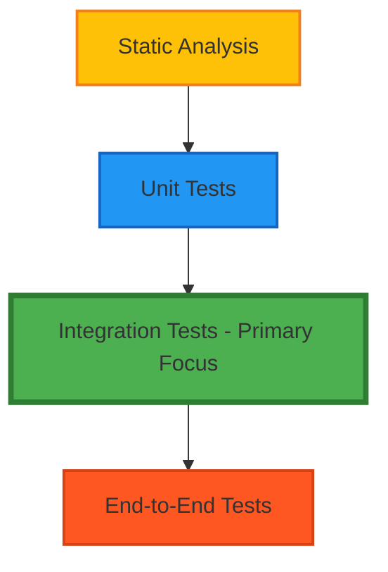

# Testing Strategy & Quality Assurance Documentation

## Overview

This document provides comprehensive guidance for testing and quality assurance practices in the Resonant application. Built on Next.js 15, React 19, TypeScript, and Convex, our testing strategy ensures code quality, performance, accessibility, and maintainability while supporting rapid development workflows.

## Testing Philosophy & Architecture

Our testing approach follows the modern "Testing Trophy" model, optimized for React applications in 2025:



### Test Distribution Strategy

- **Static Analysis**: TypeScript, ESLint, Prettier (Foundation - 100% automated)
- **Unit Tests**: 20% - Individual functions, hooks, and utilities
- **Integration Tests**: 60% - Component interactions and user workflows
- **End-to-End Tests**: 20% - Critical user journeys and cross-browser testing

## Technology Stack

### Core Testing Technologies

- **Jest 29.7+**: Test runner with enhanced TypeScript support
- **React Testing Library**: User-centric component testing
- **Playwright**: Cross-browser E2E testing with modern APIs
- **MSW (Mock Service Worker)**: API mocking and contract testing
- **Convex Testing**: Real-time backend function testing

### Quality Assurance Tools

- **ESLint**: Code quality and consistency enforcement
- **Prettier**: Automated code formatting
- **TypeScript**: Static type checking and inference
- **Husky**: Git hooks for pre-commit quality gates
- **SonarCloud**: Continuous code quality monitoring

## Implementation Guides

This documentation is organized into detailed implementation guides:

### 1. [Unit Testing Standards & Patterns](./testing/unit-testing-standards.md)
- Jest configuration and best practices
- React Testing Library component testing
- Custom hook testing strategies
- Utility function testing patterns

### 2. [Integration & E2E Testing Strategies](./testing/integration-e2e-testing.md)
- Playwright configuration and usage
- Cross-browser testing strategies
- API integration testing with MSW
- Convex backend testing patterns

### 3. [Quality Assurance Processes & Tools](./testing/quality-assurance-processes.md)
- Automated code review workflows
- Pre-commit hooks and CI/CD integration
- Security and dependency scanning
- Performance and accessibility testing

## Quick Start Guide

### Development Environment Setup

1. **Install Testing Dependencies**
   ```bash
   npm install # All testing dependencies included
   ```

2. **Run Development Tests**
   ```bash
   # Unit and integration tests
   npm test                    # Watch mode
   npm run test:ci            # CI mode with coverage
   
   # E2E tests
   npm run test:e2e           # Standard Playwright tests
   npm run test:e2e:headed    # Visual debugging mode
   ```

3. **Quality Checks**
   ```bash
   npm run typecheck          # TypeScript validation
   npm run lint               # ESLint checking
   npm run format:check       # Prettier formatting
   ```

### Test File Organization

```
src/
├── components/
│   ├── ui/
│   │   ├── button.tsx
│   │   ├── button.test.tsx
│   │   └── button.stories.tsx
│   └── features/
│       ├── journal/
│       │   ├── journal-entry-card.tsx
│       │   ├── journal-entry-card.test.tsx
│       │   └── __tests__/
│       │       └── journal-workflows.test.tsx
├── hooks/
│   ├── use-auto-save.ts
│   └── __tests__/
│       └── use-auto-save.test.ts
├── lib/
│   ├── utils.ts
│   └── __tests__/
│       └── utils.test.ts
└── __tests__/
    ├── setup.ts
    └── test-utils.tsx

tests/
├── e2e/
│   ├── auth/
│   │   └── authentication.spec.ts
│   ├── journal/
│   │   └── journal-workflows.spec.ts
│   └── visual/
│       └── visual-regression.spec.ts
└── fixtures/
    └── test-data.ts
```

## Core Testing Patterns

### Component Testing Example

```typescript
// src/components/ui/button.test.tsx
import React from 'react'
import { render, screen } from '@testing-library/react'
import userEvent from '@testing-library/user-event'
import { Button } from './button'

describe('Button Component', () => {
  it('renders with correct text', () => {
    render(<Button>Click me</Button>)
    expect(screen.getByRole('button', { name: 'Click me' })).toBeInTheDocument()
  })

  it('handles click events', async () => {
    const handleClick = jest.fn()
    const user = userEvent.setup()
    
    render(<Button onClick={handleClick}>Click me</Button>)
    
    await user.click(screen.getByRole('button'))
    expect(handleClick).toHaveBeenCalledTimes(1)
  })

  it('supports keyboard navigation', async () => {
    const handleClick = jest.fn()
    const user = userEvent.setup()
    
    render(<Button onClick={handleClick}>Click me</Button>)
    
    const button = screen.getByRole('button')
    button.focus()
    
    await user.keyboard('{Enter}')
    expect(handleClick).toHaveBeenCalled()
  })
})
```

### E2E Testing Example

```typescript
// tests/e2e/journal/journal-creation.spec.ts
import { test, expect } from '@playwright/test'

test.describe('Journal Entry Creation', () => {
  test('user can create a new journal entry', async ({ page }) => {
    await page.goto('/journal/new')
    
    // Fill out the journal entry form
    await page.fill('textarea[name="content"]', 'Today was a great day!')
    await page.selectOption('[data-testid="mood-selector"]', 'happy')
    await page.click('[data-testid="tag-input"]')
    await page.keyboard.type('reflection')
    await page.keyboard.press('Enter')
    
    // Submit the form
    await page.click('button[type="submit"]')
    
    // Verify entry was created
    await expect(page).toHaveURL(/\/journal\/[a-zA-Z0-9]+/)
    await expect(page.locator('[data-testid="journal-content"]')).toContainText('Today was a great day!')
    await expect(page.locator('[data-testid="mood-display"]')).toContainText('😊')
  })
})
```

## Testing Configuration

### Jest Configuration

```javascript
// jest.config.js
const nextJest = require('next/jest')

const createJestConfig = nextJest({
  dir: './',
})

const customJestConfig = {
  setupFilesAfterEnv: ['<rootDir>/jest.setup.js'],
  testEnvironment: 'jsdom',
  
  // Coverage configuration
  collectCoverage: true,
  collectCoverageFrom: [
    'src/**/*.{js,jsx,ts,tsx}',
    '!src/**/*.d.ts',
    '!src/**/__tests__/**',
    '!src/**/*.stories.tsx',
  ],
  
  coverageThreshold: {
    global: {
      branches: 80,
      functions: 80,
      lines: 80,
      statements: 80,
    },
    './src/components/': {
      branches: 85,
      functions: 85,
      lines: 85,
      statements: 85,
    },
  },
  
  // Module mapping for absolute imports
  moduleNameMapping: {
    '^@/(.*)$': '<rootDir>/src/$1',
  },
  
  testPathIgnorePatterns: ['<rootDir>/.next/', '<rootDir>/node_modules/'],
}

module.exports = createJestConfig(customJestConfig)
```

### Playwright Configuration

```typescript
// playwright.config.ts
import { defineConfig, devices } from '@playwright/test'

export default defineConfig({
  testDir: './tests/e2e',
  fullyParallel: true,
  forbidOnly: !!process.env.CI,
  retries: process.env.CI ? 2 : 0,
  workers: process.env.CI ? 1 : undefined,
  reporter: 'html',
  
  use: {
    baseURL: 'http://localhost:3000',
    trace: 'on-first-retry',
    screenshot: 'only-on-failure',
  },
  
  projects: [
    {
      name: 'chromium',
      use: { ...devices['Desktop Chrome'] },
    },
    {
      name: 'firefox',
      use: { ...devices['Desktop Firefox'] },
    },
    {
      name: 'webkit',
      use: { ...devices['Desktop Safari'] },
    },
    {
      name: 'Mobile Chrome',
      use: { ...devices['Pixel 5'] },
    },
  ],
  
  webServer: {
    command: 'npm run dev',
    url: 'http://localhost:3000',
    reuseExistingServer: !process.env.CI,
  },
})
```

## Quality Metrics & Coverage

### Coverage Standards

- **Minimum Global Coverage**: 80% (branches, functions, lines, statements)
- **Critical Components**: 85% coverage requirement
- **Utilities & Hooks**: 90% coverage requirement
- **Coverage Reports**: Generated in HTML, LCOV, and JSON formats

### Quality Gates

1. **Pre-commit**: ESLint, Prettier, TypeScript, related tests
2. **CI Pipeline**: Full test suite, coverage thresholds, build verification
3. **Pre-deployment**: E2E tests, performance audits, accessibility checks
4. **Post-deployment**: Smoke tests, monitoring alerts

## Continuous Integration

### GitHub Actions Workflow

```yaml
# .github/workflows/testing.yml
name: Testing Pipeline

on: [push, pull_request]

jobs:
  unit-tests:
    runs-on: ubuntu-latest
    steps:
      - uses: actions/checkout@v4
      - uses: actions/setup-node@v4
        with:
          node-version: '20'
          cache: 'npm'
      - run: npm ci
      - run: npm run test:ci
      - uses: codecov/codecov-action@v3

  e2e-tests:
    runs-on: ubuntu-latest
    steps:
      - uses: actions/checkout@v4
      - uses: actions/setup-node@v4
      - run: npm ci
      - run: npx playwright install --with-deps
      - run: npm run test:e2e

  quality-checks:
    runs-on: ubuntu-latest
    steps:
      - uses: actions/checkout@v4
      - run: npm ci
      - run: npm run typecheck
      - run: npm run lint
      - run: npm run format:check
```

## Accessibility Testing

### Automated Accessibility Testing

```typescript
// jest.setup.js
import 'jest-axe/extend-expect'
import '@testing-library/jest-dom'

// Component test example with accessibility
import { axe, toHaveNoViolations } from 'jest-axe'

test('component should be accessible', async () => {
  const { container } = render(<MyComponent />)
  const results = await axe(container)
  expect(results).toHaveNoViolations()
})
```

### Playwright Accessibility Testing

```typescript
// tests/e2e/accessibility/a11y.spec.ts
import { test, expect } from '@playwright/test'
import AxeBuilder from '@axe-core/playwright'

test('dashboard should be accessible', async ({ page }) => {
  await page.goto('/dashboard')
  
  const accessibilityScanResults = await new AxeBuilder({ page })
    .withTags(['wcag2a', 'wcag2aa', 'wcag21aa'])
    .analyze()
  
  expect(accessibilityScanResults.violations).toEqual([])
})
```

## Performance Testing

### Lighthouse CI Integration

```javascript
// .lighthouserc.js
module.exports = {
  ci: {
    collect: {
      url: ['http://localhost:3000', 'http://localhost:3000/dashboard'],
      startServerCommand: 'npm run start',
    },
    assert: {
      assertions: {
        'categories:performance': ['error', { minScore: 0.8 }],
        'categories:accessibility': ['error', { minScore: 0.9 }],
        'first-contentful-paint': ['error', { maxNumericValue: 2000 }],
        'largest-contentful-paint': ['error', { maxNumericValue: 2500 }],
      },
    },
  },
}
```

## Security Testing

### Dependency Security

```bash
# Security audit commands
npm audit                    # Check for vulnerabilities
npm run test:security       # Custom security test suite
npx better-npm-audit        # Enhanced security checking
```

### Content Security Policy Testing

```typescript
// Security test example
test('app should have secure headers', async ({ page }) => {
  const response = await page.goto('/')
  const csp = response?.headers()['content-security-policy']
  expect(csp).toContain("default-src 'self'")
})
```

## Best Practices

### Testing Principles

1. **User-Centric**: Test behavior users will experience
2. **Fast Feedback**: Prioritize quick, reliable tests
3. **Maintainable**: Write tests that are easy to understand and modify
4. **Isolated**: Each test should be independent and repeatable
5. **Realistic**: Use real data and scenarios when possible

### Common Anti-patterns to Avoid

- Testing implementation details instead of behavior
- Overusing mocks when integration tests provide more value
- Writing tests that are more complex than the code they test
- Ignoring accessibility and performance testing
- Skipping edge cases and error scenarios

## Troubleshooting

### Common Issues

1. **Flaky Tests**: Use proper waiting mechanisms and avoid time-based assertions
2. **Slow Test Suite**: Optimize setup/teardown and use parallel execution
3. **Coverage Gaps**: Focus on business logic and user interactions
4. **CI Failures**: Ensure environment consistency and proper resource allocation

### Debugging Tools

- **Jest Debug Mode**: `npm test -- --detectOpenHandles --forceExit`
- **Playwright Debug**: `npm run test:e2e -- --debug`
- **Coverage Reports**: `open coverage/lcov-report/index.html`
- **Test Results**: HTML reports available after E2E test runs

## Migration and Adoption

### Gradual Implementation

1. **Phase 1**: Set up core testing infrastructure (Jest, RTL, Playwright)
2. **Phase 2**: Add tests for new features and critical paths
3. **Phase 3**: Backfill tests for existing components
4. **Phase 4**: Implement advanced testing strategies (visual, performance)

### Team Training

- Regular testing workshops and knowledge sharing
- Code review focus on test quality and coverage
- Documentation and examples for common testing patterns
- Mentoring for complex testing scenarios

---

**Last Updated**: January 2025  
**Version**: 1.0.0  
**Next Review**: February 2025  
**Maintainers**: Engineering Team