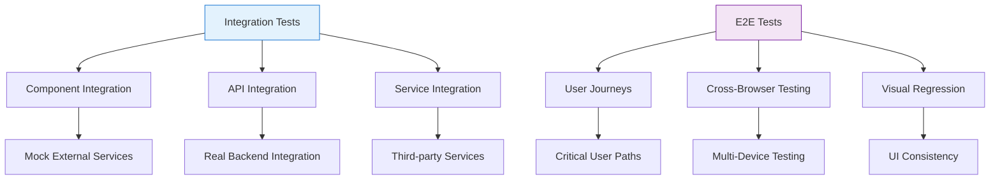

# Integration & E2E Testing Strategies

## Overview

This document establishes comprehensive integration and end-to-end testing strategies for the Resonant application using Playwright, Mock Service Worker (MSW), and Convex testing patterns. Our approach ensures reliable user workflows and robust API integration testing.

## Testing Architecture

### Integration vs E2E Testing



### Test Pyramid for Resonant

- **Integration Tests**: 60% - Component interactions, API flows, service integration
- **E2E Tests**: 20% - Critical user journeys, cross-browser validation
- **Visual Tests**: 10% - UI consistency and regression detection
- **Performance Tests**: 10% - Load time, responsiveness, resource usage

## Playwright Configuration

### Enhanced Playwright Setup

```typescript
// playwright.config.ts
import { defineConfig, devices } from '@playwright/test'

export default defineConfig({
  testDir: './tests/e2e',
  fullyParallel: true,
  forbidOnly: !!process.env.CI,
  retries: process.env.CI ? 2 : 0,
  workers: process.env.CI ? 1 : undefined,
  
  // Enhanced reporting
  reporter: [
    ['html'],
    ['json', { outputFile: 'playwright-report.json' }],
    ['junit', { outputFile: 'results.xml' }],
    process.env.CI ? ['github'] : ['list'],
  ],
  
  use: {
    baseURL: process.env.PLAYWRIGHT_BASE_URL || 'http://localhost:3000',
    trace: 'on-first-retry',
    screenshot: 'only-on-failure',
    video: 'retain-on-failure',
    
    // Enhanced browser context
    contextOptions: {
      permissions: ['notifications', 'clipboard-read', 'clipboard-write'],
    },
  },
  
  projects: [
    // Desktop browsers
    {
      name: 'chromium',
      use: { ...devices['Desktop Chrome'] },
    },
    {
      name: 'firefox',
      use: { ...devices['Desktop Firefox'] },
    },
    {
      name: 'webkit',
      use: { ...devices['Desktop Safari'] },
    },
    
    // Mobile devices
    {
      name: 'Mobile Chrome',
      use: { ...devices['Pixel 5'] },
    },
    {
      name: 'Mobile Safari',
      use: { ...devices['iPhone 12'] },
    },
    
    // Specific test suites
    {
      name: 'auth-tests',
      testMatch: '**/auth/**/*.spec.ts',
      use: { ...devices['Desktop Chrome'] },
    },
    {
      name: 'visual-regression',
      testMatch: '**/visual/**/*.spec.ts',
      use: { 
        ...devices['Desktop Chrome'],
        viewport: { width: 1280, height: 720 },
      },
    },
  ],
  
  webServer: {
    command: 'npm run dev',
    url: 'http://localhost:3000',
    reuseExistingServer: !process.env.CI,
    timeout: 120000,
  },
  
  // Global setup and teardown
  globalSetup: require.resolve('./tests/global-setup'),
  globalTeardown: require.resolve('./tests/global-teardown'),
})
```

### Global Test Setup

```typescript
// tests/global-setup.ts
import { chromium, FullConfig } from '@playwright/test'

async function globalSetup(config: FullConfig) {
  const { baseURL } = config.projects[0].use
  
  // Start services if needed
  console.log('🚀 Starting test environment...')
  
  // Verify application is ready
  const browser = await chromium.launch()
  const page = await browser.newPage()
  
  try {
    await page.goto(baseURL!)
    await page.waitForSelector('[data-testid="app-ready"]', { timeout: 30000 })
    console.log('✅ Application is ready for testing')
  } catch (error) {
    console.error('❌ Application failed to start:', error)
    throw error
  } finally {
    await browser.close()
  }
  
  // Set up test database state if needed
  await setupTestDatabase()
}

async function setupTestDatabase() {
  // Initialize test data, reset database state, etc.
  console.log('📊 Setting up test database...')
}

export default globalSetup
```

## Integration Testing Patterns

### Component Integration Testing

```typescript
// tests/integration/journal-workflow.spec.ts
import { test, expect } from '@playwright/test'

test.describe('Journal Entry Workflow Integration', () => {
  test.beforeEach(async ({ page }) => {
    // Set up authenticated user state
    await page.goto('/auth/signin')
    await page.fill('[name="identifier"]', 'test@example.com')
    await page.fill('[name="password"]', 'testpassword')
    await page.click('button[type="submit"]')
    await page.waitForURL('/dashboard')
  })

  test('complete journal entry creation workflow', async ({ page }) => {
    // Navigate to new entry page
    await page.click('[data-testid="new-entry-button"]')
    await expect(page).toHaveURL('/journal/new')
    
    // Fill out journal entry form
    await page.fill('textarea[name="content"]', 'Today I reflected on my personal growth and relationships.')
    
    // Select mood
    await page.click('[data-testid="mood-selector"]')
    await page.click('[data-testid="mood-happy"]')
    
    // Add tags
    await page.click('[data-testid="tag-input"]')
    await page.keyboard.type('reflection')
    await page.keyboard.press('Enter')
    await page.keyboard.type('growth')
    await page.keyboard.press('Enter')
    
    // Add relationship
    await page.click('[data-testid="relationship-selector"]')
    await page.click('[data-testid="relationship-partner"]')
    
    // Save entry
    await page.click('button[type="submit"]')
    
    // Verify entry was created
    await expect(page).toHaveURL(/\/journal\/[a-zA-Z0-9]+/)
    await expect(page.locator('[data-testid="journal-content"]')).toContainText('Today I reflected on')
    await expect(page.locator('[data-testid="mood-display"]')).toContainText('😊')
    await expect(page.locator('[data-testid="tag-list"]')).toContainText('reflection')
    await expect(page.locator('[data-testid="tag-list"]')).toContainText('growth')
    
    // Verify entry appears in dashboard
    await page.goto('/dashboard')
    await expect(page.locator('[data-testid="recent-entries"]')).toContainText('Today I reflected on')
  })

  test('journal entry editing workflow', async ({ page }) => {
    // First create an entry
    await page.goto('/journal/new')
    await page.fill('textarea[name="content"]', 'Initial content')
    await page.click('button[type="submit"]')
    
    const entryUrl = page.url()
    
    // Edit the entry
    await page.click('[data-testid="edit-entry-button"]')
    await expect(page).toHaveURL(`${entryUrl}/edit`)
    
    // Modify content
    const contentField = page.locator('textarea[name="content"]')
    await contentField.clear()
    await contentField.fill('Updated content with more details')
    
    // Change mood
    await page.click('[data-testid="mood-selector"]')
    await page.click('[data-testid="mood-excited"]')
    
    // Save changes
    await page.click('button[type="submit"]')
    
    // Verify changes were saved
    await expect(page).toHaveURL(entryUrl)
    await expect(page.locator('[data-testid="journal-content"]')).toContainText('Updated content with more details')
    await expect(page.locator('[data-testid="mood-display"]')).toContainText('🤩')
  })

  test('journal entry deletion workflow', async ({ page }) => {
    // Create an entry to delete
    await page.goto('/journal/new')
    await page.fill('textarea[name="content"]', 'Entry to be deleted')
    await page.click('button[type="submit"]')
    
    // Delete the entry
    await page.click('[data-testid="entry-menu-button"]')
    await page.click('[data-testid="delete-entry-button"]')
    
    // Confirm deletion
    await page.click('[data-testid="confirm-delete-button"]')
    
    // Verify redirect to journal list
    await expect(page).toHaveURL('/journal')
    
    // Verify entry is no longer in the list
    await expect(page.locator('[data-testid="journal-entries"]')).not.toContainText('Entry to be deleted')
  })
})
```

### API Integration Testing with MSW

```typescript
// tests/integration/api-integration.spec.ts
import { test, expect } from '@playwright/test'
import { setupServer } from 'msw/node'
import { http, HttpResponse } from 'msw'

const server = setupServer(
  // Mock successful API responses
  http.post('/api/journal/entries', () => {
    return HttpResponse.json({
      id: 'new-entry-123',
      content: 'Test entry content',
      mood: 'happy',
      createdAt: new Date().toISOString(),
    })
  }),
  
  http.get('/api/journal/entries', () => {
    return HttpResponse.json({
      entries: [
        {
          id: 'entry-1',
          content: 'First entry',
          mood: 'neutral',
          createdAt: '2025-01-01T00:00:00Z',
        },
        {
          id: 'entry-2', 
          content: 'Second entry',
          mood: 'happy',
          createdAt: '2025-01-02T00:00:00Z',
        },
      ],
      total: 2,
    })
  })
)

test.describe('API Integration Tests', () => {
  test.beforeAll(async () => {
    server.listen()
  })

  test.afterEach(() => {
    server.resetHandlers()
  })

  test.afterAll(async () => {
    server.close()
  })

  test('handles API success responses', async ({ page }) => {
    await page.goto('/journal')
    
    // Verify entries are loaded from API
    await expect(page.locator('[data-testid="journal-entry"]')).toHaveCount(2)
    await expect(page.locator('[data-testid="journal-entry"]').first()).toContainText('Second entry')
  })

  test('handles API error responses gracefully', async ({ page }) => {
    // Mock API error
    server.use(
      http.get('/api/journal/entries', () => {
        return new HttpResponse(null, { status: 500 })
      })
    )

    await page.goto('/journal')
    
    // Verify error state is displayed
    await expect(page.locator('[data-testid="error-message"]')).toContainText('Failed to load entries')
    await expect(page.locator('[data-testid="retry-button"]')).toBeVisible()
  })

  test('retries failed requests', async ({ page }) => {
    let requestCount = 0
    
    server.use(
      http.get('/api/journal/entries', () => {
        requestCount++
        if (requestCount === 1) {
          return new HttpResponse(null, { status: 500 })
        }
        return HttpResponse.json({ entries: [], total: 0 })
      })
    )

    await page.goto('/journal')
    
    // Wait for error state
    await expect(page.locator('[data-testid="error-message"]')).toBeVisible()
    
    // Click retry
    await page.click('[data-testid="retry-button"]')
    
    // Verify successful retry
    await expect(page.locator('[data-testid="empty-state"]')).toBeVisible()
    expect(requestCount).toBe(2)
  })
})
```

## End-to-End Testing Patterns

### Critical User Journey Testing

```typescript
// tests/e2e/user-journeys/onboarding.spec.ts
import { test, expect } from '@playwright/test'

test.describe('User Onboarding Journey', () => {
  test('new user complete onboarding flow', async ({ page }) => {
    // Start at landing page
    await page.goto('/')
    
    // Click sign up
    await page.click('[data-testid="signup-button"]')
    
    // Fill registration form
    await page.fill('[name="firstName"]', 'John')
    await page.fill('[name="lastName"]', 'Doe')
    await page.fill('[name="emailAddress"]', 'john.doe@example.com')
    await page.fill('[name="password"]', 'SecurePassword123!')
    await page.click('button[type="submit"]')
    
    // Verify email verification step
    await expect(page.locator('[data-testid="verify-email-message"]')).toBeVisible()
    
    // Simulate email verification (in test environment)
    await page.evaluate(() => {
      // Trigger verification via test API
      window.testAPI?.verifyEmail('john.doe@example.com')
    })
    
    // Complete profile setup
    await page.waitForURL('/onboarding/profile')
    await page.fill('[name="bio"]', 'I enjoy reflecting on my daily experiences.')
    await page.click('[data-testid="continue-button"]')
    
    // Set up first relationship
    await page.waitForURL('/onboarding/relationships')
    await page.click('[data-testid="add-relationship-button"]')
    await page.fill('[name="name"]', 'Sarah')
    await page.selectOption('[name="type"]', 'partner')
    await page.click('[data-testid="save-relationship-button"]')
    await page.click('[data-testid="continue-button"]')
    
    // Complete onboarding
    await page.waitForURL('/onboarding/complete')
    await page.click('[data-testid="finish-onboarding-button"]')
    
    // Verify user lands on dashboard
    await expect(page).toHaveURL('/dashboard')
    await expect(page.locator('[data-testid="welcome-message"]')).toContainText('Welcome, John!')
    await expect(page.locator('[data-testid="quick-actions"]')).toBeVisible()
  })
})
```

### Cross-Browser Compatibility Testing

```typescript
// tests/e2e/cross-browser/compatibility.spec.ts
import { test, expect } from '@playwright/test'

test.describe('Cross-Browser Compatibility', () => {
  test('journal entry creation works across browsers', async ({ page, browserName }) => {
    await page.goto('/journal/new')
    
    // Test basic functionality
    await page.fill('textarea[name="content"]', `Testing on ${browserName}`)
    await page.click('[data-testid="mood-selector"]')
    await page.click('[data-testid="mood-happy"]')
    await page.click('button[type="submit"]')
    
    // Verify entry was created
    await expect(page.locator('[data-testid="journal-content"]')).toContainText(`Testing on ${browserName}`)
    
    // Browser-specific checks
    if (browserName === 'webkit') {
      // Safari-specific tests
      await expect(page.locator('[data-testid="safari-specific-element"]')).toBeVisible()
    }
    
    if (browserName === 'firefox') {
      // Firefox-specific tests
      await expect(page.locator('[data-testid="firefox-feature"]')).toBeVisible()
    }
  })

  test('responsive design works on mobile', async ({ page }) => {
    // Test mobile-specific functionality
    await page.setViewportSize({ width: 375, height: 667 })
    await page.goto('/dashboard')
    
    // Verify mobile navigation
    await expect(page.locator('[data-testid="mobile-menu-button"]')).toBeVisible()
    await page.click('[data-testid="mobile-menu-button"]')
    await expect(page.locator('[data-testid="mobile-nav-menu"]')).toBeVisible()
    
    // Test touch interactions
    await page.locator('[data-testid="swipeable-card"]').dispatchEvent('touchstart')
    await page.locator('[data-testid="swipeable-card"]').dispatchEvent('touchend')
  })
})
```

## Visual Regression Testing

### Playwright Visual Testing

```typescript
// tests/e2e/visual/visual-regression.spec.ts
import { test, expect } from '@playwright/test'

test.describe('Visual Regression Tests', () => {
  test.beforeEach(async ({ page }) => {
    // Ensure consistent test environment
    await page.addInitScript(() => {
      // Disable animations for consistent screenshots
      document.documentElement.style.setProperty('--animation-duration', '0s')
      document.documentElement.style.setProperty('--transition-duration', '0s')
    })
  })

  test('dashboard layout remains consistent', async ({ page }) => {
    await page.goto('/dashboard')
    await page.waitForLoadState('networkidle')
    
    // Wait for all dynamic content to load
    await page.waitForSelector('[data-testid="health-score-card"]')
    await page.waitForSelector('[data-testid="recent-activity"]')
    
    // Take full page screenshot
    await expect(page).toHaveScreenshot('dashboard-full.png', {
      fullPage: true,
      animations: 'disabled',
    })
    
    // Test specific components
    await expect(page.locator('[data-testid="health-score-card"]')).toHaveScreenshot('health-score-card.png')
    await expect(page.locator('[data-testid="trend-chart"]')).toHaveScreenshot('trend-chart.png')
  })

  test('journal entry card visual consistency', async ({ page }) => {
    await page.goto('/journal')
    await page.waitForSelector('[data-testid="journal-entry-card"]')
    
    const entryCard = page.locator('[data-testid="journal-entry-card"]').first()
    
    // Test different states
    await expect(entryCard).toHaveScreenshot('journal-card-default.png')
    
    // Hover state
    await entryCard.hover()
    await expect(entryCard).toHaveScreenshot('journal-card-hover.png')
    
    // Focus state
    await entryCard.focus()
    await expect(entryCard).toHaveScreenshot('journal-card-focus.png')
  })

  test('form validation visual states', async ({ page }) => {
    await page.goto('/journal/new')
    
    // Empty form validation
    await page.click('button[type="submit"]')
    await expect(page.locator('form')).toHaveScreenshot('form-validation-errors.png')
    
    // Success state
    await page.fill('textarea[name="content"]', 'Valid content')
    await page.click('button[type="submit"]')
    await page.waitForSelector('[data-testid="success-message"]')
    await expect(page.locator('[data-testid="success-message"]')).toHaveScreenshot('form-success.png')
  })

  test('responsive breakpoints visual consistency', async ({ page }) => {
    const breakpoints = [
      { name: 'mobile', width: 375, height: 667 },
      { name: 'tablet', width: 768, height: 1024 },
      { name: 'desktop', width: 1280, height: 720 },
      { name: 'large', width: 1920, height: 1080 },
    ]

    for (const breakpoint of breakpoints) {
      await page.setViewportSize({ width: breakpoint.width, height: breakpoint.height })
      await page.goto('/dashboard')
      await page.waitForLoadState('networkidle')
      
      await expect(page).toHaveScreenshot(`dashboard-${breakpoint.name}.png`, {
        fullPage: true,
      })
    }
  })
})
```

### Chromatic Integration

```javascript
// .chromatic.config.js
module.exports = {
  projectToken: process.env.CHROMATIC_PROJECT_TOKEN,
  buildScriptName: 'build-storybook',
  exitOnceUploaded: true,
  autoAcceptChanges: 'main',
  delay: 300, // Wait for animations
  diffThreshold: 0.1, // Allow 10% pixel difference
  
  // Ignore certain files
  onlyChanged: true,
  skip: 'dependabot/**',
  
  // Cross-browser testing
  browsers: ['chrome', 'firefox', 'safari'],
  
  // Mobile testing
  viewports: [
    { name: 'mobile', width: 375, height: 667 },
    { name: 'desktop', width: 1280, height: 720 },
  ],
}
```

## Performance Testing

### Lighthouse Integration

```typescript
// tests/e2e/performance/lighthouse.spec.ts
import { test, expect } from '@playwright/test'
import { playAudit } from 'playwright-lighthouse'

test.describe('Performance Tests', () => {
  test('dashboard meets performance benchmarks', async ({ page }) => {
    await page.goto('/dashboard')
    
    await playAudit({
      page,
      thresholds: {
        performance: 80,
        accessibility: 90,
        'best-practices': 90,
        seo: 80,
        pwa: 80,
      },
      reports: {
        formats: {
          html: true,
          json: true,
        },
        directory: 'lighthouse-reports',
      },
    })
  })

  test('journal page loads within performance budget', async ({ page }) => {
    const startTime = Date.now()
    
    await page.goto('/journal')
    await page.waitForSelector('[data-testid="journal-entries"]')
    
    const loadTime = Date.now() - startTime
    expect(loadTime).toBeLessThan(3000) // 3 second budget
    
    // Check Core Web Vitals
    const [lcp, fid, cls] = await page.evaluate(() => {
      return new Promise(resolve => {
        new PerformanceObserver((list) => {
          const entries = list.getEntries()
          const metrics = entries.reduce((acc, entry) => {
            if (entry.entryType === 'largest-contentful-paint') {
              acc.lcp = entry.startTime
            }
            if (entry.entryType === 'first-input') {
              acc.fid = entry.processingStart - entry.startTime
            }
            if (entry.entryType === 'layout-shift' && !entry.hadRecentInput) {
              acc.cls += entry.value
            }
            return acc
          }, { lcp: 0, fid: 0, cls: 0 })
          
          resolve([metrics.lcp, metrics.fid, metrics.cls])
        }).observe({ entryTypes: ['largest-contentful-paint', 'first-input', 'layout-shift'] })
      })
    })
    
    expect(lcp).toBeLessThan(2500) // LCP should be < 2.5s
    expect(fid).toBeLessThan(100)  // FID should be < 100ms
    expect(cls).toBeLessThan(0.1)  // CLS should be < 0.1
  })
})
```

## Accessibility Testing

### Automated A11y Testing

```typescript
// tests/e2e/accessibility/a11y.spec.ts
import { test, expect } from '@playwright/test'
import AxeBuilder from '@axe-core/playwright'

test.describe('Accessibility Tests', () => {
  test('dashboard should be accessible', async ({ page }) => {
    await page.goto('/dashboard')
    
    const accessibilityScanResults = await new AxeBuilder({ page })
      .withTags(['wcag2a', 'wcag2aa', 'wcag21aa'])
      .analyze()
    
    expect(accessibilityScanResults.violations).toEqual([])
  })

  test('journal form should be keyboard navigable', async ({ page }) => {
    await page.goto('/journal/new')
    
    // Test tab navigation
    await page.keyboard.press('Tab')
    await expect(page.locator('textarea[name="content"]')).toBeFocused()
    
    await page.keyboard.press('Tab')
    await expect(page.locator('[data-testid="mood-selector"]')).toBeFocused()
    
    await page.keyboard.press('Tab')
    await expect(page.locator('[data-testid="tag-input"]')).toBeFocused()
    
    // Test form submission with keyboard
    await page.keyboard.press('Enter')
    await expect(page.locator('[data-testid="validation-error"]')).toBeVisible()
  })

  test('screen reader announcements work correctly', async ({ page }) => {
    await page.goto('/journal')
    
    // Check for live regions
    await expect(page.locator('[aria-live="polite"]')).toBeInTheDocument()
    
    // Test dynamic content announcements
    await page.click('[data-testid="load-more-button"]')
    await expect(page.locator('[aria-live="polite"]')).toContainText('Loaded 5 more entries')
  })
})
```

## Test Data Management

### Fixtures and Test Data

```typescript
// tests/fixtures/test-data.ts
export const testUsers = {
  standard: {
    id: 'user-123',
    email: 'test@example.com',
    firstName: 'Test',
    lastName: 'User',
  },
  premium: {
    id: 'user-456',
    email: 'premium@example.com',
    firstName: 'Premium',
    lastName: 'User',
  },
}

export const testJournalEntries = [
  {
    id: 'entry-1',
    content: 'Today was a great day! I felt really connected with my partner.',
    mood: 'happy',
    tags: ['relationship', 'gratitude'],
    relationships: ['partner'],
    createdAt: '2025-01-15T10:00:00Z',
  },
  {
    id: 'entry-2',
    content: 'Had some challenges at work but managed to stay positive.',
    mood: 'neutral',
    tags: ['work', 'resilience'],
    relationships: [],
    createdAt: '2025-01-14T15:30:00Z',
  },
]

export const testRelationships = [
  {
    id: 'rel-1',
    name: 'Sarah',
    type: 'partner',
    photo: null,
    initials: 'S',
  },
  {
    id: 'rel-2',
    name: 'Mike',
    type: 'friend',
    photo: null,
    initials: 'M',
  },
]
```

### Database Setup and Teardown

```typescript
// tests/setup/database.ts
import { ConvexTestingHelper } from 'convex/testing'

export class TestDatabase {
  private helper: ConvexTestingHelper

  constructor() {
    this.helper = new ConvexTestingHelper()
  }

  async setup() {
    await this.helper.start()
    await this.seedTestData()
  }

  async teardown() {
    await this.helper.cleanup()
  }

  async seedTestData() {
    // Create test users
    for (const user of testUsers) {
      await this.helper.mutation('users:create', user)
    }
    
    // Create test journal entries
    for (const entry of testJournalEntries) {
      await this.helper.mutation('journalEntries:create', entry)
    }
    
    // Create test relationships
    for (const relationship of testRelationships) {
      await this.helper.mutation('relationships:create', relationship)
    }
  }

  async resetData() {
    await this.helper.mutation('testing:clearAllData')
    await this.seedTestData()
  }
}
```

## CI/CD Integration

### GitHub Actions E2E Pipeline

```yaml
# .github/workflows/e2e-tests.yml
name: E2E Tests

on:
  pull_request:
    branches: [main]
  push:
    branches: [main]

jobs:
  e2e-tests:
    runs-on: ubuntu-latest
    
    strategy:
      matrix:
        browser: [chromium, firefox, webkit]
        
    steps:
      - uses: actions/checkout@v4
      
      - uses: actions/setup-node@v4
        with:
          node-version: '20'
          cache: 'npm'
          
      - name: Install dependencies
        run: npm ci
        
      - name: Install Playwright browsers
        run: npx playwright install --with-deps ${{ matrix.browser }}
        
      - name: Start application
        run: |
          npm run build
          npm run start &
          npx wait-on http://localhost:3000
          
      - name: Run E2E tests
        run: npx playwright test --project=${{ matrix.browser }}
        env:
          PLAYWRIGHT_BASE_URL: http://localhost:3000
          
      - name: Upload test results
        uses: actions/upload-artifact@v3
        if: failure()
        with:
          name: playwright-report-${{ matrix.browser }}
          path: playwright-report/
          retention-days: 30
```

## Best Practices

### Test Organization

1. **Feature-based Structure**: Organize tests by user-facing features
2. **Shared Utilities**: Create reusable helper functions and page objects
3. **Data Isolation**: Ensure tests don't interfere with each other
4. **Parallel Execution**: Design tests to run independently

### Performance Optimization

1. **Selective Browser Testing**: Run critical tests on all browsers, others on primary browser
2. **Smart Test Grouping**: Group related tests to share setup costs
3. **Resource Management**: Clean up resources and reset state efficiently
4. **Caching Strategies**: Cache build artifacts and dependencies

### Reliability Patterns

1. **Wait Strategies**: Use proper waiting mechanisms for dynamic content
2. **Retry Logic**: Implement intelligent retry for flaky operations
3. **Error Handling**: Provide meaningful error messages and debugging info
4. **Environment Consistency**: Ensure test environment matches production

---

**Last Updated**: January 2025  
**Version**: 1.0.0  
**Next Review**: February 2025