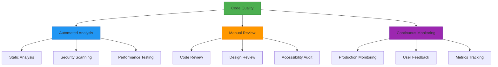

# QA Philosophy & Strategy

## Overview

This document establishes the core quality assurance philosophy and strategic approach for the Resonant application. Our QA strategy ensures code quality, security, performance, and maintainability through automated processes, quality gates, and continuous monitoring.

## QA Philosophy & Architecture

### Quality-First Development

### Quality Gates Strategy

Our QA process implements multiple quality gates throughout the development lifecycle:

1. **Pre-commit**: Local validation and automated fixes
2. **Pull Request**: Comprehensive automated testing and review
3. **Pre-deployment**: Integration testing and security validation
4. **Post-deployment**: Monitoring and performance validation

### Core QA Principles

#### 1. Shift-Left Philosophy
- **Early Detection**: Catch issues in development, not production
- **Fast Feedback**: Immediate validation during coding
- **Cost Efficiency**: Fix bugs when they're cheapest to address

#### 2. Automation-First Approach
- **Consistent Standards**: Automated enforcement of quality standards
- **Scalable Processes**: Quality measures that scale with team growth
- **Reduced Human Error**: Minimize manual quality gates

#### 3. Risk-Based Testing
- **Critical Path Focus**: Prioritize testing of user-critical features
- **Impact Assessment**: Weight testing efforts by business impact
- **Resource Optimization**: Allocate QA resources effectively

#### 4. Continuous Improvement
- **Metrics-Driven**: Use data to guide QA process improvements
- **Feedback Loops**: Regular retrospectives and process refinement
- **Tool Evolution**: Continuously evaluate and upgrade QA tools

## Quality Assurance Scope

### Code Quality Assurance
- **Static Analysis**: ESLint, TypeScript strict mode, SonarCloud
- **Code Review**: Automated and manual code review processes
- **Formatting**: Prettier for consistent code formatting
- **Architecture**: Design pattern compliance and best practices

### Security Assurance
- **Vulnerability Scanning**: Automated security vulnerability detection
- **Dependency Auditing**: Regular security audits of dependencies
- **Code Security**: Static analysis for security anti-patterns
- **Access Control**: Authentication and authorization testing

### Performance Assurance
- **Load Testing**: Application performance under stress
- **Bundle Optimization**: JavaScript bundle size monitoring
- **Runtime Performance**: Real-time performance monitoring
- **Resource Usage**: Memory and CPU usage optimization

### Accessibility Assurance
- **WCAG Compliance**: Web Content Accessibility Guidelines 2.1 AA
- **Screen Reader Testing**: Compatibility with assistive technologies
- **Keyboard Navigation**: Full keyboard accessibility
- **Color Contrast**: Visual accessibility standards

## Quality Metrics Framework

### Primary Quality Metrics
- **Code Coverage**: Target ≥ 80% overall coverage
- **Bug Escape Rate**: < 2% of bugs reach production
- **Mean Time to Resolution**: < 4 hours for critical issues
- **Security Vulnerability Count**: Zero high-severity vulnerabilities

### Secondary Quality Metrics
- **Code Review Coverage**: 100% of code changes reviewed
- **Automated Test Pass Rate**: ≥ 95% test suite stability
- **Documentation Coverage**: All public APIs documented
- **Performance Benchmarks**: Meet defined performance SLAs

## QA Tool Stack

### Development Environment
- **IDE Integration**: ESLint, Prettier, TypeScript plugins
- **Pre-commit Hooks**: Husky for automated validation
- **Local Testing**: Jest watch mode for rapid feedback

### CI/CD Pipeline
- **GitHub Actions**: Automated quality gates
- **SonarCloud**: Continuous code quality analysis
- **Dependabot**: Automated dependency updates
- **CodeQL**: Security vulnerability scanning

### Production Monitoring
- **Error Tracking**: Sentry for runtime error monitoring
- **Performance Monitoring**: Web Vitals and custom metrics
- **Uptime Monitoring**: Synthetic monitoring and alerts
- **User Feedback**: Integrated feedback collection

## Team Responsibilities

### Developers
- **Local Quality**: Run quality checks before committing
- **Code Review**: Participate in peer review process
- **Test Writing**: Write and maintain unit and integration tests
- **Documentation**: Keep documentation current with code changes

### QA Team
- **Process Design**: Design and maintain QA processes
- **Tool Management**: Configure and maintain QA tools
- **Training**: Train team members on QA practices
- **Metrics Analysis**: Monitor and report on quality metrics

### DevOps Team
- **Pipeline Maintenance**: Maintain CI/CD quality gates
- **Tool Integration**: Integrate QA tools into development workflow
- **Environment Management**: Maintain testing environments
- **Monitoring Setup**: Configure production monitoring systems

---

**Related Documentation:**
- [Automated Code Review](automated-code-review.md) - CI/CD automation details
- [Git Workflows and Hooks](git-workflows-and-hooks.md) - Pre-commit processes
- [Static Analysis and Security](static-analysis-and-security.md) - Code analysis tools
- [Production Monitoring](production-monitoring.md) - Runtime quality monitoring

**Last Updated**: January 2025  
**Version**: 1.0.0  
**Next Review**: February 2025