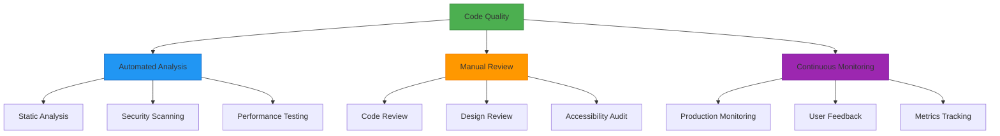

# Quality Assurance Processes & Tools

## Overview

This document establishes comprehensive quality assurance processes and tools for the Resonant application. Our QA strategy ensures code quality, security, performance, and maintainability through automated processes, quality gates, and continuous monitoring.

## QA Philosophy & Architecture

### Quality-First Development



### Quality Gates Strategy

Our QA process implements multiple quality gates throughout the development lifecycle:

1. **Pre-commit**: Local validation and automated fixes
2. **Pull Request**: Comprehensive automated testing and review
3. **Pre-deployment**: Integration testing and security validation
4. **Post-deployment**: Monitoring and performance validation

## Automated Code Review Workflows

### GitHub Actions Integration

```yaml
# .github/workflows/quality-assurance.yml
name: Quality Assurance Pipeline

on:
  pull_request:
    branches: [main, develop]
  push:
    branches: [main]

jobs:
  code-quality:
    runs-on: ubuntu-latest
    
    steps:
      - uses: actions/checkout@v4
        with:
          fetch-depth: 0 # Full history for SonarCloud
      
      - uses: actions/setup-node@v4
        with:
          node-version: '20'
          cache: 'npm'
      
      - name: Install dependencies
        run: npm ci
      
      - name: Run TypeScript compilation
        run: npm run typecheck
      
      - name: Run ESLint
        run: npm run lint -- --format=json --output-file=eslint-report.json
      
      - name: Run Prettier check
        run: npm run format:check
      
      - name: Run tests with coverage
        run: npm run test:ci
      
      - name: SonarCloud Scan
        uses: SonarSource/sonarcloud-github-action@master
        env:
          GITHUB_TOKEN: ${{ secrets.GITHUB_TOKEN }}
          SONAR_TOKEN: ${{ secrets.SONAR_TOKEN }}
  
  security-audit:
    runs-on: ubuntu-latest
    
    steps:
      - uses: actions/checkout@v4
      
      - name: Run npm audit
        run: npm audit --audit-level high --production
      
      - name: Run Snyk security scan
        uses: snyk/actions/node@master
        env:
          SNYK_TOKEN: ${{ secrets.SNYK_TOKEN }}
        with:
          args: --severity-threshold=medium
      
      - name: FOSSA license scan
        uses: fossas/fossa-action@main
        with:
          api-key: ${{ secrets.FOSSA_API_KEY }}
  
  performance-audit:
    runs-on: ubuntu-latest
    
    steps:
      - uses: actions/checkout@v4
      
      - name: Install dependencies
        run: npm ci
      
      - name: Build application
        run: npm run build
      
      - name: Analyze bundle size
        run: |
          npx @next/bundle-analyzer
          npx bundlesize
      
      - name: Lighthouse CI
        uses: treosh/lighthouse-ci-action@v10
        with:
          configPath: '.lighthouserc.json'
          uploadArtifacts: true
```

### Enhanced ESLint Configuration

```javascript
// eslint.config.mjs
import js from '@eslint/js'
import typescript from '@typescript-eslint/eslint-plugin'
import typescriptParser from '@typescript-eslint/parser'
import react from 'eslint-plugin-react'
import reactHooks from 'eslint-plugin-react-hooks'
import jsxA11y from 'eslint-plugin-jsx-a11y'
import next from '@next/eslint-plugin-next'

export default [
  js.configs.recommended,
  {
    files: ['**/*.{js,jsx,ts,tsx}'],
    languageOptions: {
      parser: typescriptParser,
      parserOptions: {
        ecmaVersion: 'latest',
        sourceType: 'module',
        ecmaFeatures: {
          jsx: true,
        },
      },
    },
    plugins: {
      '@typescript-eslint': typescript,
      'react': react,
      'react-hooks': reactHooks,
      'jsx-a11y': jsxA11y,
      '@next/next': next,
    },
    rules: {
      // TypeScript strict rules
      '@typescript-eslint/no-explicit-any': 'error',
      '@typescript-eslint/no-unsafe-assignment': 'error',
      '@typescript-eslint/no-unsafe-member-access': 'error',
      '@typescript-eslint/no-unsafe-call': 'error',
      '@typescript-eslint/no-unsafe-return': 'error',
      '@typescript-eslint/no-unsafe-argument': 'error',
      '@typescript-eslint/strict-boolean-expressions': 'warn',
      '@typescript-eslint/prefer-nullish-coalescing': 'error',
      '@typescript-eslint/prefer-optional-chain': 'error',
      
      // React best practices
      'react-hooks/rules-of-hooks': 'error',
      'react-hooks/exhaustive-deps': 'warn',
      'react/prop-types': 'off', // Using TypeScript
      'react/react-in-jsx-scope': 'off', // Next.js handles this
      'react/display-name': 'error',
      'react/jsx-key': 'error',
      'react/jsx-no-target-blank': 'error',
      
      // Accessibility
      'jsx-a11y/alt-text': 'error',
      'jsx-a11y/anchor-has-content': 'error',
      'jsx-a11y/anchor-is-valid': 'error',
      'jsx-a11y/click-events-have-key-events': 'error',
      'jsx-a11y/role-has-required-aria-props': 'error',
      
      // Next.js specific
      '@next/next/no-img-element': 'error',
      '@next/next/no-page-custom-font': 'error',
      
      // Code quality
      'no-console': 'warn',
      'prefer-const': 'error',
      'no-var': 'error',
      'no-duplicate-imports': 'error',
    },
    settings: {
      react: {
        version: 'detect',
      },
    },
  },
  {
    files: ['**/*.test.{js,jsx,ts,tsx}'],
    rules: {
      // Relaxed rules for tests
      '@typescript-eslint/no-explicit-any': 'off',
      'no-console': 'off',
    },
  },
]
```

## Pre-commit Hooks and Git Workflows

### Husky and lint-staged Setup

```bash
# Install Husky and lint-staged
npm install --save-dev husky lint-staged commitlint @commitlint/config-conventional

# Initialize Husky
npx husky init
```

```json
// package.json
{
  "scripts": {
    "prepare": "husky"
  },
  "lint-staged": {
    "**/*.{ts,tsx}": [
      "eslint --max-warnings=0 --fix",
      "prettier --write",
      "bash -c 'npm run typecheck'"
    ],
    "**/*.{js,json,css,md,yml,yaml}": [
      "prettier --write"
    ],
    "**/*.{ts,tsx,js,jsx}": [
      "jest --bail --findRelatedTests --passWithNoTests --silent"
    ]
  },
  "commitlint": {
    "extends": ["@commitlint/config-conventional"]
  }
}
```

### Git Hooks Configuration

```bash
# .husky/pre-commit
#!/usr/bin/env sh
npx lint-staged

# .husky/commit-msg
#!/usr/bin/env sh
npx commitlint --edit $1

# .husky/pre-push
#!/usr/bin/env sh
npm run test:ci
npm run build
```

### Commitlint Configuration

```javascript
// commitlint.config.js
module.exports = {
  extends: ['@commitlint/config-conventional'],
  rules: {
    'type-enum': [
      2,
      'always',
      [
        'feat',     // New feature
        'fix',      // Bug fix
        'docs',     // Documentation
        'style',    // Formatting
        'refactor', // Code refactoring
        'perf',     // Performance improvement
        'test',     // Tests
        'chore',    // Maintenance
        'ci',       // CI/CD changes
        'build',    // Build system changes
        'revert',   // Revert changes
      ],
    ],
    'subject-max-length': [2, 'always', 72],
    'subject-case': [2, 'always', 'lower-case'],
    'subject-empty': [2, 'never'],
    'subject-full-stop': [2, 'never', '.'],
  },
}
```

## Static Analysis Tools

### SonarCloud Configuration

```properties
# sonar-project.properties
sonar.projectKey=resonant-app
sonar.organization=your-org
sonar.projectName=Resonant App
sonar.projectVersion=1.0

# Source and test paths
sonar.sources=src
sonar.tests=src
sonar.test.inclusions=**/*.test.ts,**/*.test.tsx,**/*.spec.ts

# Coverage
sonar.typescript.lcov.reportPaths=coverage/lcov.info
sonar.coverage.exclusions=**/*.test.ts,**/*.test.tsx,**/*.stories.tsx,**/*.d.ts

# Analysis exclusions
sonar.exclusions=**/node_modules/**,**/.next/**,**/coverage/**,**/*.stories.tsx

# Code quality thresholds
sonar.qualitygate.wait=true
```

### TypeScript Strict Configuration

```json
// tsconfig.strict.json
{
  "extends": "./tsconfig.json",
  "compilerOptions": {
    // Strict type checking
    "strict": true,
    "noImplicitAny": true,
    "strictNullChecks": true,
    "strictFunctionTypes": true,
    "strictBindCallApply": true,
    "strictPropertyInitialization": true,
    "noImplicitThis": true,
    "noImplicitReturns": true,
    "noFallthroughCasesInSwitch": true,
    "noUncheckedIndexedAccess": true,
    "exactOptionalPropertyTypes": true,
    
    // Additional checks
    "noUnusedLocals": true,
    "noUnusedParameters": true,
    "allowUnreachableCode": false,
    "allowUnusedLabels": false,
    
    // Import/module resolution
    "moduleResolution": "bundler",
    "allowImportingTsExtensions": false,
    "resolveJsonModule": true,
    "isolatedModules": true,
    "verbatimModuleSyntax": true
  }
}
```

## Security Scanning and Monitoring

### Comprehensive Security Workflow

```yaml
# .github/workflows/security.yml
name: Security Audit

on:
  schedule:
    - cron: '0 2 * * 1' # Weekly on Monday at 2 AM
  pull_request:
    branches: [main]
  push:
    branches: [main]

jobs:
  security-scan:
    runs-on: ubuntu-latest
    
    steps:
      - uses: actions/checkout@v4
      
      - name: Setup Node.js
        uses: actions/setup-node@v4
        with:
          node-version: '20'
          cache: 'npm'
      
      - name: Install dependencies
        run: npm ci
      
      - name: npm audit
        run: npm audit --audit-level moderate --production
      
      - name: Snyk vulnerability scan
        uses: snyk/actions/node@master
        env:
          SNYK_TOKEN: ${{ secrets.SNYK_TOKEN }}
        with:
          args: --severity-threshold=medium --fail-on=all
      
      - name: Semgrep security analysis
        uses: returntocorp/semgrep-action@v1
        with:
          config: >-
            p/security-audit
            p/react
            p/typescript
            p/owasp-top-ten
            p/nodejs
      
      - name: CodeQL analysis
        uses: github/codeql-action/init@v3
        with:
          languages: javascript
      
      - name: Perform CodeQL analysis
        uses: github/codeql-action/analyze@v3
      
      - name: FOSSA license compliance
        uses: fossas/fossa-action@main
        with:
          api-key: ${{ secrets.FOSSA_API_KEY }}
          
      - name: Generate security report
        run: |
          echo "# Security Scan Report" > security-report.md
          echo "Generated on: $(date)" >> security-report.md
          echo "" >> security-report.md
          echo "## npm audit results" >> security-report.md
          npm audit --json || true >> security-report.md
          
      - name: Upload security report
        uses: actions/upload-artifact@v3
        with:
          name: security-report
          path: security-report.md
```

### Security Monitoring Configuration

```typescript
// src/lib/security/monitoring.ts
import * as Sentry from '@sentry/nextjs'

// Security event tracking
export function trackSecurityEvent(event: string, data?: Record<string, any>) {
  Sentry.addBreadcrumb({
    message: `Security event: ${event}`,
    level: 'warning',
    data,
  })
  
  // Log to security monitoring service
  if (process.env.NODE_ENV === 'production') {
    console.warn(`[SECURITY] ${event}`, data)
  }
}

// Content Security Policy violation handler
export function handleCSPViolation(violation: SecurityPolicyViolationEvent) {
  trackSecurityEvent('CSP Violation', {
    blockedURI: violation.blockedURI,
    violatedDirective: violation.violatedDirective,
    originalPolicy: violation.originalPolicy,
  })
}

// Rate limiting detection
export function detectRateLimit(ip: string, endpoint: string) {
  trackSecurityEvent('Rate Limit Hit', {
    ip,
    endpoint,
    timestamp: new Date().toISOString(),
  })
}
```

## Dependency Management

### Automated Dependency Updates

```yaml
# .github/dependabot.yml
version: 2
updates:
  # npm dependencies
  - package-ecosystem: "npm"
    directory: "/"
    schedule:
      interval: "weekly"
      day: "monday"
      time: "09:00"
    reviewers:
      - "@team-leads"
    assignees:
      - "@security-team"
    labels:
      - "dependencies"
      - "security"
    open-pull-requests-limit: 10
    
    # Group updates by type
    groups:
      production-dependencies:
        patterns:
          - "*"
        exclude-patterns:
          - "@types/*"
          - "*-dev"
        
      development-dependencies:
        patterns:
          - "@types/*"
          - "*-dev"
          - "eslint*"
          - "prettier*"
          - "jest*"
          - "@testing-library/*"
    
    # Version update strategies
    versioning-strategy: "increase"
    
  # GitHub Actions
  - package-ecosystem: "github-actions"
    directory: "/"
    schedule:
      interval: "weekly"
    labels:
      - "github-actions"
```

### Advanced Security Scanning

```bash
# scripts/security-audit.sh
#!/bin/bash

echo "🔍 Running comprehensive security audit..."

# Check for known vulnerabilities
echo "Checking npm vulnerabilities..."
npm audit --audit-level moderate

# Check for outdated packages
echo "Checking for outdated packages..."
npm outdated

# Advanced security scanning
echo "Running enhanced security scan..."
npx better-npm-audit

# Check for hardcoded secrets
echo "Scanning for secrets..."
npx @secretlint/cli src/**/*

# License compliance check
echo "Checking license compliance..."
npx license-checker --summary

# Security linting
echo "Running security linting..."
npx eslint src --ext .ts,.tsx --rule 'security/detect-object-injection: error'

echo "✅ Security audit complete!"
```

## Build and Deployment Validation

### Enhanced CI/CD Pipeline

```yaml
# .github/workflows/deployment.yml
name: Build and Deployment Validation

on:
  push:
    branches: [main]
  pull_request:
    branches: [main]

jobs:
  build-validation:
    runs-on: ubuntu-latest
    
    steps:
      - uses: actions/checkout@v4
      
      - name: Setup Node.js
        uses: actions/setup-node@v4
        with:
          node-version: '20'
          cache: 'npm'
      
      - name: Install dependencies
        run: npm ci
      
      - name: Type checking
        run: npm run typecheck
      
      - name: Linting
        run: npm run lint
      
      - name: Testing
        run: npm run test:ci
      
      - name: Build application
        run: npm run build
        env:
          NEXT_TELEMETRY_DISABLED: 1
      
      - name: Bundle analysis
        run: |
          npx @next/bundle-analyzer
          npx bundlesize
      
      - name: Lighthouse CI
        uses: treosh/lighthouse-ci-action@v10
        with:
          configPath: '.lighthouserc.json'
          uploadArtifacts: true
          temporaryPublicStorage: true
          
      - name: Visual regression testing
        uses: chromaui/action@v1
        with:
          projectToken: ${{ secrets.CHROMATIC_PROJECT_TOKEN }}
          onlyChanged: true
          
  deployment-preview:
    runs-on: ubuntu-latest
    if: github.event_name == 'pull_request'
    needs: build-validation
    
    steps:
      - uses: actions/checkout@v4
      
      - name: Deploy to Vercel Preview
        uses: amondnet/vercel-action@v25
        id: vercel-deploy
        with:
          vercel-token: ${{ secrets.VERCEL_TOKEN }}
          vercel-org-id: ${{ secrets.ORG_ID }}
          vercel-project-id: ${{ secrets.PROJECT_ID }}
          working-directory: ./
          
      - name: Run E2E tests on preview
        env:
          PLAYWRIGHT_BASE_URL: ${{ steps.vercel-deploy.outputs.preview-url }}
        run: |
          npm ci
          npx playwright install --with-deps
          npm run test:e2e
          
      - name: Comment PR with preview URL
        uses: actions/github-script@v6
        with:
          script: |
            github.rest.issues.createComment({
              issue_number: context.issue.number,
              owner: context.repo.owner,
              repo: context.repo.repo,
              body: `🚀 Preview deployment ready at: ${{ steps.vercel-deploy.outputs.preview-url }}`
            })
```

### Performance Budget Configuration

```javascript
// .lighthouserc.js
module.exports = {
  ci: {
    collect: {
      url: [
        'http://localhost:3000',
        'http://localhost:3000/dashboard',
        'http://localhost:3000/journal',
        'http://localhost:3000/relationships',
      ],
      startServerCommand: 'npm run start',
      numberOfRuns: 3,
    },
    assert: {
      assertions: {
        // Performance
        'categories:performance': ['error', { minScore: 0.8 }],
        'first-contentful-paint': ['error', { maxNumericValue: 2000 }],
        'largest-contentful-paint': ['error', { maxNumericValue: 2500 }],
        'cumulative-layout-shift': ['error', { maxNumericValue: 0.1 }],
        'total-blocking-time': ['error', { maxNumericValue: 300 }],
        
        // Accessibility
        'categories:accessibility': ['error', { minScore: 0.9 }],
        
        // Best practices
        'categories:best-practices': ['error', { minScore: 0.9 }],
        
        // SEO
        'categories:seo': ['error', { minScore: 0.8 }],
        
        // PWA
        'categories:pwa': ['warn', { minScore: 0.8 }],
      },
    },
    upload: {
      target: 'temporary-public-storage',
    },
  },
}
```

## Production Monitoring

### Application Performance Monitoring

```typescript
// src/lib/monitoring/performance.ts
import { getCLS, getFID, getFCP, getLCP, getTTFB } from 'web-vitals'

interface Metric {
  name: string
  value: number
  id: string
  navigationType: string
}

function sendToAnalytics(metric: Metric) {
  // Send to your analytics service
  if (process.env.NODE_ENV === 'production') {
    fetch('/api/analytics/vitals', {
      method: 'POST',
      headers: {
        'Content-Type': 'application/json',
      },
      body: JSON.stringify(metric),
    })
  }
}

// Initialize performance monitoring
export function initPerformanceMonitoring() {
  getCLS(sendToAnalytics)
  getFID(sendToAnalytics)
  getFCP(sendToAnalytics)
  getLCP(sendToAnalytics)
  getTTFB(sendToAnalytics)
}

// Custom performance markers
export function markFeatureUsage(feature: string, duration: number) {
  if (typeof window !== 'undefined' && 'performance' in window) {
    performance.mark(`feature-${feature}-end`)
    performance.measure(`feature-${feature}`, `feature-${feature}-start`, `feature-${feature}-end`)
    
    sendToAnalytics({
      name: `feature-${feature}`,
      value: duration,
      id: `${feature}-${Date.now()}`,
      navigationType: 'navigate',
    })
  }
}
```

### Error Monitoring and Alerting

```typescript
// src/lib/monitoring/errors.ts
import * as Sentry from '@sentry/nextjs'

// Enhanced error reporting
export function reportError(error: Error, context?: Record<string, any>) {
  Sentry.withScope((scope) => {
    if (context) {
      scope.setContext('error_context', context)
    }
    
    scope.setTag('error_boundary', true)
    Sentry.captureException(error)
  })
}

// User feedback integration
export function captureUserFeedback(feedback: {
  name: string
  email: string
  comments: string
}) {
  const user = Sentry.getCurrentHub().getScope()?.getUser()
  
  Sentry.captureUserFeedback({
    user: {
      id: user?.id || 'anonymous',
      username: user?.username || feedback.name,
      email: user?.email || feedback.email,
    },
    comments: feedback.comments,
  })
}

// Performance issue detection
export function detectPerformanceIssue(timing: PerformanceTiming) {
  const loadTime = timing.loadEventEnd - timing.navigationStart
  
  if (loadTime > 3000) {
    Sentry.addBreadcrumb({
      message: 'Slow page load detected',
      level: 'warning',
      data: {
        loadTime,
        url: window.location.href,
      },
    })
  }
}
```

### Health Check Implementation

```typescript
// src/pages/api/health.ts
import { NextApiRequest, NextApiResponse } from 'next'

interface HealthCheckResult {
  status: 'healthy' | 'degraded' | 'unhealthy'
  timestamp: string
  version: string
  checks: {
    database: boolean
    auth: boolean
    external_apis: boolean
  }
  metrics: {
    uptime: number
    memory_usage: number
    response_time: number
  }
}

export default async function handler(
  req: NextApiRequest,
  res: NextApiResponse<HealthCheckResult>
) {
  const startTime = Date.now()
  
  try {
    // Check database connectivity
    const dbHealthy = await checkDatabase()
    
    // Check authentication service
    const authHealthy = await checkAuthService()
    
    // Check external APIs
    const externalApisHealthy = await checkExternalAPIs()
    
    const checks = {
      database: dbHealthy,
      auth: authHealthy,
      external_apis: externalApisHealthy,
    }
    
    const allHealthy = Object.values(checks).every(Boolean)
    const responseTime = Date.now() - startTime
    
    const result: HealthCheckResult = {
      status: allHealthy ? 'healthy' : 'degraded',
      timestamp: new Date().toISOString(),
      version: process.env.npm_package_version || '1.0.0',
      checks,
      metrics: {
        uptime: process.uptime(),
        memory_usage: process.memoryUsage().heapUsed / 1024 / 1024, // MB
        response_time: responseTime,
      },
    }
    
    res.status(allHealthy ? 200 : 503).json(result)
  } catch (error) {
    res.status(500).json({
      status: 'unhealthy',
      timestamp: new Date().toISOString(),
      version: process.env.npm_package_version || '1.0.0',
      checks: {
        database: false,
        auth: false,
        external_apis: false,
      },
      metrics: {
        uptime: process.uptime(),
        memory_usage: process.memoryUsage().heapUsed / 1024 / 1024,
        response_time: Date.now() - startTime,
      },
    })
  }
}

async function checkDatabase(): Promise<boolean> {
  // Implement database health check
  try {
    // Example: Simple query to check connectivity
    return true
  } catch {
    return false
  }
}

async function checkAuthService(): Promise<boolean> {
  // Implement auth service health check
  try {
    // Example: Verify Clerk service connectivity
    return true
  } catch {
    return false
  }
}

async function checkExternalAPIs(): Promise<boolean> {
  // Implement external API health checks
  try {
    // Example: Check Convex backend
    return true
  } catch {
    return false
  }
}
```

## Quality Metrics and KPIs

### Automated Quality Reports

```typescript
// scripts/generate-quality-report.ts
import { execSync } from 'child_process'
import { writeFileSync } from 'fs'

interface QualityMetrics {
  coverage: {
    statements: number
    branches: number
    functions: number
    lines: number
  }
  codeQuality: {
    eslintErrors: number
    eslintWarnings: number
    typeErrors: number
  }
  security: {
    vulnerabilities: number
    licenseIssues: number
  }
  performance: {
    bundleSize: number
    lighthouseScore: number
  }
}

async function generateQualityReport(): Promise<QualityMetrics> {
  // Run tests and collect coverage
  const coverageResult = JSON.parse(
    execSync('npm run test:ci -- --coverage --json', { encoding: 'utf8' })
  )
  
  // Run ESLint
  const eslintResult = JSON.parse(
    execSync('npm run lint -- --format=json', { encoding: 'utf8' })
  )
  
  // Run TypeScript check
  const typeCheckResult = execSync('npm run typecheck', { encoding: 'utf8' })
  
  // Run security audit
  const auditResult = JSON.parse(
    execSync('npm audit --json', { encoding: 'utf8' })
  )
  
  // Analyze bundle
  const bundleStats = JSON.parse(
    execSync('npx next build --profile', { encoding: 'utf8' })
  )
  
  const metrics: QualityMetrics = {
    coverage: {
      statements: coverageResult.coverageMap.getCoverageSummary().statements.pct,
      branches: coverageResult.coverageMap.getCoverageSummary().branches.pct,
      functions: coverageResult.coverageMap.getCoverageSummary().functions.pct,
      lines: coverageResult.coverageMap.getCoverageSummary().lines.pct,
    },
    codeQuality: {
      eslintErrors: eslintResult.reduce((acc, file) => acc + file.errorCount, 0),
      eslintWarnings: eslintResult.reduce((acc, file) => acc + file.warningCount, 0),
      typeErrors: (typeCheckResult.match(/error TS/g) || []).length,
    },
    security: {
      vulnerabilities: auditResult.metadata.vulnerabilities.total,
      licenseIssues: 0, // Implement license checking
    },
    performance: {
      bundleSize: bundleStats.pages['/'].size,
      lighthouseScore: 0, // Implement Lighthouse score extraction
    },
  }
  
  // Generate report
  const report = `
# Quality Report
Generated: ${new Date().toISOString()}

## Test Coverage
- Statements: ${metrics.coverage.statements}%
- Branches: ${metrics.coverage.branches}%
- Functions: ${metrics.coverage.functions}%
- Lines: ${metrics.coverage.lines}%

## Code Quality
- ESLint Errors: ${metrics.codeQuality.eslintErrors}
- ESLint Warnings: ${metrics.codeQuality.eslintWarnings}
- TypeScript Errors: ${metrics.codeQuality.typeErrors}

## Security
- Vulnerabilities: ${metrics.security.vulnerabilities}
- License Issues: ${metrics.security.licenseIssues}

## Performance
- Bundle Size: ${metrics.performance.bundleSize} bytes
- Lighthouse Score: ${metrics.performance.lighthouseScore}%
`
  
  writeFileSync('quality-report.md', report)
  return metrics
}

if (require.main === module) {
  generateQualityReport().catch(console.error)
}
```

## Documentation Quality Assurance

### Automated Documentation Validation

```yaml
# .github/workflows/docs-validation.yml
name: Documentation Validation

on:
  pull_request:
    paths:
      - 'docs/**'
      - 'README.md'
      - '**/*.md'

jobs:
  validate-docs:
    runs-on: ubuntu-latest
    
    steps:
      - uses: actions/checkout@v4
      
      - name: Check markdown links
        uses: gaurav-nelson/github-action-markdown-link-check@v1
        with:
          use-quiet-mode: 'yes'
          use-verbose-mode: 'yes'
          config-file: '.markdown-link-check.json'
      
      - name: Spell check
        uses: streetsidesoftware/cspell-action@v2
        with:
          files: '**/*.md'
          config: '.cspell.json'
      
      - name: Vale prose linting
        uses: errata-ai/vale-action@reviewdog
        with:
          files: docs
          vale_flags: '--config=.vale.ini'
      
      - name: Check documentation structure
        run: |
          # Verify all guides are linked in main index
          python scripts/validate-docs-structure.py
```

### Documentation Standards

```json
// .cspell.json
{
  "version": "0.2",
  "language": "en",
  "words": [
    "Resonant",
    "Convex",
    "Clerk",
    "Next.js",
    "TypeScript",
    "Tailwind",
    "Playwright",
    "ESLint",
    "Prettier",
    "Storybook"
  ],
  "ignorePaths": [
    "node_modules/**",
    ".next/**",
    "coverage/**",
    "*.json"
  ]
}
```

## Implementation Checklist

### Immediate Actions (Week 1)

- [ ] Set up Husky and lint-staged
- [ ] Configure enhanced ESLint rules
- [ ] Implement pre-commit hooks
- [ ] Set up SonarCloud integration
- [ ] Configure Dependabot

### Short-term Goals (Month 1)

- [ ] Implement comprehensive security scanning
- [ ] Set up performance monitoring
- [ ] Configure automated quality reports
- [ ] Implement health checks
- [ ] Set up documentation validation

### Long-term Objectives (Quarter 1)

- [ ] Establish quality metrics dashboard
- [ ] Implement advanced security monitoring
- [ ] Set up automated compliance checking
- [ ] Create quality gate automation
- [ ] Establish team training programs

---

**Last Updated**: January 2025  
**Version**: 1.0.0  
**Next Review**: February 2025