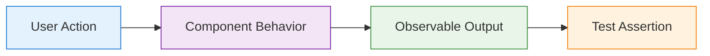

# Unit Testing Standards & Patterns

## Overview

This document establishes comprehensive unit testing standards for the Resonant application using Jest 29.7+, React Testing Library, and TypeScript. Our approach focuses on testing behavior over implementation, ensuring maintainable and reliable test suites.

## Testing Philosophy

### Core Principles

1. **Test Behavior, Not Implementation**: Focus on what the component does, not how it does it
2. **User-Centric Testing**: Test from the user's perspective using accessible queries
3. **Fast and Reliable**: Unit tests should run quickly and consistently
4. **Maintainable**: Tests should be easy to read, understand, and modify
5. **Isolated**: Each test should be independent and not rely on external state

### Testing Mindset



## Jest Configuration

### Project Setup

```javascript
// jest.config.js
const nextJest = require('next/jest')

const createJestConfig = nextJest({
  dir: './',
})

const customJestConfig = {
  setupFilesAfterEnv: ['<rootDir>/jest.setup.js'],
  testEnvironment: 'jsdom',

  // Coverage configuration
  collectCoverage: true,
  collectCoverageFrom: [
    'src/**/*.{js,jsx,ts,tsx}',
    '!src/**/*.d.ts',
    '!src/**/__tests__/**',
    '!src/**/*.stories.tsx',
    'convex/**/*.ts',
    '!convex/_generated/**',
  ],

  coverageThreshold: {
    global: {
      branches: 80,
      functions: 80,
      lines: 80,
      statements: 80,
    },
    './src/components/': {
      branches: 85,
      functions: 85,
      lines: 85,
      statements: 85,
    },
    './src/hooks/': {
      branches: 90,
      functions: 90,
      lines: 90,
      statements: 90,
    },
  },

  // Module name mapping for absolute imports
  moduleNameMapping: {
    '^@/(.*)$': '<rootDir>/src/$1',
    '^@/convex/_generated/api$': '<rootDir>/convex/_generated/api',
  },

  // Test path configuration
  testMatch: [
    '<rootDir>/src/**/__tests__/**/*.{js,jsx,ts,tsx}',
    '<rootDir>/src/**/*.{test,spec}.{js,jsx,ts,tsx}',
  ],

  testPathIgnorePatterns: [
    '<rootDir>/.next/',
    '<rootDir>/node_modules/',
    '<rootDir>/tests/e2e/',
  ],

  // Transform configuration
  transform: {
    '^.+\\.(js|jsx|ts|tsx)$': ['babel-jest', { presets: ['next/babel'] }],
  },

  // Environment variables for testing
  testEnvironmentOptions: {
    url: 'http://localhost:3000',
  },
}

module.exports = createJestConfig(customJestConfig)
```

### Test Setup Configuration

```javascript
// jest.setup.js
import '@testing-library/jest-dom'
import 'jest-axe/extend-expect'

// Mock Next.js router
jest.mock('next/router', () => ({
  useRouter() {
    return {
      route: '/',
      pathname: '/',
      query: {},
      asPath: '/',
      push: jest.fn(),
      replace: jest.fn(),
      reload: jest.fn(),
      back: jest.fn(),
      prefetch: jest.fn(),
      beforePopState: jest.fn(),
      events: {
        on: jest.fn(),
        off: jest.fn(),
        emit: jest.fn(),
      },
    }
  },
}))

// Mock Next.js navigation
jest.mock('next/navigation', () => ({
  useRouter() {
    return {
      push: jest.fn(),
      replace: jest.fn(),
      back: jest.fn(),
      forward: jest.fn(),
      refresh: jest.fn(),
    }
  },
  useSearchParams() {
    return new URLSearchParams()
  },
  usePathname() {
    return '/'
  },
}))

// Mock Convex
jest.mock('convex/react', () => ({
  useQuery: jest.fn(),
  useMutation: jest.fn(),
  useAction: jest.fn(),
  ConvexProvider: ({ children }) => children,
}))

// Mock Clerk authentication
jest.mock('@clerk/nextjs', () => ({
  useUser: () => ({
    user: {
      id: 'test-user-id',
      firstName: 'Test',
      lastName: 'User',
      emailAddresses: [{ emailAddress: 'test@example.com' }],
    },
    isLoaded: true,
    isSignedIn: true,
  }),
  useAuth: () => ({
    userId: 'test-user-id',
    isLoaded: true,
    isSignedIn: true,
  }),
  SignInButton: ({ children }) => children,
  SignOutButton: ({ children }) => children,
  UserButton: () => <div data-testid="user-button">User Menu</div>,
}))

// Global test utilities
global.mockConvexQuery = mockImplementation => {
  const { useQuery } = require('convex/react')
  useQuery.mockImplementation(mockImplementation)
}

global.mockConvexMutation = mockImplementation => {
  const { useMutation } = require('convex/react')
  useMutation.mockImplementation(mockImplementation)
}

// Suppress console errors during tests
const originalError = console.error
beforeAll(() => {
  console.error = (...args) => {
    if (
      typeof args[0] === 'string' &&
      args[0].includes('Warning: ReactDOM.render is no longer supported')
    ) {
      return
    }
    originalError.call(console, ...args)
  }
})

afterAll(() => {
  console.error = originalError
})
```

## Component Testing Patterns

### Basic Component Testing

```typescript
// src/components/ui/button.test.tsx
import React from 'react'
import { render, screen } from '@testing-library/react'
import userEvent from '@testing-library/user-event'
import { Button } from './button'

describe('Button Component', () => {
  describe('Rendering', () => {
    it('renders with correct text content', () => {
      render(<Button>Click me</Button>)
      expect(screen.getByRole('button', { name: 'Click me' })).toBeInTheDocument()
    })

    it('renders all variants correctly', () => {
      const variants = ['default', 'destructive', 'outline', 'secondary', 'ghost', 'link'] as const

      variants.forEach(variant => {
        const { rerender } = render(<Button variant={variant}>Test</Button>)
        const button = screen.getByRole('button')
        expect(button).toHaveClass(expect.stringContaining(variant))
        rerender(<></>)
      })
    })

    it('renders all sizes correctly', () => {
      const sizes = ['sm', 'default', 'lg', 'icon'] as const

      sizes.forEach(size => {
        const { rerender } = render(<Button size={size}>Test</Button>)
        const button = screen.getByRole('button')
        expect(button).toHaveClass(expect.stringContaining(size))
        rerender(<></>)
      })
    })
  })

  describe('Interactions', () => {
    it('calls onClick when clicked', async () => {
      const handleClick = jest.fn()
      const user = userEvent.setup()

      render(<Button onClick={handleClick}>Click me</Button>)

      await user.click(screen.getByRole('button'))
      expect(handleClick).toHaveBeenCalledTimes(1)
    })

    it('calls onClick when Enter key is pressed', async () => {
      const handleClick = jest.fn()
      const user = userEvent.setup()

      render(<Button onClick={handleClick}>Click me</Button>)

      const button = screen.getByRole('button')
      button.focus()
      await user.keyboard('{Enter}')
      expect(handleClick).toHaveBeenCalledTimes(1)
    })

    it('calls onClick when Space key is pressed', async () => {
      const handleClick = jest.fn()
      const user = userEvent.setup()

      render(<Button onClick={handleClick}>Click me</Button>)

      const button = screen.getByRole('button')
      button.focus()
      await user.keyboard(' ')
      expect(handleClick).toHaveBeenCalledTimes(1)
    })

    it('does not call onClick when disabled', async () => {
      const handleClick = jest.fn()
      const user = userEvent.setup()

      render(<Button disabled onClick={handleClick}>Click me</Button>)

      await user.click(screen.getByRole('button'))
      expect(handleClick).not.toHaveBeenCalled()
    })
  })

  describe('States', () => {
    it('shows loading indicator when loading', () => {
      render(<Button loading>Test</Button>)
      expect(screen.getByTestId('loading-spinner')).toBeInTheDocument()
    })

    it('is disabled when loading', () => {
      render(<Button loading>Test</Button>)
      expect(screen.getByRole('button')).toBeDisabled()
    })

    it('hides left icon when loading', () => {
      render(
        <Button loading leftIcon={<span data-testid="left-icon">Icon</span>}>
          Test
        </Button>
      )
      expect(screen.queryByTestId('left-icon')).not.toBeInTheDocument()
    })
  })

  describe('Accessibility', () => {
    it('has proper button role', () => {
      render(<Button>Test</Button>)
      expect(screen.getByRole('button')).toBeInTheDocument()
    })

    it('supports aria-label', () => {
      render(<Button aria-label="Close dialog">×</Button>)
      expect(screen.getByLabelText('Close dialog')).toBeInTheDocument()
    })

    it('supports aria-describedby', () => {
      render(
        <>
          <Button aria-describedby="description">Test</Button>
          <p id="description">Button description</p>
        </>
      )
      expect(screen.getByRole('button')).toHaveAttribute('aria-describedby', 'description')
    })

    it('is focusable when not disabled', () => {
      render(<Button>Test</Button>)
      const button = screen.getByRole('button')
      button.focus()
      expect(button).toHaveFocus()
    })

    it('is not focusable when disabled', () => {
      render(<Button disabled>Test</Button>)
      const button = screen.getByRole('button')
      button.focus()
      expect(button).not.toHaveFocus()
    })
  })
})
```

### Form Component Testing

```typescript
// src/components/features/journal/journal-entry-editor.test.tsx
import React from 'react'
import { render, screen, waitFor } from '@testing-library/react'
import userEvent from '@testing-library/user-event'
import { JournalEntryEditor } from './journal-entry-editor'

// Mock Convex mutations
const mockCreateEntry = jest.fn()
const mockUpdateEntry = jest.fn()

beforeEach(() => {
  mockConvexMutation(() => mockCreateEntry)
  jest.clearAllMocks()
})

describe('JournalEntryEditor', () => {
  const defaultProps = {
    onSave: jest.fn(),
    onCancel: jest.fn(),
  }

  describe('New Entry Mode', () => {
    it('renders empty form for new entry', () => {
      render(<JournalEntryEditor {...defaultProps} />)

      expect(screen.getByRole('textbox', { name: /content/i })).toHaveValue('')
      expect(screen.getByRole('combobox', { name: /mood/i })).toHaveValue('')
      expect(screen.getByRole('button', { name: /save entry/i })).toBeInTheDocument()
    })

    it('creates new entry when form is submitted', async () => {
      const user = userEvent.setup()
      mockCreateEntry.mockResolvedValue({ id: 'new-entry-id' })

      render(<JournalEntryEditor {...defaultProps} />)

      // Fill out the form
      await user.type(screen.getByRole('textbox', { name: /content/i }), 'Today was great!')
      await user.selectOptions(screen.getByRole('combobox', { name: /mood/i }), 'happy')

      // Submit the form
      await user.click(screen.getByRole('button', { name: /save entry/i }))

      await waitFor(() => {
        expect(mockCreateEntry).toHaveBeenCalledWith({
          content: 'Today was great!',
          mood: 'happy',
          tags: [],
          relationships: [],
        })
      })

      expect(defaultProps.onSave).toHaveBeenCalledWith({ id: 'new-entry-id' })
    })
  })

  describe('Edit Mode', () => {
    const existingEntry = {
      id: 'entry-123',
      content: 'Existing content',
      mood: 'neutral',
      tags: ['reflection'],
      relationships: [],
    }

    it('populates form with existing entry data', () => {
      render(<JournalEntryEditor {...defaultProps} entry={existingEntry} />)

      expect(screen.getByRole('textbox', { name: /content/i })).toHaveValue('Existing content')
      expect(screen.getByRole('combobox', { name: /mood/i })).toHaveValue('neutral')
      expect(screen.getByText('reflection')).toBeInTheDocument()
    })

    it('updates existing entry when form is submitted', async () => {
      const user = userEvent.setup()
      mockUpdateEntry.mockResolvedValue(existingEntry)

      render(<JournalEntryEditor {...defaultProps} entry={existingEntry} />)

      // Modify the content
      const contentField = screen.getByRole('textbox', { name: /content/i })
      await user.clear(contentField)
      await user.type(contentField, 'Updated content')

      // Submit the form
      await user.click(screen.getByRole('button', { name: /save entry/i }))

      await waitFor(() => {
        expect(mockUpdateEntry).toHaveBeenCalledWith({
          id: 'entry-123',
          content: 'Updated content',
          mood: 'neutral',
          tags: ['reflection'],
          relationships: [],
        })
      })
    })
  })

  describe('Validation', () => {
    it('shows error when content is empty', async () => {
      const user = userEvent.setup()

      render(<JournalEntryEditor {...defaultProps} />)

      // Try to submit empty form
      await user.click(screen.getByRole('button', { name: /save entry/i }))

      expect(screen.getByText(/content is required/i)).toBeInTheDocument()
      expect(mockCreateEntry).not.toHaveBeenCalled()
    })

    it('shows error when content is too long', async () => {
      const user = userEvent.setup()
      const longContent = 'a'.repeat(5001) // Assuming 5000 char limit

      render(<JournalEntryEditor {...defaultProps} />)

      await user.type(screen.getByRole('textbox', { name: /content/i }), longContent)
      await user.click(screen.getByRole('button', { name: /save entry/i }))

      expect(screen.getByText(/content is too long/i)).toBeInTheDocument()
    })
  })

  describe('Auto-save functionality', () => {
    it('auto-saves draft after typing stops', async () => {
      const user = userEvent.setup()

      render(<JournalEntryEditor {...defaultProps} />)

      // Type content
      await user.type(screen.getByRole('textbox', { name: /content/i }), 'Draft content')

      // Wait for auto-save delay
      await waitFor(() => {
        expect(screen.getByText(/draft saved/i)).toBeInTheDocument()
      }, { timeout: 3000 })
    })
  })
})
```

## Custom Hook Testing

### Simple Hook Testing

```typescript
// src/hooks/__tests__/use-auto-save.test.ts
import { renderHook, act } from '@testing-library/react'
import { useAutoSave } from '../use-auto-save'

describe('useAutoSave', () => {
  beforeEach(() => {
    jest.useFakeTimers()
  })

  afterEach(() => {
    jest.runOnlyPendingTimers()
    jest.useRealTimers()
  })

  it('calls save function after delay when data changes', () => {
    const mockSave = jest.fn()
    const { rerender } = renderHook(
      ({ data }) => useAutoSave(data, mockSave, 1000),
      { initialProps: { data: 'initial' } }
    )

    // Change data
    rerender({ data: 'updated' })

    // Fast-forward time
    act(() => {
      jest.advanceTimersByTime(1000)
    })

    expect(mockSave).toHaveBeenCalledWith('updated')
  })

  it('debounces multiple rapid changes', () => {
    const mockSave = jest.fn()
    const { rerender } = renderHook(
      ({ data }) => useAutoSave(data, mockSave, 1000),
      { initialProps: { data: 'initial' } }
    )

    // Make multiple rapid changes
    rerender({ data: 'change1' })
    rerender({ data: 'change2' })
    rerender({ data: 'change3' })

    // Fast-forward time
    act(() => {
      jest.advanceTimersByTime(1000)
    })

    // Should only save the latest value once
    expect(mockSave).toHaveBeenCalledTimes(1)
    expect(mockSave).toHaveBeenCalledWith('change3')
  })

  it('returns save status correctly', () => {
    const mockSave = jest.fn().mockResolvedValue(undefined)
    const { result, rerender } = renderHook(
      ({ data }) => useAutoSave(data, mockSave, 1000),
      { initialProps: { data: 'initial' } }
    )

    // Initially not saving
    expect(result.current.isSaving).toBe(false)
    expect(result.current.lastSaved).toBeNull()

    // Change data
    rerender({ data: 'updated' })

    // Should be saving after delay
    act(() => {
      jest.advanceTimersByTime(1000)
    })

    expect(result.current.isSaving).toBe(true)
  })
})
```

### Complex Hook Testing with Context

```typescript
// src/hooks/__tests__/use-journal-entries.test.tsx
import React from 'react'
import { renderHook, waitFor } from '@testing-library/react'
import { ConvexProvider } from 'convex/react'
import { useJournalEntries } from '../use-journal-entries'

const mockClient = {
  query: jest.fn(),
  mutation: jest.fn(),
  action: jest.fn(),
}

const Wrapper = ({ children }: { children: React.ReactNode }) => (
  <ConvexProvider client={mockClient as any}>
    {children}
  </ConvexProvider>
)

describe('useJournalEntries', () => {
  beforeEach(() => {
    jest.clearAllMocks()
    mockConvexQuery(() => [])
  })

  it('fetches journal entries for user', async () => {
    const mockEntries = [
      { id: '1', content: 'Entry 1', mood: 'happy' },
      { id: '2', content: 'Entry 2', mood: 'sad' },
    ]

    mockConvexQuery(() => mockEntries)

    const { result } = renderHook(() => useJournalEntries('user-123'), {
      wrapper: Wrapper,
    })

    await waitFor(() => {
      expect(result.current.entries).toEqual(mockEntries)
    })
  })

  it('filters entries by mood when specified', () => {
    const mockEntries = [
      { id: '1', content: 'Entry 1', mood: 'happy' },
      { id: '2', content: 'Entry 2', mood: 'sad' },
      { id: '3', content: 'Entry 3', mood: 'happy' },
    ]

    mockConvexQuery(() => mockEntries)

    const { result } = renderHook(
      () => useJournalEntries('user-123', { mood: 'happy' }),
      { wrapper: Wrapper }
    )

    expect(result.current.entries).toHaveLength(2)
    expect(result.current.entries.every(entry => entry.mood === 'happy')).toBe(true)
  })

  it('sorts entries by date descending by default', () => {
    const mockEntries = [
      { id: '1', content: 'Old entry', createdAt: '2025-01-01' },
      { id: '2', content: 'New entry', createdAt: '2025-01-03' },
      { id: '3', content: 'Middle entry', createdAt: '2025-01-02' },
    ]

    mockConvexQuery(() => mockEntries)

    const { result } = renderHook(() => useJournalEntries('user-123'), {
      wrapper: Wrapper,
    })

    expect(result.current.entries[0].content).toBe('New entry')
    expect(result.current.entries[1].content).toBe('Middle entry')
    expect(result.current.entries[2].content).toBe('Old entry')
  })
})
```

## Utility Function Testing

### Pure Function Testing

```typescript
// src/lib/__tests__/utils.test.ts
import { cn, formatDate, calculateMoodTrend } from '../utils'

describe('cn utility', () => {
  it('combines class names correctly', () => {
    expect(cn('base', 'additional')).toBe('base additional')
  })

  it('handles conditional classes', () => {
    expect(cn('base', true && 'conditional', false && 'hidden')).toBe(
      'base conditional'
    )
  })

  it('handles undefined and null values', () => {
    expect(cn('base', undefined, null, 'valid')).toBe('base valid')
  })

  it('deduplicates classes', () => {
    expect(cn('flex flex-row', 'flex')).toBe('flex flex-row')
  })
})

describe('formatDate utility', () => {
  it('formats date in default format', () => {
    const date = new Date('2025-01-15T10:30:00Z')
    expect(formatDate(date)).toBe('January 15, 2025')
  })

  it('formats date with custom format', () => {
    const date = new Date('2025-01-15T10:30:00Z')
    expect(formatDate(date, 'short')).toBe('Jan 15, 2025')
  })

  it('handles invalid dates', () => {
    expect(formatDate(new Date('invalid'))).toBe('Invalid Date')
  })
})

describe('calculateMoodTrend', () => {
  const mockEntries = [
    { mood: 'happy', createdAt: '2025-01-01' },
    { mood: 'sad', createdAt: '2025-01-02' },
    { mood: 'happy', createdAt: '2025-01-03' },
    { mood: 'neutral', createdAt: '2025-01-04' },
  ]

  it('calculates positive trend', () => {
    const result = calculateMoodTrend(mockEntries)
    expect(result.direction).toBe('up')
    expect(result.percentage).toBeGreaterThan(0)
  })

  it('handles empty entries array', () => {
    const result = calculateMoodTrend([])
    expect(result.direction).toBe('neutral')
    expect(result.percentage).toBe(0)
  })

  it('handles single entry', () => {
    const result = calculateMoodTrend([mockEntries[0]])
    expect(result.direction).toBe('neutral')
    expect(result.percentage).toBe(0)
  })
})
```

### Complex Logic Testing

```typescript
// src/lib/__tests__/analytics.test.ts
import { calculateHealthScore, generateInsights } from '../analytics'

describe('calculateHealthScore', () => {
  it('calculates score based on entry patterns', () => {
    const entries = [
      { mood: 'happy', relationships: ['partner'], createdAt: '2025-01-01' },
      { mood: 'happy', relationships: ['partner'], createdAt: '2025-01-02' },
      { mood: 'neutral', relationships: ['friend'], createdAt: '2025-01-03' },
    ]

    const score = calculateHealthScore(entries, 'partner')
    expect(score).toBeGreaterThan(0.7) // Expect high score for positive entries
    expect(score).toBeLessThanOrEqual(1)
  })

  it('returns lower score for negative patterns', () => {
    const entries = [
      { mood: 'sad', relationships: ['partner'], createdAt: '2025-01-01' },
      { mood: 'angry', relationships: ['partner'], createdAt: '2025-01-02' },
      {
        mood: 'frustrated',
        relationships: ['partner'],
        createdAt: '2025-01-03',
      },
    ]

    const score = calculateHealthScore(entries, 'partner')
    expect(score).toBeLessThan(0.5)
  })

  it('handles edge cases', () => {
    expect(calculateHealthScore([], 'partner')).toBe(0.5) // Neutral score for no data
    expect(calculateHealthScore(null as any, 'partner')).toBe(0.5)
  })
})

describe('generateInsights', () => {
  it('generates relevant insights from data', () => {
    const entries = [
      { mood: 'happy', tags: ['work'], createdAt: '2025-01-01' },
      { mood: 'stressed', tags: ['work'], createdAt: '2025-01-02' },
      { mood: 'happy', tags: ['family'], createdAt: '2025-01-03' },
    ]

    const insights = generateInsights(entries)

    expect(insights).toHaveLength(2)
    expect(insights.some(insight => insight.category === 'mood_patterns')).toBe(
      true
    )
    expect(insights.some(insight => insight.category === 'tag_analysis')).toBe(
      true
    )
  })

  it('prioritizes insights by relevance', () => {
    const entries = Array(20)
      .fill(null)
      .map((_, i) => ({
        mood: i % 2 === 0 ? 'happy' : 'sad',
        tags: ['work'],
        createdAt: `2025-01-${i + 1}`,
      }))

    const insights = generateInsights(entries)

    // Most relevant insights should come first
    expect(insights[0].confidence).toBeGreaterThan(
      insights[insights.length - 1].confidence
    )
  })
})
```

## Test Utilities and Helpers

### Custom Render Function

```typescript
// src/__tests__/test-utils.tsx
import React from 'react'
import { render, RenderOptions } from '@testing-library/react'
import { ConvexProvider } from 'convex/react'
import { ClerkProvider } from '@clerk/nextjs'
import { ThemeProvider } from '@/components/providers/theme-provider'

const mockConvexClient = {
  query: jest.fn(),
  mutation: jest.fn(),
  action: jest.fn(),
}

const AllTheProviders = ({ children }: { children: React.ReactNode }) => {
  return (
    <ClerkProvider publishableKey="test-key">
      <ConvexProvider client={mockConvexClient as any}>
        <ThemeProvider defaultTheme="light" storageKey="test-theme">
          {children}
        </ThemeProvider>
      </ConvexProvider>
    </ClerkProvider>
  )
}

const customRender = (
  ui: React.ReactElement,
  options?: Omit<RenderOptions, 'wrapper'>
) => render(ui, { wrapper: AllTheProviders, ...options })

export * from '@testing-library/react'
export { customRender as render }
```

### Mock Data Factories

```typescript
// src/__tests__/factories.ts
import { JournalEntry, Relationship, User } from '@/lib/types'

export const createMockUser = (overrides: Partial<User> = {}): User => ({
  id: 'user-123',
  firstName: 'Test',
  lastName: 'User',
  email: 'test@example.com',
  createdAt: new Date().toISOString(),
  ...overrides,
})

export const createMockJournalEntry = (
  overrides: Partial<JournalEntry> = {}
): JournalEntry => ({
  id: 'entry-123',
  userId: 'user-123',
  content: 'Test journal entry content',
  mood: 'neutral',
  tags: [],
  relationships: [],
  createdAt: new Date().toISOString(),
  updatedAt: new Date().toISOString(),
  ...overrides,
})

export const createMockRelationship = (
  overrides: Partial<Relationship> = {}
): Relationship => ({
  id: 'rel-123',
  userId: 'user-123',
  name: 'Test Relationship',
  type: 'friend',
  photo: null,
  initials: 'TR',
  createdAt: new Date().toISOString(),
  ...overrides,
})

// Factory with multiple entries
export const createMockJournalEntries = (count: number): JournalEntry[] => {
  return Array.from({ length: count }, (_, i) =>
    createMockJournalEntry({
      id: `entry-${i + 1}`,
      content: `Journal entry ${i + 1}`,
      createdAt: new Date(Date.now() - i * 24 * 60 * 60 * 1000).toISOString(),
    })
  )
}
```

## Best Practices

### Test Organization

1. **Descriptive Test Names**: Use clear, descriptive test names that explain what is being tested
2. **Arrange-Act-Assert**: Follow the AAA pattern for test structure
3. **One Assertion Per Test**: Focus each test on a single behavior
4. **Group Related Tests**: Use `describe` blocks to organize related tests

### Mocking Guidelines

1. **Mock External Dependencies**: Always mock APIs, external services, and complex dependencies
2. **Mock at the Boundaries**: Mock at the module boundary, not internal implementation
3. **Use Realistic Mock Data**: Ensure mock data represents real-world scenarios
4. **Reset Mocks**: Clear mock state between tests to avoid interference

### Performance Considerations

1. **Minimize DOM Operations**: Use `screen` queries efficiently
2. **Avoid Unnecessary Renders**: Use `rerender` sparingly
3. **Use `waitFor` Appropriately**: Only when testing asynchronous behavior
4. **Clean Up Resources**: Ensure proper cleanup in `afterEach` hooks

### Common Anti-patterns

❌ **Testing Implementation Details**

```typescript
// Don't test internal state or methods
expect(wrapper.state('isOpen')).toBe(true)
```

✅ **Testing User-Observable Behavior**

```typescript
// Test what users can see and interact with
expect(screen.getByRole('dialog')).toBeVisible()
```

❌ **Over-mocking**

```typescript
// Don't mock everything
jest.mock('./utils') // Mocks the entire utils module
```

✅ **Targeted Mocking**

```typescript
// Mock only what's necessary
jest.mock('./api', () => ({
  fetchUserData: jest.fn(),
}))
```

---

**Last Updated**: January 2025  
**Version**: 1.0.0  
**Next Review**: February 2025
