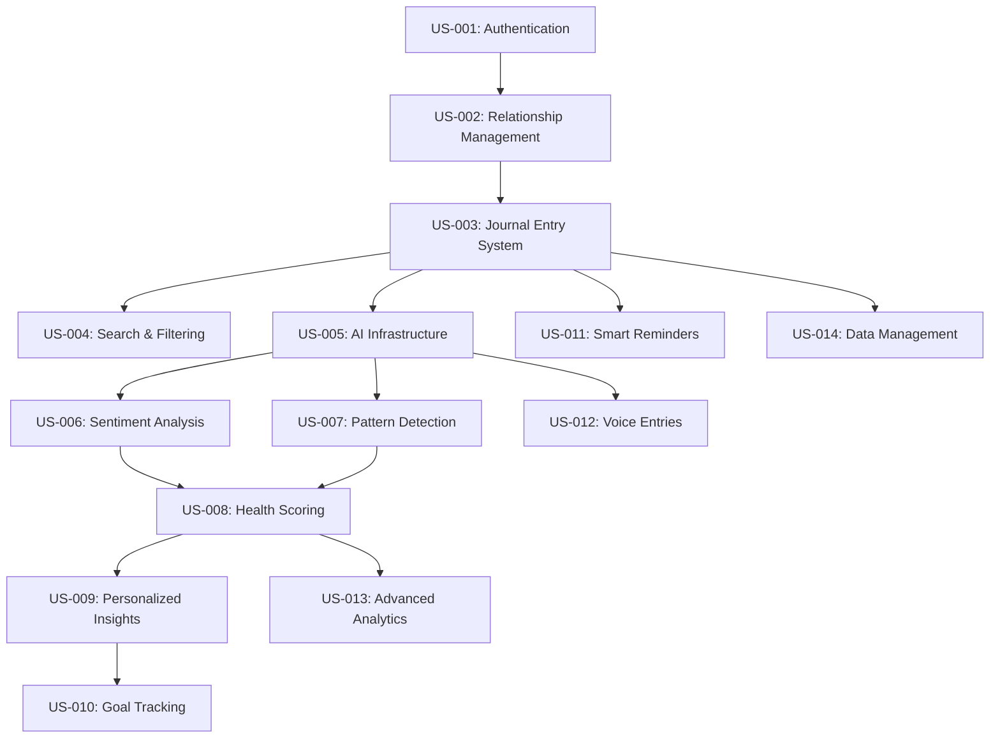

# User Stories and Acceptance Criteria

This document provides comprehensive user stories with detailed acceptance criteria for all four epics of the Resonant relationship health journal application.

## Table of Contents

1. [Story Writing Guidelines](#story-writing-guidelines)
2. [Epic 1: Core Relationship Journal](#epic-1-core-relationship-journal)
3. [Epic 2: AI-Powered Analysis](#epic-2-ai-powered-analysis)
4. [Epic 3: Insights & Guidance](#epic-3-insights--guidance)
5. [Epic 4: Advanced Features](#epic-4-advanced-features)
6. [Story Point Estimation Guide](#story-point-estimation-guide)
7. [Cross-Epic Dependencies](#cross-epic-dependencies)

## Story Writing Guidelines

### Story Format

```
**As a** [user type],
**I want** [goal/functionality],
**so that** [benefit/value].
```

### Acceptance Criteria Format

- **Given** [precondition]
- **When** [action]
- **Then** [expected result]

### Priority Levels

- **P0 (Critical)**: MVP blockers, core functionality
- **P1 (High)**: Important features for user value
- **P2 (Medium)**: Nice-to-have features
- **P3 (Low)**: Future enhancements

### Story Point Scale

- **1 Point**: Simple task (1-2 hours)
- **2 Points**: Small feature (half day)
- **3 Points**: Medium feature (1 day)
- **5 Points**: Large feature (2-3 days)
- **8 Points**: Complex feature (1 week)
- **13 Points**: Epic-level (needs breakdown)

## Epic 1: Core Relationship Journal

### 1.1 User Authentication and Account Setup

**Story ID**: US-001  
**Priority**: P0  
**Story Points**: 5  
**Epic**: Core Foundation

**As a** new user,  
**I want** to create an account and set up my profile,  
**so that** I can securely access my relationship journal.

**Acceptance Criteria:**

1. **Account Creation**
   - **Given** I am on the landing page
   - **When** I click "Sign Up"
   - **Then** I am taken to a registration form

2. **Registration Form Validation**
   - **Given** I am on the registration form
   - **When** I enter invalid email format
   - **Then** I see an error message "Please enter a valid email"
   - **And** the submit button remains disabled

3. **Successful Registration**
   - **Given** I have entered valid credentials
   - **When** I submit the registration form
   - **Then** my account is created
   - **And** I receive an email verification link
   - **And** I am redirected to the onboarding flow

4. **Email Verification**
   - **Given** I have registered an account
   - **When** I click the verification link in my email
   - **Then** my email is verified
   - **And** I am redirected to complete my profile

5. **Login Flow**
   - **Given** I have a verified account
   - **When** I enter my credentials on the login page
   - **Then** I am logged in
   - **And** redirected to my dashboard

6. **Password Reset**
   - **Given** I have forgotten my password
   - **When** I click "Forgot Password" and enter my email
   - **Then** I receive a password reset link
   - **And** can set a new password

**Definition of Done:**

- User can register, verify email, and log in
- Password reset functionality works
- All form validations are in place
- Error states are handled gracefully
- Authentication state persists across sessions

---

### 1.2 Relationship Management System

**Story ID**: US-002  
**Priority**: P0  
**Story Points**: 8  
**Epic**: Core Foundation

**As a** user,  
**I want** to create and manage my relationships,  
**so that** I can organize my journal entries by the people in my life.

**Acceptance Criteria:**

1. **Add New Relationship**
   - **Given** I am logged in
   - **When** I click "Add Relationship"
   - **Then** I see a form to create a new relationship
   - **And** I can enter name, relationship type, and optional photo

2. **Relationship Types**
   - **Given** I am creating a relationship
   - **When** I select the relationship type
   - **Then** I can choose from: Partner, Family, Friend, Colleague, Other
   - **And** each type has appropriate icon and color coding

3. **Relationship Profile**
   - **Given** I am creating a relationship
   - **When** I fill out the relationship form
   - **Then** I can add: name (required), type (required), photo (optional), notes (optional)
   - **And** the system generates initials if no photo is provided

4. **Free Tier Limitations**
   - **Given** I am on the free tier
   - **When** I try to add a 4th relationship
   - **Then** I see a premium upgrade prompt
   - **And** cannot create additional relationships

5. **Premium Tier Access**
   - **Given** I am on the premium tier
   - **When** I add relationships
   - **Then** I can create unlimited relationships
   - **And** see no tier restrictions

6. **Edit Relationship**
   - **Given** I have existing relationships
   - **When** I click "Edit" on a relationship
   - **Then** I can modify all relationship details
   - **And** changes are saved immediately

7. **Delete Relationship**
   - **Given** I want to remove a relationship
   - **When** I click "Delete" on a relationship
   - **Then** I see a confirmation dialog
   - **And** if confirmed, the relationship is marked as inactive
   - **And** associated journal entries remain but show "Deleted Relationship"

8. **Relationship List View**
   - **Given** I have multiple relationships
   - **When** I view my relationships page
   - **Then** I see all relationships in a grid/list format
   - **And** can sort by name, type, or date added
   - **And** see relationship statistics (entry count, last journal date)

**Definition of Done:**

- Users can create, edit, and delete relationships
- Free tier enforces 3 relationship limit
- Premium tier allows unlimited relationships
- Relationship data is properly validated
- Soft delete preserves data integrity

---

### 1.3 Journal Entry Creation and Management

**Story ID**: US-003  
**Priority**: P0  
**Story Points**: 8  
**Epic**: Core Foundation

**As a** user,  
**I want** to write journal entries about my relationships,  
**so that** I can record my thoughts and feelings over time.

**Acceptance Criteria:**

1. **Create New Entry**
   - **Given** I am on the journal page
   - **When** I click "New Entry"
   - **Then** I see a journal entry form
   - **And** can write in a rich text editor

2. **Entry Content Requirements**
   - **Given** I am writing an entry
   - **When** I type in the content field
   - **Then** the content must be at least 50 characters
   - **And** I see a character counter
   - **And** the save button is disabled until minimum length is met

3. **Relationship Tagging**
   - **Given** I am creating an entry
   - **When** I click the relationship selector
   - **Then** I can select one or multiple relationships
   - **And** see selected relationships displayed as chips
   - **And** can remove relationship tags before saving

4. **Mood Selection**
   - **Given** I am creating an entry
   - **When** I click the mood selector
   - **Then** I can choose from 10 predefined moods
   - **And** each mood has an emoji and descriptive name
   - **And** mood selection is optional

5. **Custom Tags**
   - **Given** I am creating an entry
   - **When** I type in the tags field
   - **Then** I can add custom tags separated by commas
   - **And** see autocomplete suggestions from previous tags
   - **And** tags are optional

6. **Privacy Controls**
   - **Given** I am creating an entry
   - **When** I toggle the AI analysis setting
   - **Then** I can choose to allow or disallow AI analysis
   - **And** see clear indicators of my privacy choice
   - **And** default setting is based on user preferences

7. **Auto-save Functionality**
   - **Given** I am writing an entry
   - **When** I pause typing for 3 seconds
   - **Then** the entry is automatically saved as a draft
   - **And** I see a "Draft saved" indicator
   - **And** can recover the draft if I leave and return

8. **Save and Submit**
   - **Given** I have completed an entry
   - **When** I click "Save Entry"
   - **Then** the entry is permanently saved
   - **And** I see a success confirmation
   - **And** am redirected to the journal list view

9. **Edit Existing Entry**
   - **Given** I have a saved entry
   - **When** I click "Edit" on the entry
   - **Then** I can modify all entry content
   - **And** see an "Last edited" timestamp
   - **And** can save changes or cancel edits

10. **Delete Entry**
    - **Given** I want to remove an entry
    - **When** I click "Delete" on an entry
    - **Then** I see a confirmation dialog warning data loss
    - **And** if confirmed, the entry is permanently deleted

**Definition of Done:**

- Users can create, edit, and delete journal entries
- Auto-save prevents data loss
- Relationship tagging works correctly
- Privacy controls are respected
- All form validations work properly

---

### 1.4 Journal Entry List and Search

**Story ID**: US-004  
**Priority**: P1  
**Story Points**: 5  
**Epic**: Core Foundation

**As a** user,  
**I want** to view and search through my journal entries,  
**so that** I can find and review past reflections about my relationships.

**Acceptance Criteria:**

1. **Journal List View**
   - **Given** I have journal entries
   - **When** I visit the journal page
   - **Then** I see my entries in reverse chronological order
   - **And** each entry shows: date, excerpt, relationships, mood icon

2. **Entry Card Display**
   - **Given** I am viewing the journal list
   - **When** I look at an entry card
   - **Then** I see: date created, first 150 characters, associated relationships, mood, tags
   - **And** can click to read the full entry

3. **Search Functionality**
   - **Given** I want to find specific entries
   - **When** I type in the search box
   - **Then** results filter in real-time by content, tags, and relationship names
   - **And** search terms are highlighted in results

4. **Filter by Relationship**
   - **Given** I want to see entries for specific people
   - **When** I select a relationship filter
   - **Then** only entries tagged with that relationship appear
   - **And** I can select multiple relationships

5. **Filter by Mood**
   - **Given** I want to see entries with specific moods
   - **When** I select mood filters
   - **Then** only entries with those moods appear
   - **And** I can select multiple moods

6. **Filter by Date Range**
   - **Given** I want to see entries from a specific time period
   - **When** I set a date range filter
   - **Then** only entries within that range appear
   - **And** I can use preset ranges (last week, month, year)

7. **Filter by Tags**
   - **Given** I want to see entries with specific themes
   - **When** I select tag filters
   - **Then** only entries with those tags appear
   - **And** I see a tag cloud of popular tags

8. **Clear Filters**
   - **Given** I have applied filters
   - **When** I click "Clear All Filters"
   - **Then** all filters are removed
   - **And** I see the complete journal list

9. **Empty States**
   - **Given** I have no journal entries
   - **When** I visit the journal page
   - **Then** I see an encouraging message to write my first entry
   - **And** a prominent "Start Writing" button

10. **Pagination**
    - **Given** I have many journal entries
    - **When** I scroll to the bottom of the list
    - **Then** more entries load automatically
    - **And** performance remains smooth with large datasets

**Definition of Done:**

- Entry list displays correctly with proper sorting
- Search and all filters work accurately
- Performance is acceptable with large datasets
- Empty states provide clear guidance
- Responsive design works on all devices

---

## Epic 2: AI-Powered Analysis

### 2.1 AI Analysis Infrastructure

**Story ID**: US-005  
**Priority**: P0  
**Story Points**: 8  
**Epic**: AI Analysis

**As a** premium user,  
**I want** my journal entries to be analyzed by AI,  
**so that** I can gain insights into my relationship patterns.

**Acceptance Criteria:**

1. **AI Analysis Opt-in**
   - **Given** I am creating or editing an entry
   - **When** I see the AI analysis toggle
   - **Then** I can choose to enable or disable AI analysis for that entry
   - **And** see clear explanation of what AI analysis includes

2. **Premium Feature Gate**
   - **Given** I am on the free tier
   - **When** I try to enable AI analysis
   - **Then** I see a premium upgrade prompt
   - **And** cannot enable AI analysis

3. **Analysis Queue System**
   - **Given** I have saved an entry with AI analysis enabled
   - **When** the entry is submitted
   - **Then** it is queued for AI processing
   - **And** I see a "Analysis Pending" status

4. **Processing Indicators**
   - **Given** my entry is being analyzed
   - **When** I view the entry
   - **Then** I see a progress indicator
   - **And** estimated completion time

5. **Analysis Completion**
   - **Given** AI analysis is complete
   - **When** I view the entry
   - **Then** I see the analysis results
   - **And** receive a notification of completion

6. **Analysis Results Display**
   - **Given** my entry has been analyzed
   - **When** I view the analysis
   - **Then** I see: sentiment score, emotional themes, relationship dynamics, suggested tags
   - **And** all insights are clearly categorized

7. **Privacy Controls**
   - **Given** I have privacy concerns
   - **When** I disable AI analysis
   - **Then** my entry content is not sent to external AI services
   - **And** I see confirmation of my privacy choice

8. **Error Handling**
   - **Given** AI analysis fails
   - **When** there is a processing error
   - **Then** I see a clear error message
   - **And** option to retry analysis

9. **Analysis History**
   - **Given** I have multiple analyzed entries
   - **When** I view my analysis history
   - **Then** I can see trends in sentiment and themes over time
   - **And** compare analyses across different relationships

**Definition of Done:**

- AI analysis pipeline is functional
- Privacy controls are properly implemented
- Error handling covers all failure scenarios
- Premium gating works correctly
- Analysis results are displayed clearly

---

### 2.2 Sentiment and Emotional Analysis

**Story ID**: US-006  
**Priority**: P1  
**Story Points**: 5  
**Epic**: AI Analysis

**As a** premium user,  
**I want** to understand the emotional tone of my journal entries,  
**so that** I can track my emotional patterns in relationships.

**Acceptance Criteria:**

1. **Sentiment Scoring**
   - **Given** my entry has been analyzed
   - **When** I view the sentiment analysis
   - **Then** I see a sentiment score from -1 (very negative) to +1 (very positive)
   - **And** the score is displayed with color coding and descriptive text

2. **Emotional Categories**
   - **Given** my entry contains emotional content
   - **When** I view the emotional analysis
   - **Then** I see detected emotions from categories: joy, sadness, anger, fear, surprise, trust, anticipation, disgust
   - **And** each emotion has a confidence percentage

3. **Emotional Intensity**
   - **Given** emotions are detected in my entry
   - **When** I view the analysis
   - **Then** I see intensity levels (low, medium, high) for each emotion
   - **And** can understand the strength of my emotional state

4. **Relationship-Specific Sentiment**
   - **Given** my entry mentions multiple relationships
   - **When** I view the analysis
   - **Then** I see sentiment scores for each relationship mentioned
   - **And** can compare emotional responses across relationships

5. **Sentiment Trends**
   - **Given** I have multiple analyzed entries
   - **When** I view my sentiment trends
   - **Then** I see a timeline of emotional patterns
   - **And** can identify positive and negative trend periods

6. **Emotional Triggers**
   - **Given** the AI detects emotional patterns
   - **When** I view trigger analysis
   - **Then** I see potential triggers for negative emotions
   - **And** patterns in what creates positive emotions

7. **Confidence Indicators**
   - **Given** AI provides sentiment analysis
   - **When** I view the results
   - **Then** I see confidence percentages for all insights
   - **And** understand the reliability of each analysis

8. **Historical Comparison**
   - **Given** I have analysis history
   - **When** I compare current sentiment to past entries
   - **Then** I see how my emotional state has changed over time
   - **And** can identify improvement or decline patterns

**Definition of Done:**

- Sentiment analysis is accurate and helpful
- Emotional categories are properly detected
- Trend analysis shows meaningful patterns
- Confidence scores help users trust insights
- Visualizations are clear and actionable

---

### 2.3 Relationship Pattern Detection

**Story ID**: US-007  
**Priority**: P1  
**Story Points**: 8  
**Epic**: AI Analysis

**As a** premium user,  
**I want** AI to identify patterns in my relationship dynamics,  
**so that** I can understand recurring themes and behaviors.

**Acceptance Criteria:**

1. **Communication Pattern Detection**
   - **Given** I have multiple entries about relationship interactions
   - **When** AI analyzes communication patterns
   - **Then** I see insights about communication frequency, tone, and effectiveness
   - **And** trends in how communication affects relationship satisfaction

2. **Conflict Pattern Analysis**
   - **Given** my entries describe conflicts or disagreements
   - **When** AI analyzes conflict patterns
   - **Then** I see common conflict triggers, resolution styles, and outcomes
   - **And** suggestions for better conflict management

3. **Support Pattern Recognition**
   - **Given** my entries mention giving or receiving support
   - **When** AI analyzes support patterns
   - **Then** I see how support flows in my relationships
   - **And** identify imbalances or positive support cycles

4. **Intimacy and Connection Trends**
   - **Given** my entries discuss emotional or physical intimacy
   - **When** AI analyzes intimacy patterns
   - **Then** I see trends in emotional connection levels
   - **And** factors that enhance or diminish intimacy

5. **Behavioral Pattern Insights**
   - **Given** I describe my behaviors in relationships
   - **When** AI analyzes behavioral patterns
   - **Then** I see recurring behavior themes
   - **And** how my behaviors impact relationship dynamics

6. **Cross-Relationship Patterns**
   - **Given** I have entries about multiple relationships
   - **When** AI compares patterns across relationships
   - **Then** I see consistent patterns in how I relate to others
   - **And** differences in how I interact with different relationship types

7. **Seasonal and Temporal Patterns**
   - **Given** I have entries spanning different time periods
   - **When** AI analyzes temporal patterns
   - **Then** I see how relationship dynamics change over seasons, stress periods, or life events
   - **And** identify optimal times for relationship activities

8. **Growth and Development Patterns**
   - **Given** I have long-term entry history
   - **When** AI analyzes personal growth patterns
   - **Then** I see how my relationship skills have developed
   - **And** areas where continued growth would be beneficial

9. **Warning Signal Detection**
   - **Given** AI detects concerning patterns
   - **When** potential relationship issues are identified
   - **Then** I receive gentle alerts about patterns that may need attention
   - **And** suggestions for proactive intervention

**Definition of Done:**

- Pattern detection identifies meaningful relationship dynamics
- Insights are actionable and helpful for users
- Warning signals are accurate but not alarming
- Cross-relationship analysis provides valuable comparisons
- Temporal patterns help users understand relationship cycles

---

## Epic 3: Insights & Guidance

### 3.1 Relationship Health Scoring

**Story ID**: US-008  
**Priority**: P1  
**Story Points**: 8  
**Epic**: Insights & Guidance

**As a** premium user,  
**I want** to see health scores for my relationships,  
**so that** I can objectively assess which relationships are thriving or need attention.

**Acceptance Criteria:**

1. **Health Score Calculation**
   - **Given** I have journal entries for a relationship
   - **When** the health score is calculated
   - **Then** I see a score from 0-100 based on sentiment, patterns, and relationship factors
   - **And** the calculation uses the 5-factor analysis (communication, support, conflict resolution, trust/intimacy, shared growth)

2. **Score Visualization**
   - **Given** I view a relationship's health score
   - **When** I see the score display
   - **Then** the score is shown with color coding (red: 0-40, yellow: 41-70, green: 71-100)
   - **And** includes a clear label (Poor, Fair, Good, Excellent)

3. **Factor Breakdown**
   - **Given** I want to understand my health score
   - **When** I click on the score details
   - **Then** I see individual scores for each of the 5 factors
   - **And** can understand which areas are strong or need improvement

4. **Confidence Indicators**
   - **Given** a health score is calculated
   - **When** I view the score
   - **Then** I see a confidence percentage (based on data availability and analysis quality)
   - **And** understand how reliable the score is

5. **Score History and Trends**
   - **Given** I have historical health scores
   - **When** I view the score timeline
   - **Then** I see how the score has changed over time
   - **And** can identify trends (improving, declining, stable)

6. **Comparison Across Relationships**
   - **Given** I have multiple relationships with scores
   - **When** I view my relationship dashboard
   - **Then** I can compare health scores across all relationships
   - **And** identify which relationships need the most attention

7. **Score Recalculation Triggers**
   - **Given** I add new journal entries
   - **When** significant new data is available
   - **Then** health scores are automatically recalculated
   - **And** I'm notified if there's a significant change

8. **Manual Score Refresh**
   - **Given** I want updated health scores
   - **When** I click "Recalculate Scores"
   - **Then** all relationship scores are updated with latest data
   - **And** I see processing status and completion confirmation

9. **Score Recommendations**
   - **Given** my relationship has a concerning score
   - **When** I view the score details
   - **Then** I see specific recommendations for improvement
   - **And** suggested actions based on the lowest-scoring factors

**Definition of Done:**

- Health scores are calculated accurately using 5-factor methodology
- Score visualization is clear and intuitive
- Historical trends provide meaningful insights
- Recommendations are actionable and specific
- Automatic recalculation keeps scores current

---

### 3.2 Personalized Insights and Recommendations

**Story ID**: US-009  
**Priority**: P1  
**Story Points**: 5  
**Epic**: Insights & Guidance

**As a** premium user,  
**I want** to receive personalized insights and recommendations,  
**so that** I can take actionable steps to improve my relationships.

**Acceptance Criteria:**

1. **Insight Generation**
   - **Given** I have sufficient journal data
   - **When** AI generates insights
   - **Then** I receive personalized insights based on my patterns and relationships
   - **And** insights are categorized by type (pattern recognition, improvement suggestions, celebration prompts)

2. **Insight Relevance**
   - **Given** I receive insights
   - **When** I view them
   - **Then** each insight is relevant to my recent entries and relationship patterns
   - **And** includes specific examples from my journal entries

3. **Actionable Recommendations**
   - **Given** an insight identifies an area for improvement
   - **When** I view the recommendation
   - **Then** I see specific, actionable steps I can take
   - **And** recommendations are practical and achievable

4. **Conversation Starters**
   - **Given** AI detects communication opportunities
   - **When** I view conversation suggestions
   - **Then** I see personalized conversation starters for specific relationships
   - **And** topics are based on my relationship dynamics and recent patterns

5. **Celebration Recognition**
   - **Given** AI detects positive developments
   - **When** I view celebration insights
   - **Then** I see recognition of relationship improvements and milestones
   - **And** suggestions for acknowledging or building on positive patterns

6. **Warning Signals**
   - **Given** AI detects concerning patterns
   - **When** I view warning insights
   - **Then** I see gentle alerts about patterns that may need attention
   - **And** suggestions for proactive intervention without alarm

7. **Insight Interaction**
   - **Given** I receive an insight
   - **When** I interact with it
   - **Then** I can mark it as helpful, not helpful, or acted upon
   - **And** my feedback improves future insight relevance

8. **Insight History**
   - **Given** I have received multiple insights over time
   - **When** I view my insight history
   - **Then** I can see past insights and my actions taken
   - **And** track how insights have helped improve my relationships

9. **Insight Frequency**
   - **Given** I am an active user
   - **When** new insights are generated
   - **Then** I receive 1-3 new insights per week based on my activity
   - **And** can adjust insight frequency in my preferences

**Definition of Done:**

- Insights are personalized and relevant to user's data
- Recommendations are specific and actionable
- Warning signals are helpful without being alarming
- User feedback improves insight quality over time
- Insight frequency matches user preferences

---

### 3.3 Goal Setting and Progress Tracking

**Story ID**: US-010  
**Priority**: P2  
**Story Points**: 5  
**Epic**: Insights & Guidance

**As a** premium user,  
**I want** to set relationship goals and track my progress,  
**so that** I can actively work toward improving specific aspects of my relationships.

**Acceptance Criteria:**

1. **Goal Creation**
   - **Given** I want to improve a relationship aspect
   - **When** I create a new goal
   - **Then** I can set specific, measurable goals related to communication, conflict resolution, intimacy, or support
   - **And** choose the relationship(s) the goal applies to

2. **Goal Templates**
   - **Given** I'm creating a goal
   - **When** I need inspiration
   - **Then** I can choose from pre-written goal templates
   - **And** customize them to fit my specific situation

3. **Goal Metrics**
   - **Given** I have set a goal
   - **When** I define success metrics
   - **Then** I can choose from measurable outcomes like frequency of communication, sentiment scores, or self-assessment ratings
   - **And** set target values and timelines

4. **Progress Tracking**
   - **Given** I have active goals
   - **When** I write journal entries related to my goals
   - **Then** AI automatically detects goal-related progress
   - **And** updates my progress indicators

5. **Manual Progress Updates**
   - **Given** I want to update goal progress
   - **When** I access my goals dashboard
   - **Then** I can manually log progress and reflections
   - **And** rate how I'm feeling about my progress

6. **Goal Reminders**
   - **Given** I have set goals with timelines
   - **When** it's time for goal check-ins
   - **Then** I receive gentle reminders to reflect on my progress
   - **And** can schedule custom reminder frequencies

7. **Progress Visualization**
   - **Given** I have been working on goals over time
   - **When** I view my goals dashboard
   - **Then** I see visual progress indicators (progress bars, charts, timelines)
   - **And** can celebrate milestones achieved

8. **Goal Recommendations**
   - **Given** AI identifies areas for improvement
   - **When** I'm ready to set new goals
   - **Then** I receive personalized goal suggestions based on my patterns and insights
   - **And** can accept, modify, or dismiss suggestions

9. **Goal Completion**
   - **Given** I have achieved a goal
   - **When** I mark it as complete
   - **Then** I see a celebration of my achievement
   - **And** can reflect on what worked and set new related goals

**Definition of Done:**

- Users can create specific, measurable relationship goals
- Progress tracking works both automatically and manually
- Visual progress indicators motivate continued effort
- Goal recommendations are relevant and helpful
- Goal completion provides satisfying closure and next steps

---

## Epic 4: Advanced Features

### 4.1 Smart Reminder System

**Story ID**: US-011  
**Priority**: P2  
**Story Points**: 8  
**Epic**: Advanced Features

**As a** user,  
**I want** intelligent reminders to journal and nurture my relationships,  
**so that** I maintain consistent relationship care habits.

**Acceptance Criteria:**

1. **Reminder Preferences Setup**
   - **Given** I want to configure reminders
   - **When** I access reminder settings
   - **Then** I can set frequency (daily, every 2 days, weekly), preferred times, and days of week
   - **And** choose which types of reminders I want to receive

2. **Journaling Reminders**
   - **Given** I haven't journaled recently
   - **When** my reminder threshold is reached
   - **Then** I receive a gentle reminder notification
   - **And** the reminder includes a personalized prompt or question

3. **Relationship Check-in Reminders**
   - **Given** I haven't written about a specific relationship recently
   - **When** the AI detects a relationship needs attention
   - **Then** I receive a reminder to check in on that relationship
   - **And** see suggested conversation starters or activities

4. **Intelligent Timing**
   - **Given** I have reminder preferences set
   - **When** the system schedules reminders
   - **Then** reminders are sent at optimal times based on my past engagement patterns
   - **And** frequency adapts based on my response rate

5. **Contextual Reminders**
   - **Given** AI detects patterns or insights
   - **When** there's an opportunity for relationship nurturing
   - **Then** I receive contextual reminders (e.g., "You mentioned feeling distant from [Name] - consider reaching out")
   - **And** reminders include specific, actionable suggestions

6. **Milestone Reminders**
   - **Given** I have important dates or anniversaries in my relationships
   - **When** these dates approach
   - **Then** I receive reminders to acknowledge or celebrate
   - **And** see suggestions for meaningful gestures or reflections

7. **Reminder Customization**
   - **Given** I receive reminders
   - **When** I want to adjust their frequency or tone
   - **Then** I can provide feedback to improve future reminders
   - **And** can temporarily snooze or permanently disable specific reminder types

8. **Premium Reminder Features**
   - **Given** I have a premium account
   - **When** I use the reminder system
   - **Then** I get AI-powered personalized prompts and deeper relationship insights
   - **And** more sophisticated timing optimization

9. **Reminder Analytics**
   - **Given** I receive reminders over time
   - **When** I view reminder effectiveness
   - **Then** I can see which reminders lead to journaling and positive relationship actions
   - **And** understand how reminders help maintain my relationship care habits

**Definition of Done:**

- Reminder system works reliably across web and mobile
- AI-powered personalization improves reminder relevance
- Users can easily customize reminder preferences
- Reminder analytics help users understand their habits
- Premium features provide additional value

---

### 4.2 Voice Entries and Transcription

**Story ID**: US-012  
**Priority**: P2  
**Story Points**: 8  
**Epic**: Advanced Features

**As a** premium user,  
**I want** to create journal entries using voice recording,  
**so that** I can capture thoughts naturally when typing isn't convenient.

**Acceptance Criteria:**

1. **Voice Recording Interface**
   - **Given** I want to create a voice entry
   - **When** I click the microphone button
   - **Then** I can record audio directly in the browser
   - **And** see visual feedback showing recording is active

2. **Recording Controls**
   - **Given** I am recording a voice entry
   - **When** I use the recording controls
   - **Then** I can start, pause, resume, and stop recording
   - **And** see recording duration and audio levels

3. **Audio Transcription**
   - **Given** I have finished recording
   - **When** I stop the recording
   - **Then** the audio is automatically transcribed to text
   - **And** I see the transcription appear in the entry field

4. **Transcription Accuracy**
   - **Given** my audio is being transcribed
   - **When** the transcription is complete
   - **Then** the text accurately represents my spoken words
   - **And** I can edit the transcription before saving

5. **Audio Storage**
   - **Given** I have recorded a voice entry
   - **When** the entry is saved
   - **Then** both the audio file and transcription are stored
   - **And** I can play back the original audio later

6. **Multi-language Support**
   - **Given** I speak in a supported language
   - **When** I record a voice entry
   - **Then** the transcription accurately handles my language
   - **And** I can set my preferred language in settings

7. **Background Noise Handling**
   - **Given** I'm recording in a noisy environment
   - **When** there's background noise
   - **Then** the transcription focuses on my voice
   - **And** audio quality indicators help me find quieter moments

8. **Premium Feature Access**
   - **Given** I am on the free tier
   - **When** I try to access voice recording
   - **Then** I see a premium upgrade prompt
   - **And** can preview the feature with a time-limited trial

9. **Voice Entry Analysis**
   - **Given** I have voice entries with transcription
   - **When** AI analyzes the entry
   - **Then** tone, emotion, and speech patterns are considered alongside content
   - **And** I get insights about my vocal expression patterns

**Definition of Done:**

- Voice recording works reliably in modern browsers
- Transcription accuracy is high for clear speech
- Audio files are securely stored and playable
- Premium gating is properly implemented
- Voice analysis provides additional insights

---

### 4.3 Advanced Visualizations and Analytics

**Story ID**: US-013  
**Priority**: P2  
**Story Points**: 8  
**Epic**: Advanced Features

**As a** premium user,  
**I want** advanced charts and analytics about my relationships,  
**so that** I can gain deeper insights into patterns and trends over time.

**Acceptance Criteria:**

1. **Sentiment Trend Charts**
   - **Given** I have multiple analyzed entries
   - **When** I view sentiment analytics
   - **Then** I see line charts showing sentiment trends over time for each relationship
   - **And** can adjust time ranges (1 month, 3 months, 6 months, 1 year, all time)

2. **Relationship Comparison Charts**
   - **Given** I have multiple relationships with data
   - **When** I view comparison analytics
   - **Then** I see charts comparing health scores, sentiment patterns, and engagement across relationships
   - **And** can select which relationships to compare

3. **Communication Frequency Analysis**
   - **Given** I journal about interactions with different relationships
   - **When** I view communication analytics
   - **Then** I see how often I write about each relationship over time
   - **And** identify relationships that may be receiving less attention

4. **Emotional Pattern Heatmaps**
   - **Given** I have emotional data from analyzed entries
   - **When** I view emotional pattern heatmaps
   - **Then** I see when different emotions are most common (days of week, times of year)
   - **And** can identify emotional cycles and triggers

5. **Health Score Evolution**
   - **Given** I have historical health score data
   - **When** I view health score analytics
   - **Then** I see how each relationship's health score has evolved over time
   - **And** can identify periods of improvement or decline

6. **Topic and Theme Analysis**
   - **Given** I have many journal entries
   - **When** I view topic analytics
   - **Then** I see word clouds and theme distributions showing what I write about most
   - **And** how topics change over time

7. **Goal Progress Visualization**
   - **Given** I have relationship goals with progress data
   - **When** I view goal analytics
   - **Then** I see progress charts and completion timelines
   - **And** can identify which types of goals I achieve most successfully

8. **Insights Impact Tracking**
   - **Given** I have received and acted on insights
   - **When** I view insights analytics
   - **Then** I see how acting on insights correlates with relationship improvements
   - **And** which types of insights are most helpful for me

9. **Export and Sharing Options**
   - **Given** I want to save or share my analytics
   - **When** I use export options
   - **Then** I can download charts as images or data as CSV files
   - **And** create shareable (anonymized) reports for coaches or therapists

**Definition of Done:**

- All charts are interactive and visually appealing
- Analytics provide meaningful insights users can act on
- Export functionality works for all chart types
- Performance is good even with large datasets
- Mobile responsive design works for all visualizations

---

### 4.4 Data Export and Privacy Management

**Story ID**: US-014  
**Priority**: P1  
**Story Points**: 5  
**Epic**: Advanced Features

**As a** user,  
**I want** comprehensive control over my data and privacy,  
**so that** I can manage my information according to my preferences and needs.

**Acceptance Criteria:**

1. **Complete Data Export**
   - **Given** I want to export my data
   - **When** I request a full export
   - **Then** I receive all my journal entries, relationships, analyses, and insights in JSON format
   - **And** the export includes creation dates, metadata, and full content

2. **Selective Data Export**
   - **Given** I want to export specific data
   - **When** I choose selective export options
   - **Then** I can export data by date range, relationship, or content type
   - **And** receive only the requested data in my chosen format

3. **Export Formats**
   - **Given** I'm exporting data
   - **When** I choose export format
   - **Then** I can select from JSON (complete data), CSV (spreadsheet compatible), or PDF (formatted report)
   - **And** each format includes appropriate content for its use case

4. **Privacy Settings Management**
   - **Given** I want to control my privacy
   - **When** I access privacy settings
   - **Then** I can control AI analysis permissions, data sharing preferences, and account visibility
   - **And** changes take effect immediately

5. **AI Analysis Control**
   - **Given** I want to manage AI access to my data
   - **When** I modify AI analysis settings
   - **Then** I can enable/disable analysis for future entries, modify past entry permissions, and control insight generation
   - **And** see clear explanations of what each setting controls

6. **Data Deletion Options**
   - **Given** I want to delete specific data
   - **When** I use deletion tools
   - **Then** I can delete individual entries, entire relationships, or specific time periods
   - **And** receive clear warnings about permanent data loss

7. **Account Deletion**
   - **Given** I want to permanently delete my account
   - **When** I initiate account deletion
   - **Then** I receive clear warnings, a waiting period, and confirmation that all data will be permanently removed
   - **And** can download my data before deletion

8. **Privacy Audit Log**
   - **Given** I want to track privacy-related changes
   - **When** I view my privacy audit log
   - **Then** I see a history of all privacy setting changes, data exports, and AI analysis permissions
   - **And** when each change was made and by what action

9. **GDPR/CCPA Compliance**
   - **Given** I have data rights under privacy regulations
   - **When** I exercise these rights
   - **Then** I can easily access, correct, delete, or port my data
   - **And** the system facilitates compliance with privacy regulations

**Definition of Done:**

- Data export provides complete, usable data in multiple formats
- Privacy controls are granular and immediately effective
- Account deletion permanently removes all user data
- Privacy audit log provides complete transparency
- System complies with major privacy regulations

---

## Story Point Estimation Guide

### Estimation Scale

- **1 Point**: Simple UI changes, basic form validation, minor configuration
- **2 Points**: Simple component creation, basic CRUD operations, simple integrations
- **3 Points**: Complex form handling, API integrations, component composition
- **5 Points**: Feature implementation with multiple components, complex business logic
- **8 Points**: Large features requiring backend and frontend changes, complex integrations
- **13 Points**: Epic-level features requiring multiple sprints (should be broken down)

### Estimation Factors

1. **Technical Complexity**: How complex is the implementation?
2. **Unknown Requirements**: How much research/discovery is needed?
3. **Integration Points**: How many systems need to work together?
4. **Testing Requirements**: How complex is the testing strategy?
5. **UI/UX Complexity**: How sophisticated is the user interface?

### Example Estimations by Epic

**Epic 1 (Core Foundation):**

- Authentication (US-001): 5 points - Standard implementation with Clerk
- Relationship Management (US-002): 8 points - Complex CRUD with tier restrictions
- Journal Entry System (US-003): 8 points - Rich editor with auto-save and tagging
- Search and Filtering (US-004): 5 points - UI-heavy with multiple filter types

**Epic 2 (AI Analysis):**

- AI Infrastructure (US-005): 8 points - External API integration with queue system
- Sentiment Analysis (US-006): 5 points - Display and trend visualization
- Pattern Detection (US-007): 8 points - Complex AI analysis and presentation

**Epic 3 (Insights & Guidance):**

- Health Scoring (US-008): 8 points - Complex scoring algorithm and visualization
- Personalized Insights (US-009): 5 points - AI-generated content display
- Goal Tracking (US-010): 5 points - Goal management with progress tracking

**Epic 4 (Advanced Features):**

- Smart Reminders (US-011): 8 points - Complex notification system with AI timing
- Voice Entries (US-012): 8 points - Audio recording, transcription, and storage
- Advanced Analytics (US-013): 8 points - Multiple chart types with interactivity
- Data Management (US-014): 5 points - Export tools and privacy controls

## Cross-Epic Dependencies

### Dependencies Map



### Critical Path

1. **US-001 (Authentication)** - Must be completed first
2. **US-002 (Relationship Management)** - Depends on authentication
3. **US-003 (Journal Entry System)** - Core functionality, blocks most other features
4. **US-005 (AI Infrastructure)** - Enables all AI-powered features
5. **US-008 (Health Scoring)** - Central to insights and analytics

### Sprint Planning Recommendations

**Sprint 1-2 (Foundation):**

- US-001: Authentication (5 points)
- US-002: Relationship Management (8 points)
- **Total: 13 points**

**Sprint 3-4 (Core Features):**

- US-003: Journal Entry System (8 points)
- US-004: Search & Filtering (5 points)
- **Total: 13 points**

**Sprint 5-6 (AI Foundation):**

- US-005: AI Infrastructure (8 points)
- US-006: Sentiment Analysis (5 points)
- **Total: 13 points**

**Sprint 7-8 (AI Features):**

- US-007: Pattern Detection (8 points)
- US-008: Health Scoring (8 points)
- **Total: 16 points** (consider splitting US-008)

**Sprint 9-10 (Insights):**

- US-009: Personalized Insights (5 points)
- US-010: Goal Tracking (5 points)
- US-014: Data Management (5 points)
- **Total: 15 points**

**Sprint 11-12 (Advanced Features):**

- US-011: Smart Reminders (8 points)
- US-012: Voice Entries (8 points)
- **Total: 16 points** (consider splitting across sprints)

**Sprint 13-14 (Analytics & Polish):**

- US-013: Advanced Analytics (8 points)
- Polish and bug fixes
- **Total: 8+ points**

This user story breakdown provides a comprehensive foundation for agile development, with clear acceptance criteria that can be tested and validated throughout the development process.
